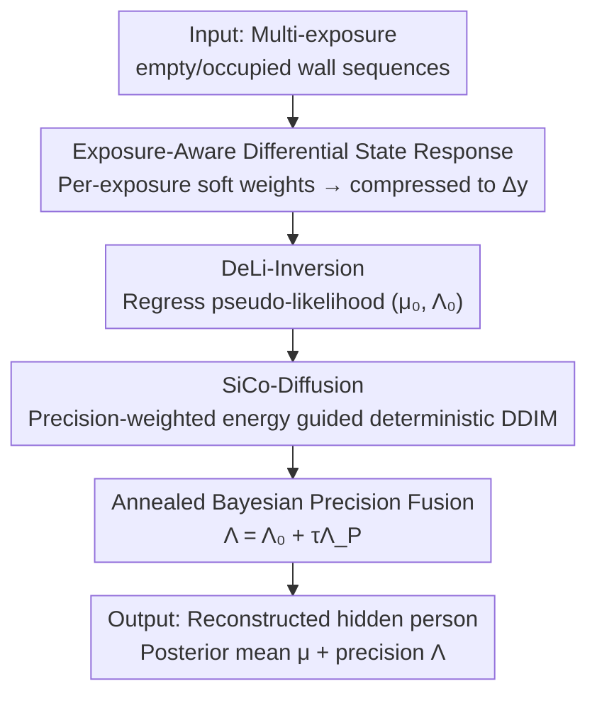

# Similarity-Consistent Likelihood Diffusion enables Hidden Person Detection from Wall Reflections

**Conference**: CVPR 2026  
**Paper**: [CVF Open Access](https://openaccess.thecvf.com/content/CVPR2026/html/Zheng_Similarity-Consistent_Likelihood_Diffusion_enables_Hidden_Person_Detection_from_Wall_Reflections_CVPR_2026_paper.html)  
**Code**: None  
**Area**: Image Restoration / Computational Imaging / Non-Line-of-Sight Imaging  
**Keywords**: Non-Line-of-Sight (NLOS) imaging, diffusion prior, likelihood guidance, heteroscedastic precision, corner camera

## TL;DR
SLD-Net regresses the almost invisible differential optical signals in wall diffuse reflections into a Gaussian pseudo-likelihood $(\mu_0,\Lambda_0)$ with pixel-wise precision, which is then injected into deterministic DDIM sampling as a "precision-weighted energy term." This makes the diffusion prior strictly adhere to physical measurements while guaranteeing that the same observation always yields the same reconstruction, successfully reconstructing the hidden person behind a corner from wall reflections and reducing the FID from 264.91/177.05 to 73.54/26.89 on two real-world datasets.

## Background & Motivation
**Background**: Non-Line-of-Sight (NLOS) imaging aims to recover hidden scenes beyond the direct line of sight from indirect light transport. It is divided into two lines: active methods use controllable illumination and time-resolved sensors to measure multi-bounce scattering, which is physically reliable but relies on expensive transient hardware; passive methods use ordinary cameras to observe steady-state/uncontrolled indirect reflections, which is cheap but the signal is extremely weak, observations are unstable, and constraints are insufficient. This paper adopts an "active steady-state" route: using an ordinary camera and ordinary illumination to inspect a central wall, reconstructing the hidden person behind the corner based on the tiny disturbances they introduce to the ambient lighting.

**Limitations of Prior Work**: Inverting wall reflections into hidden images is an ill-posed inverse problem. First, the useful signal is weak and almost completely overwhelmed by ambient light, sensor gain, and non-linearity. Even with multi-exposure sequences, it is difficult to extract verifiable, pixel-wise statistical constraints from these unstable readings. Second, mapping from 2D wall measurements to the hidden space is severely under-determined, requiring strong generative priors like diffusion to complete the missing structures.

**Key Challenge**: The inherent stochasticity of generative priors directly conflicts with the "system reproducibility" requirement of sensing systems—the same observation might map to several different reconstructed images. Thus, the problem becomes: how to simultaneously enforce **data consistency** (adhering to physical measurements) and **similarity consistency** (same input $\to$ same output) without sacrificing generative details.

**Goal**: (1) Distill unstable wall readings into verifiable statistical likelihoods; (2) inject this likelihood into the diffusion prior in a calibrated manner, ensuring the reconstruction matches measurements while being deterministically reproducible.

**Key Insight**: Instead of directly regressing the differential measurements into a hidden image as a regular feature map, regress it as a **heteroscedastic Gaussian pseudo-likelihood**—providing both a mean $\mu_0$ (rough reconstruction) and a pixel-wise precision $\Lambda_0$ (indicating where the wall information is reliable). Then, transform the diffusion sampling from a "random generator" into a "deterministic posterior solver."

**Core Idea**: Use the "precision-weighted likelihood energy term $\Lambda_0(\mu_0-\hat x_0)$" to guide deterministic DDIM. Trusted wall regions serve as hard constraints, while under-determined areas are left for the prior to complete the structure. No stochasticity is introduced throughout the process $\to$ physical consistency + reproducibility.

## Method

### Overall Architecture
SLD-Net is a "likelihood–prior solver": the inputs are two sets of multi-exposure wall sequences captured under the same camera pose (empty scene $\{y_0^{(k)}\}$ and with a person $\{y^{(k)}\}$), and the output is the RGB reconstruction $x$ of the hidden person. It uses a computable factorized approximation of the Bayesian posterior $p(x\mid y)\propto p(x)\,p(y\mid x)$, which runs in three serial stages:

1. **Exposure-Aware Differential State Response**: Weights and differences the multi-exposure sequences by exposure reliability, compressing them into a radiometrically linear differential tensor $\tilde\Delta y$ to suppress static walls and down-weight overexposed/noisy frames.
2. **DeLi-Inversion**: Maps $\tilde\Delta y$ to a heteroscedastic Gaussian pseudo-likelihood $(\mu_0,\Lambda_0)$—where $\mu_0$ is the initial reconstruction and $\Lambda_0$ is the pixel-wise precision map (encoding which wall pixels are highly informative).
3. **SiCo-Diffusion + Annealed Bayesian Fusion**: Injects this pseudo-likelihood as a precision-weighted energy term into the deterministic DDIM trajectory of a pre-trained diffusion prior to obtain prior estimates $(\mu_P,\Lambda_P)$. Then, uses annealed Bayesian precision fusion to multiply the two Gaussian factors (DeLi and diffusion) to output the final posterior mean $\mu$ and precision $\Lambda$.

### Key Designs

**1. Exposure-Aware Differential State Response: Compress multi-exposure readings into a differential tensor that suppresses static walls and selects reliable exposures**

The hidden person only introduces minute changes to the wall intensity via high-order, low-SNR scattering. A single exposure's difference is either saturated (overexposed) or buried in noise. First, each exposure is mapped to the radiometrically linear domain $\hat y^{(k)}=r(y^{(k)})$ and differenced $\delta y^{(k)}=\hat y^{(k)}-\hat y_0^{(k)}$ to eliminate static walls and camera biases. Since different exposures have different SNR, saturation, and motion sensitivity levels, they cannot be averaged with equal weights. Thus, a lightweight **Exposure-aware Likelihood Adapter (ELA)** is introduced: for each wall pixel $p$, its difference vector across $K$ exposures $d(p)=(\delta y^{(1)}(p),\dots,\delta y^{(K)}(p))$ is fed into a pixel-wise small network $A_\eta$, which outputs exposure weights via softmax:

$$w_k(p)=\frac{\exp(A_\eta(d(p))_k)}{\sum_j \exp(A_\eta(d(p))_j)},\quad \sum_k w_k(p)=1,$$

and computes the weighted sum to obtain the differential state response $\tilde\Delta y(p)=\sum_k w_k(p)\,\delta y^{(k)}(p)$. These weights act as "soft saliencies," amplifying highly informative exposures pixel-by-pixel and suppressing saturated/noisy ones, which is more robust and compact than direct single-exposure differencing.

**2. DeLi-Inversion: Distill unstable wall responses into a verifiable heteroscedastic Gaussian pseudo-likelihood $(\mu_0,\Lambda_0)$**

In ill-posed inverse problems, the most critical issue is the lack of pixel-wise constraints indicating "which parts are reliable." The authors first linearize the forward light transport around the empty scene as $\tilde\Delta y=Hx+\varepsilon,\ \varepsilon\sim\mathcal N(0,\Sigma(x))$, writing it as a heteroscedastic Gaussian likelihood $\log p(\tilde\Delta y\mid x)=-\tfrac12\|e(x)\|^2_{\Lambda(x)}+\tfrac12\log\det\Lambda(x)+C$, where $\Lambda=\Sigma^{-1}$ is the precision. Since explicitly modeling $(H,\Sigma)$ per scene is intractable, a data-driven proxy $F_\theta$ is used to directly regress the mean $\mu_0$ and precision logits $Z_0$ from $\tilde\Delta y$, which are converted to diagonal precision $\Lambda_0(p)=\mathrm{diag}(\phi(Z_0(p)))$ via softplus $\phi(\cdot)$. Training uses heteroscedastic Gaussian negative log-likelihood:

$$\mathcal L_\text{DeLi}=\tfrac12\sum_p\Big(\|\mu_0(p)-x^\star(p)\|^2_{\Lambda_0(p)}-\log\det\Lambda_0(p)\Big).$$

This objective couples $\mu_0$ and $\Lambda_0$: pixels with inaccurate DeLi predictions are automatically forced to have low precision, while accurate ones get high precision—the precision map thus naturally learns to represent "wall reliability maps." Crucially, $(\mu_0,\Lambda_0)$ can be symmetrically re-parameterized into a differentiable likelihood factor with respect to $x$ as $p(\mu_0\mid x)\propto\exp(-\tfrac12\|\Lambda_0^{1/2}(x-\mu_0)\|^2)$, whose log-gradient $\nabla_x\log p(\mu_0\mid x)=\Lambda_0(\mu_0-x)$ serves perfectly as a data constraint on $x$ during diffusion inference.

**3. SiCo-Diffusion: Convert diffusion from a stochastic generator to a deterministic posterior solver, guided by a precision-weighted energy term**

The diffusion prior $p(x)$ offers strong generative capacity to fill in under-determined structures, but random sampling ruins reproducibility. The authors utilize **deterministic DDIM ($\eta=0$)**: at each step, a denoiser yields $\hat x_0=G_\psi(x_t,t)$, which is then updated via a step of precision-weighted gradient ascent based on $\log p(\mu_0\mid x)$:

$$\tilde x_0=\hat x_0+\gamma_t\,\Lambda_0(\mu_0-\hat x_0),$$

substituting $\tilde x_0$ back into DDIM to update $x_{t-1}=\sqrt{\bar\alpha_{t-1}}\,\tilde x_0+\sqrt{1-\bar\alpha_{t-1}}\,\tfrac{x_t-\sqrt{\bar\alpha_t}\tilde x_0}{\sqrt{1-\bar\alpha_t}}$. This step is interpretable as a local MAP update on the posterior energy $-\log p(x)-\log p(\mu_0\mid x)$, where the denoiser provides the prior term and DeLi provides the data term. Because of the fixed starting point $x_T$ and fixed schedule, the iteration converges to a unique final state $\mu_P$—guaranteeing that the same wall observation always yields the same reconstruction, which is what the paper refers to as **similarity-consistent**. The guidance direction and magnitude are modulated by $\Lambda_0$: high-precision areas act as near-hard constraints, while low-precision areas are softly pushed to let the prior dominate, which is much more reasonable than CFG, which applies a single "global strength" and treats all pixels as equally reliable.

**4. Annealed Bayesian Precision Fusion: Convert DeLi likelihood and diffusion prior from "measurement-first" to a "fully Bayesian combination" using a temperature parameter $\tau$**

Along the trajectory, the denoiser also regresses pixel-wise variance, which is inverted to obtain the diffusion prior precision $\Lambda_P=\Sigma_P^{-1}$, giving a second Gaussian factor $\mathcal N(x;\mu_P,\Lambda_P^{-1})$. Multiplying the DeLi factor and the annealed diffusion factor ($\propto\mathcal N(\mu_P,\Lambda_P^{-1})^\tau$, with $\tau\in(0,1]$) yields another Gaussian, following the fusion rule:

$$\Lambda(p)=\Lambda_0(p)+\tau\Lambda_P(p),\quad \mu(p)=\Lambda(p)^{-1}\big(\Lambda_0(p)\mu_0(p)+\tau\Lambda_P(p)\mu_P(p)\big).$$

The posterior mean is a precision-weighted average, and the posterior precision is the sum of both precisions: pixels with sufficient wall information (large $\Lambda_0$) are dominated by $\mu_0$, while under-determined regions are regularized by $\mu_P$. Annealing $\tau$ from a small value to 1 scales the fusion from "relying almost entirely on DeLi likelihood" to a "full product-of-Gaussians posterior" (standard product posterior when $\tau=1$), preventing the optimization from being biased by an unreliable diffusion prior early on.

### Loss & Training
DeLi and the upstream ELA are jointly trained using the heteroscedastic Gaussian NLL loss (Eq. 9). The diffusion prior is trained separately on ground-truth hidden images $x^\star$ using a cosine noise schedule ($T=2000$). For inference, 50-step DDIM is used. $x_T$ is initialized with a fixed random seed to ensure that SiCo-Diffusion remains deterministic given a specific observation. All training is performed on 8×RTX 4090 GPUs.

## Key Experimental Results

### Main Results
Two real-world datasets: Reflect-Corridor (R-C, T-shaped corridor) and Reflect-Room (R-R, apartment living room), shot in RAW using a Sony A7SII. Empty/occupied multi-exposure protocols were used, with a second camera in the hidden area capturing frontal RGB images as ground truth. Comparisons are made against three categories of baselines: general reconstruction networks, physics-informed networks, and NLOS-specific networks, all retrained with identical input-output conditions.

| Dataset | Metric | Ours (SLD-Net) | Best Baseline | Gain |
|--------|------|------|----------|------|
| R-C | PSNR↑ | **15.58** | 14.01 (Phasor Field) | +1.57 dB |
| R-C | FID↓ | **73.54** | 264.91 (Restormer) | Significant drop |
| R-C | LPIPS↓ | **0.30** | 0.32 (NLOD-LTM) | Better |
| R-R | PSNR↑ | **12.49** | 12.02 (Phasor Field) | +0.47 dB |
| R-R | FID↓ | **26.89** | 177.05 (Restormer) | Significant drop |
| R-R | LPIPS↓ | **0.25** | 0.30 (Restormer) | Better |

*Note: The original abstract lists the baseline PSNR/FID starting points as 13.84/264.91 (U-Net/Restormer), which is consistent with Table 1. Although pure diffusion baselines like DDIM/DPS yield decent FID values (DPS 96.37), their PSNR is extremely low (6.02), indicating that pure priors diverge from physical measurements. SLD-Net leads in both distortion (PSNR/SSIM) and perception (FID/LPIPS) metrics, showing that it does not simply "beautify" the output, but lets the prior fill in structures only where the wall measurements are obscure.*

### Ablation Study

| Configuration | R-C PSNR↑ | R-C FID↓ | R-R PSNR↑ | R-R FID↓ | Description |
|---|---|---|---|---|---|
| Full SLD-Net | 15.58 | 73.54 | 12.49 | 26.89 | Full model |
| DeLi-only | 13.67 | 217.30 | 11.14 | 168.30 | Only likelihood proxy, no diffusion prior: geometry is okay, but perception is "blurry" and FID is poor |
| Diffusion-only | 6.02 | 191.22 | 4.07 | 182.98 | Only prior, discarding wall likelihood: realistic generation but decoupled from measurements; PSNR collapses |
| Bayes Guidance (ours) | 15.58 | 73.54 | 12.49 | 26.89 | vs CFG(1.0) 53.17/13.42: CFG uses a single global strength, struggling to balance constraints |
| Fusion with $(\mu,\Lambda)$ | 15.58 | 73.54 | 12.49 | 26.89 | Including precision map |
| Fusion with $\mu$ only | 13.48 | 53.31 | 11.85 | 45.06 | Discarding $\Lambda_0$ assumes identical pixel reliability; PSNR/LPIPS degrade |

### Key Findings
- **Both components are indispensable**: DeLi-only has correct geometry but poor perception; Diffusion-only is realistic but collapses in PSNR (to 6.02). Only the coupling of "likelihood anchoring + prior completion" achieves strong performance across both sets of metrics.
- **The precision map $\Lambda_0$ is the critical switch**: Removing it ($\mu$-only) might yield a lower FID (53.31), but PSNR/SSIM/LPIPS all degrade. The precision map is responsible for deciding pixel-by-pixel "whether to trust DeLi or the prior."
- **Deterministic precision guidance is faster and more stable**: SLD-Net stabilizes in about 25 steps and is close to convergence even at 5 steps, whereas CFG is sensitive to step count (especially for perceptual metrics) because it relies on long trajectories to reconcile heuristic guidance and measurements. SLD-Net applies a precision-weighted posterior drift at each step; shortening the trajectory only introduces integration errors without altering the underlying energy.
- **Essential difference from CFG**: CFG uses a single global guidance strength, implicitly treating all pixels as equally reliable. The guidance in this work is modulated pixel-wise by the precision $\Lambda_0(\mu_0-x)$ in both direction and magnitude, achieving a better overall operating point without needing to tune hyperparameters per dataset.

## Highlights & Insights
- **Explicitly modeling "uncertainty" as a constraint**: Instead of regressing a single image, this method regresses $(\mu_0,\Lambda_0)$. The precision map naturally becomes a "wall reliability map," giving the ill-posed inverse problem pixel-wise reliability values to negotiate the influence of the prior vs. data for the first time—a paradigm applicable to any ill-posed imaging inverse problem.
- **Trading randomness for reproducibility**: Converting diffusion from a stochastic generator into a deterministic posterior solver retains the completion capabilities of high-capacity priors while satisfying the strict "same input $\to$ same output" demands of sensing systems, elegantly resolving the conflict between generative randomness and sensing reproducibility.
- **Physical intuition behind annealed fusion**: Annealing $\tau$ from a small value to 1 creates a controllable Bayesian progression of "measurements first, priors later," avoiding early bias from unreliable priors—a strategy highly transferable to other "likelihood + generative prior" combinations.
- **The "wow factor" of the task itself**: Reconstructing a hidden person behind a corner using just an ordinary camera pointed at a wall proves that the seemingly invisible differential light spots are computationally invertible.

## Limitations & Future Work
- The authors acknowledge dependencies on paired empty/occupied sequences and calibrated acquisition, with a fixed corner geometry; adapting to unknown layouts requires re-calibration.
- We note that many critical implementation details (e.g., the precision map, annealing schedule, ELA) are relegated to the appendix, and the main paper leaves out some specific formulas (e.g., the exact annealing curve), requiring the appendix for reproduction; the linearized forward assumption $\tilde\Delta y=Hx+\varepsilon$ is only valid near the empty scene, raising doubts about its validity under strong non-linearity or large motion.
- Ground truth relies on a second camera in the hidden area, meaning the performance "upper bound" is tied to this specific collection protocol; the lower FID of the $\mu$-only variant indicates that a trade-off between PSNR and FID still exists, with the precision map primarily buying back distortion and LPIPS.
- Future Work: Online differencing, robustness to unknown photometric non-linearities, extension to complex NLOS environments and temporal tracking, and acceleration to real-time speeds.

## Related Work & Insights
- **vs Transient Active NLOS (NLOST/Phasor Field, etc.)**: These rely on ultra-fast illumination and time-resolved sensors to measure multi-bounce scattering, which is physically robust but requires expensive hardware. This work belongs to "steady-state active" methods, using an ordinary camera and ordinary illumination, making it more cost-effective and more reliable than pure passive methods.
- **vs General/Physical Reconstruction Networks (Restormer/DGUNet, etc.)**: They treat differential responses as deterministic feature maps for direct regression, failing to leverage exposure-related structures and uncertainty. This work changes the role of wall measurements—treating them as likelihood energy terms rather than regression targets.
- **vs General Diffusion Inverse Solvers (DPS/DDIM+CFG)**: Common approaches treat the forward model as a condition and enforce data consistency through projection, learned regularization, or heuristic guidance. They use global hyperparameters and do not explicitly model pixel-wise uncertainty. This work uses a deterministic sampler as a posterior solver, injecting a pixel-wise precision-weighted DeLi pseudo-likelihood. It enforces strong constraints in high-confidence areas and lets the prior guide the shape in under-determined ones.

## Rating
- Novelty: ⭐⭐⭐⭐⭐ Combining heteroscedastic pseudo-likelihood with deterministic precision-guided diffusion for steady-state NLOS human reconstruction represents both a novel problem setting and a novel methodology.
- Experimental Thoroughness: ⭐⭐⭐⭐ Solid evaluations on two real-world datasets, three baseline groups, and four sets of ablation studies. However, the evaluation is limited to two datasets with fixed geometry, leaving generalization evidence bounded.
- Writing Quality: ⭐⭐⭐⭐ Clear Bayesian narrative with well-corresponding figures. However, moving several key details (annealing, ELA, precision schedule) to the appendix slightly compromises self-containment.
- Value: ⭐⭐⭐⭐ Reconstructing a hidden person behind a corner using an ordinary camera looking at a wall holds substantial application potential, and the likelihood + deterministic diffusion paradigm can migrate to other ill-posed imaging tasks.

<!-- RELATED:START -->

## Related Papers

- [\[ICML 2026\] Consistent Diffusion Language Models](../../ICML2026/image_restoration/consistent_diffusion_language_models.md)
- [\[ICLR 2026\] FAST-DIPS: Adjoint-Free Analytic Steps and Hard-Constrained Likelihood Correction for Diffusion-Prior Inverse Problems](../../ICLR2026/image_restoration/fastdips_adjointfree_analytic_steps_and_hardconstrained_likelihood_correction_fo.md)
- [\[CVPR 2026\] Polarization State Tracing for Reflection Removal and Color-Consistent Reconstruction](polarization_state_tracing_for_reflection_removal_and_color-consistent_reconstru.md)
- [\[CVPR 2026\] CASR: A Robust Cyclic Framework for Arbitrary Large-Scale Super-Resolution with Distribution Alignment and Self-Similarity Awareness](casr_a_robust_cyclic_framework_for_arbitrary_large-scale_super-resolution_with_d.md)
- [\[CVPR 2026\] Degradation-Consistent Test-Time Adaptation for All-in-One Image Restoration](degradation-consistent_test-time_adaptation_for_all-in-one_image_restoration.md)

<!-- RELATED:END -->
