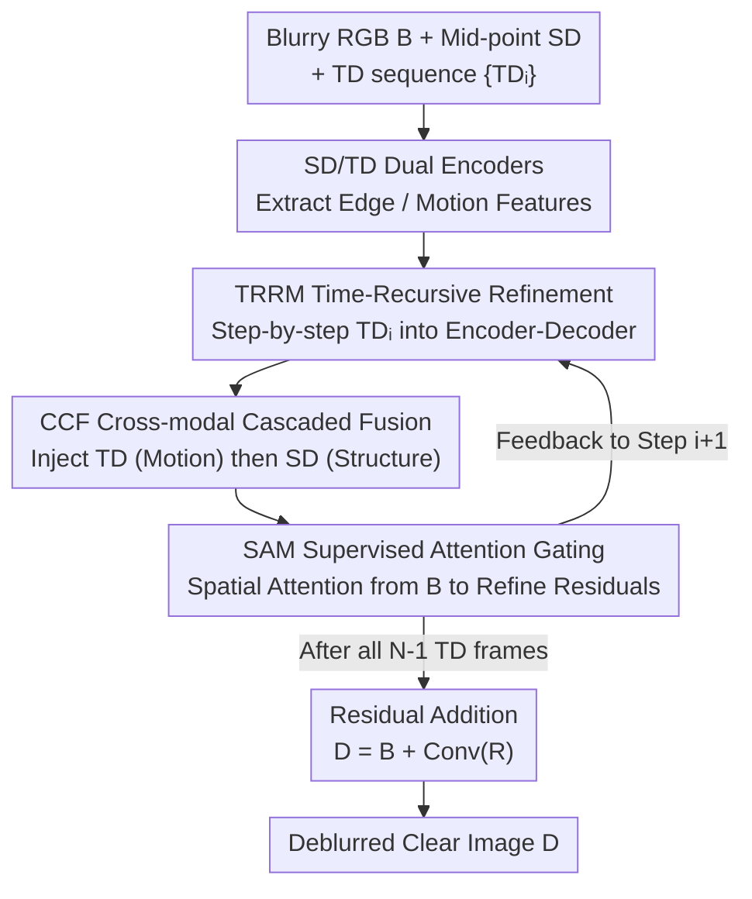

# Spatio-Temporal Difference Guided Motion Deblurring with the Complementary Vision Sensor

**Conference**: CVPR 2026  
**Paper**: [CVF Open Access](https://openaccess.thecvf.com/content/CVPR2026/html/Meng_Spatio-Temporal_Difference_Guided_Motion_Deblurring_with_the_Complementary_Vision_Sensor_CVPR_2026_paper.html)  
**Code**: https://tmcDeblur.github.io/ (Project Page)  
**Area**: Image Restoration / Motion Deblurring  
**Keywords**: Motion deblurring, Complementary Vision Sensor, Spatio-temporal difference, Recursive refinement, Cross-modal attention fusion

## TL;DR
Addressing the ill-posed nature of single-frame RGB deblurring and the issues of saturation and edge/motion entanglement in event cameras, this paper utilizes the high-frame-rate Spatial Difference (SD, encoding structural edges) and Temporal Difference (TD, encoding motion) captured synchronously by the Tianmouc Complementary Vision Sensor (CVS) within a single RGB exposure. The authors design STGDNet, a recursive multi-branch network that injects SD/TD into the RGB feature space sequentially. Complemented by a DMD data pipeline for generating real aligned training pairs, the method achieves SOTA performance on both synthetic CVS datasets and over 100 real extreme motion scenarios.

## Background & Motivation
**Background**: Motion blur occurs when rapid scene changes during exposure "integrate" rich motion trajectories into a single RGB frame. Traditional deblurring has evolved from kernel estimation to deep encoder-decoder networks, multi-scale recursion, and attention mechanisms, but all essentially attempt to **implicitly** infer motion from blurry RGB frames.

**Limitations of Prior Work**: Pure RGB deblurring is highly ill-posed under extreme motion, where large non-linear movements blend structure and color. Modalities like event cameras or spike cameras offer high temporal resolution but suffer from three major flaws: (1) Signal quality issues such as refractory period false negatives, non-constant thresholds, and saturation at high speeds; (2) Modality entanglement where events mix **structural features** and **motion cues**, requiring algorithmic decoupling; (3) Hardware challenges in physical spatio-temporal alignment with RGB sensors, often requiring complex beamsplitter setups.

**Key Challenge**: To compensate for missing motion/structural cues in RGB, a high-temporal-resolution modality must be introduced; however, the event modality itself is prone to saturation, entangles edges with motion, and is difficult to align with RGB—the cost of adding cues is the introduction of new noise and entanglement.

**Goal**: To identify a high-temporal-resolution modality that **decouples edges and motion at the sensing layer, is naturally aligned with RGB, and does not saturate** to guide RGB deblurring, while solving engineering challenges such as variable RGB exposure duration, sparse difference signals, and cross-modal domain gaps.

**Key Insight**: The authors adopt the Complementary Vision Sensor (CVS, Tianmouc), which features dual synergistic pathways: a cognitive pathway outputting 30 FPS RGB frames and an action pathway outputting Spatial Difference (SD) and Temporal Difference (TD) at 757–10,000 FPS. Due to fixed frame rates and multi-bit precision, CVS has bounded bandwidth and **does not saturate**. SD/TD are captured with extremely short exposures, making them **free of motion blur**. They encode spatial structure and temporal dynamics separately, **decoupling edges and motion at the sensing layer**, and achieve hardware-level alignment with RGB.

**Core Idea**: Utilize synchronously captured SD (mid-point structural frame) and TD (motion sequence) as explicit spatio-temporal priors. Through a **recursive** network, these are injected into the RGB feature space step-by-step for residual refinement, enabling the restoration of sharp, color-consistent images under extreme motion.

## Method

### Overall Architecture
STGDNet is an encoder-decoder framework. The inputs are **one blurry RGB frame $B$, one mid-point spatial difference frame $SD_{\lfloor (N-1)/2 \rfloor}$, and a sequence of all $N-1$ temporal difference frames $\{TD_i\}$** within the exposure. Here $N$ is determined by the RGB exposure time $t_{RGB}$ and the difference sampling interval $\tau_{diff}$: $N = \lceil t_{RGB}/\tau_{diff} \rceil$ (in experiments, $\tau_{diff}=1320\,\mu s$, corresponding to 757 FPS). Thus, **longer exposures result in more TD frames**, requiring the network to adapt to variable-length sequences. SD is taken at the mid-point to explicitly align the restored image with a structural snapshot.

The data flow proceeds as follows: SD and TD are processed by independent encoders. They then enter the **Time-Recursive Refinement Module (TRRM)**. At each step $i$, TRRM takes one $TD_i$ frame and the SD features, injects attention via **Cross-modal Complementary Fusion (CCF)** to generate an intermediate residual, which is then gated by the **Supervised Attention Module (SAM)** using the blurry RGB before being fed to the next step. After iterating through all TD frames, the final residual is added to the blurry frame: $D = B + \mathrm{Conv}_{out}(R_{N-1})$.

### Key Designs

**1. CCF Cross-modal Cascaded Fusion: Injecting colorless motion/structure into RGB features**
SD/TD encode luminance changes without **color** and have domain gaps with RGB. CCF uses **two-stage cascaded cross-attention** within TRRM: the first stage uses encoding features as Query and TD features as Key/Value to obtain "motion-enhanced" representations $\tilde F^{j,i} = \mathrm{softmax}\!\big((Q^{j,i}_{enc})(K^{j,i}_{TD})^\top/\sqrt{d_k}\big)V^{j,i}_{TD} + F^{j,i}_{enc}$. The second stage uses $\tilde F^{j,i}$ as Query and SD features as Key/Value to obtain $F^{j,i}_{CCF}$ containing both motion and structure. The "Motion first, Structure second" order follows the logic of reconstructing trajectory before pinning down texture.

**2. TRRM Time-Recursive Refinement: Handling variable exposure durations**
TRRM decomposes deblurring into **recursive step-by-step refinement** along the TD timeline. Each step $i$ processes $TD_i$ and SD features through a hierarchical encoder-decoder (with CCF in encoding and skip connections in decoding) to output an intermediate residual $R_i$, which is fed back: $R_{i+1} = \mathrm{TRRM}(R'_i, B_{enc}, F_{TD_i}, F_{SD})$. This naturally adapts to any $N$ and allows motion information to accumulate incrementally. Replacing TRRM with a single forward pass drops performance by 0.67 dB PSNR.

**3. SAM Supervised Attention Gating: Constraining residual feedback**
To prevent error accumulation in recursion, SAM maps the intermediate residual $R_i$ back to the RGB domain and aligns it with blurry $B$ to generate a spatial attention map $A = \sigma(C_3(C_2(R_i)+B))$. This gates the residual $R'_i = R_i + C_1(R_i)\odot A$. This mechanism focuses refinement on "still-blurry" regions rather than the whole image, stabilizing the recursion.

**4. DMD Data Production Pipeline: Creating real aligned CVS training pairs**
To bridge the generalization gap, the authors use a **Digital Micromirror Device (DMD)** to project sharp frames from SportsSloMo onto a CVS sensor. CVS captures real SD and TD responses, while RGB exposure is set to four levels (6600 to 14520 µs, corresponding to $N=5, 7, 9, 11$). Ground truth is obtained by projecting a single static sharp frame. This ensures hardware-level temporal sync and pixel-level spatial alignment, resulting in the SportsSloMo-CVS dataset (98,569 pairs).

### Loss & Training
The model is optimized using a PSNR-based loss $L_{PSNR} = -\lambda_{psnr}\cdot 10\log_{10}\big(1/(\mathrm{MSE}+\epsilon)\big)$ with $\lambda_{psnr}=0.5$. It is trained from scratch using AdamW ($2\times10^{-4}$ lr, $1\times10^{-4}$ weight decay) with cosine annealing on 4×RTX 4090 for 10 epochs.

## Key Experimental Results

### Main Results
On SportsSloMo-CVS across four exposure levels, the method is compared against RGB methods (Restormer/Turtle), a CVS diffusion method (CBRDM), and event-based methods (EFNet/STCNet/ELEDNet). Ours achieves the highest PSNR/SSIM with only 13.9 M parameters:

| Method | N=5 PSNR | N=11 PSNR | N=11 SSIM | Params(M)↓ |
|------|---------|----------|-----------|-----------|
| Restormer (RGB-only) | 34.99 | 31.35 | 0.9186 | 26.1 |
| Restormer* (+SD/TD) | 39.51 | 38.32 | 0.9732 | 26.1 |
| Turtle* | 39.37 | 37.73 | 0.9713 | 59.1 |
| STCNet (Event) | 40.07 | 37.79 | 0.9723 | 16.4 |
| ELEDNet (Event) | 39.51 | 38.36 | 0.9743 | 12.8 |
| EFNet (Event) | 41.29 | 39.37 | 0.9847 | 8.5 |
| CBRDM (CVS Diff) | 31.48 | 30.70 | 0.9307 | 166.2 |
| **STGDNet (Ours)** | **41.88** | **40.12** | **0.9874** | **13.9** |

### Ablation Study
Breakdown on the N=11 test set:

| SD | TD | CCF | TRRM | PSNR↑ | SSIM↑ | Note |
|----|----|-----|------|-------|-------|------|
| × | × | × | × | 31.06 | 0.9429 | RGB only |
| ✓ | × | ✓ | × | 37.70 | 0.9811 | +SD: +6.64 dB |
| × | ✓ | ✓ | × | 39.01 | 0.9842 | +TD: +7.95 dB |
| ✓ | ✓ | × | × | 39.01 | 0.9841 | w/o CCF (Direct concat) |
| ✓ | ✓ | ✓ | × | 39.45 | 0.9855 | w/o TRRM (Single forward) |
| ✓ | ✓ | ✓ | ✓ | **40.12** | **0.9874** | Full Model |

### Key Findings
- **Modality Contribution**: TD (motion) is slightly more critical than SD (structure), but they are highly complementary, together yielding an 8.39 dB gain over RGB-only.
- **Component Impact**: Removing TRRM results in a 0.67 dB drop and blurry motion boundaries, showing that recursive refinement is superior to single-pass fusion.
- **Real-world Generalization**: Models trained on discrete exposure settings generalize well to continuous exposures and real-world data, showing better color fidelity and fewer artifacts than event-based methods under high-speed motion.

## Highlights & Insights
- **Decoupling at the sensing layer**: Instead of using complex algorithmic modules to decouple edges and motion from events, CVS provides them in separate hardware pathways, inherently solving alignment and saturation issues.
- **Cascaded Logic**: The CCF design follows the physical intuition of "reconstructing trajectory, then pinning texture," prioritizing motion injection before structural refinement.
- **Handling Variable Lengths**: Using recursion to handle variable input sequences (governed by exposure time) is a robust strategy for multi-frame tasks where capture conditions vary.

## Limitations & Future Work
- The method is tightly coupled with specific CVS (Tianmouc) hardware, limiting its immediate applicability to standard cameras.
- While the DMD pipeline generates realistic noise, it remains projection-domain data; potential domain gaps between DMD and natural light environments may exist.
- Performance boundary analysis indicates a collapse region under extremely high rotation speeds combined with long exposures.
- Only the mid-point SD frame is used; structural information in other SD frames within the sequence is currently underutilized.

## Related Work & Insights
- **vs. RGB Deblurring**: Pure RGB methods struggle with extreme blur where structure/color are blended; CVS priors significantly boost their performance when concatenated.
- **vs. Event-based Deblurring**: Events suffer from saturation and require complex optical alignment; CVS avoids these via hardware-level integration and non-saturating multi-bit sensing.
- **vs. CVS Diffusion (CBRDM)**: Diffusion models are computationally heavy and prone to color distortion; the proposed deterministic STGDNet is lighter and more faithful to original colors.

## Rating
- Novelty: ⭐⭐⭐⭐⭐ First systematic use of CVS SD/TD for deblurring; shifts decoupling from algorithm to hardware.
- Experimental Thoroughness: ⭐⭐⭐⭐ Extensive synthetic and real-world testing, though quantified GT for real captures is limited.
- Writing Quality: ⭐⭐⭐⭐ Logical flow from event camera limitations to CVS advantages is well-articulated.
- Value: ⭐⭐⭐⭐ Provides infrastructure (DMD pipeline/benchmark) for future research on specialized sensors.

<!-- RELATED:START -->

## Related Papers

- [\[CVPR 2026\] Event-Based Motion Deblurring Using Task-Oriented 3D Gaussian Event Representations](event-based_motion_deblurring_using_task-oriented_3d_gaussian_event_representati.md)
- [\[CVPR 2026\] MAD-Avatar: Motion-Aware Animatable Gaussian Avatars Deblurring](motionaware_animatable_gaussian_avatars_deblurring.md)
- [\[CVPR 2026\] NEC-Diff: Noise-Robust Event–RAW Complementary Diffusion for Seeing Motion in Extreme Darkness](nec-diff_noise-robust_event-raw_complementary_diffusion_for_seeing_motion_in_ext.md)
- [\[CVPR 2026\] STCDiT: Spatio-Temporally Consistent Diffusion Transformer for High-Quality Video Super-Resolution](stcdit_spatio-temporally_consistent_diffusion_transformer_for_high-quality_video.md)
- [\[CVPR 2026\] Gyro-based Deep Video Deblurring](gyro-based_deep_video_deblurring.md)

<!-- RELATED:END -->
