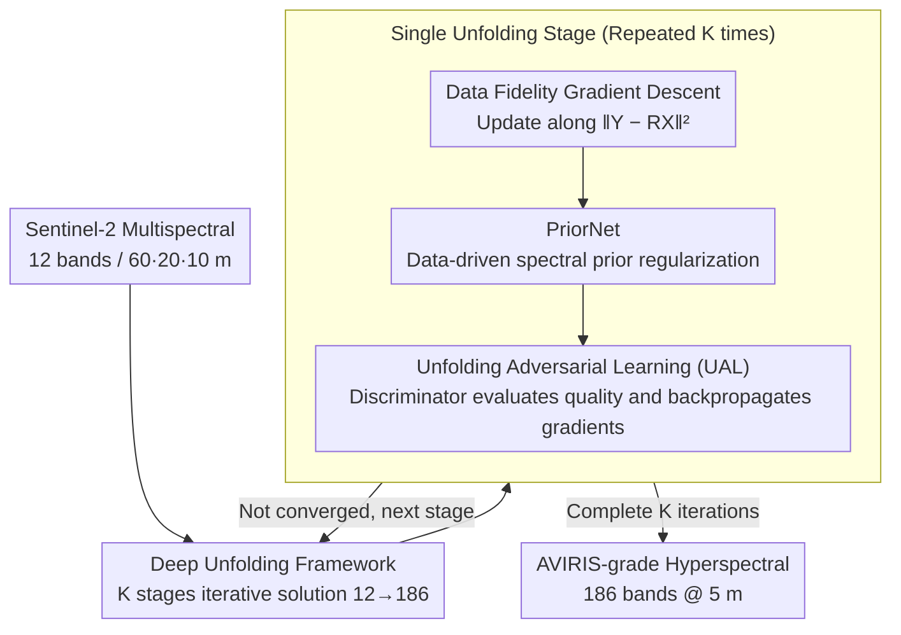

# Spectral Super-Resolution via Adversarial Unfolding and Data-Driven Spectrum Regularization

**Conference**: CVPR 2026  
**arXiv**: [2603.00920](https://arxiv.org/abs/2603.00920)  
**Code**: [IHCLab/UALNet](https://github.com/IHCLab/UALNet)  
**Area**: Image Restoration  
**Keywords**: Spectral Super-Resolution, Deep Unfolding, Adversarial Learning, Hyperspectral Reconstruction, Remote Sensing, Sentinel-2, AVIRIS

## TL;DR

Proposes UALNet, which achieves spectral super-resolution from Sentinel-2 multispectral data (12 bands) to NASA AVIRIS hyperspectral images (186 bands) by embedding data-driven spectral priors (PriorNet) and adversarial learning terms into a deep unfolding framework. It outperforms Transformers while requiring only 15% of the computation and 1/20 of the parameters.

## Background & Motivation

**Background**: ESA's Sentinel-2 satellites provide global multispectral coverage but only offer 12 bands with inconsistent spatial resolutions (60/20/10 m), which is insufficient for fine-grained remote sensing identification. NASA's AVIRIS-NG sensor provides high-spectral and high-spatial resolution but is limited to certain regions in the Americas due to operational constraints.

**Key Challenge**: Can computational methods reconstruct global Sentinel-2 data into NASA-grade hyperspectral images? Super-resolving 12 bands into 186 bands is a highly ill-posed inverse problem ($12 \rightarrow 186$), and it also requires unifying the spatial resolution to 5 m.

**Limitations of Prior Work**:
   - Traditional deep unfolding methods rely on implicit deep priors and lack explicit modeling of spectral physical characteristics.
   - Most spectral super-resolution methods only handle 31-band visible light reconstruction (e.g., CAVE dataset), failing to reach the complexity of AVIRIS-grade hyperspectral data.
   - Purely data-driven Transformer/CNN methods have high parameter counts and computational costs, with poor interpretability.
   - GAN discriminators only function during training and are discarded during inference, wasting discriminative information.

## Method

### Overall Architecture

UALNet addresses a specific scientific question: whether it is possible to computationally reconstruct Sentinel-2 data (12 bands, global coverage) into NASA AVIRIS-grade hyperspectral images (186 bands). This is a highly underdetermined linear inverse problem—the observation is modeled as $\mathbf{Y} = \mathbf{R}\mathbf{X} + \mathbf{N}$, where $\mathbf{Y} \in \mathbb{R}^{12 \times P}$ is the multispectral observation, $\mathbf{X} \in \mathbb{R}^{186 \times P}$ is the target hyperspectral image, and $\mathbf{R} \in \mathbb{R}^{12 \times 186}$ is the spectral response matrix. Solving for 186 unknowns with 12 equations requires strong regularization. UALNet unfolds this optimization problem into a multi-stage network, where each stage performs an iteration of "data fidelity gradient descent + regularization constraint." It introduces two novel components: PriorNet for explicit spectral priors and a discriminator that participates in reconstruction during both training and inference. Furthermore, since Sentinel-2 bands are distributed across 60/20/10 m resolutions, UALNet couples spectral and spatial super-resolution into a joint task, unifying the output at 5 m.

### Key Designs

**1. Deep Unfolding Framework: Decomposing iterative optimization into a learnable multi-stage network**

Direct end-to-end regression of a 12→186 mapping lacks interpretability and is difficult to constrain. UALNet adopts a deep unfolding approach, unfolding the iterative solution of the inverse problem into several stages. Each stage corresponds to an update: first, gradient descent is performed along the data fidelity term $\|\mathbf{Y} - \mathbf{R}\mathbf{X}\|^2$ to ensure consistency between reconstruction and observation, followed by a regularization term to pull the solution toward a plausible spectral space. Each step has physical meaning, and the regularization term serves as a plug-and-play module.

**2. PriorNet: Replacing implicit network regularization with explicit spectral priors**

Regularization terms in traditional deep unfolding are often implicit networks, making it unclear what priors are learned and lacking explicit constraints on spectral physical properties. UALNet designs PriorNet to learn the low-dimensional manifold structure of hyperspectral signals directly from paired Sentinel-2/AVIRIS data. In each unfolding stage, it outputs a data-driven spectral regularization signal, guiding the reconstruction toward the real spectral distribution. Compared to implicit priors, it is more interpretable and provides larger gains in PSNR/SSIM/SAM.

**3. Unfolding Adversarial Learning (UAL): Enabling the discriminator to work during inference**

In typical GANs, the discriminator only provides adversarial signals during training and is discarded during inference. UAL embeds the discriminator within the unfolding framework: it evaluates the current reconstruction quality at each stage, and its gradients directly participate in the iterative updates. This discriminator is retained during both training and inference—a fundamental difference from traditional GANs. Effectively, the adversarial term acts as a distribution-matching regularizer, forcing the reconstructed hyperspectral data to match the statistical characteristics of real AVIRIS data.

### Loss & Training

The total loss consists of three parts: reconstruction loss ($\ell_1$ or $\ell_2$ error relative to ground truth), spectral angle loss (SAM, constraining the fidelity of spectral curve shapes), and discriminator-guided adversarial loss (for distribution matching). With these combined, UALNet surpasses Transformers in accuracy while using only ~15% of the MACs and 1/20 of the parameters.

## Key Experimental Results

### Main Results

- **Data Sources**: Paired data from Sentinel-2 multispectral satellites (global, 12 bands) and NASA AVIRIS-NG hyperspectral airborne sensors (Americas, 186 bands).
- **Task**: 12-band → 186-band spectral super-resolution + spatial resolution unification to 5 m.
- **Metrics**: PSNR, SSIM, SAM (Spectral Angle Mapper, lower is better), MACs, Parameters.
- **Baselines**: Includes Transformer-based methods and other SOTA spectral super-resolution models.

**Table 1: Quantitative comparison with SOTA methods**

| Method | PSNR ↑ | SSIM ↑ | SAM ↓ | Parameters | MACs |
|------|--------|--------|-------|--------|------|
| CNN-based baseline | Lower | Lower | Higher | Medium | Medium |
| Transformer (2nd best) | 2nd | 2nd | 2nd | 20× UALNet | 6.7× UALNet |
| **UALNet (Ours)** | **Best** | **Best** | **Best** | **Least** | **Least (15%)** |

UALNet outperforms the runner-up Transformer method across all three metrics while being significantly more efficient:
- MACs are only **15%** of the Transformer.
- Parameters are only **1/20** of the Transformer (20× compression).

### Ablation Study

**Table 2: Contribution of components**

| Configuration | PSNR | SSIM | SAM | Description |
|------|------|------|-----|------|
| Basic Unfolding Framework | Baseline | Baseline | Baseline | Data fidelity term only |
| + Implicit Deep Prior | ↑ | ↑ | ↓ | Traditional unfolding regularization |
| + PriorNet (Explicit Spectral Prior) | ↑↑ | ↑↑ | ↓↓ | Data-driven prior is more effective |
| + UAE (Adversarial during training only) | ↑ | ↑ | ↓ | Standard GAN-style training |
| + UAL (Adversarial during training + inference) | **↑↑↑** | **↑↑↑** | **↓↓↓** | Full framework, continuous discriminator guidance |

Ablation results show:
- PriorNet's explicit spectral prior is significantly better than traditional implicit deep priors.
- UAL (using the discriminator in both training and inference) further improves performance compared to using it only during training.
- The combination of the three modules achieves the optimal effect.

## Highlights & Insights

- **Concept of Unfolding Adversarial Learning (UAL)**: Proposes allowing the discriminator to participate in reconstruction during the inference stage, breaking the paradigm where GAN discriminators are only used for training. This means each sample receives adversarial quality feedback during testing, representing a new inference enhancement strategy.
- **Explicit vs. Implicit Priors**: By providing data-driven spectral priors via PriorNet instead of implicit network priors, the model achieves better interpretability and reconstruction quality.
- **Extreme Efficiency**: Surpasses Transformer performance while requiring only 15% of the computation and 1/20 of the parameters, offering high practical value for resource-constrained remote sensing platforms (on-board computing).
- **Scientific Significance**: If successfully deployed, this method could transform all global Sentinel-2 historical data into AVIRIS-grade hyperspectral data, significantly expanding the global coverage of hyperspectral data.
- **New Paradigm for Deep Unfolding**: It integrates data fidelity terms, data-driven priors, and adversarial regularization within a unified unfolding framework, providing a new design paradigm for solving inverse problems.

## Limitations & Future Work

- **Paired Data Dependency**: Training requires spatially paired Sentinel-2 and AVIRIS-NG data. AVIRIS-NG only covers parts of the Americas, limiting the geographic diversity of training data.
- **Generalization Challenges**: Since the model is trained on American data, its generalization to other continents (Africa, Asia) with different land cover distributions has not been fully verified.
- **Atmospheric Correction Assumptions**: Radiometric consistency between Sentinel-2 and AVIRIS data depends on accurate atmospheric correction; errors may propagate to the reconstruction.
- **Discriminator Inference Overhead**: Although total parameters are much fewer than Transformers, UAL still requires running the discriminator during inference, adding to the computational cost of the inference stage.
- **Band Coverage Constraints**: The model currently reconstructs 186 bands, but AVIRIS can originally reach 224 bands (186 remain after removing absorption/damaged bands); some spectral information remains unrecoverable.

## Related Work & Insights

- **Spectral Super-Resolution**: The inverse problem of reconstructing hyperspectral data from RGB/multispectral inputs. Traditional methods include sparse coding and matrix factorization; deep methods are dominated by CNNs and Transformers, but most are restricted to the CAVE dataset (31 bands) and do not address AVIRIS-level complexity.
- **Deep Unfolding**: Unfolding optimization algorithms like ADMM or ISTA into learnable networks. Works like ADMM-ADAM and CODE-IF have proven the effectiveness of unfolding for hyperspectral problems, but regularization terms are mostly implicit network priors.
- **GANs in Image Reconstruction**: SRGAN and ESRGAN are widely used in spatial super-resolution, but the discriminator is discarded after training. UALNet's UAL is the first to allow the discriminator to function during inference.
- **Sentinel-2 Super-Resolution**: The prior work COS2A also studied the Sentinel-2 to AVIRIS conversion using a convex optimization/deep hybrid framework (CODE) + spectral-spatial duality; UALNet builds on this by introducing adversarial learning to further improve performance and efficiency.

## Rating

- Novelty: ⭐⭐⭐⭐ — The concept of Unfolding Adversarial Learning (retaining the discriminator during inference) is novel, and PriorNet's replacement of implicit priors is a methodological contribution.
- Experimental Thoroughness: ⭐⭐⭐⭐ — Comprehensive ablation studies and efficiency comparisons are provided, though geographic diversity of datasets is limited.
- Writing Quality: ⭐⭐⭐⭐ — Clear motivation, rigorous derivation, and a coherent logic from physical modeling to algorithm design.
- Value: ⭐⭐⭐⭐ — Addresses the practical need for global hyperspectral coverage, with high application value in the remote sensing community.

<!-- RELATED:START -->

## Related Papers

- [\[CVPR 2026\] Dual Graph Regularized Deep Unfolding Network for Guided Depth Map Super-resolution](dual_graph_regularized_deep_unfolding_network_for_guided_depth_map_super-resolut.md)
- [\[ICML 2026\] Coloring the Noise: Adversarial Sobolev Alignment for Faithful Image Super Resolution](../../ICML2026/image_restoration/coloring_the_noise_adversarial_sobolev_alignment_for_faithful_image_super_resolu.md)
- [\[ECCV 2024\] Learning Exhaustive Correlation for Spectral Super-Resolution: Where Spatial-Spectral Attention Meets Linear Dependence](../../ECCV2024/image_restoration/learning_exhaustive_correlation_for_spectral_super-resolution_where_spatial-spec.md)
- [\[ICML 2026\] Phy-CoSF: Physics-Guided Continuous Spectral Fields Reconstruction and Super-Resolution for Snapshot Compressive Imaging](../../ICML2026/image_restoration/phy-cosf_physics-guided_continuous_spectral_fields_reconstruction_and_super-reso.md)
- [\[ECCV 2024\] Rethinking Image Super-Resolution from Training Data Perspectives](../../ECCV2024/image_restoration/rethinking_image_super-resolution_from_training_data_perspectives.md)

<!-- RELATED:END -->
