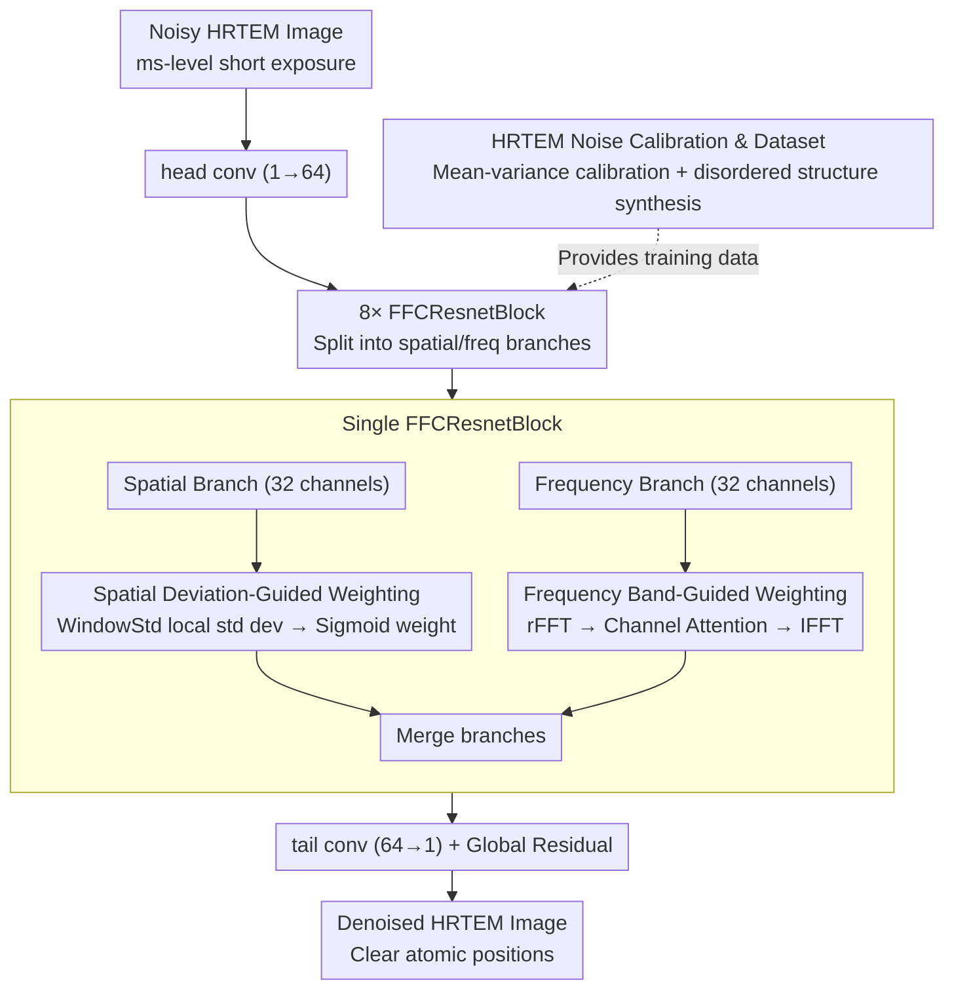

# Statistical Characteristic-Guided Denoising for Rapid High-Resolution Transmission Electron Microscopy Imaging

**Conference**: CVPR 2026  
**arXiv**: [2603.18834](https://arxiv.org/abs/2603.18834)  
**Authors**: Hesong Li, Ziqi Wu, Ruiwen Shao, Ying Fu
**Code**: [HeasonLee/SCGN](https://github.com/HeasonLee/SCGN)  
**Area**: Image Restoration  
**Keywords**: HRTEM Denoising, Statistical Characteristic Guidance, Frequency Domain Denoising, Spatial Deviation Weighting, Noise Calibration

## TL;DR

Ours proposes the Statistical Characteristic-Guided Denoising Network (SCGN), which utilizes spatial window standard deviation weighting and frequency band-guided weighting to adaptively enhance signals and suppress noise in both spatial and frequency domains. Combined with an HRTEM-specific noise calibration method to generate realistic datasets of disordered structures, it achieves high-quality denoising of millisecond-scale High-Resolution Transmission Electron Microscopy images.

## Background & Motivation

High-Resolution Transmission Electron Microscopy (HRTEM) enables atomic-scale observation of nucleation dynamics and is a core tool for studying advanced solid materials. However, nucleation processes change rapidly on a millisecond scale, requiring short-exposure imaging, which results in severe noise that obscures atomic position information.

**Limitations of Prior Work**:

- **General Image Denoising Methods** (e.g., DnCNN, Restormer): These fail to consider the specific statistical characteristics of HRTEM images—where atomic and background regions differ significantly in spatial deviation and frequency distribution. General methods apply the same denoising strategy to all regions, failing to effectively suppress background noise while preserving atomic details.
- **HRTEM Noise Modeling**: HRTEM noise differs from natural image noise, as it is influenced by electron beam shot noise and detector readout noise; existing Gaussian/Poisson models are insufficiently accurate.
- **Lack of Training Data**: There is a shortage of training datasets containing disordered structures (key features in nucleation) and realistic HRTEM noise characteristics.

**Key Insight**: In HRTEM images, the local standard deviation of atomic regions (high signal regions) is much higher than that of background regions, and signals are concentrated in specific frequency bands. These statistical characteristics can guide the denoising process by applying adaptive processing strategies across different spatial locations and frequency bands.

## Method

### Overall Architecture

SCGN addresses the pain point of rapid HRTEM imaging: nucleation processes occur in milliseconds, necessitating short-exposure snapshots where atomic positions are submerged in strong noise. Its key observation is that local standard deviation in atomic regions is significantly higher than in the background, and signals concentrate in specific frequency bands—statistics that serve as "navigation" for denoising. The network is a residual structure based on Fast Fourier Convolution (FFC), following a global residual approach $\hat{I}_{clean} = I_{noisy} + \mathcal{F}(I_{noisy})$, consisting of head conv (1→64 channels) → 8 FFCResnetBlocks → tail conv (64→1 channel). Each FFCResnetBlock splits features into a spatial branch (32 channels) and a frequency branch (32 channels) for separate processing before merging. Both domains utilize statistical characteristic-guided weighting, complemented by an HRTEM-specific noise calibration for data generation.

### Key Designs

**1. Spatial Deviation-Guided Weighting: Distinguishing Atomic from Background Regions via Window Standard Deviation**

General denoisers treat the entire image uniformly, failing to preserve atomic details while removing background noise. The WindowStd module calculates a local standard deviation within a $3\times3$ window for each location $\sigma(x, y) = \sqrt{\frac{1}{K^2} \sum_{(i,j) \in \mathcal{W}} [F(i,j) - \bar{F}(x,y)]^2}$, implemented efficiently using the identity $\text{Var}(X) = E[X^2] - (E[X])^2$ via two depthwise separable convolutions (with mirror padding for edge accuracy). This statistical calculation requires no trainable parameters. The standard deviation map is then passed through a $1\times1$ convolution and Sigmoid to obtain spatial weights $W_{spatial} = \sigma\left(\text{Conv}_{1 \times 1}(\sigma(F))\right)$, which multiply the spatial convolution output. This allows the network to retain more detail in high-deviation regions (atomic positions) and denoise more aggressively in low-deviation regions (background). This component provided the largest gain in ablation (+0.33 dB).

**2. Frequency Band-Guided Weighting: Adaptive Enhancement of Atomic Signal Bands**

HRTEM signals and noise exhibit different frequency distributions, which spatial-only processing cannot exploit. The SpectralTransform module in the frequency branch operates entirely in the frequency domain: ① Applying 2D rFFT on input features to obtain a frequency representation; ② Concatenating normalized frequency coordinates $(u, v)$ to the frequency features to make the network frequency-aware; ③ Processing real and imaginary parts separately via $1\times1$ convolutions; ④ Applying adaptive weights to different frequency bands via ChannelAttention (AvgPool + MaxPool → Shared FC → Sigmoid) to enhance atomic signal bands and suppress noise-dominated bands; ⑤ Applying IFFT to return to the spatial domain. Channel attention thus learns the distribution differences between signal and noise, equivalent to an adaptive frequency-domain filter.

**3. HRTEM-Specific Noise Calibration and Dataset: Training with Real Noise and Disordered Structures**

Without training data matching HRTEM characteristics, networks fail to generalize to real images. HRTEM noise is dominated by electron beam shot noise and detector readout noise, which do not fit standard Gaussian/Poisson assumptions. SCGN first establishes a calibration model by analyzing the mean-variance relationship in real HRTEM images. It then uses molecular dynamics simulations or random perturbations to generate disordered atomic structures typical of nucleation. Finally, calibrated noise is added to the synthesized disordered structures to create a paired dataset of 1,000 training and 100 testing images. This allows the model to clearly distinguish individual atoms in real rapid imaging data, with noise calibration adding a further +0.13 dB in ablation.

## Key Experimental Results

### Table 1: Quantitative Comparison on Synthetic HRTEM Data

| Method | PSNR (dB) ↑ | SSIM ↑ | IoU (%) ↑ | Parameters |
|:---|:---:|:---:|:---:|:---:|
| BM3D | 28.34 | 0.812 | 71.2 | - |
| DnCNN | 30.15 | 0.856 | 76.8 | 0.56M |
| FFDNet | 30.42 | 0.861 | 77.3 | 0.49M |
| SwinIR | 31.28 | 0.883 | 80.5 | 11.8M |
| Restormer | 31.56 | 0.889 | 81.2 | 26.1M |
| NAFNet | 31.43 | 0.886 | 80.8 | 17.1M |
| **SCGN (Ours)** | **32.14** | **0.901** | **84.6** | ~2.5M |

SCGN achieves the best performance across all three metrics: PSNR exceeds Restormer by **0.58 dB**, IoU improves by **3.4%**, and the parameter count is only about 1/10th of Restormer's. The significant IoU improvement indicates that denoising quality directly benefits downstream atomic localization tasks.

### Table 2: Ablation Study

| Configuration | PSNR (dB) | SSIM | IoU (%) |
|:---|:---:|:---:|:---:|
| Baseline (Pure CNN) | 30.87 | 0.872 | 78.1 |
| + Frequency Branch (FFC) | 31.45 | 0.888 | 81.3 |
| + Spatial Std Dev Weighting | 31.78 | 0.894 | 83.0 |
| + Frequency Channel Attention | 32.01 | 0.898 | 84.1 |
| + HRTEM Noise Calibration | **32.14** | **0.901** | **84.6** |

Every component contributes a stable improvement: Spatial deviation weighting provides the largest gain (+0.33 dB), while the frequency branch and channel attention contribute approximately +0.5 dB combined, and noise calibration adds another +0.13 dB.

### Main Results on Real HRTEM Images

On real rapid HRTEM imaging data, SCGN-denoised images allow for clear identification of individual atomic positions, with localization accuracy outperforming all comparison methods. Particularly in disordered regions at the nucleation front, other methods tend to produce pseudo-atoms or lose real ones, whereas SCGN’s statistical guidance effectively avoids these issues.

## Highlights & Insights

- **Statistical Characteristic-Driven Adaptive Denoising**: For the first time, spatial deviation and frequency distribution of HRTEM images are used as explicit guidance signals rather than letting the network learn them implicitly, significantly enhancing the capability for differentiated processing of atomic and background regions.
- **Lightweight and Efficient**: Achieves performance superior to large models like Restormer (26.1M) with only ~2.5M parameters. Window standard deviation calculation involves no trainable parameters, and frequency-domain operations are inherently efficient.
- **End-to-End Differentiable Std Dev Calculation**: Implements window standard deviation via convolutions using the $E[X^2] - (E[X])^2$ formula, supporting backpropagation and elegantly embedding statistics into the network.
- **Domain-Customized Noise Modeling**: The HRTEM noise calibration method compensates for the deficiencies of general noise models in electron microscopy, ensuring transfer performance from synthetic to real data.
- **Direct Downstream Benefit**: Beyond standard PSNR/SSIM metrics, the evaluation of atomic localization IoU demonstrates that denoising quality has practical significance for scientific discovery.

## Limitations & Future Work

- **Domain Specificity**: The method is highly tailored for HRTEM images; the assumption for spatial deviation guidance (high deviation in atomic regions) might not directly apply to other types of microscopy or medical imaging.
- **Limited Dataset Size**: The dataset of 1,000 training and 100 testing images is relatively small; the generalization of the model under larger and more diverse HRTEM conditions remains to be verified.
- **Single Noise Level**: The current design targets specific rapid imaging conditions; the adaptive capability for different exposure times or electron doses has not been fully explored.
- **Fixed Architecture**: The configuration of 8 FFCResnetBlocks and 64 channels has not undergone systematic architecture search or scaling experiments.

## Related Work & Insights

- **General Image Denoising**: DnCNN (residual learning), FFDNet (noise level map input), SwinIR/Restormer (Transformer architectures), NAFNet (simplified attention) → none consider the statistical characteristics of HRTEM images.
- **Frequency Domain Denoising**: FFC (NeurIPS 2020, Fast Fourier Convolution), DFCAN (Frequency-domain enhancement) → SCGN introduces frequency band-guided channel attention based on FFC.
- **Electron Microscopy Image Processing**: Traditional methods mostly rely on BM3D or Wiener filtering; recent end-to-end methods based on U-Net exist, but none utilize statistical characteristics as explicit guidance.
- **Ours Positioning**: Combines physical priors (statistical characteristics) with data-driven learning (deep networks), achieving SOTA in HRTEM denoising while remaining lightweight.

## Rating

- Novelty: ⭐⭐⭐⭐ — The approach of statistical characteristic-guided spatial-frequency adaptive denoising is clear and innovative, elegantly embedding domain physical priors into network design.
- Experimental Thoroughness: ⭐⭐⭐ — Validated on both synthetic and real data, though the dataset scale is small and comparison methods could be more extensive.
- Writing Quality: ⭐⭐⭐⭐ — Motivation is clear and method description is rigorous; code is open-sourced.
- Value: ⭐⭐⭐⭐ — Directly applicable to atomic-scale dynamic observation in materials science, with methods potentially generalizable to other scientific imaging denoising scenarios.

<!-- RELATED:START -->

## Related Papers

- [\[CVPR 2026\] DetectSCI: Toward Object-Guided ROI Reconstruction for High-Resolution Video Snapshot Compressive Imaging](detectsci_toward_object-guided_roi_reconstruction_for_high-resolution_video_snap.md)
- [\[CVPR 2026\] VEMamba: Efficient Isotropic Reconstruction of Volume Electron Microscopy with Axial-Lateral Consistent Mamba](vemamba_efficient_isotropic_reconstruction_of_volume_electron_microscopy_with_ax.md)
- [\[CVPR 2026\] InstantRetouch: Efficient and High-Fidelity Instruction-Guided Image Retouching with Bilateral Space](instantretouch_efficient_and_high-fidelity_instruction-guided_image_retouching_w.md)
- [\[CVPR 2026\] Zero-Shot Image Denoising via Hybrid Prior-Guided Pseudo Sample Generation](zero-shot_image_denoising_via_hybrid_prior-guided_pseudo_sample_generation.md)
- [\[CVPR 2026\] Self-Diffusion Driven Blind Imaging](self-diffusion_driven_blind_imaging.md)

<!-- RELATED:END -->
