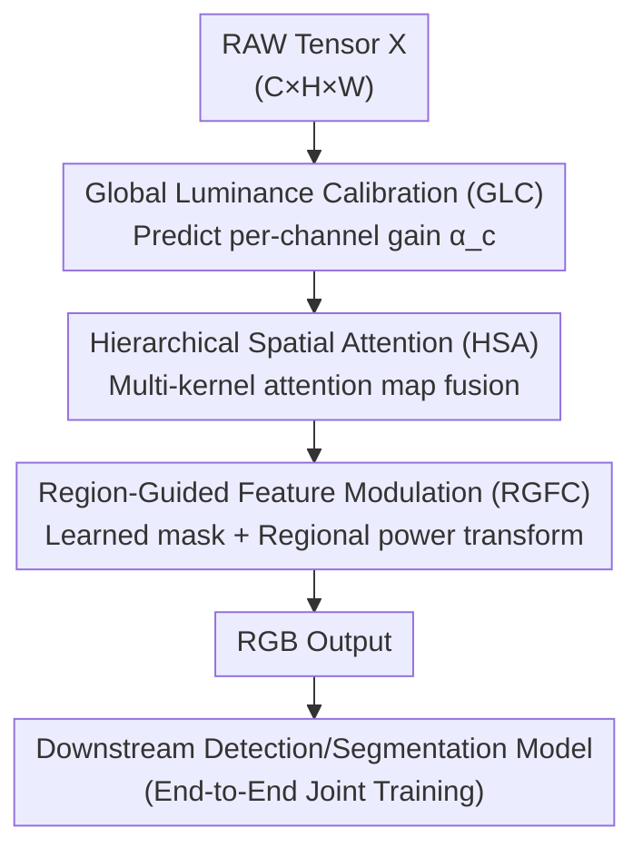

# Task-Aware Image Signal Processor for Advanced Visual Perception

**Conference**: CVPR 2026  
**Paper**: [CVF Open Access](https://openaccess.thecvf.com/content/CVPR2026/html/Chen_Task-Aware_Image_Signal_Processor_for_Advanced_Visual_Perception_CVPR_2026_paper.html)  
**Code**: https://github.com/CVL-UESTC/TA-ISP  
**Area**: Image Restoration / ISP / RAW Visual Perception  
**Keywords**: Task-Aware ISP, RAW-to-RGB, Multi-grain Modulation, Lightweight, Object Detection and Segmentation

## TL;DR
TA-ISP replaces the RAW→RGB step—traditionally either a heavy network or a few tuned parameters—with predicted sets of global, regional, and pixel-level modulation operators. At the cost of only 3K parameters and sub-27ms latency, it produces image representations optimal for downstream detection and segmentation, achieving superior accuracy while significantly reducing computation and latency across multiple RAW benchmarks.

## Background & Motivation
**Background**: Increasing numbers of vision tasks directly utilize RAW sensor data instead of low-bit RGB, as RAW preserves richer information. Converting RAW to RGB for pre-trained detection or segmentation models requires an Image Signal Processor (ISP). Current approaches typically follow two paths: 1) End-to-end mapping using large networks (e.g., MW-ISPNet) jointly optimized with downstream models; 2) Fine-tuning a few parameters in a traditional ISP pipeline or inserting small adapters (e.g., DIAP, RAW-Adapter).

**Limitations of Prior Work**: The first category utilizes networks that are too large and slow—ISPs are typically deployed on edge devices with strict area and power constraints. Networks exceeding 1000 GFLOPs (e.g., MW-ISPNet at 1690 GFLOPs with 2.4s latency) are impractical for terminal devices. The second category, while lightweight, is restricted by the fixed design space of traditional ISPs, often limited to global or per-channel adjustments. This fails to express the complex, spatially varying transformations required, leading to generalization failure when scenes or tasks deviate from the original design.

**Key Challenge**: A hard trade-off between expressive power and computational budget. Strong spatial-adaptive transformations typically require dense convolutions, which edge-side ISP hardware budgets do not permit.

**Goal**: To produce "task-oriented" RAW→RGB representations under strict parameter, latency, and bandwidth constraints, capable of expressing spatially varying transformations.

**Key Insight**: The authors observe that most computation is wasted on dense convolutions. By decoupling "the transformation type" from "the execution intensity per pixel," the network only needs to **predict a small set of compact modulation operators** (per-channel gains, attention maps, regional masks + weights). Applying these operators back to the image expands the spatial-adaptive transformation space significantly with almost no additional computational cost.

**Core Idea**: Replace "dense convolutional ISP" with "predicted multi-grain modulation operators." Image statistics are reshaped across global, regional, and pixel scales to achieve strong spatial adaptivity under low computation.

## Method

### Overall Architecture
TA-ISP is a lightweight RAW→RGB pipeline **jointly optimized end-to-end** with downstream vision models. The input is a packed RAW tensor $X \in \mathbb{R}^{C\times H\times W}$, and the output is a processed RGB image fed into frozen or trainable downstream detectors/segmentors. The pipeline consists of three serial modules that adjust the representation from coarse to fine: Global Luminance Calibration (GLC), Hierarchical Spatial Attention (HSA), and Region-Guided Feature Modulation (RGFC). The commonality is that computation is spent on "predicting modulation parameters" rather than dense convolution, resulting in only 3K parameters and 26ms latency (for 3840×2160 input).

### Key Designs

**1. Global Luminance Calibration (GLC): Expanding RAW dynamic range via per-channel gains**

This addresses the issue where RAW pixel values are often compressed into a narrow low-intensity range, with serious exposure imbalance and color response bias between channels. GLC first calculates global mean and variance for each channel: $\mu_c=\frac{1}{HW}\sum_{i,j}X_{c,i,j}$ and $\sigma_c^2=\frac{1}{HW}\sum_{i,j}(X_{c,i,j}-\mu_c)^2$. The vector $[\mu_c,\sigma_c^2]$ is passed through fully connected layers to estimate per-channel multiplicative gains $\alpha_c=\mathrm{Softplus}(F_g([\mu_c,\sigma_c^2]))+1$. The calibrated image is $X_g=\alpha_c\cdot X_c$. Softplus ensures non-negativity, and the constant +1 ensures $\alpha_c>1$ (brightening only). It fixes dynamic range and exposure simultaneously through a scalar gain optimized for downstream tasks.

**2. Hierarchical Spatial Attention (HSA): Highlighting task-relevant structures**

Structural information (edges, textures) in RAW images is distributed non-uniformly. HSA pools $X_g$ along the channel dimension to get $M=[M_{avg};M_{max}]\in\mathbb{R}^{2\times H\times W}$, then uses multiple convolution branches with different kernel sizes $k$ to obtain single-channel attention maps $A_k=\sigma(\mathrm{Conv}_k(M))$. Fusion is performed using weights $w_k$ derived from a global descriptor $d=G(X_g)$ via $1{\times}1$ convolution and softmax. The final map is $A=\sum_k w_k A_k$, applied as $X_s=X_g\odot A$. This data-adaptive weighting provides appropriate receptive fields for different structure sizes with minimal overhead.

**3. Region-Guided Feature Modulation (RGFC): Learned spatial partitioning and enhancement**

To handle spatially varying requirements that global adjustments miss, RGFC learns spatial partitions. A convolution head $F_m$ generates mask logits, and Gumbel–Softmax $M=S_\tau(F_m(X_s),\tau)$ produces $K$ sets of nearly discrete spatial masks. For each region, an adaptive scalar weight $w_k=F_w(P(F_m(X_s)))$ is estimated. A **power transformation** is then applied per region:

$$X_o=\sum_{k=1}^{K} M_k\cdot X_s^{1/w_k}.$$

This allows nonlinear enhancements of varying intensities ($w_k$) across regions. The partitioning is entirely data-driven, enabling fine-grained, context-aware spatial transformations that traditional ISP tuning cannot express.

### Loss & Training
TA-ISP does not introduce additional image reconstruction losses. It is **jointly optimized end-to-end** with the downstream vision model, using task-specific losses (detection or segmentation) to guide the modulation parameter prediction. Detection experiments used RetinaNet (ResNet-18/50) and YOLOX series (SGD, batch 4, 35–50 epochs). Segmentation used Segformer (MiT-B0, 512×512 crop, 80k iterations).

## Key Experimental Results

### Main Results
On PASCAL RAW (daylight) and LOD (low-light) detection datasets, TA-ISP leads in both accuracy and efficiency (AP; FLOPs at 640×640, Latency at 3840×2160):

| Method | PASCAL R18 | PASCAL R50 | LOD R50 | Params(M) | FLOPs(G) | Latency(ms) |
|------|-----------|-----------|---------|---------|----------|----------|
| Demosaic | 87.7 | 89.2 | 58.5 | — | — | — |
| MW-ISPNet | 88.9 | 89.6 | 59.4 | 9.14 | 1690.54 | 2425.87 |
| InvISP | 85.4 | 87.6 | 56.9 | 1.06 | 433.30 | 1584.65 |
| DIAP | 88.5 | 89.7 | 59.5 | 0.08 | 0.23 | 79.70 |
| RAW-Adapter | 88.7 | 89.7 | 62.1 | 0.76 | 4.02 | 158.01 |
| **TA-ISP (Ours)** | **89.9** | **90.2** | **63.9** | **0.003** | **0.20** | **26.43** |

Notably, the ResNet-18 version (89.9) outperforms other methods using ResNet-50. Parameters are an order of magnitude lower than DIAP (3K vs 80K). On the high-dynamic-range ROD dataset:

| Method | Day AP | Day AP50 | Night AP | Night AP50 |
|------|--------|----------|----------|------------|
| Demosaic | 36.1 | 49.4 | 54.5 | 80.6 |
| DIAP | 36.2 | 49.9 | 58.5 | 84.3 |
| RAW-Adapter | 35.9 | 49.0 | 45.9 | 69.9 |
| **TA-ISP** | **38.0** | **51.6** | **59.7** | **84.8** |

TA-ISP remains robust in night scenes where MW-ISPNet and RAW-Adapter significantly degrade. Performance in semantic segmentation (ADE20K) also leads (36.29 mIoU vs 34.72 for RAW-Adapter).

### Ablation Study
Module-wise integration validation (ROD Day AP / LOD Night):

| GLC | HSA | RGFC | ROD AP | LOD |
|-----|-----|------|--------|-----|
| – | – | – | 36.1 | 58.5 |
| ✓ | – | – | 36.3 | 60.4 |
| ✓ | ✓ | – | 36.8 | 63.0 |
| ✓ | ✓ | ✓ | 38.0 | 63.9 |

The combination results in a cumulative +5.4 AP on LOD. HSA and RGFC contribute significantly (+1.9 total on ROD), indicating the importance of spatial adaptive modulation.

### Key Findings
- **Efficiency and Accuracy are not mutually exclusive**: TA-ISP achieves higher accuracy with 0.20 GFLOPs compared to MW-ISPNet's 1690 GFLOPs.
- **Superior Data Efficiency**: In limited-data experiments on PASCAL RAW, TA-ISP with 25% data outperforms competitors using 100% data.
- **Model Agnostic**: Gains are consistent across different model scales (e.g., YOLOX-L).
- **Granularity Matters**: All three levels (Global, Regional, Pixel) are essential, with low-light scenes showing higher dependency on HSA/RGFC.

## Highlights & Insights
- **Philosophy of "Predicting Operators"**: Transferring ISP computation from dense pixel transformations to predicting compact parameters (gain/attention/mask weights) allows for strong expressiveness with only 3K parameters.
- **Elegant Power Transform**: The $X_s^{1/w_k}$ transformation is a simple yet effective way to implement non-linear regional enhancement, outperforming linear scale-and-shift methods for RAW exposure correction.
- **Data-Driven Partitioning**: Utilizing Gumbel-Softmax to discover spatial partitions avoids the rigidity of manual region definition, which is key to lightweight spatial adaptivity.
- **Grain Decomposition**: The coarse-to-fine structure (Global → Regional → Pixel) naturally maps to diverse needs like whole-image calibration, regional adjustment, and detail correction.

## Limitations & Future Work
- Sensitivity analysis for hyperparameters (kernel sizes in HSA, region number $K$) was not provided.
- Evaluation focused on detection and segmentation; transferability to depth estimation or tracking is unverified.
- End-to-end joint training requires retraining for each new downstream task/model, lacking "train-once, reuse-all" multi-task capability.
- Numerical stability of the power operator $X_s^{1/w_k}$ near 0 or for negative values was not explicitly discussed.

## Related Work & Insights
- **vs. MW-ISPNet / InvISP**: These use large networks for RAW→RGB mapping. While expressive, they have high latency and often fail in low-light/HDR scenes. TA-ISP is more robust and efficient.
- **vs. DIAP / RAW-Adapter**: These are stuck in the design space of traditional ISPs (global/channel-wise). TA-ISP's HSA and RGFC modules introduce explicit multi-scale, spatially varying transformations.
- **Insight**: The paradigm of "parameterizing a compact function family" instead of using dense convolutions is highly valuable for any latency-sensitive low-level vision task.

## Rating
- **Novelty**: ⭐⭐⭐⭐ Multi-grain modulation for task-aware ISP is a refined assembly of known techniques.
- **Experimental Thoroughness**: ⭐⭐⭐⭐⭐ Comprehensive coverage of tasks, lighting conditions, and data constraints.
- **Writing Quality**: ⭐⭐⭐⭐ Logic and formulas are clear, though some hyperparameter details are missing.
- **Value**: ⭐⭐⭐⭐⭐ 3K parameters and 26ms latency with SOTA performance offers high practical value for edge deployment.

<!-- RELATED:START -->

## Related Papers

- [\[CVPR 2026\] Bridging the Perception Gap in Image Super-Resolution Evaluation](bridging_the_perception_gap_in_image_super-resolution_evaluation.md)
- [\[CVPR 2026\] BiEvLight: Bi-level Learning of Task-Aware Event Refinement for Low-Light Image Enhancement](bievlight_bi-level_learning_of_task-aware_event_refinement_for_low-light_image_e.md)
- [\[CVPR 2026\] DVAR: Dynamic Visual Autoregressive Modeling for Image Super-Resolution](dvar_dynamic_visual_autoregressive_modeling_for_image_super-resolution.md)
- [\[CVPR 2026\] Towards Generalized Representations for Low-Light Understanding: When Signal Constancy Meets Semantic Enrichment](towards_generalized_representations_for_low-light_understanding_when_signal_cons.md)
- [\[ICLR 2026\] Learning Domain-Aware Task Prompt Representations for Multi-Domain All-in-One Image Restoration](../../ICLR2026/image_restoration/learning_domain-aware_task_prompt_representations_for_multi-domain_all-in-one_im.md)

<!-- RELATED:END -->
