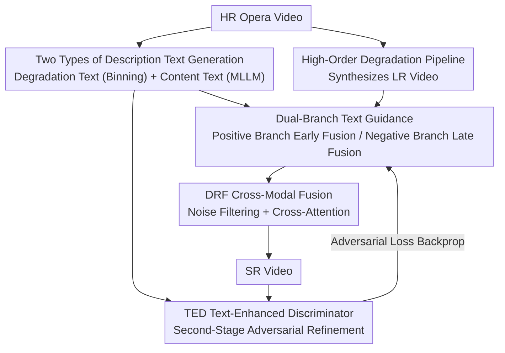

# TextOVSR: Text-Guided Real-World Opera Video Super-Resolution

**Conference**: CVPR 2026  
**Paper**: [CVF Open Access](https://openaccess.thecvf.com/content/CVPR2026/html/Chang_TextOVSR_Text-Guided_Real-World_Opera_Video_Super-Resolution_CVPR_2026_paper.html)  
**Code**: https://github.com/ChangHua0/TextOVSR  
**Area**: Image Restoration / Video Super-Resolution  
**Keywords**: Real-world video super-resolution, opera video, text guidance, degradation modeling, cross-modal fusion

## TL;DR
To address the issues of poor image quality and difficult-to-model real-world degradation in old opera videos, TextOVSR introduces two types of text prompts: "degradation description text" and "content description text" to construct a positive/negative dual-branch network. The negative branch uses degradation text to constrain the solution space, while the positive branch utilizes content text to supplement semantics. Equipped with a degradation-robust cross-modal fusion module (DRF) and a text-semantic-aware discriminator (TED), it achieves state-of-the-art (SOTA) performance on no-reference quality metrics on the self-built OperaLQ real-world degradation benchmark.

## Background & Motivation

**Background**: Real-World Video Super-Resolution (RWVSR) has shifted in recent years from "assuming bicubic downsampling" to "approximating real-world complex degradations." The mainstream approaches are twofold: first, high-order degradation pipelines like Real-ESRGAN, which synthesize low-quality inputs by cascading multiple stages of known degradation kernels (such as blur, scaling, noise, and JPEG/video compression); second, real-world noise modeling like NegVSR, which directly extracts real noise patches from external datasets for injection and utilizes a "negative constraint" to make the model more robust to noise.

**Limitations of Prior Work**: Directly applying these methods to heavily degraded opera videos faces two inevitable challenges. First, **difficulty in modeling real degradation**: simple combinations of classical degradation kernels generate synthetic noise distributions that do not match real-world noise, easily leading to out-of-distribution issues. Extracting real noise from external datasets highly relies on the assumption that "external data style $\approx$ target data style." When the noise style of everyday videos mismatches that of opera videos, prominent artifacts are introduced in the results. Second, **lack of high-level semantic guidance**: existing RWVSR approaches only take degraded image features as input without any high-level semantic information, rendering them inadequate in reconstructing realistic textures, especially in structured regions like human faces, text, and opera costumes.

**Key Challenge**: Modeling degradation "realistically" requires introducing real noise, which brings artifacts due to style mismatch; reconstructing textures "believably" requires semantic priors, which are absent in pure image features. Both issues point to the same gap: **the model lacks a stable, controllable, and semantic external guidance signal**.

**Key Insight**: The authors observe that text is a natural carrier of high-level semantics, which is both controllable and cheap to obtain. If "how severe the degradation of this frame is" and "what is depicted in this frame" can be written as text and fed into the network, the former can constrain the solution space of degradation modeling, while the latter can supplement semantics for texture reconstruction.

**Core Idea**: Embedding two types of text prompts into the classical RWVSR framework (based on NegVSR/BasicVSR): degradation description text enters the negative branch to constrain the solution space, and content description text enters the positive branch and the discriminator to supplement semantics. This uses text rather than diffusion priors to simultaneously improve degradation modeling and texture reconstruction while remaining lightweight.

## Method

### Overall Architecture

TextOVSR is a **positive/negative dual-branch, text-guided** real-world opera video super-resolution network, where both branches are built on the bidirectional propagation backbone of BasicVSR. The input is a degraded low-resolution (LR) opera video, and the output is the super-resolved high-resolution (HR) video. The entire pipeline can be split into four stages: "text generation $\to$ dual-branch text-guided propagation $\to$ cross-modal fusion $\to$ adversarial refinement":

First, while synthesizing LR training data using a high-order degradation pipeline, **degradation description texts** are generated based on the degradation severity. Meanwhile, **content description texts** are generated from clean HR frames using a Multimodal Large Language Model (MLLM). During training, the **positive branch** (blue) takes the "content text + degraded LR video" to produce the super-resolution result $V_{sr}^{t}$, and the **negative branch** (red) takes the "degradation text + LR video mixed with real noise" to yield $\hat{V}_{sr}^{t}$. The negative loss $\mathcal{L}_{neg}$ is calculated between the outputs of the two branches to enhance the positive branch's robustness to real noise. In both branches, image features and text features are fused using the **DRF module** for cross-modal fusion, with the key difference being the fusion timing: the positive branch uses **early fusion** (before deep feature extraction, to enhance frame feature representation and suppress error propagation), while the negative branch uses **late fusion** (after deep feature extraction, allowing the degradation description to model real noise at the feature level). The training is divided into two stages. In the second stage, TextOVSR acts as the generator, and a **text-enhanced discriminator (TED)** is introduced for adversarial training to refine textures. During inference, only the positive branch is used, and the degradation description text is no longer required.

### Key Designs

**1. Generation of Two Types of Description Texts: Translating Degradation Intensity and Frame Semantics into Controllable Text Prompts**

This step targets the root causes of the "unrealistic degradation modeling" and "lack of semantic guidance" pain points—by constructing two types of text signals for the network. **Degradation description text** is generated alongside the high-order degradation pipeline. Each stage of the pipeline contains operations such as blur, scaling, noise, JPEG compression, and video compression. Following PromptSR, the authors **bin** the intensity of each degradation into three levels: light, medium, and heavy, generating phrases like "light blur." The high-order degradation then concatenates descriptions of several contiguous stages to form a complete high-order degradation description (e.g., "heavy blur, downsample, medium noise, light image compression, medium video compression..."). **Content description text** is generated frame-by-frame using an MLLM (implemented with LLaVA). Crucially, it is generated from **clean HR frames** instead of degraded LR frames (e.g., "A woman in traditional Chinese opera costume stands on the stage, holding a folding fan..."), ensuring the semantics are accurate and untainted by degradation. For efficiency and video-level consistency, texts are shared across continuous frames within a batch (batch size of 7, matching the 7-frame clip format of the dataset).

**2. Dual-Branch Text Guidance and Differentiated Fusion Timings: Positive Branch for Semantics, Negative Branch for Solution Space Constraint**

This is the backbone of the overall framework, directly addressing the conflict of "wanting to model real degradation but introducing artifacts." Both branches are built on BasicVSR's bidirectional propagation, but play opposite roles: the positive branch (blue) takes content description text $T_C$ + degraded LR video, aiming to output high-quality SR; the negative branch (red) takes degradation description text $T_D$ + LR video mixed with real noise as a "counter-example" constraint. During training, the negative loss $\mathcal{L}_{neg}(V_{sr}^{t},\hat{V}_{sr}^{t})$ is calculated using the outputs of both branches ($V_{sr}^{t}$ and $\hat{V}_{sr}^{t}$) to help the positive branch learn to remain stable under real noise. The most ingenious design is the **differentiated fusion timing**: the positive branch fuses text features **before deep feature extraction** to enhance frame representation and suppress temporal error propagation; the negative branch fuses text features **after deep feature extraction** to let the degradation descriptions model real noise distributions at the feature level. Taking the positive branch forward propagation $t\to t+1$ as an example: the LR video $V_{lr}$ is first passed through a residual module to get frame features $F_I^{t+1}$, and the CLIP text encoder encodes $T_C$ into $F_{T_C}^{t+1}$. These two are fused into $M^{t+1}$ via the DRF module. Meanwhile, the previous feature $F_I^{t}$ and optical flow $v_{t\to t+1}$ are spatially warped to obtain aligned features $\tilde{F}_I^{t}$. Finally, the fused features and aligned temporal features are concatenated along the channel dimension and passed through a residual module to obtain the final feature of frame $t+1$.

**3. DRF Degradation-Robust Cross-Modal Fusion Module: Filter First then Cross-Attention to Avoid Directly Trusting Dirty Features**

Both positive and negative inputs can contain unreliable information: the LR input in the positive branch has degradation details, and directly trusting it will amplify errors and blur details during temporal propagation; the external real noise injected into the negative branch often has mismatched styles; even the content descriptions generated by the MLLM can be inaccurate. DRF is designed for "fusion under uncertainty": the extracted frame features $F_I^{t+1}$ and text features $F_T^{t+1}$ are first "filtered" via **multi-head self-attention** and linear layers respectively to amplify reliable information and suppress noise and erroneous features, obtaining filtered features $\hat{F}_I^{t}$ and $\hat{F}_T^{t}$. Subsequently, the filtered image features are used to generate Queries, and the filtered text features are used to generate Keys and Values, calculating the fused features $M^{t+1}$ via **multi-head cross-attention**. This two-stage structure of filtering first and then performing cross-attention is key to its ability to "perform cross-modal fusion while suppressing degradation interference."

**4. TED Text-Enhanced Discriminator: Infusing High-Level Semantics into Adversarial Signals**

High-level semantics in content description texts are useful not only for the generator but also for the discriminator—a discriminator that better understands "what should be in the scene" can provide more accurate adversarial guidance. TED injects text features on top of a standard UNet discriminator: the inputs are the SR frame $V_{sr}^{t}$ and the corresponding content text features $F_{T_C}^{t}$. The UNet extracts image features $F_{sr}^{t}$, and a feature filter filters out valid text features $\hat{F}_{T_C}^{t}$. The two are concatenated along the channel dimension and passed through a residual module to compute the adversarial loss. This combination of "UNet image extraction + filtered text" leverages high-level semantics of content descriptions while filtering out inaccurate features, proving more stable than directly applying GALIP (which aligns CLIP image-text encoders without filtering), which tends to yield blurry reconstructions in fine-grained regions like faces and costumes.

### Loss & Training

A two-stage training strategy is adopted (following the paradigm of RealBasicVSR / NegVSR). **In the first stage**, only TextOVSR is trained, and the loss is the reconstruction loss plus the negative loss:

$$\mathcal{L}_{stage1}=\mathcal{L}_{rec}(V_{sr}^{t},V_{GT}^{t})+\alpha\,\mathcal{L}_{neg}(V_{sr}^{t},\hat{V}_{sr}^{t})$$

where the weight of the negative loss is $\alpha=0.5$. Training runs for 100K iterations using the Adam optimizer with a learning rate of $1\times10^{-4}$. **In the second stage**, the trained TextOVSR serves as the generator and TED serves as the discriminator to refine details under the GAN framework. The learning rate is reduced to $5\times10^{-5}$, and a perceptual loss $\mathcal{L}_{per}$ and CLIPIQA loss are added. The CLIPIQA loss is defined as $\mathcal{L}_{clipiqa}=1-\mathcal{R}(V_{sr}^{t})$ (where $\mathcal{R}$ is the CLIP-IQA model), and the adversarial loss is $\mathcal{L}_{adv}=-\mathbb{E}\big[\log\,TED(V_{sr}^{t},F_{T_C}^{t})\big]$. The overall objective for the second stage is:

$$\mathcal{L}_{stage2}=\mathcal{L}_{stage1}+\mathcal{L}_{per}(V_{sr}^{t},V_{GT}^{t})+\beta\,\mathcal{L}_{clipiqa}+\mathcal{L}_{adv}$$

where $\beta=0.5$. Optical flow is estimated using a pre-trained SPyNet (frozen), and text is encoded using CLIP ViT-L/14@336px.

## Key Experimental Results

### Main Results

The training set utilizes Chinese Opera Video Clips (COVC) from MambaOVSR, where 7-frame sequences are split for single-frame reconstruction. Unlike the online degradation in RealBasicVSR, this paper **pre-generates** degraded inputs using the RealESRGAN pipeline to ensure consistent degradation across epochs and alignment with frame-by-frame degradation description texts. GT and degraded frames are randomly cropped to $256\times256$, and degraded frames are further bicubic-downsampled to $64\times64$. Evaluation is conducted on the self-built OperaLQ benchmark (50 real-world degraded opera videos, 100 frames each). Since real degraded videos **lack reference GTs**, no-reference metrics are used throughout: image-level NRQM / MUSIQ / CLIPIQA+ / TOPIQ / BRISQUE / NIQE / ILNIQE / PI, and video-level DOVER.

| Method | Params(M) | NRQM↑ | CLIPIQA+↑ | TOPIQ↑ | NIQE↓ | BRISQUE↓ | DOVER↑ |
|------|-----------|-------|-----------|--------|-------|----------|--------|
| RealBasicVSR | 4.9 | 5.1708 | 0.3494 | 0.3556 | 4.4300 | 41.7475 | 33.4799 |
| RealViformer | 8.5 | 5.1894 | 0.3774 | 0.3669 | 4.4347 | 39.3883 | 39.4318 |
| NegVSR (baseline) | 3.4 | 5.7761 | 0.3990 | 0.4354 | 4.0756 | 33.5291 | 40.6763 |
| **TextOVSR (Ours)** | 5.7 | **5.8184** | **0.5667** | **0.4636** | **3.5139** | **33.3799** | **45.0415** |

TextOVSR achieves optimal performance across most metrics, including CLIPIQA+, TOPIQ, NIQE, BRISQUE, PI, and DOVER. Notably, CLIPIQA+ jumps from 0.3990 (NegVSR) to 0.5667 (+0.1677), and DOVER rises from 40.68 to 45.04. This demonstrates that text guidance yields real improvements in both perceptual quality and temporal consistency. Meanwhile, the parameter count is only 5.7M with 309.6G FLOPs, remaining lightweight (the only lagging metric is MUSIQ at 58.30, slightly below NegVSR's 58.64).

### Ablation Study

Using NegVSR as the baseline (Variant 1), DRF, degradation/content texts, and TED are step-by-step added:

| Variant | Configuration | NRQM↑ | CLIPIQA+↑ | TOPIQ↑ | NIQE↓ |
|------|------|-------|-----------|--------|-------|
| V1 | baseline (NegVSR, w/o T, N) | 5.7761 | 0.3990 | 0.4354 | 4.0756 |
| V2 | +DRF (only negative branch enhanced) | 5.4949 | 0.5462 | 0.4436 | 3.7303 |
| V3 | +Degradation text $T_D$ | 5.4610 | 0.5471 | 0.4483 | 3.6396 |
| V4 | Dual-branch both enhanced | 5.5697 | 0.5507 | 0.4523 | 3.6627 |
| V5 | +Content text ($T_D$ & $T_C$) | 5.6838 | 0.5667 | 0.4636 | 3.5139 |
| V6 | +TED (full model) | 5.8184 | 0.5659 | 0.4733 | 3.4291 |

V1 $\to$ V2, using only DRF to enhance the negative branch, lifts CLIPIQA+ by 0.1472 (0.3990 $\to$ 0.5462), effectively suppressing artifacts caused by style-mismatched noise. Adding degradation text (V3), enhancing both branches (V4), and integrating content text (V5) steadily improve TOPIQ/NIQE. Finally, adding TED (V5 $\to$ V6) increases NRQM from 5.6838 to 5.8184, TOPIQ from 0.4636 to 0.4733, NIQE from 3.5139 to 3.4291, and BRISQUE from 35.7444 to 33.3799, pushing the overall reconstruction quality with adversarial refinement.

Three other analytical experiments were conducted:
(1) **Text granularity**: Fine-grained Text (NRQM 5.6838 / NIQE 3.5139) overall outperforms coarse-grained Caption (NRQM 5.5552 / NIQE 3.6206), with only a slight drop of 0.0051 in CLIPIQA+. Fine-grained descriptions better guide structural recovery in areas like faces and chairs.
(2) **Discriminator**: TED (NRQM 5.8184 / TOPIQ 0.4733) > UNet (5.6838 / 0.4636) > direct CLIP image-text alignment (5.0118 / 0.2860, where the lack of filtering leads to blurry fine-grained regions).
(3) **DRF position in negative branch**: Fusion "after feature extraction" (CLIPIQA+ 0.5462 / NIQE 3.7303) is superior to "before extraction" (0.5438 / 3.7274) and no fusion (0.3990 / 4.0753). Late fusion effectively suppresses out-of-distribution noise at the feature level.

### Key Findings
- DRF is the main performance driver: The V1 $\to$ V2 step alone (adding DRF only to the negative branch) boosts CLIPIQA+ by 0.1472, indicating that "cross-modal fusion with filtering" is highly critical for suppressing style-mismatched noise.
- Finer text granularity is better, but requires filtering: Fine-grained content descriptions guide clearer structural recovery. However, if text is used without filtering (as in the CLIP-aligned discriminator), it leads to degradation in detailed areas like faces or costumes; TED's "filter-first" approach is designed to solve this issue.
- Fusion timing is not "the earlier, the better": The early fusion in the positive branch and late fusion in the negative branch are deliberately distinguished. Early fusion in the negative branch would introduce noise, whereas late fusion can suppress out-of-distribution noise at the feature level.

## Highlights & Insights
- **Using text as dual signals for "degradation labels + semantic priors"**: Degradation description text essentially discretizes continuous degradation intensities into readable binned labels to constrain the solution space in the negative branch, while content description text feeds frame semantics into the positive branch to supplement textures. This lightweight text channel simultaneously resolves two classic problems ("degradation modeling" and "semantic guidance") without the high computational cost of multi-step denoising in diffusion models.
- **Generating content text from HR instead of LR** is a key detail: Descriptions generated from degraded frames would be corrupted by noise and produce inaccurate semantics. Generating from clean HR frames provides a reliable semantic prior, while LLaVA is used during inference to generate descriptions for test frames on the fly.
- **DRF's "filter first, then cross-attend"** is a transferable cross-modal fusion paradigm: When both modalities are partially unreliable (noisy images + potentially inaccurate text), performing self-attention filtering first followed by cross-attention is more robust than direct concatenation or standard cross-attention. This can be adapted to other noisy cross-modal tasks.
- **Discriminators also benefit from semantics**: TED reminds us that the discriminator side of GANs can also benefit from high-level semantic guidance, not just the generator. Injecting content text into the discriminator provides more precise adversarial signals.

## Limitations & Future Work
- **Heavily reliant on MLLM and CLIP encoders**: The quality of the content text depends directly on LLaVA's description accuracy, and running the MLLM on each frame during inference introduces extra overhead. Inaccurate MLLM descriptions introduce new uncertainties (acknowledged by the authors; alleviated by DRF/TED filtering but not fundamentally eliminated).
- **Heuristic text binning for degradation description**: The three-tier binning (light/medium/heavy) and concatenation strategy are heuristics based on degradation pipeline parameters, which may not cover all degradation patterns in real-world opera videos. The impact of binning granularity remains under-explored.
- **Evaluated solely on no-reference metrics**: Real degradation datasets lack GT, forcing reliance on no-reference metrics like NRQM, CLIPIQA+, and DOVER. These metrics have limited alignment with human subjective consistency (as seen with NegVSR outperforming Ours on MUSIQ). Conclusions should be evaluated alongside qualitative visualizations (⚠️ caution is needed when comparing across different NR metrics as they emphasize different aspects, and ranking on a single metric may not generalize).
- **Narrow domain focus**: The method is developed specifically for opera videos (using the COVC training set and OperaLQ benchmark). Its generalization to other real-world degradation domains (such as surveillance or old movies) has not been verified.

## Related Work & Insights
- **vs NegVSR**: This work is directly built on top of NegVSR and uses it as a baseline. NegVSR extracts real noise from external datasets and applies negative constraints for robustness, but suffers from style mismatch artifacts and relies solely on image features. TextOVSR retains the negative branch/negative loss idea and introduces two types of texts alongside DRF/TED, upgrading both degradation modeling and texture reconstruction. This lifts CLIPIQA+ from 0.3990 to 0.5667.
- **vs Real-ESRGAN / RealBasicVSR**: These methods approximate real-world degradation via high-order pipelines or dynamic clean-up modules. They still follow the "pure image feature" route and lack semantic guidance. This work reuses their degradation pipelines to synthesize data but additionally writes degradation intensities into text and feeds them to the network.
- **vs Diffusion-based Text-Guided SR (STAR, CLIP-SR, etc.)**: Diffusion methods generate realistic textures using generative priors but suffer from heavy computational overhead and temporal inconsistency. This work embeds multiple text cues into the classical RWVSR framework, achieving degradation modeling and texture enhancement while remaining lightweight and robust, offering an alternative direction to the diffusion paradigm.

## Rating
- Novelty: ⭐⭐⭐⭐ Embedding dual texts ("degradation text + content text") into classic RWVSR, with differentiated fusion timings and a filtered cross-modal discriminator, offers a novel and problem-aligned combination.
- Experimental Thoroughness: ⭐⭐⭐⭐ Main comparisons cover 8 SOTA methods across multiple metrics, and ablation studies are detailed down to individual variants with three sets of analytical experiments (text granularity, discriminator, and fusion position). However, it is limited to the single domain of opera videos and relies entirely on no-reference metrics.
- Writing Quality: ⭐⭐⭐⭐ Clear progression from motivation to method and experiments. Figures 1, 2, and 3 clarify the dual-branch setup and text generation.
- Value: ⭐⭐⭐⭐ The OperaLQ benchmark and the text-guided RWVSR schema offer practical value for restoring old opera videos and archival footage. The DRF cross-modal fusion paradigm is highly transferable.

<!-- RELATED:START -->

## Related Papers

- [\[ICLR 2026\] Improved Adversarial Diffusion Compression for Real-World Video Super-Resolution](../../ICLR2026/image_restoration/improved_adversarial_diffusion_compression_for_real-world_video_super-resolution.md)
- [\[CVPR 2026\] One-Step Diffusion Transformer for Controllable Real-World Image Super-Resolution](one-step_diffusion_transformer_for_controllable_real-world_image_super-resolutio.md)
- [\[CVPR 2026\] Toward Real-world Infrared Image Super-Resolution: A Unified Autoregressive Framework and Benchmark Dataset](real_iisr_infrared_image_super_resolution_autoregressive.md)
- [\[CVPR 2026\] Time-Aware One Step Diffusion Network for Real-World Image Super-Resolution](time-aware_one_step_diffusion_network_for_real-world_image_super-resolution.md)
- [\[ECCV 2024\] Towards Real-world Event-guided Low-light Video Enhancement and Deblurring](../../ECCV2024/image_restoration/towards_real-world_event-guided_low-light_video_enhancement_and_deblurring.md)

<!-- RELATED:END -->
