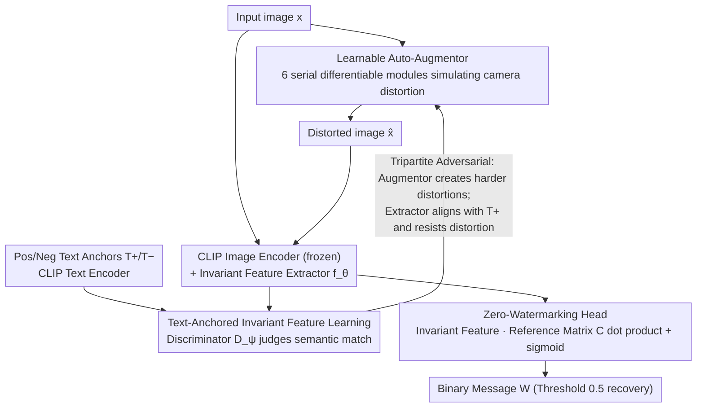

# TIACam: Text-Anchored Invariant Feature Learning with Auto-Augmentation for Camera-Robust Zero-Watermarking

**Conference**: CVPR2026  
**arXiv**: [2602.18863](https://arxiv.org/abs/2602.18863)  
**Code**: To be confirmed  
**Area**: Object Detection (Actual: Multimedia Security/Watermarking)  
**Keywords**: Zero-watermarking, cross-modal alignment, learnable data augmentation, camera robustness, CLIP, adversarial training, invariant feature learning

## TL;DR

Ours proposes the TIACam framework, which achieves a camera-robust zero-watermarking scheme without modifying image pixels. By employing a learnable auto-augmentor to simulate camera distortions, text-anchored cross-modal adversarial training to learn invariant features, and a zero-watermarking head to bind messages in the feature space, the method achieves SOTA extraction accuracy in three real-world scenarios: screen re-shooting, print re-shooting, and screenshots.

## Background & Motivation

1.  **Zero-Watermarking Paradigm**: Traditional watermarking modifies images in the spatial or transform domain. Zero-watermarking, however, does not modify pixels but associates the watermark with inherent image features, balancing invisibility with verification reliability.
2.  **Camera Re-shooting Challenge**: Re-shooting with a camera introduces complex and spatially coupled degradations such as perspective distortion, illumination changes, sensor noise, and moiré patterns, representing one of the most difficult scenarios for watermark extraction.
3.  **Limitations of Prior Work (Manual Noise Layers)**: Methods like StegaStamp and PIMoG use manually designed camera noise layers. However, real optical distortions vary by environment and are non-linearly coupled; fixed augmentations struggle to cover these cases.
4.  **Non-optimal Pre-trained Features**: Feature robustness in self-supervised models like DINO is a byproduct and not explicitly optimized for watermarking tasks.
5.  **Insufficiency of Single Invariance**: Learning invariance through either text guidance alone or distortion-adversarial training alone cannot simultaneously guarantee semantic consistency and distortion robustness.
6.  **Key Challenge (Lack of Unified Framework)**: Existing methods separate augmentation, feature learning, and watermark binding, lacking an end-to-end joint optimization mechanism.

## Method

### Overall Architecture

TIACam addresses zero-watermarking for camera re-shooting scenarios. Since camera re-shooting introduces complex, coupled degradations that manual noise layers cannot fully cover, the core idea is to integrate "distortion simulation—invariant feature learning—message binding" into a tripartite adversarial loop for joint training. The Auto-Augmentor continuously generates more challenging camera distortions, the Text-Anchored Invariant Feature Learner learns features in the CLIP cross-modal space that are resistant to these distortions while maintaining semantic consistency, and the Zero-Watermarking Head binds binary messages within this invariant feature space. The three modules mutually exert pressure to evolve a robust and verifiable feature representation.

### Key Designs

**1. Learnable Auto-Augmentor: Training "Camera Distortion" as an Adversary**

Manual noise layers are static, whereas real optical distortions are environment-dependent and non-linearly coupled. The Auto-Augmentor decomposes camera degradation into 6 serial differentiable modules. Each module's distortion parameters are learnable, allowing the entire pipeline to be optimized via gradients to evolve toward the "hardest to resist" direction:

| Module | Function | Key Parameter |
|------|------|----------|
| Geometric | Perspective/Rotation/Scaling | Learnable 3×3 perspective matrix $A$ |
| Photometric | Brightness/Contrast/Gamma | Learnable $\alpha, \gamma, \beta$ |
| Additive Noise | Sensor noise | Reparameterization $\sigma \cdot z, z \sim \mathcal{N}(0,1)$ |
| Filtering | Optical blur/Lens smudge | Learnable convolution kernel $K$ |
| Compression | JPEG quantization & freq. mask | Smooth quantization + trainable mask $M$ |
| Moiré | Sensor-display interference | Learnable frequency $(f_x, f_y)$ and amplitude $\alpha$ |

The six modules are combined as $\hat{x} = \mathcal{T}_{\text{aug}}(x;\Theta) = \mathcal{T}_{\text{comp}} \circ \mathcal{T}_{\text{filter}} \circ \mathcal{T}_{\text{add}} \circ \mathcal{T}_{\text{photo}} \circ \mathcal{T}_{\text{geo}} \circ \mathcal{T}_{\text{moire}}(x)$. Each module is pre-trained on 10k samples using MSE+SSIM for its specific distortion type before being fine-tuned in the overall adversarial training, ensuring realistic yet controllable distortions.

**2. Text-Anchored Invariant Feature Learning: Simultaneous Robustness and Discriminability**

Solely relying on distortion-adversarial learning can lead to semantic collapse (homogenization), while relying only on text guidance lacks distortion resistance. TIACam anchors both. The feature side uses a frozen CLIP image encoder plus a trainable invariant feature extractor $f_\theta$ (3 residual blocks + projection head $\to$ 1024D). The discriminator $D_\psi$ is a 4-layer Transformer (8-head attention, hidden dim 512) that evaluates image-text pairs. During training, $x$ and its augmented version $\hat{x}$ form pairs with positive/negative text anchors $T^+/T^-$. The discriminator optimizes $\mathcal{L}_{\text{disc}}$ and the generator optimizes $\mathcal{L}_{\text{adv}}$. The augmentor maximizes $\mathcal{L}_{\text{inv}} - \lambda_{\text{sem}}\mathcal{L}_{\text{sem}}$ (where semantic fidelity $\mathcal{L}_{\text{sem}}$ uses cosine similarity from a frozen ViT), and the extractor minimizes $\mathcal{L}_{\text{inv}}$. Updates alternate: ① Update $D_\psi$ to improve pairing discrimination $\to$ ② Update $\Theta$ to generate stronger distortions $\to$ ③ Update $f_\theta$ to align with positive text anchors and resist distortions.

**3. Zero-Watermarking Head: Binding Messages via Dot Product in Invariant Feature Space**

Once features are robust, message binding is lightweight. The zero-watermarking head takes the invariant feature $\tilde{F} = \Psi(f_\theta(x))$ ($\Psi$ is global average pooling + linear projection) and maintains a learnable reference matrix $C \in \mathbb{R}^{k \times d}$, where the $i$-th row is the directional code for the $i$-th bit. Prediction is a dot product plus sigmoid: $\hat{W}_i = \sigma(\tilde{F} \cdot C_i)$. During registration, $C$ and $\Psi$ are optimized (BCE + L2 regularization) for each image-message pair while $f_\theta$ is frozen. Extraction calculates $\tilde{F}' = \Psi(f_\theta(x'))$ for the distorted image $x'$ and recovers the binary message with a threshold of 0.5. This process requires no pixel modification or localization.

## Key Experimental Results

### Feature Invariance (Cosine Similarity, Original vs. Distorted Image)

| Distortion Type | SimCLR | BYOL | Barlow | VICReg | VIbCReg | **Ours** |
|----------|--------|------|--------|--------|---------|------------|
| Additive Noise | 0.82 | 0.88 | 0.79 | 0.83 | 0.89 | **0.97** |
| Photometric | 0.84 | 0.84 | 0.81 | 0.76 | 0.88 | **0.93** |
| Perspective | 0.87 | 0.85 | 0.87 | 0.83 | 0.88 | **0.95** |
| JPEG Compression | 0.79 | 0.80 | 0.87 | 0.81 | 0.73 | **0.98** |
| Moiré Patterns | 0.85 | 0.83 | 0.84 | 0.89 | 0.87 | **0.97** |
| Filtering Blur | 0.88 | 0.88 | 0.89 | 0.87 | 0.88 | **0.98** |
| All Combined | 0.74 | 0.71 | 0.74 | 0.77 | 0.77 | **0.94** |

### Main Results: Watermark Extraction Accuracy (Bit Accuracy %)

| Method | Screen 30b | Screen 100b | Print 30b | Print 100b | Screenshot 30b | Screenshot 100b |
|------|:-----------:|:------------:|:-----------:|:------------:|:-------:|:--------:|
| HiDDeN | 70.6 | 68.8 | 67.1 | 65.7 | 74.5 | 70.6 |
| PIMoG | 82.3 | 80.1 | 75.7 | 72.3 | 79.7 | 78.6 |
| StegaStamp | 93.8 | 91.2 | 92.2 | 91.3 | 93.7 | 93.9 |
| **Ours** | **99.1** | **98.2** | **96.6** | **95.1** | **97.4** | **95.2** |

### Ablation Study: Contribution of Invariant Feature Extractor

| Dataset | CLIP Only | CLIP + Ours |
|--------|:---------:|:-------------:|
| Visual Genome | 0.78 | **0.92** |
| Flickr | 0.84 | **0.93** |
| MSCOCO | 0.76 | **0.89** |
| ImageNet | 0.82 | **0.93** |

The feature extractor improves cosine similarity by approximately 13-15%, proving that robustness stems from the framework rather than CLIP pre-training alone.

### Key Findings: Feature Discriminability Test

For 200 pairs of distinct images generated with the same caption: only the registered image allows 100% watermark recovery. The accuracy for the other image with identical text features drops to ~84% with an average cosine similarity of 0.73, indicating the framework maintains visual instance discriminability while achieving invariance.

## Highlights & Insights

- **Tripartite Adversarial Framework**: Harmonizes the augmentor, extractor, and discriminator, unifying distortion simulation and cross-modal alignment into a single loop.
- **Fully Differentiable Augmentation Pipeline**: 6 modules cover geometry, photometry, noise, filtering, compression, and moiré, allowing gradients to optimize the augmentation strategy.
- **No Pixel Modification**: The zero-watermarking paradigm avoids modifying the image, extracting messages via dot product in the feature space.
- **Excellent Camera Robustness**: Significantly outperforms SOTA under real physical degradations (screen/print re-shooting).
- **No Localization Required**: Directly extracts watermarks from the entire image using robust feature spaces without a separate detection step.

## Limitations & Future Work

- Area labeled as object_detection in metadata; classification needs correction to multimedia security.
- Images are unified to 128x128; local feature preservation for high-resolution images is not fully discussed.
- Zero-watermarking registration requires per-pair optimization of $C$ and $\Psi$, which may be a bottleneck for large-scale batch registration.
- Experiments limited to RTX 4090; inference latency and mobile/embedded feasibility are not addressed.
- Images with similar semantics but different visuals still show 84% accuracy (ideally lower); cross-instance leakage in feature space warrants attention.
- Dependency on text anchors (captions) requires an extra module or manual input in practical use.

## Related Work & Insights

| Method | Type | Augmentation Strategy | Feature Source | Camera Robustness |
|------|------|----------|----------|:----------:|
| HiDDeN | Embedded | Fixed noise layer | Self-trained CNN | Low |
| StegaStamp | Embedded | Manual camera noise | Self-trained CNN | Med-High |
| PIMoG | Embedded | Manual projection noise | Self-trained CNN | Med |
| InvZW | Zero-Watermark | Distortion adversarial | Adversarial training | Med |
| DINO-based | Zero-Watermark | None | Pre-trained SSL | Med |
| **Ours** | **Zero-Watermark**| **Learnable Auto-Aug.** | **CLIP+Adv. Training** | **High** |

**Novelty**: TIACam is the first method to unify learnable augmentation, cross-modal text anchoring, and zero-watermarking into an adversarial training framework.

## Rating

- Novelty: ⭐⭐⭐⭐ — Tripartite adversarial framework and differentiable pipeline are innovative.
- Experimental Thoroughness: ⭐⭐⭐⭐ — Comprehensive real-world and ablation tests, though missing efficiency analysis.
- Writing Quality: ⭐⭐⭐⭐ — Clear structure, complete derivations, and intuitive diagrams.
- Value: ⭐⭐⭐⭐ — Significant progress in camera-robust zero-watermarking; deployment feasibility requires further study.

<!-- RELATED:START -->

## Related Papers

- [\[AAAI 2026\] Blur-Robust Detection via Feature Restoration: An End-to-End Framework for Prior-Guided Infrared UAV Target Detection](../../AAAI2026/image_restoration/blur-robust_detection_via_feature_restoration_an_end-to-end_framework_for_prior-.md)
- [\[CVPR 2026\] DeSpike: Defocus Deblurring and Image Reconstruction for Spike Camera](seeing_through_blur_tackling_defocus_in_spike-based_imaging.md)
- [\[CVPR 2026\] Edge-Focused Super-Resolution for Omnidirectional Images with Spherical Geometric Augmentation](edge-focused_super-resolution_for_omnidirectional_images_with_spherical_geometri.md)
- [\[CVPR 2026\] Restore Text First, Enhance Image Later: Two-Stage Scene Text Image Super-Resolution with Glyph Structure Guidance](restore_text_first_enhance_image_later_two-stage_scene_text_image_super-resoluti.md)
- [\[CVPR 2025\] Classic Video Denoising in a Machine Learning World: Robust, Fast, and Controllable](../../CVPR2025/image_restoration/classic_video_denoising_in_a_machine_learning_world_robust_fast_and_controllable.md)

<!-- RELATED:END -->
