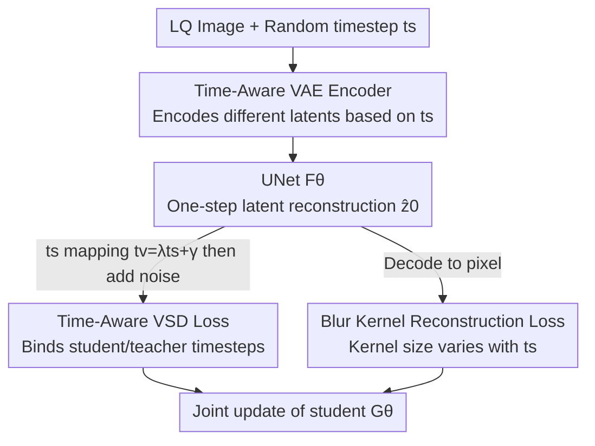

# Time-Aware One Step Diffusion Network for Real-World Image Super-Resolution

**Conference**: CVPR 2026  
**Paper**: [CVF Open Access](https://openaccess.thecvf.com/content/CVPR2026/html/Zhang_Time-Aware_One_Step_Diffusion_Network_for_Real-World_Image_Super-Resolution_CVPR_2026_paper.html)  
**Code**: https://github.com/zty557/TADSR  
**Area**: Image Restoration / Diffusion Models  
**Keywords**: Real-world SR, One-step Diffusion, Variational Score Distillation, Time-aware, Fidelity-Realism Trade-off

## TL;DR
TADSR identifies that existing one-step diffusion SR methods fix the student's timestep at 999, wasting the diverse generative priors of Stable Diffusion (SD) across different timesteps. It introduces a time embedding to the VAE encoder, allowing the same image to encode different latents based on the timestep, and utilizes a mapping function to bind student and teacher timesteps. This enables consistent generative guidance in a single step and allows for seamless adjustment between fidelity and realism by simply tuning $t_s$, achieving SOTA performance on non-reference metrics across multiple real and synthetic datasets.

## Background & Motivation

**Background**: Real-world image super-resolution (Real-ISR) aims to recover high-quality (HQ) images from low-quality (LQ) inputs with complex, unknown degradations. Recent mainstream methods leverage the generative priors of pre-trained Stable Diffusion (SD). However, iterative denoising is slow. Consequently, works like OSEDiff, S3Diff, PisaSR, AdcSR, and TSDSR follow a "one-step distillation" route: using SD with trainable LoRA as a student and a fixed-weight SD as a teacher, employing Variational Score Distillation (VSD) loss to compress the teacher's generative capability into a single step.

**Limitations of Prior Work**: These one-step methods share a common fixed setting—the student's timestep is pinned to a constant (e.g., 999), while the teacher's timestep is sampled randomly. This paper uses observations (Fig. 1b) to show this is wasteful: feeding the same image to SD at $t=100$ preserves almost all information with only fine texture adjustments; at $t=300$, the teacher compensates for noise-masked content using generative priors; at $t=600$, image information is significantly lost, leaving only coarse structure and color. In essence, **SD's generative priors are fundamentally different across timesteps**, and fixing the timestep utilizes only a fraction of these priors.

**Key Challenge**: Fixed student timestep → fails to exploit differential priors across SD timesteps; random teacher timestep → provides inconsistent guidance signals (small $t$ guides textures, large $t$ guides semantics), leading to contradictory optimization signals and sub-optimal convergence. This manifests in methods like PisaSR where increasing the semantic weight $\lambda_{sem}$ for realism only results in over-sharpening rather than richer semantics.

**Core Idea**: Make the one-step model "time-aware." The student must receive randomly sampled timesteps, and the input latent must vary according to the timestep (simulating noise level changes in SD). To achieve this, the encoder is modified to produce different latents for the same image based on the timestep, and the distillation loss is updated to bind the student timestep $t_s$ and teacher timestep $t_v$ via a mapping function. This allows the model to fully utilize generative priors across timesteps and provides a controllable "knob" for realism via timestep adjustment.

## Method

### Overall Architecture

TADSR trains a one-step student model $G_\theta$ consisting of two trainable components: a **Time-Aware VAE Encoder** $E_\theta$ (TAE) and a LoRA-equipped diffusion UNet $F_\theta$. The teacher is a frozen pre-trained SD $\epsilon_\psi$, with a duplicated LoRA model $\epsilon_\phi$ used to estimate the score of the "fake distribution."

The training data flow is as follows: A pair of HQ-LQ images is taken from the dataset, and a $t_s$ is uniformly sampled from $[0, 999]$. The LQ image and $t_s$ are fed into the student; $E_\theta(x_L, t_s)$ generates a time-varying LQ latent, which passes through $F_\theta$ to produce the reconstructed latent $\hat z_0$. $\hat z_0$ is decoded back to pixel space and compared with the HQ image for reconstruction loss (blue flow). In the latent space, $t_s$ is transformed into $t_v$ via a mapping function, followed by adding noise to $\hat z_0$ to get $\hat z_{t_v}$. Both $\hat z_{t_v}$ and $t_v$ are fed to the teacher and LoRA model to calculate the Time-Aware VSD loss (orange flow) for enhanced realism. The LoRA model itself is trained on data produced by the student using standard diffusion loss (green flow).

### Key Designs

**1. Time-Aware VAE Encoder (TAE): Dynamic latents for the same image**

The direct approach is sampling timesteps during training, but a hidden obstacle exists: the original VAE encoder maps an image to the same latent distribution regardless of the timestep. If the input latent remains identical, the UNet struggles to activate different generative priors based solely on the timestep. Conversely, adding Gaussian noise directly to the latent destroys reconstruction fidelity.

TADSR inserts a time embedding layer into the VAE encoder to represent the image as a **time-varying latent distribution**: $z_L = E_\theta(x_L, t_s)$, $\hat z = F_\theta(z_L, t_s)$ (Eq. 4). This synchronization mimics the "timestep change ↔ noise level change" characteristic of SD, enabling the one-step network to activate corresponding priors. PCA visualization (Fig. 3) confirms that as $t_s$ increases, the mean and standard deviation of latent features change systematically, proving the latent space adapts to the timestep.

**2. Time-Aware Variational Score Distillation (TAVSD): Aligning student and teacher timesteps**

Standard VSD guidance is inconsistent if the teacher's timestep is sampled independently. Analyzing the guidance residual (the difference between teacher and LoRA predictions decoded to pixel space, Fig. 4): at $t_v=100$, gradients mainly supplement texture; at $t_v=300$, the teacher provides global semantic guidance; at $t_v=600$, the teacher provides only coarse color structures. Overlapping these leads to conflicting optimization signals.

TAVSD establishes a linear mapping between student $t_s$ and teacher $t_v$:

$$t_v = \lambda t_s + \gamma, \quad t_s \in [0, 999],\ t_v \in [0, 999]$$

(Eq. 5, with $\lambda=0.5,\ \gamma=0$). The student uses $t_s$ to get $\hat z = G_\theta(x_L, t_s)$, which is then noised according to $t_v$ to $\hat z_{t_v} = \alpha_{t_v}\hat z + \beta_{t_v}\epsilon$, and fed to the teacher and LoRA:

$$\nabla_\theta L_{TAVSD}(\hat z, c, t_v) = \mathbb{E}_\epsilon\!\left[\omega(t_v)\big(\epsilon_\psi(\hat z_{t_v}; t_v, c) - \epsilon_\phi(\hat z_{t_v}; t_v, c)\big)\frac{\partial \hat z}{\partial \theta}\right]$$

(Eq. 6). Consequently, a large $t_s$ prompts stronger semantic generation, while a small $t_s$ focus on texture enhancement. The guidance is **consistent and conditioned on $t_s$**, allowing distillation to fully exploit teacher priors.

**3. Time-Adaptive Blur Kernel Reconstruction Loss: Balancing fidelity and realism**

Real-ISR is ill-posed; standard MSE on all frequencies clashes with the high-frequency generative content from TAVSD. TADSR applies Gaussian blurring to both the reconstruction and HQ images before calculating MSE, leaving high frequencies to the generative component:

$$L_{MSE}^{blur} = L_{MSE}\big(G_\theta(x_L) * G_{t_s},\ x_H * G_{t_s}\big)$$

(Eq. 7, where $G_{t_s}$ is a Gaussian kernel with size determined by $t_s$). Larger $t_s$ uses larger kernels, relaxing low-frequency supervision when stronger generation is desired. Combined with LPIPS, this forms the reconstruction loss $L_{Rec} = L_{MSE}^{blur} + L_{LPIPS}(G_\theta(x_L), x_H)$ (Eq. 8).

### Loss & Training

The student's total loss is the reconstruction loss plus TAVSD regularization: $L_{Stu} = L_{Rec} + \lambda_{TAVSD}\cdot L_{TAVSD}$ (Eq. 9). The LoRA model is trained separately with standard diffusion loss $L_{Diff}(\hat z, c_y) = \mathbb{E}_{t,\epsilon}\big[\lVert \epsilon_\phi(\hat z_t; t, c_y) - \epsilon'\rVert^2\big]$ (Eq. 10). Training uses LSDIR with $512\times512$ patches and the Real-ESRGAN degradation pipeline. Optimizer: AdamW, learning rate $5\times10^{-5}$, LoRA rank=4, base model SD 2.1-base, 8 A40 GPUs, batch size 24, fine-tuned for only 2k steps. Text prompts are extracted via the DAPE module.

## Key Experimental Results

### Main Results

Compared against 9 SOTA methods (including multi-step StableSR/DiffBIR/SeeSR and one-step SinSR/OSEDiff/S3Diff/PisaSR/TSDSR/AdcSR) across 4 datasets. Inference is set at $t_s=500$. Selected non-reference metrics (higher is better):

| Dataset | Metric | OSEDiff | PisaSR | AdcSR | TADSR |
|--------|------|---------|--------|-------|-------|
| DIV2K-Val | CLIPIQA ↑ | 0.6682 | 0.6928 | 0.6763 | **0.7353** |
| DIV2K-Val | TOPIQ ↑ | 0.6188 | 0.6619 | 0.6526 | **0.7044** |
| DIV2K-Val | QALIGN ↑ | 3.8357 | 3.8812 | 3.612 | **4.0783** |
| DRealSR | CLIPIQA ↑ | 0.6974 | 0.6971 | 0.7049 | **0.7398** |
| DRealSR | QALIGN ↑ | 3.5450 | 3.5838 | 3.6520 | **3.7491** |
| RealSR | MUSIQ ↑ | 69.087 | 70.147 | 69.899 | **71.182** |
| RealLR200 | CLIPIQA ↑ | 0.6792 | 0.7153 | 0.7048 | **0.7741** |
| RealLR200 | TOPIQ ↑ | 0.5990 | 0.6627 | 0.6684 | **0.7249** |

TADSR ranks first in almost all non-reference metrics across 4 datasets, becoming the **only one-step method to consistently outperform multi-step methods on non-reference metrics** while maintaining competitive PSNR/SSIM.

### Ablation Study

Baseline = Original VAE encoder + Original VSD (with random timestep sampling).

| Dataset | Configuration | PSNR↑ | MUSIQ↑ | CLIPIQA↑ | TOPIQ↑ |
|--------|------|-------|--------|----------|--------|
| RealSR | Baseline | 24.39 | 70.22 | 0.6751 | 0.6391 |
| RealSR | w/o TAE | 24.89 | 70.08 | 0.6857 | 0.6466 |
| RealSR | w/o TAVSD | 24.84 | 70.96 | 0.6930 | 0.6553 |
| RealSR | Full | **25.16** | **71.18** | **0.7283** | **0.7082** |

### Key Findings

- **Random sampling alone is ineffective**: Without TAE, performance drops despite random sampling, proving time-adaptive latents are the key to utilizing varied priors.
- **TAVSD enhances realism**: Removing TAVSD sharply decreases CLIPIQA/TOPIQ scores. Consistent teacher guidance is essential for activating cross-timestep priors.
- **$t_s$ as a Trade-off Knob**: On DRealSR, increasing $t_s$ leads to lower PSNR and higher QALIGN. TADSR remains at the top-right of the trade-off curve, offering better QALIGN for a given PSNR compared to PisaSR.

## Highlights & Insights

- **Insightful analysis of "timestep waste"**: TADSR validates that SD priors vary across timesteps and transforms the "discarded" fixed timestep into a core controllable variable.
- **Coupled modifications of encoder and loss**: Modifying both the input side (TAE for time-varying latents) and supervision side (TAVSD for consistent guidance) creates a closed loop that can be transferred to other one-step distillation tasks.
- **Interpretation of VSD as teacher-LoRA residual**: Clarifies why VSD enhances realism without over-smoothing, as the LoRA model trained on low-quality data naturally produces smoother outputs than the teacher.

## Limitations & Future Work

- Lacks hard data on inference latency/FLOPs (assumed to be similar to OSEDiff).
- The mapping $t_v = \lambda t_s + \gamma$ uses empirical values ($\lambda=0.5, \gamma=0$); sensitivity analysis for different datasets is missing.
- Realism-fidelity control requires manual $t_s$ adjustment; an automatic selection mechanism is not yet developed.
- Dependency on SD 2.1-base priors means inherent biases of the base model are inherited.

## Related Work & Insights

- **vs OSEDiff**: TADSR outperforms OSEDiff in non-reference metrics by enabling the one-step model to utilize diverse timestep priors at a similar parameter scale.
- **vs PisaSR**: While PisaSR uses dual LoRAs for trade-off control, TADSR uses timesteps, achieving a better trade-off curve where semantic gains are more pronounced.
- **vs multi-step methods (StableSR, SeeSR)**: TADSR integrates "time-aware" principles into a one-step framework, achieving superior efficiency with comparable perception quality.

## Rating
- Novelty: ⭐⭐⭐⭐⭐ 
- Experimental Thoroughness: ⭐⭐⭐⭐ 
- Writing Quality: ⭐⭐⭐⭐⭐ 
- Value: ⭐⭐⭐⭐ 

<!-- RELATED:START -->

## Related Papers

- [\[CVPR 2026\] IFCSR: Inference-Free Fidelity-Realism Control for One-Step Diffusion-based Real-World Image Super-Resolution](ifcsr_inference-free_fidelity-realism_control_for_one-step_diffusion-based_real-.md)
- [\[CVPR 2026\] One-Step Diffusion Transformer for Controllable Real-World Image Super-Resolution](one-step_diffusion_transformer_for_controllable_real-world_image_super-resolutio.md)
- [\[CVPR 2026\] Language-Guided One-Step Diffusion Model for Nighttime Flare Removal](language-guided_one-step_diffusion_model_for_nighttime_flare_removal.md)
- [\[ICLR 2026\] VARestorer: One-Step VAR Distillation for Real-World Image Super-Resolution](../../ICLR2026/image_restoration/varestorer_one-step_var_distillation_for_real-world_image_super-resolution.md)
- [\[CVPR 2026\] DNF-SR: Dual-Input and Negative-Aware Feature Fine-Tuning for Real-World Image Super-Resolution](dnf-sr_dual-input_and_negative-aware_feature_fine-tuning_for_real-world_image_su.md)

<!-- RELATED:END -->
