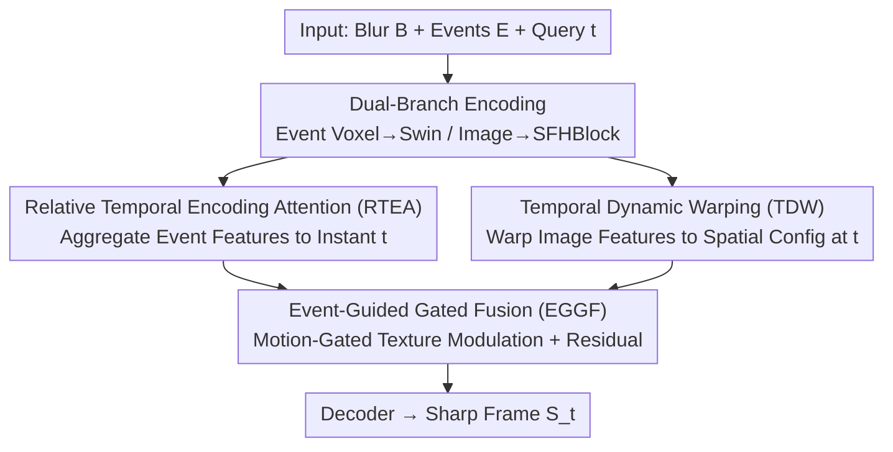

# Time-Specialized Event-Image Alignment for Blur-to-Video Decomposition

**Conference**: CVPR 2026  
**Paper**: [CVF Open Access](https://openaccess.thecvf.com/content/CVPR2026/html/Sun_Time-Specialized_Event-Image_Alignment_for_Blur-to-Video_Decomposition_CVPR_2026_paper.html)  
**Code**: https://github.com/ZhijingS/TSANet (Available)  
**Area**: Image Restoration / Event Camera / Motion Deblurring  
**Keywords**: Blur Decomposition, Event Camera, Temporal Alignment, Video Reconstruction, Attention

## TL;DR
TSANet leverages event cameras to "unfold" a single motion-blurred image into a high-frame-rate sharp video. The core mechanism involves "time-specializing" both event and image features to align them with an arbitrary query timestamp $t$ before lightweight fusion, consistently outperforming previous SOTA methods on GoPro, HighREV, and EBD datasets.

## Background & Motivation

**Background**: While single-image deblurring (blur → one sharp image) is well-studied, recent research has pivoted to the more challenging task of "blur decomposition": recovering a continuous sharp video sequence $S_t = \phi(B, E, t)$ from a single blurred image, where $t \in [0,1]$ denotes the normalized time within the exposure window.

**Limitations of Prior Work**: Blur decomposition is inherently ill-posed due to **motion ambiguity**, where different motion trajectories integrated over exposure time result in the same blurred image (illustrated by the "hand-ball" toy example: configurations like hand-up/ball-down vs. hand-down/ball-up yield identical blurred averages). Purely image-based methods (relying on temporal consistency, multi-frame inputs, or rolling shutter cues) fail under large complex motions because critical temporal information is irreversibly lost in the blur.

**Key Challenge**: Event cameras record pixel-level brightness changes asynchronously with microsecond resolution, naturally capturing the "missing motion trajectory." However, existing event-based methods struggle to utilize this: physics-based models (e.g., EDI) are sensitive to noise; two-stage pipelines (deblurring followed by interpolation) suffer from error accumulation; and learning-based methods (e.g., EVDI, E-CIR) treat events across the exposure as a **global motion descriptor**, lacking a mechanism to **explicitly align features to an arbitrary query time** $t$. EVDI only generates time-indexed event representations during preprocessing, which is inefficient and lacks dynamic internal alignment.

**Core Idea**: The authors propose the "Time-Specialized Alignment" principle. Before fusing modalities, features must be independently aligned to the target time $t$: **event features focus on instantaneous motion near $t$**, while **image features are warped to the spatial configuration at $t$**. High-quality, temporally coherent video can only be reconstructed once both are explicitly aligned.

## Method

### Overall Architecture
The input consists of a blurred image $B$ and events $E$ collected during exposure; the output is a sharp frame $S_t$ for any query time $t$. The pipeline consists of four steps: **Dual-branch Encoding → Event Time-Specialization (RTEA) → Image Time-Specialization (TDW) → Gated Fusion (EGGF) → Decoding**.

Events are converted into two representations: event voxels and timesurfaces. The event branch uses Conv + Swin Transformer blocks to extract spatio-temporal dynamics from voxels. The image branch uses SFHBlocks to extract global texture. Both extract "time-agnostic global features." The critical **time-specialization stage** follows: RTEA aggregates event motion to the instant $t$, TDW uses the timesurface to geometrically transform image features to $t$, and EGGF performs lightweight fusion before the decoder reconstructs $S_t$.

### Key Designs

**1. Relative Temporal Encoding Attention (RTEA): Focusing Event Features**

RTEA addresses the inefficiency of preprocessing-based alignment. Instead of regenerating event representations for each $t$, it dynamically reweights a sequence of event feature maps $F_E \in \mathbb{R}^{N \times C \times H \times W}$ ($N$ temporal bins) based on their **relative temporal distance** to $t$. It first computes content correlation using standard query-key attention: $F_E$ is spatially pooled to $\hat F_E \in \mathbb{R}^{N \times C}$ and projected to keys $K$; $t$ is passed through Fourier positional encoding + MLP to generate query $q$. The content logits are $W = K \cdot q$.

The core contributes the **relative temporal prior bias** $T_{\text{bias}}$: it calculates the normalized relative distance $d_n$ for each bin $n$ to the target time:

$$d_n = \frac{n - p}{N-1}, \quad p = t \times (N-1)$$

$d_n$ and $d_n^2$ are passed through an MLP to generate biases added to $W$ before the Softmax. The time-specialized motion feature $F_E^t$ is the weighted sum:

$$T_{\text{bias}} = \text{MLP}([d_n, d_n^2]), \quad \eta = \text{Softmax}(W + T_{\text{bias}}), \quad F_E^t = \eta \cdot F_E$$

**Mechanism**: $T_{\text{bias}}$ explicitly encodes the physical prior that events closer to $t$ are more relevant. This allows the model to act as an "adaptive temporal lens." Without it, the model averages the exposure, resulting in over-smoothed images with motion ghosts.

**2. Temporal Dynamic Warping (TDW): Aligning "Time-Averaged" Texture**

Texture features extracted from a blurred image represent a **temporal average** of the exposure, leading to systematic spatial misalignment with the scene at any specific instant $t$. TDW uses the event timesurface for geometric alignment. The timesurface records the "timestamp of the last event" at each pixel, implicitly characterizing the motion trajectory and providing local motion priors for deformation field prediction.

**Mechanism**: TDW extracts motion patterns from the timesurface $TS$ and makes them **conditional on $t$** using Scale & Shift. The embedding of $t$ generates channel-wise parameters $\gamma, \beta$ via an MLP to modulate the features into a time-conditional motion representation $M^t$. A convolutional head then maps $M^t$ to a 2-channel deformation field $K_t \in \mathbb{R}^{2 \times H \times W}$ (pixel displacements $(\Delta x, \Delta y)$) for differentiable bilinear sampling:

$$\gamma, \beta = \text{MLP}(\text{Embed}(t)), \quad M^t = \gamma \cdot \text{ConvBlock}(TS) + \beta$$
$$K_t = \text{Conv}(M^t), \quad F_B^t = \text{Warp}(F_B, K_t)$$

**3. Event-Guided Gated Fusion (EGGF): Motional "Highlighting" of Texture**

Since spatio-temporal alignment is resolved in the previous steps, fusion can be lightweight. EGGF uses the dense motion representation $M^t$ to enhance $F_E^t$ via scale & shift to get $\hat F_E^t$. A spatial gate $G$ is generated via Conv + ReLU, which element-wise scales the warped image features $F_B^t$ with a residual connection:

$$\gamma_m, \beta_m = \text{Chunk}(\text{ReLU}(\text{Conv}(M^t))), \quad \hat F_E^t = \gamma_m \cdot F_E^t + \beta_m$$
$$G = \text{ReLU}(\text{Conv}(\hat F_E^t)), \quad F_{\text{fused}} = G \odot F_B^t + F_B^t$$

**Mechanism**: The gate $G$ ensures that areas with intense motion have their texture details emphasized, while the residual ensures base textures are preserved.

## Key Experimental Results

### Main Results
The model was retrained on GoPro (synthetic), HighREV (real events), and EBD (newly collected). "×5" indicates one blurred image decomposed into 5 frames.

| Dataset (×5) | Metric | TSANet (Ours) | Strongest Event Baseline | Gain |
|--------------|--------|----------------|-------------------------|------|
| GoPro | PSNR | **28.40** | EvEnhancer (27.76) | +0.64dB |
| HighREV | PSNR | **36.84** | EvEnhancer (35.78) | +1.06dB |
| EBD | PSNR | **29.02** | REFID (27.84) | +1.94dB |
| HighREV | SSIM | **0.974** | EBFI (0.957) | +0.017 |

TSANet leads pure image-based methods by at least 1.14 / 4.6 / 3.4 dB across datasets. With 6.3M parameters, it is smaller than most event-based baselines.

### Ablation Study (HighREV)
| Config | RTEA | Warp Guide | Fusion | PSNR | FLOPs(G) |
|------|------|-----------|------|------|----------|
| Case 1 (Baseline) | - | - | EGGF | 33.92 | 94.12 |
| Case 2 | ✓ | - | EGGF | 35.42 | 101.67 |
| Case 3 | ✓ | EDW (voxel) | EGGF | 36.35 | 108.76 |
| **Ours** | ✓ | TDW | EGGF | **36.84** | 107.91 |

### Key Findings
- **RTEA is the most significant contributor**: Adding RTEA alone yields a 1.5dB boost, serving as the foundation for effective event utilization.
- **Timesurface is superior to voxels for warping**: TDW (timesurface-guided) outperforms EDW (voxel-guided) by 0.49dB, proving that task-aligned event representations are crucial.
- **Efficient alignment enables simpler fusion**: EGGF outperforms cross-attention by 0.05dB while saving 0.54G FLOPs, suggesting complex fusion modules are redundant if alignment is handled properly.

## Highlights & Insights
- **Decoupled Alignment Philosophy**: Splitting the problem into "event focusing" and "image warping" simplifies fusion into a lightweight task.
- **Relative Temporal Distance as Bias**: Using $[d_n, d_n^2]$ to inject "proximity" priors is more efficient than re-generating representations for every $t$, representing a clever trick for continuous query timestamps.
- **New Dataset (EBD)**: The authors collected 29 sequences (25,608 frames) using hardware-aligned DVSync event cameras, addressing the lack of high-quality, real aligned data.

## Limitations & Future Work
- **Synthetic vs. Real Blur**: Blurred images were synthesized by averaging 11 sharp frames. Real-world camera blur features non-linearities and rolling shutter effects that may differ.
- **Event Quality Dependency**: Performance in sparse event or high-noise regions (low light, low contrast) was not stress-tested.
- **Decomposition Accuracy**: RTEA assumes motion can be aggregated via relative time weighting; accuracy for complex motion (reversals, high acceleration) within one exposure remains to be analyzed.
- **2D Warping**: Using 2D pixel displacement may fail in scenarios with significant occlusions or parallax changes where one pixel represents different depth layers across $t$.

## Related Work & Insights
- **vs. EVDI**: EVDI generates event representations per $t$ only at the input stage; TSANet performs dynamic feature-level alignment inside the network using RTEA, which is more efficient for dense video generation.
- **vs. Physics-based Models (EDI)**: While EDI analytically couples blur and events, it is sensitive to noise; TSANet uses the timesurface for noise-robust, learned alignment.
- **vs. Pure Image Methods (BiT / DeMFI)**: These methods suffer from motion ambiguity; TSANet uses events as a "ground-truth record" of motion, leading by 1+ dB.

## Rating
- Novelty: ⭐⭐⭐⭐ The combination of RTEA/TDW and the "time-specialized alignment" principle is a refined improvement within the event-based deblurring paradigm.
- Experimental Thoroughness: ⭐⭐⭐⭐ Comprehensive evaluation across three datasets and long video generation, though real long-exposure blur testing is missing.
- Writing Quality: ⭐⭐⭐⭐ Motivational examples are intuitive; framework and module responsibilities are well-defined.
- Value: ⭐⭐⭐⭐ Includes a SOTA model, open-source code, and a new real-world dataset (EBD).

<!-- RELATED:START -->

## Related Papers

- [\[CVPR 2026\] AE2VID: Event-based Video Reconstruction via Aperture Modulation](ae2vid_event-based_video_reconstruction_via_aperture_modulation.md)
- [\[CVPR 2026\] One-Shot Flow, Any-Time Frame: A Bidirectional Warping Framework for Event-Based Video Frame Interpolation](one-shot_flow_any-time_frame_a_bidirectional_warping_framework_for_event-based_v.md)
- [\[CVPR 2026\] Event-Based Motion Deblurring Using Task-Oriented 3D Gaussian Event Representations](event-based_motion_deblurring_using_task-oriented_3d_gaussian_event_representati.md)
- [\[CVPR 2026\] Real-Time Neural Video Compression with Unified Intra and Inter Coding](real-time_neural_video_compression_with_unified_intra_and_inter_coding.md)
- [\[CVPR 2026\] Time Without Time: Pseudo-Temporal Representation for Space-Time Super-Resolution](time_without_time_pseudo-temporal_representation_for_space-time_super-resolution.md)

<!-- RELATED:END -->
