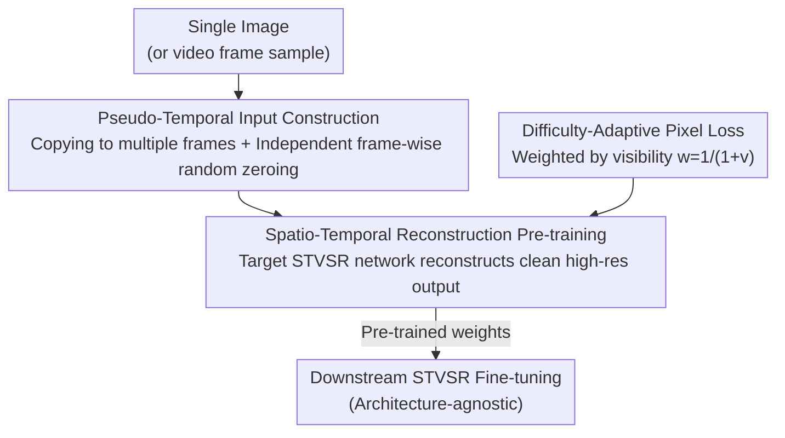

# Time Without Time: Pseudo-Temporal Representation for Space-Time Super-Resolution

**Conference**: CVPR 2026  
**Paper**: [CVF Open Access](https://openaccess.thecvf.com/content/CVPR2026/html/Choi_Time_Without_Time_Pseudo_Temporal_Representation_for_Space-Time_Super-Resolution_CVPR_2026_paper.html)  
**Code**: TBD  
**Area**: Image Restoration / Video Super-Resolution  
**Keywords**: Space-Time Video Super-Resolution, Pre-training, Pseudo-time, Self-supervised, Difficulty-adaptive loss

## TL;DR
Addressing the lack of effective pre-training strategies for Space-Time Video Super-Resolution (STVSR), this paper proposes a method that "copies a single image into multiple frames + applies independent random zeroing per frame" to forge a video without real time. This allows the target STVSR network to undergo pre-training by reconstructing clean high-spatio-temporal resolution outputs from degraded pseudo-temporal inputs. A difficulty-adaptive pixel loss is used to focus on hard-to-generate regions. This architecture-agnostic, image-only pre-training improves the PSNR of various STVSR networks by up to +5dB under few-shot fine-tuning.

## Background & Motivation

**Background**: Space-Time Video Super-Resolution (STVSR) aims to simultaneously increase spatial resolution and frame rate (the default setting in the paper is spatial $\times4$, temporal $\times2$, taking 4 frames as input and producing 7 frames as output). In recent years, effort in this field has been concentrated on designing task-specific architectures (Zooming, TMNet, RSTT, etc.) and new modeling paradigms (diffusion, continuous-time modeling).

**Limitations of Prior Work**: Pre-training, a mature path in classification and detection, remains nearly blank for STVSR. Directly adopting mainstream video self-supervised schemes—such as Masked Autoencoders (MAE) like VideoMAE and MAE-ST—leads to poor performance. These are designed for ViT, processing images as rectangular patches, which causes obvious block artifacts in low-level vision tasks. Furthermore, they use extremely high mask rates (e.g., 90–95%) for reconstruction training, which erases high-frequency details like edges, textures, and repetitive structures. As shown in Figure 1 of the paper, pre-training RSTT-S with various video self-supervised methods on REDS and then fine-tuning yields only 31.60 PSNR for MAE-ST and 31.64 for VideoMAE, showing little to no improvement over training from scratch (31.66).

**Key Challenge**: STVSR is a pixel-level dense prediction task requiring the preservation of rich spatio-temporal information. In contrast, mainstream video self-supervised pre-training relies on "aggressive masking + patch reconstruction," which essentially discards high-frequency information to learn high-level semantics—the objectives are fundamentally misaligned. Moreover, video frames are highly redundant with weak spatial discriminability, and pure video pre-training is particularly demanding in terms of computation and memory.

**Goal**: To find a pre-training method that is (1) architecture-agnostic, applicable to any fixed-rate STVSR network, and (2) capable of efficiently utilizing image datasets (which naturally provide clear, blur-free strong spatial cues).

**Key Insight**: The authors' key observation is that the two core capabilities of STVSR are "spatial restoration" and "cross-frame aggregation." Why not align the pre-training task directly with these two goals? Although image data lacks a temporal dimension, by copying an image into multiple frames and independently applying random holes to each frame, the visible regions of each frame differ. This "visibility difference" naturally forces the network to perform cross-frame inference—thus forging "time" in the absence of real motion.

**Core Idea**: Construct pseudo-temporal videos using "single image copying + independent frame-wise zeroing," allowing the target STVSR network itself to perform spatio-temporal reconstruction pre-training (rather than using an external independent module). This allows the network to develop inductive biases for both spatial restoration and cross-frame aggregation from image data.

## Method

### Overall Architecture
The entire method is a "pre-training framework" rather than a new network; it introduces no extra modules and pre-trains the specific STVSR network you intend to use. Given a single image, it is copied to create the same number of frames as the target network's input. Then, several small pixel blocks are **independently** and randomly zeroed out in each frame, resulting in a low-resolution, low-frame-rate "pseudo-temporal video" with holes. The target network takes this degraded input and is required to reconstruct a clean high-resolution video upsampled spatially by $scale\_s$ and temporally by $scale\_t$. The loss is not standard MSE but is weighted for each output region based on its "visibility count" in the input frames—regions that are harder to generate (more heavily masked in the input) receive higher weights. After pre-training, these weights are used for fine-tuning on downstream STVSR tasks.

### Key Designs

**1. Pseudo-temporal input construction: Creating "time" from a single image via independent frame masks**

This approach solves the problem of how to train cross-frame capabilities without temporal dimensions in images. It involves two steps: first, copying an image $T_{in}$ times to obtain a pseudo-video where every frame is identical. Second, for each frame, several 4×4 blocks are **independently** selected and **zeroed out**. Two details are crucial: First, tokens are "zero-filled" rather than "removed" as in MAE, because STVSR requires a complete spatial tensor for dense prediction. Second, the paper **deliberately avoids high mask rates** (default is 0.5, compared to 0.9–0.95 in VideoMAE) because high mask rates destroy high-frequency signals like edges and textures essential for STVSR. Although all frames originate from the same image, the independent masks create variations in pixel visibility across frames. It is this **frame-wise visibility change** that forces the network to "seek information across frames to fill holes in the current frame," thereby forging a temporal structure without real motion.

**2. Spatio-temporal reconstruction pre-training: Target network performing a pre-text task aligned with core capabilities**

Using the final STVSR network **itself** for pre-training is the source of the method's "architecture-agnostic" nature. Since the pre-training and downstream tasks use the same network and input/output formats, any fixed-rate STVSR network (ViT-based RSTT or CNN-based Zooming/TMNet) can be used. The pre-text task aligns precisely with STVSR challenges: the input is a degraded pseudo-video, and the output must be a clean, high-resolution, high-frame-rate video. In the **spatial dimension**, the network learns to complete missing content and perform pixel-level super-resolution. In the **temporal dimension**, even without explicit motion cues, the differing visible regions across frames force the network to learn "cross-frame cross-referencing" temporal inductive biases.

**3. Difficulty-adaptive pixel loss: Weighting by visibility count to focus on hard regions**

While standard pixel MSE treats all output regions equally, "difficulty" can be precisely quantified in the pseudo-temporal setting. Since each input video segment is copied from a single image, the input regions $\{L^{(t)}_{ij}\}_{t=1}^{T_{in}}$ corresponding to the $(i,j)$-th block in the output frame $\hat{H}^{(t)}_{ij}$ are fully locatable. The **visibility count** $v^{(t)}_{ij}$ is defined as the number of frames where that region was not masked (ranging from 0 to $T_{in}$). If a region is shielded in almost all input frames (low $v$), it is difficult to generate. Conversely, if it is fully visible, it is easy. A modulation factor is defined as:

$$w^{(t)}_{ij} = \frac{1}{1 + v^{(t)}_{ij}}$$

This factor is integrated into the block-wise L2 loss:

$$\text{loss} = \frac{1}{N}\sum_{t}\sum_{i}\sum_{j} w^{(t)}_{ij}\,\big\|H^{(t)}_{ij} - \hat{H}^{(t)}_{ij}\big\|^2$$

where $N$ is the total number of pixels and $H^{(t)}_{ij}$ is the ground-truth block. Fewer visibilities result in higher weights, pushing the network to focus on the hardest-to-recover regions.

### Loss & Training
Pre-training for 200 epochs, fine-tuning for 50 epochs. Mask blocks are 4×4 with a default mask rate of 0.5. The target task is spatial $\times4$ and temporal $\times2$ (4 frames in, 7 out). To evaluate pre-training gains fairly, few-shot fine-tuning is used (e.g., "Vimeo-90K 1%" refers to a 1% subset). The loss used is the difficulty-adaptive pixel loss described above.

## Key Experimental Results

### Main Results
Validated across Zooming / TMNet / RSTT architectures on various datasets (all pre-trained on Vimeo-90K; PSNR for Vimeo-90K is reported on the "fast" sequence):

| Architecture | Configuration | Vimeo-90K 1% | Vimeo-90K 10% | REDS 10% | REDS 100% |
| :--- | :--- | :--- | :--- | :--- | :--- |
| Zooming | baseline | 28.88 | 33.96 | 24.84 | 26.20 |
| Zooming | **+Ours** | **33.96** (+5.08) | **34.93** (+0.97) | **26.25** | **26.60** |
| TMNet | baseline | 28.91 | 33.79 | 23.32 | 26.56 |
| TMNet | **+Ours** | **34.79** (+5.88) | **35.43** | **26.50** | **26.93** |
| RSTT | baseline | 31.66 | 34.56 | 25.31 | 26.35 |
| RSTT | **+Ours** | **34.18** | **35.61** | **26.21** | **26.83** |

Gains are larger with less data: Zooming gains +5.08dB on 1% of the data, which narrows to +0.97dB on 10%, confirming that pre-training's primary value lies in few-shot scenarios.

### Ablation Study
(RSTT-S pre-trained on Vimeo-90K, fine-tuned on Vimeo-90K 1%):

| Configuration | Key Metric (Fast PSNR) | Description |
| :--- | :--- | :--- |
| Scratch | 31.66 | No pre-training |
| Modulation factor = Equal | 33.64 | Standard uniform MSE pre-training |
| Modulation factor = Onehot | 33.45 | Focusing only on a single region is worse than Equal |
| **Modulation factor = Ours** | **34.18** | Complete method with adaptive weighting |
| Mask rate 0.3 / 0.5 / 0.7 | 34.19 / 34.18 / 34.19 | Insensitive to mask rate (as long as fully masked regions are low) |
| Mask rate 0.9 | 33.77 | Excessive info loss leads to drop |

### Key Findings
- **Difficulty-adaptive loss is the core source of gain**: Improvement from 33.64 (Equal) to 34.18 (+0.54dB) shows that "smooth weighting by visibility" is superior to binary one-hot weighting.
- **Robust to mask rate but sensitive to total occlusion**: Mask rates between 0.3 and 0.7 show almost no difference. Performance drops only when the proportion of "entirely masked regions" (regions hidden in all input frames) becomes high (e.g., at 0.9 mask rate).
- **Efficient pre-training**: 50 epochs are nearly as effective as 200, making the method "simple and inexpensive."
- **Larger networks gain more**: Pre-training provides a more valuable initialization for larger models.

## Highlights & Insights
- **The "pseudo-time" concept is the most innovative aspect**: Cross-frame aggregation was previously thought to require real motion videos. This work reveals that "inter-frame visibility differences" are sufficient to induce cross-frame inference.
- **Pre-training task matches the target network**: By using the target STVSR network for the pre-text task, the method achieves architectural independence and can be transferred to any fixed-rate dense prediction task.
- **Quantifying difficulty**: Because the input is a copied single image, the difficulty of generating an output block can be explicitly quantified by its visibility count, a strategy that could be repurposed for other masked reconstruction tasks.
- **Anti-MAE intuition**: For low-level vision, "low mask rate + zero-filling + loss on all regions" is more suitable than "high mask rate + patch deletion + loss on masked regions only."

## Limitations & Future Work
- **Limited to fixed-rate STVSR**: The paper only targets reconstruction at preset temporal scales; continuous-time or arbitrary-scale STVSR is not covered.
- **Lack of real motion semantics**: The "time" forged from a single image lacks real object motion, deformation, and complex occlusion.
- **Diminishing returns on large datasets**: Gains drop quickly as the data volume increases, suggesting that its primary value is in data-constrained scenarios.
- **Proposed improvement**: Upgrading "independent frame-wise masking" to masks with pseudo-motion trajectories (e.g., translating masked regions) might inject stronger motion inductive biases.

## Related Work & Insights
- **vs. VideoMAE / MAE-ST**: These methods use ViT-specific high mask rates and patch deletion, leading to blocky artifacts and high-frequency loss. This paper's approach is 2-3dB better on STVSR tasks.
- **vs. Image-to-Video 3D-CNN pre-training**: Unlike methods relying on 3D-CNN architectures, this approach is architecture-agnostic.
- **vs. Task-induced pre-training in low-level vision**: This work is the first to bring this concept to STVSR by solving the "no time in images" problem through copying and independent masking.

## Rating
- **Novelty**: ⭐⭐⭐⭐⭐ The "image copy + independent mask = pseudo-time" concept is simple yet effective.
- **Experimental Thoroughness**: ⭐⭐⭐⭐ Solid validation across 3 architectures and multiple datasets, though lacking high-motion scene analysis.
- **Writing Quality**: ⭐⭐⭐⭐ Clear logic from motivation to experimentation.
- **Value**: ⭐⭐⭐⭐ Plug-and-play, image-only, high few-shot gains.

<!-- RELATED:START -->

## Related Papers

- [\[CVPR 2026\] Time-Aware One Step Diffusion Network for Real-World Image Super-Resolution](time-aware_one_step_diffusion_network_for_real-world_image_super-resolution.md)
- [\[ICLR 2026\] Continuous Space-Time Video Super-Resolution with 3D Fourier Fields](../../ICLR2026/image_restoration/continuous_space-time_video_super-resolution_with_3d_fourier_fields.md)
- [\[CVPR 2026\] Time-Specialized Event-Image Alignment for Blur-to-Video Decomposition](time-specialized_event-image_alignment_for_blur-to-video_decomposition.md)
- [\[ICLR 2026\] Test-Time Domain Generalization for Image Super-Resolution](../../ICLR2026/image_restoration/test-time_domain_generalization_for_image_super-resolution.md)
- [\[CVPR 2026\] Degradation-Consistent Test-Time Adaptation for All-in-One Image Restoration](degradation-consistent_test-time_adaptation_for_all-in-one_image_restoration.md)

<!-- RELATED:END -->
