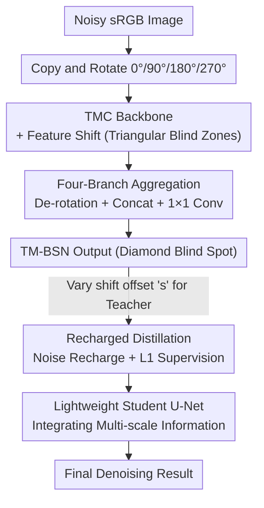

# TM-BSN: Triangular-Masked Blind-Spot Network for Real-World Self-Supervised Image Denoising

**Conference**: CVPR 2026  
**arXiv**: [2604.04484](https://arxiv.org/abs/2604.04484)  
**Code**: [https://github.com/parkjun210/TM-BSN](https://github.com/parkjun210/TM-BSN)  
**Area**: Image Restoration / Self-Supervised Denoising  
**Keywords**: Blind-Spot Network, Self-Supervised Denoising, Triangular-Masked Convolution, Spatially Correlated Noise, Knowledge Distillation

## TL;DR

Ours proposes the Triangular-Masked Blind-Spot Network (TM-BSN), which aligns the blind-spot shape precisely with the diamond-shaped spatial correlation patterns of real sRGB noise. It achieves self-supervised image denoising at the original resolution without downsampling and further enhances performance through knowledge distillation, reaching SOTA on SIDD and DND benchmarks.

## Background & Motivation

1. **Background**: Blind-spot networks (BSN) are a mainstream approach for self-supervised image denoising. The core idea is to prevent identity mapping by excluding the receptive field of the target pixel, thereby estimating the clean signal without clean supervision.
2. **Limitations of Prior Work**: BSN assumes noise is pixel-independent. However, in real sRGB images, the ISP pipeline (especially demosaicing) introduces strong spatially correlated noise, violating the independence assumption and causing the network to degrade into identity mapping.
3. **Key Challenge**: Existing solutions either use pixel-shuffle downsampling (PD) to decorrelate noise, which changes noise statistics and requires post-processing (e.g., AP-BSN), or expand the blind-spot area at full resolution (e.g., AT-BSN). However, rectangular blind spots mismatch the diamond-shaped correlation pattern of noise, excluding useful uncorrelated pixels.
4. **Goal**: How to design a self-supervised denoising network where the blind-spot shape precisely matches the geometric structure of real noise spatial correlation?
5. **Key Insight**: It is observed that during demosaicing, each pixel is reconstructed using neighboring samples with spatially decaying weights, producing a diamond-shaped correlation pattern centered on the target pixel. The blind spot should precisely cover this diamond region.
6. **Core Idea**: Use Triangular-Masked Convolutions (TMC) to construct a diamond-shaped blind spot. This precisely matches the spatial correlation geometry of sRGB noise, excluding all correlated pixels while retaining maximum contextual information.

## Method

### Overall Architecture

The core problem TM-BSN addresses is that real sRGB noise is not pixel-independent. Demosaicing interpolation makes each pixel correlate with its neighborhood in a **diamond-shaped** region. Traditional blind-spot networks either disrupt noise statistics via downsampling or use rectangular blind spots that exclude usable uncorrelated pixels. This method shapes the blind spot to fit this diamond geometry.

Specifically, the noisy image is first copied into four versions, rotated 0°, 90°, 180°, and 270°. Each version is fed into a backbone composed of Triangular-Masked Convolutions (TMC) replacing standard $3 \times 3$ convolutions. Combined with feature shifting, this pushes the target pixel out of its own receptive field, creating a triangular blind region for each branch. Merging the four triangular regions creates a complete diamond blind spot. Features from each branch are de-rotated, concatenated along the channel dimension, and fused via a $1 \times 1$ convolution. To further boost performance, knowledge distillation transfers complementary predictions from multiple blind-spot sizes into a lightweight U-Net.

### Key Designs

**1. Triangular-Masked Convolution (TMC): Controlling Blind-Spot "Edges"**

The challenge is that the blind spot must exclude the target pixel and its correlated neighborhood, but rectangular spots also block uncorrelated pixels outside the diamond. TMC applies an upper-triangular binary mask $M_{ij} = 1\ \text{if}\ i \leq j$ to the $3 \times 3$ kernel weights. The receptive field grows only in the upper-triangular direction across layers. Combined with shifting the feature map by $s$ pixels, the target pixel is pushed out of the receptive field. Since the receptive field is triangular, it naturally covers one edge of the diamond correlation zone, laying the foundation for assembling a diamond blind spot without wasting corner information.

**2. Four-Branch Aggregation: Assembling Symmetric Diamonds**

A single TMC can only create a triangular blind zone in one direction. The design rotates the input across four orientations. Each branch's triangular receptive field handles one side of the diamond. Aggregating the four branches forms a complete diamond—blocking all target-correlated pixels while preserving all uncorrelated context outside the diamond. A key detail: aggregation only concatenates features from vertical and horizontal shifts, avoiding diagonal shifts that could leave leaks at the blind-spot boundary.

**3. Recharged Distillation: Breaking the Information Ceiling**

The blind-spot constraint inherently discards target pixel information, capping single-network accuracy. TM-BSN can generate multiple predictions with different blind-spot sizes by simply changing the shift offset $s$ on the shared backbone (approx. +15% compute). The distillation framework synthesizes these teacher outputs into a supervisory signal. It randomly "recharges" a portion of original noisy pixels into the teacher's results and trains a lightweight U-Net student using an L1 loss. This student is not constrained by a blind spot and can integrate complementary information from multiple scales.

### Loss & Training

The TM-BSN backbone is trained with a self-supervised L1 loss using a fixed shift offset $s=5$. This is the "sweet spot": $s=4$ is too small to block correlated pixels (leading to identity mapping), while $s \geq 6$ discards useful neighbors. The distillation objective is:

$$\mathcal{L}_{RD} = \sum_{s_i \in S} \big\| f_D(y) - \text{sg}\big[T_{s_i} \odot (1-M_i) + y \odot M_i\big] \big\|_1$$

where $f_D$ is the student, $T_{s_i}$ is the teacher's prediction with offset $s_i$, $M_i$ marks recharged noisy pixels, and $\text{sg}[\cdot]$ denotes the stop-gradient operator. The inference offset set $S=\{2,3,4,5,6\}$ provides diverse and stable supervision. The student U-Net has only 1.02M parameters.

## Key Experimental Results

### Main Results

| Dataset | Metric | TM-BSN (D) | APR (RD) | TBSN | AT-BSN (D) |
|--------|------|------------|----------|------|------------|
| SIDD Val | PSNR | **38.08** | 38.00 | 37.71 | 37.88 |
| SIDD Benchmark | PSNR | **38.31** | 38.26 | 38.02 | 38.14 |
| DND Benchmark | PSNR | **39.41** | 38.83 | 39.08 | 38.68 |
| DND (Fully Self-Sup.) | PSNR | **38.96** | 38.57 | - | 38.29 |

### Ablation Study

| Configuration | SIDD Val PSNR | Description |
|------|---------------|------|
| $s=4$ Training | Severe Degradation | Offset too small; fails to block correlations; identity mapping |
| $s=5$ Training | **37.31** | Optimal Balance: Avoids identity mapping + utilizes neighbors |
| $s=6$ Training | Suboptimal | Offset too large; loses useful context |
| $s=7$ Training | Suboptimal | Excessive offset further loses information |
| Distill $S=\{1,2,3,4,5\}$ | Suboptimal | $s=1$ too far from training offset; unstable teacher |
| Distill $S=\{2,3,4,5,6\}$ | **Optimal** | Diverse and reliable supervision targets |
| Distill $S=\{3,4,5,6,7\}$ | Suboptimal | Large offsets limit information utilization |

### Key Findings

- A training offset of $s=5$ is the optimal balance: $s=4$ is too small, while $s \geq 6$ loses the local context.
- Distilled TM-BSN (D) improves DND performance by +0.33 dB (vs. TBSN) with only 1.02M parameters and 3.21ms latency.
- Efficiency: TM-BSN (D) consumes only 26.74 GFLOPs, performing significantly better than TBSN (5463.9 GFLOPs).

## Highlights & Insights

- **Diamond Blind-Spot Design**: This is the first work to align the blind-spot shape precisely with the spatial correlation geometry of noise rather than using simple rectangles. This insight suggests that understanding the physical origins of noise (demosaicing patterns) is crucial for architecture design.
- **Efficient Multi-scale Prediction**: By utilizing a shared backbone with varying shift offsets, the model produces complementary predictions with only ~15% overhead. This "extract once, use multiple times" approach is transferable.
- **Breaking the Ceiling via Distillation**: Blind-spot constraints naturally limit information. Distilling into a student network without such constraints breaks this bottleneck effectively.

## Limitations & Future Work

- The diamond blind-spot assumes noise correlation stems from standard Bayer CFA demosaicing; non-standard CFAs or different ISP pipelines might require different shapes.
- The choice of training offset $s$ relies on ablation; there is no adaptive mechanism to determine the optimal offset automatically.
- Validation is limited to SIDD and DND; applications in other domains like medical imaging are not yet explored.
- The diamond blind-spot concept could be extended to video denoising by designing 3D blind spots for spatio-temporal correlations.

## Related Work & Insights

- **vs. AP-BSN**: AP-BSN uses pixel-shuffle downsampling to decorrelate noise, requiring post-processing for checkerboard artifacts and limiting the receptive field. TM-BSN works at full resolution without post-processing.
- **vs. AT-BSN**: AT-BSN uses asymmetric operations for rectangular spots. However, the rectangle excludes useful corner pixels that the diamond preserves.
- **vs. TBSN**: TBSN uses Transformer blocks with massive computational costs (5463 GFLOPs); TM-BSN (D) achieves better performance with only 26.7 GFLOPs.

## Rating

- Novelty: ⭐⭐⭐⭐ The diamond design has strong physical intuition, and the TMC implementation is clever.
- Experimental Thoroughness: ⭐⭐⭐⭐ Comprehensive evaluation on standard benchmarks with complexity analysis.
- Writing Quality: ⭐⭐⭐⭐⭐ Clear logical chain from physical noise causes to architecture design.
- Value: ⭐⭐⭐⭐ Reaches SOTA in self-supervised denoising with high practical efficiency.

<!-- RELATED:START -->

## Related Papers

- [\[CVPR 2026\] Next-Scale Prediction: A Self-Supervised Approach for Real-World Image Denoising](next-scale_prediction_a_self-supervised_approach_for_real-world_image_denoising.md)
- [\[CVPR 2026\] LF-BVN: Blind-View Network for Self-Supervised Light Field Denoising](lf-bvn_blind-view_network_for_self-supervised_light_field_denoising.md)
- [\[CVPR 2026\] Convexity-Aware Noise Calibration: A Self-Supervised Framework for Noise-Level-Unknown Image Denoising](convexity-aware_noise_calibration_a_self-supervised_framework_for_noise-level-un.md)
- [\[ECCV 2024\] Asymmetric Mask Scheme for Self-supervised Real Image Denoising](../../ECCV2024/image_restoration/asymmetric_mask_scheme_for_self-supervised_real_image_denoising.md)
- [\[CVPR 2026\] Time-Aware One Step Diffusion Network for Real-World Image Super-Resolution](time-aware_one_step_diffusion_network_for_real-world_image_super-resolution.md)

<!-- RELATED:END -->
