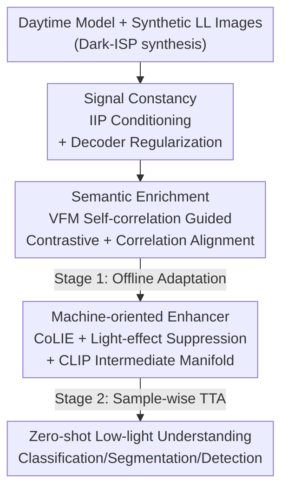

# Towards Generalized Representations for Low-Light Understanding: When Signal Constancy Meets Semantic Enrichment

**Conference**: CVPR 2026  
**Paper**: [CVF Open Access](https://openaccess.thecvf.com/content/CVPR2026/html/Li_Towards_Generalized_Representations_for_Low_Light_Understanding_When_Signal_Constancy_Meets_CVPR_2026_paper.html)  
**Code**: https://lyf1212.github.io/UniPrior (Project Page)  
**Area**: Low-light understanding / Representation learning / Domain adaptation  
**Keywords**: Low-light adaptation, Illumination-invariant prior, Visual Foundation Models, Contrastive learning, Test-time augmentation

## TL;DR
UniPrior unifies the "illumination-invariant signal prior" with the "semantic prior from Visual Foundation Models (DINOv2/CLIP)." Without using **any real low-light data** for training, it enables models trained on daytime data to robustly generalize to unseen nocturnal/low-light scenes, significantly setting new zero-shot SOTAs across classification, segmentation, and face detection tasks.

## Background & Motivation
**Background**: There are three mainstream paradigms for enabling machines to "see clearly" at night: 1) **enhance-then-understand**, which uses methods like Zero-DCE or Retinex to brighten images before feeding them to downstream models; 2) **supervised adaptation**, which trains directly on paired, annotated low-light data; and 3) **domain adaptation**, which transfers annotated knowledge from the daytime domain to an unannotated low-light target domain.

**Limitations of Prior Work**: Each approach has significant drawbacks. Enhancement methods are optimized for **human vision**, often introducing artifacts and losing task-related details, which hampers machine perception (as highlighted in Fig.1/Fig.2c). Supervised methods suffer from the scarcity of low-light annotations and **overfit to specific training sets**. Domain adaptation methods are limited by **biased degradation patterns and scene distributions** in the training data; switching datasets (e.g., from DarkFace to ExDark) drops accuracy by 1.72%, and reducing data from 4800 to 600 samples drops it by another 2.27%.

**Key Challenge**: Low-light degradation is **highly diverse** (low visibility, noise, motion blur, neon lights, night reflections, etc.), making it impractical to cover through exhaustive sampling. Current methods lack a **universal, illumination-independent semantic prior** to anchor "what the object essentially is," leading to failure when encountering unseen degradations.

**Goal**: To construct representations that are both **stable** (no signal shift under different illumination) and **discriminative** (rich in high-level semantic cues) without touching any real low-light data, facilitating the zero-shot transfer of daytime models to any low-light condition.

**Key Insight**: The authors observe that two types of priors are naturally complementary: **illumination-invariant priors** (such as the physical ISP prior in QuadPrior) provide stable representations by suppressing illumination perturbations at the signal layer but are vulnerable to complex noise; **Visual Foundation Models (VFMs)** (DINOv2, CLIP) carry robust semantic priors that remain stable across scenes and degradations. Integrating both yields both "signal constancy" and "semantic enrichment."

**Core Idea**: Use illumination-invariant priors to establish **signal constancy** for stabilizing feature distributions, then employ VFM self-correlation map-guided contrastive learning to achieve **semantic enrichment** by aligning with the VFM semantic space. Finally, inject this unified prior into pixel-level enhancement for **sample-wise test-time adaptation (TTA)**. This translates to a three-layer prior alignment trained with zero real low-light data.

## Method

### Overall Architecture
UniPrior is a two-stage "unified prior" framework. The **input** consists of a downstream model trained on daytime data plus synthetic low-light data (dimmed via Dark-ISP); the **output** is an adapted model capable of zero-shot generalization to real low-light. The pipeline comprises three modules across two training stages:

- **Stage 1 (Offline Adaptation Training)**: At the high-level feature side, two objectives are pursued: ① **Signal Constancy**: Illumination-invariant priors are fed as auxiliary inputs into the backbone, with a lightweight decoder performing cross-illumination reconstruction regularization to force the backbone to learn compact, illumination-independent representations; ② **Semantic Enrichment**: DINOv2 self-correlation maps guide contrastive learning and correlation alignment to align the task backbone's feature space with the VFM semantic space.
- **Stage 2 (Test-Time Augmentation)**: On real low-light data, a **machine-oriented enhancer** (CoLIE backbone) performs sample-wise pixel optimization. By employing light-effect suppression loss, signal prior consistency, and CLIP intermediate manifold loss, "semantic alignment" and "pixel correction" are coupled to further adapt to unseen low-light distributions.

### Key Designs

**1. Signal Constancy: Illumination-Invariant Prior Conditioning + Decoder Regularization as Information Bottleneck**

This component addresses the "feature drift under illumination" problem. For an image $I\in\mathbb{R}^{h\times w\times 3}$, an illumination-invariant prior $p_{iip}=G_{iip}(I)\in\mathbb{R}^{h\times w\times 6}$ is extracted ($G_{iip}$ is initialized with QuadPrior weights and fine-tuned online). The original image and prior are channel-concatenated (9 channels) and fused into the backbone via a convolution $K_{merge}$. A critical trick is **zero initialization**: weights corresponding to the prior channels are initialized to 0, allowing the network to gradually learn to utilize the prior without disrupting its daytime pre-trained capabilities—removing zero-init causes accuracy to plummet from 74.52% to 62.25%.

Two training constraints are used. First, an **outlier-robust prior consistency loss**: synthetic low-light images generated via inverse-ISP are used to force the synthetic prior $G_{iip}(I_{low})$ to match the daytime prior $G_{iip}(I_{normal})$. To handle artifacts in synthetic data, a difference map $d=|G_{iip}(I_{low})-G_{iip}(I_{normal})|$ is calculated, and an $\alpha$-quantile $d_\alpha$ serves as an adaptive threshold to filter outliers:

$$\mathcal{F}=\begin{cases}0,& d>d_\alpha\\1,&\text{otherwise}\end{cases},\qquad \mathcal{L}_{\text{iip-consis}}=\big\|\mathcal{F}\odot(G_{iip}(I_{low})-G_{iip}(I_{normal}))\big\|_2^2$$

Second, **Decoder Regularization**: A lightweight decoder $D_{prior}$ (approx. 10% of backbone parameters) reconstructs the **daytime** illumination-invariant prior $p_{iip}^{normal}$ from low-light intermediate features $\{f^i\}$, via $\mathcal{L}_{\text{iip-decode}}=\|D_{prior}(\{f^i\})-p_{iip}^{normal}\|_2^2$. The intentionally small decoder acts as an **information bottleneck**, forcing the backbone to distill the most compact, illumination-independent information.

**2. Semantic Enrichment: Guidance via VFM Self-correlation Maps (rather than static features)**

A core insight (Fig.4) is that in DINOv2's **raw features**, an object might be indistinguishable from its surroundings, but its **self-correlation map** precisely highlights semantically relevant regions. Thus, the model should align "correlation structures" rather than "absolute feature values."

**Contrastive Enhancement**: For VFM features $f_{vfm}$, a normalized self-similarity matrix $\mathcal{S}=\big(\tfrac{f_{vfm}}{\|f_{vfm}\|_2^2}\big)\cdot\big(\tfrac{f_{vfm}}{\|f_{vfm}\|_2^2}\big)^\top$ is computed and binarized using an adaptive threshold $\mathcal{S}_\alpha$ to obtain a mask. For an anchor point $p$, the semantic cluster region $\mathcal{M}$ is defined. Features within the mask are positive samples, while those outside are negative. InfoNCE is applied to the synthetic low-light anchor $f$, daytime positive $f^+$, and negative $f^-$:

$$\mathcal{L}_{\text{contra}}=-\log\frac{\sigma(f,f^+)}{\sigma(f,f^+)+\sum_{M[i]=0}\sigma(f,f^-_i)},\quad \sigma(x,y)=\exp(x\cdot y/\tau)$$

**Correlation Alignment**: Since VFM capacity far exceeds the task backbone, forcing the small model to mimic VFM feature distributions is difficult. Instead, alignment is performed at the **self-correlation map level**. For backbone features $f$ and DINOv2 features $f_{dino}$, self-correlation maps $\mathcal{S}, \mathcal{S}_{dino}$ are computed, followed by softmax and cross-entropy: $\mathcal{L}_{\text{align}}=\text{CE}(\text{Softmax}(\mathcal{S}),\text{Softmax}(\mathcal{S}_{dino}))$.

**3. Machine-oriented Enhancement: Injecting Unified Priors into Pixel Correction (Sample-wise TTA)**

Stage 2 employs CoLIE as the enhancement backbone to optimize pixels per sample. Beyond human-centric enhancement losses $\mathcal{L}_{enh}$, three **machine-oriented** objectives are added:

- **Light-effect Suppression Loss**: An overexposure mask $\mathcal{M}_{LE}$ is extracted (extending the signal prior to handle glare/headlights), and $\mathcal{L}_{LE}=\tfrac{1}{hw}\sum_{i,j}\mathcal{M}_{i,j}$ penalizes the overexposed area to prevent amplification of harmful artifacts.
- **Signal Prior Consistency**: The same outlier-robust L1 constraint is applied between the enhanced image prior $p_{iip}^{enh}$ and input prior $p_{iip}^{low}$.
- **CLIP Intermediate Manifold Loss**: To erase "illumination attributes," the enhanced image is pushed towards an "intermediate manifold" between daytime and low-light text embeddings in CLIP space using a **maximum entropy** loss $\mathcal{L}_{\text{clip-inter}}=\sum_i p_{sim}^i\log p_{sim}^i$.

### Loss & Training
Two-stage training:

**Stage 1 (Offline Adaptation)**: Combined training of high-level components using Dark-ISP synthetic pairs.
$$\mathcal{L}_{\text{high}}=\lambda_{\text{task}}\mathcal{L}_{\text{task}}+\lambda_{\text{con}}\mathcal{L}_{\text{iip-consis}}+\lambda_{\text{dec}}\mathcal{L}_{\text{iip-decode}}+\lambda_{\text{contra}}\mathcal{L}_{\text{contra}}+\lambda_{\text{ca}}\mathcal{L}_{\text{align}}$$

**Stage 2 (Test-Time Augmentation)**: Sample-wise optimization of low-level enhancement on real data.
$$\mathcal{L}_{\text{low}}=\lambda_{\text{enh}}\mathcal{L}_{\text{enh}}+\lambda_{\text{entropy}}\mathcal{L}_{\text{entropy}}+\lambda_{\text{consis}}\mathcal{L}_{\text{consis}}$$

Zero real low-light data is used throughout the training.

## Key Experimental Results

### Main Results
On CoDaN low-light classification (ResNet-18 baseline), UniPrior significantly outperforms all zero-shot adaptation methods with minimal overhead (parameters 11.70M→11.72M, FLOPs 1.80G→2.04G):

| Category | Method | Top-1 ACC (%) | Remarks |
|------|------|------|------|
| Baseline | ResNet-18 | 53.32 | Direct Inference |
| Enhancement | GEFU | 60.92 | Optimized for humans, suboptimal for machines |
| Zero-shot | Sim-MinMax | 65.87 | Contrastive learning, lacks universal prior |
| Zero-shot | DAI-Net | 68.44 | Prev. SOTA |
| **Ours** | **UniPrior** | **74.52** | **+6.08 over SOTA**, negligible overhead |
| Ours | UniPrior + TTA | **75.72** | Further gain via sample-wise enhancement |

Segmentation (mIoU) and Face Detection (mAP@0.5) also set new zero-shot SOTAs:

| Task / Dataset | Metric | Best Prev. (Zero-shot) | Ours | Ours + TTA |
|------|------|------|------|------|
| Seg. / Nighttime Driving | mIoU | 44.9 (Sim-MinMax) | **48.2** | 48.6 |
| Seg. / ACDC-Night | mIoU | 27.6 (Sim-MinMax) | 27.9 | **28.5** |
| Detection / DarkFace | mAP | 28.0 (DAI-Net) | 31.3 | **33.6** |

### Ablation Study

| Configuration | CoDaN ACC (%) | ND mIoU (%) | Explanation |
|------|------|------|------|
| **Full (Ours)** | **74.52** | **48.20** | Complete model |
| w/o zero-init | 62.25 | 39.31 | Largest performance drop |
| with naive feature align | 63.26 | 41.72 | L1 align instead of self-correlation |
| w/o contrastive aug. | 68.89 | 47.07 | Removed contrastive augmentation |
| w/o correlation align. | 69.71 | 46.67 | Removed correlation alignment |
| w/o prior decoder | 70.26 | 45.23 | Loss of information bottleneck |
| w/o invariant prior | 67.24 | 44.62 | Removed signal layer prior |

### Key Findings
- **Zero-init and "Correlation Map Alignment" are critical**: Removing either drops accuracy below 64%, proving the gain comes from these specific designs—preserving daytime capabilities and capturing semantic structures rather than absolute values.
- **Decoder Regularization as an Information Bottleneck is effective**: A decoder with only ~10% parameters contributes a 4.26 drop when removed, validating the "compact distillation" motivation.
- **Enhancement can harm segmentation**: Human-oriented enhancement (e.g., EnlightenGAN) can drop ND mIoU to 25.2 (lower than baseline 34.3), highlighting the necessity of machine-oriented designs.

## Highlights & Insights
- **The "Correlation Map vs. Feature" Insight**: Rather than mimicking high-dimensional DINOv2 features, aligning the softmax-normalized self-correlation matrix (contextual patterns) bypasses the capacity gap and captures semantic essence.
- **Cross-level Unified Prior**: The signal layer (invariant prior), feature layer (VFM semantics), and pixel layer (enhancement) are coupled through a single unified prior framework, which is the root cause of its generalization to unseen degradations.
- **Transferable Tricks**: ① Zero-init for "painless integration" of new modalities; ② Outlier-robust loss using quantile thresholds for synthetic data; ③ Maximum entropy in CLIP space to erase nuisance attributes (illumination).

## Limitations & Future Work
- **Dependency on Pre-trained Quality**: If foundation models (DINOv2/CLIP) are weak in specific domains (e.g., thermal, underwater), UniPrior's performance ceiling will be limited.
- **TTA Overhead**: Single image inference with TTA takes 2.593s (vs. 0.005s for the main model), making it unsuitable for real-time systems like autonomous driving unless optimized.
- **Synthetic Gap**: Stage 1 relies on Dark-ISP synthesis. While outlier-robust losses help, a large gap between synthetic and real sensor noise may still affect signal constancy.

## Related Work & Insights
- **vs. Sim-MinMax**: Both use contrastive learning, but Sim-MinMax lacks universal priors. UniPrior leads by +8.65% in classification.
- **vs. DAI-Net**: DAI-Net uses reflectance decomposition; UniPrior integrates VFM semantic priors to gain +5.6 mAP in face detection.
- **vs. Enhancement-only**: Pure enhancement often introduces artifacts. UniPrior's machine-oriented approach couples the alignment and correction, leading to superior perception.

## Rating
- Novelty: ⭐⭐⭐⭐⭐ (Self-correlation alignment insight + 3-layer prior integration)
- Experimental Thoroughness: ⭐⭐⭐⭐⭐ (3 tasks, complexity analysis, detailed ablation)
- Writing Quality: ⭐⭐⭐⭐ (Clear logic, though some notation is dense)
- Value: ⭐⭐⭐⭐⭐ (New zero-shot SOTA, transferable tricks)

<!-- RELATED:START -->

## Related Papers

- [\[CVPR 2026\] 2-Shots in the Dark: Low-Light Denoising with Minimal Data Acquisition](2-shots_in_the_dark_low-light_denoising_with_minimal_data_acquisition.md)
- [\[CVPR 2026\] Multinex: Lightweight Low-light Image Enhancement via Multi-prior Retinex](multinex_lightweight_low-light_image_enhancement_via_multi-prior_retinex.md)
- [\[CVPR 2026\] UDAPose: Unsupervised Domain Adaptation for Low-Light Human Pose Estimation](udapose_unsupervised_domain_adaptation_for_low_light_human_pose_estimation.md)
- [\[CVPR 2026\] Bi-Bridge: Bidirectional Diffusion Bridges for Low-Light Image Enhancement](bi-bridge_bidirectional_diffusion_bridges_for_low-light_image_enhancement.md)
- [\[CVPR 2026\] MR. Illuminate: Zero-Shot Low-Light Image Enhancement with Diffusion Prior](mr_illuminate_zero-shot_low-light_image_enhancement_with_diffusion_prior.md)

<!-- RELATED:END -->
