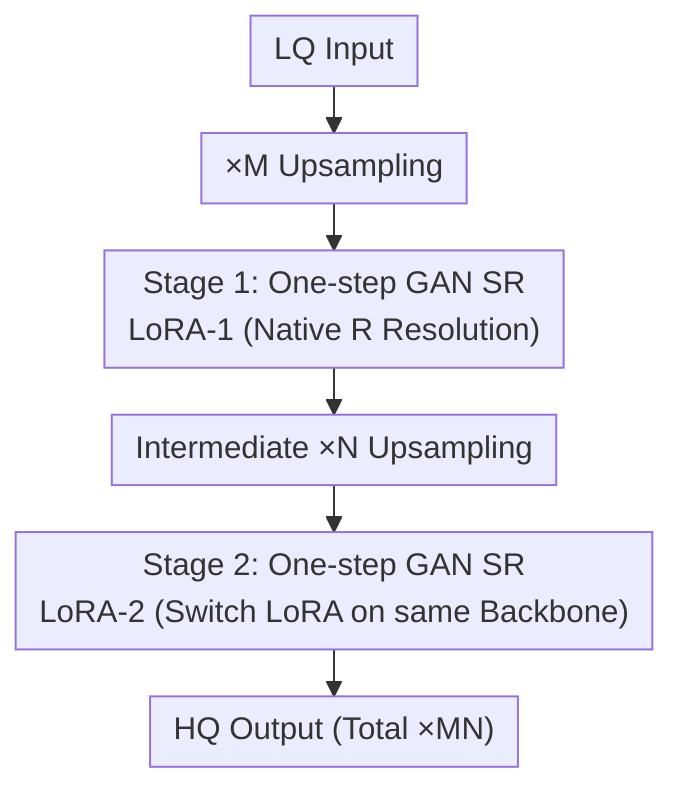

# TUDSR: Twice Upsampling-Diffusion for Higher Super-Resolution

**Conference**: CVPR 2026  
**Paper**: [CVF Open Access](https://openaccess.thecvf.com/content/CVPR2026/html/Wu_TUDSR_Twice_Upsampling_Diffusion_for_Higher_Super-Resolution_CVPR_2026_paper.html)  
**Code**: https://github.com/wuer5/TUDSR  
**Area**: Image Restoration / Diffusion Model Super-Resolution  
**Keywords**: Real Super-Resolution, One-step Diffusion, LoRA, Twice Upsampling, GAN

## TL;DR
Addressing the failure of diffusion models like SD (with a native resolution of $512^2$) in $\times 8$ high-magnification super-resolution (e.g., $256^2 \to 2048^2$), TUDSR decomposes "one-time high-magnification upsampling" into two stages of "upsampling-diffusion" that fall within the model's native capability. By using two serial LoRAs and a one-step GAN, it produces high-quality $2048^2$ images on 4x RTX 4090 GPUs, achieving SOTA on perceptual metrics across multiple real-world datasets, particularly in $\times 8$ tasks.

## Background & Motivation

**Background**: Real-world image super-resolution (Real-SR) currently mainstream uses Stable Diffusion (SD) as a base, fine-tuning it via LoRA or ControlNet to leverage SD's strong generative priors for complex degradations. To reduce inference costs, "one-step" models like OSEDiff, PiSA-SR, and InvSR have emerged, using distillation to compress multi-step sampling. For variable image sizes, tiled diffusion is used during inference to stitch large outputs.

**Limitations of Prior Work**: Common models like SD2.1-base/SD2.1 have a native resolution of only $512^2$ or $768^2$. When the goal is $1024^2$ or $2048^2$, requiring $\times 8$ upsampling, it exceeds both the native $\times 4$ magnification and the native resolution. Consequently, even with tiled diffusion, the $2048^2$ outputs are extremely blurry and lack detail—a failure attributed to violating two boundaries: **magnification crossover** ($\times 8 >$ native $\times 4$) and **resolution crossover** ($2048^2 \gg 512^2$).

**Key Challenge**: Either switch to larger generative models (e.g., SD3.5, FLUX.1-dev) for native $1024^2$ training (like FluxSR), which incurs massive training memory and compute costs, making it unfeasible for constrained devices; or use smaller models to upsample low-resolution images directly to the target resolution, which pushes the task beyond the capacity of current SR models. It is a trade-off between compute and quality.

**Goal**: Enable a small generative model with native $512^2$ support to stably produce high-quality $2048^2$ results without switching to massive models or stacking excessive compute.

**Key Insight**: Since a single $\times 8$ stage violates both magnification and resolution limits, decompose $\times 8$ into two successive stages (e.g., $\times 4$ then $\times 2$, where $M \times N = 8$). Each stage's magnification and resolution remain within the model's "comfort zone" to progressively refine the image.

**Core Idea**: Replace "one-time high upsampling-diffusion" with "Twice Upsampling-Diffusion." Train two separate LoRAs sharing the same backbone, splitting the difficult high-magnification SR task into two tasks the model excels at.

## Method

### Overall Architecture
TUDSR solves "high-magnification SR for small diffusion models." The strategy decomposes the target $\times MN$ magnification into two phases: **Stage 1** trains the first LoRA SR model (LoRA-1) at the native resolution $R$ (e.g., 512); **Stage 2** freezes LoRA-1, uses its output as input, performs $\times N$ upsampling, and trains the second LoRA SR model (LoRA-2). During inference, the input undergoes $\times M$ upsampling followed by LoRA-1, then $\times N$ upsampling followed by LoRA-2 to reach the final $\times MN$ resolution. Critically, both LoRAs use the same backbone; inference only requires switching LoRAs within the backbone, minimizing memory overhead.

Each stage functions as a **one-step GAN**: the Generator $G$ is "Pre-trained SD + LoRA" (one-step denoising to $x_0$), and the Discriminator $D$ is a "frozen DINOv3-ViT-B feature extractor + multi-layer discriminator heads trained from scratch." To handle Stage 2's high-resolution gradients without memory overflow, a **for-loop chunked training** strategy is used to process the large image in $R \times R$ blocks.

The inference workflow is as follows (Stage 2 chunking is only for training):

### Key Designs

**1. Twice Upsampling-Diffusion Decomposition: Splitting Out-of-Bound SR**

Standard $\times 8$ fails because magnification ($\times 8$ vs. native $\times 4$) and resolution ($2048^2$ vs. native $512^2$) exceed model priors. TUDSR decomposes the magnification into $M \times N$. Stage 1 brings the LQ image to native resolution via LoRA-1. Stage 2 takes this "clean but slightly blurry" intermediate image and applies $\times N$ upsampling/diffusion via LoRA-2 for final details. For $\times 8$, $M=4, N=2$ (M4N2) is used; for $\times 4$, $M=2, N=2$ (M2N2). This keeps each stage within $\times 2$--$\times 4$ magnification. Ablations show that using only the second stage (N-only) results in "extremely poor" performance (CLIPIQA 0.30), while decomposition (M2N2/M4N2) is optimal.

**2. Dual LoRA Shared Backbone: Efficiency and Memory Savings**

Using two full models would double memory and loading costs. TUDSR shares a single pre-trained generative backbone and only trains two lightweight LoRAs. Stage 1 trains LoRA-1 (with discriminator heads $\phi_1$). For Stage 2, $G_{\theta_1}$ is frozen to produce intermediate images $m = G_{\theta_1}(x_L, t_1, c)$, and only LoRA-2 ($\theta_2$ and $\phi_2$) is trained. Since only one backbone is loaded and the switch between LoRAs is lightweight, the memory footprint remains low.

**3. For-loop Chunked Training: High-Res Training on Native Hardware**

Stage 2 upsamples the intermediate image by $\times N$ to $y_L = \text{Upsampling}(m, N)$ with resolution $NR$, which exceeds the native resolution $R$ and training memory. The solution involves non-overlapping chunking of $y_L$ into $N^2$ blocks of size $R$: $\{y_L^{(i)}\} = \text{Chunking}(y_L, R)$. The training uses a for-loop to perform forward passes and **block-wise gradient backpropagation** for $\theta_2$. This maintains the peak memory consumption at the native $R$ level, allowing a single 4090 to train Stage 2 for $2048^2$.

**4. One-step GAN + DINOv3 Discriminator: Stable Details via Pre-trained Priors**

Traditional GAN training is difficult due to mapping noise to HQ images and balancing two from-scratch networks. TUDSR simplifies the task to "LQ $\to$ HQ" and injects pre-trained priors. The Generator predicts the latent directly via one-step denoising:

$$\hat{z}_H = \frac{z_L - \sqrt{1 - \bar\alpha_t} \cdot B(z_L, t, c)}{\sqrt{\bar\alpha_t}}$$

where $t$ is a fixed timestep and $B$ is the backbone. The Discriminator uses a frozen DINOv3-ViT-B as a feature extractor, extracting features from **layers 3, 6, and 9**. Shallow/middle layers are used because they contain rich details needed for SR, whereas high layers focus on global semantics already present in LQ images. An edge-aware **DISTS** loss is used for structural perception: $\mathcal{L}_{\text{ea-dists}} = \text{dists}(x_H, \hat{x}_H) + \text{dists}(S(x_H), S(\hat{x}_H))$, where $S(\cdot)$ is the Sobel operator. DISTS is preferred over LPIPS as it is more robust to geometric distortions and prevents artifacts in diffusion-GAN training.

### Loss & Training
Generator Loss: $\mathcal{L}_G = \lambda_1 \mathcal{L}_{\text{ea-dists}} + \lambda_2 \mathcal{L}_{\text{gen}} + \lambda_3 \mathcal{L}_{\text{mae}}$, with $\lambda_1=5, \lambda_2=0.5, \lambda_3=0.5$. $\mathcal{L}_{\text{gen}}$ uses BCE with a soft label of 0.8. TUDSR-S is initialized from SD2.1-base with LoRA rank 32, AdamW optimizer (LR $5 \times 10^{-5}$), and 4x gradient accumulation. Stages 1 and 2 are trained for 5100 and 3500 steps, respectively, on 4x RTX 4090s.

## Key Experimental Results

### Main Results
Testing on RealSR, DrealSR, RealLQ250, and RealLR200. Metrics include LPIPS, FID, and several no-reference perceptual metrics. $\times 4$ comparison on RealSR ($\uparrow$ higher better, $\downarrow$ lower better):

| Method (×4, RealSR) | FID↓ | NIQE↓ | CLIPIQA+↑ | LIQE↑ | MUSIQ↑ | MANIQA↑ | LPIPS↓ |
|--------------------|------|-------|-----------|-------|--------|---------|--------|
| OSEDiff | 123.50 | 5.6474 | 0.6964 | 4.0690 | 69.09 | 0.6331 | 0.2921 |
| PiSA-SR | 124.19 | 5.5057 | 0.6957 | 4.0989 | 70.15 | 0.6552 | **0.2672** |
| InvSR | 138.85 | 5.6222 | 0.6880 | 4.0392 | 68.54 | 0.6628 | 0.2871 |
| **TUDSR-S (M2N2)** | **111.42** | **4.7149** | **0.7135** | **4.3738** | **70.24** | **0.6786** | 0.3217 |

TUDSR-S leads in FID, NIQE, and all no-reference perceptual metrics. The higher LPIPS is a typical trade-off for generating more realistic details.

For $\times 8$ (high-frequency) tasks, only one-step models are compared due to the latency of multi-step models:

| Method (×8, RealSR) | CLIPIQA+↑ | NIQE↓ | LIQE↑ | MUSIQ↑ | MANIQA↑ |
|--------------------|-----------|-------|-------|--------|---------|
| OSEDiff | 0.6673 | 5.6951 | 3.6347 | 67.60 | 0.5678 |
| PiSA-SR | 0.6562 | 5.0937 | 3.2765 | 66.02 | 0.5510 |
| InvSR | 0.6420 | **4.3930** | 3.0830 | 64.30 | 0.5711 |
| **TUDSR-S (M4N2)** | **0.6883** | 4.6839 | **3.6547** | 67.22 | **0.6126** |

TUDSR-S outperforms in $\times 8$ tasks across most metrics, validating the decomposition strategy in difficult scenarios.

### Ablation Study
Configuration: M4/N4 indicates single-stage LoRA; M2N2/M4N2 indicates serial decomposition.

| Config (RealSR) | Task | CLIPIQA↑ | MUSIQ↑ | Note |
|----------------|------|----------|--------|------|
| M4 (Single ×4) | ×4 | 0.6657 | 69.26 | Traditional, sub-optimal |
| N4 (Only Stage 2) | ×4 | 0.3056 | 28.53 | Direct high-magnification, fails |
| **M2N2 (Two stages)** | ×4 | **0.6846** | **70.24** | Optimal |
| M8 (Single ×8) | ×8 | 0.6928 | 65.73 | Single stage, lacks detail |
| N8 (Only Stage 2) | ×8 | 0.2672 | 19.65 | Direct high-magnification, fails |
| **M4N2 (Two stages)**| ×8 | **0.6920** | 67.22 | Optimal |

### Key Findings
- **Decomposition is the performance source**: Using only Stage 2 (direct high SR) fails miserably, proving that the crossover of magnification and resolution is the root cause of failure.
- **Higher gains at higher magnification**: While M4 is competitive at $\times 4$, the advantage of decomposition (M4N2) becomes significantly more pronounced at $\times 8$.
- **Quality-Fidelity Trade-off**: The method targets perceptual quality and FID; pixel-wise metrics like LPIPS are secondary.
- **Resource Efficiency**: High-quality $2048^2$ SR is achieved using only small SD2.1-base models and 4x 4090 GPUs.

## Highlights & Insights
- **"Don't let any stage exceed limits"**: A simple yet effective perspective. By compressing $M \times N$ back into the model's comfort zone, the Stage 2 task is downgraded from "generating details from scratch" to "refining existing structures."
- **Dual LoRA Switching**: Sharing the backbone and switching LoRAs reduces the cascade cost to a single loading operation, which is critical for deployment on smaller devices.
- **For-loop Chunked Training**: Uses time to save space, allowing high-resolution training on consumer-grade hardware.
- **Discriminator Layer Selection**: Utilizing DINOv3's shallow/middle layers (3/6/9) for detail discrimination aligns with the SR requirement of adding fine details to existing semantic structures.

## Limitations & Future Work
- **Weak Fidelity Metrics**: LPIPS lags behind PiSA-SR, meaning generated details are "realistic" but may not perfectly match the ground truth (GT).
- **Manual Decomposition**: The values for M and N are manually searched; there is no automated mechanism to select the optimal factorization.
- **Inference Latency**: Two cascading stages increase latency compared to a single-step model like InvSR at high resolutions.
- **Stability on Ultra-large Images**: OOM issues on certain datasets like RealLR200 at $\times 8$ suggest room for improvement.

## Related Work & Insights
- **vs. Single-stage High SR**: Conventional methods upsample directly to the target resolution, causing "out-of-bounds" failures. TUDSR's decomposition prevents this.
- **vs. FluxSR**: FluxSR uses massive models for native high-res training. TUDSR achieves similar results using small models and decomposition, emphasizing resource efficiency.
- **vs. One-step Models (PiSA-SR/OSEDiff)**: These models handle native resolutions well but fail at high magnification. TUDSR serves as a framework to extend their applicability.

## Rating
- Novelty: ⭐⭐⭐⭐ 
- Experimental Thoroughness: ⭐⭐⭐⭐ 
- Writing Quality: ⭐⭐⭐⭐ 
- Value: ⭐⭐⭐⭐

<!-- RELATED:START -->

## Related Papers

- [\[CVPR 2026\] One-Step Diffusion Transformer for Controllable Real-World Image Super-Resolution](one-step_diffusion_transformer_for_controllable_real-world_image_super-resolutio.md)
- [\[CVPR 2026\] Disentangled Textual Priors for Diffusion-based Image Super-Resolution](disentangled_textual_priors_for_diffusion-based_image_super-resolution.md)
- [\[CVPR 2026\] Time-Aware One Step Diffusion Network for Real-World Image Super-Resolution](time-aware_one_step_diffusion_network_for_real-world_image_super-resolution.md)
- [\[CVPR 2026\] DreamSR: Towards Ultra-High-Resolution Image Super-Resolution via a Receptive-Field Enhanced Diffusion Transformer](dreamsr_towards_ultra-high-resolution_image_super-resolution_via_a_receptive-fie.md)
- [\[CVPR 2026\] IFCSR: Inference-Free Fidelity-Realism Control for One-Step Diffusion-based Real-World Image Super-Resolution](ifcsr_inference-free_fidelity-realism_control_for_one-step_diffusion-based_real-.md)

<!-- RELATED:END -->
