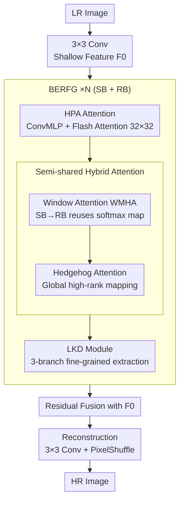

# UCAN: Unified Convolutional Attention Network for Expansive Receptive Fields in Lightweight Super-Resolution

**Conference**: CVPR 2026  
**arXiv**: [2603.11680](https://arxiv.org/abs/2603.11680)  
**Code**: [https://github.com/hokiyoshi/UCAN](https://github.com/hokiyoshi/UCAN)  
**Area**: Image Restoration / Lightweight Super-Resolution  
**Keywords**: Lightweight Super-Resolution, Hedgehog Attention, Large Kernel Distillation, Receptive Field Expansion, Parameter Sharing

## TL;DR

The authors propose UCAN, a lightweight super-resolution network that unifies convolutional and attention mechanisms to efficiently expand the effective receptive field. By introducing Hedgehog attention, it addresses the rank collapse problem in linear attention. The model incorporates a large kernel distillation module and a semi-sharing parameter strategy, achieving a 31.63 dB PSNR on Manga109 (4×) with only 48.4G MACs.

## Background & Motivation

1. **Background**: Lightweight SR primarily improves performance by expanding the effective receptive field (ERF). While Transformer-based methods are effective, increasing attention windows or kernel sizes significantly raises computational costs.
2. **Limitations of Prior Work**: Global attention methods like Grid Attention and Mamba still face efficiency issues. Although linear attention achieves $O(N)$ complexity, it suffers from rank collapse, leading to insufficient feature diversity. Parameter sharing and distillation strategies may homogenize feature maps.
3. **Key Challenge**: The inherent contradiction between expanding the receptive field and maintaining a lightweight design; the trade-off between efficiency and representational richness.
4. **Goal**: Model both local textures and global dependencies simultaneously under lightweight constraints.
5. **Key Insight**: Use Hedgehog feature mapping to solve the rank collapse of linear attention and Flash Attention for efficient computation of large-window attention.
6. **Core Idea**: Multi-level fusion—Flash Attention for large-window local modeling, Hedgehog Attention for global modeling, and large kernel distillation for spatial structures.

## Method

### Overall Architecture

The core problem UCAN addresses is: lightweight SR needs to expand the ERF to aggregate distant repeating textures without the computational overhead of large windows/kernels used in standard Transformers. The network is divided into three stages: shallow convolution, backbone, and reconstruction. An LR image passes through a 3×3 convolution to extract shallow features. The backbone consists of several "Broad Effective Receptive Field Groups" (BERFG) in series. The backbone output is fused with shallow features via residual connection, and the final HR image is reconstructed through 3×3 convolution and PixelShuffle. Inside each BERFG, a Shared Block (SB) and a Receiving Block (RB) facilitate feature processing through: High-Performance Attention (HPA, using Flash Attention for 32×32 windows), Semi-shared Hybrid Attention (Window Attention + Hedgehog Global Attention + Channel Branch), and a Large Kernel Distillation (LKD) module to expand spatial RF with minimal parameters. HPA, Hedgehog, and LKD cover "large-window local", "global", and "spatial structure" scales, respectively.

### Key Designs

**1. High-Performance Attention (HPA): Efficient Large-Window Local Modeling**

Expanding windows aggregates more context, but standard self-attention complexity is quadratic. HPA first uses a ConvMLP with kernel size 7 ($F_{mlp}=f_{\mathrm{ConvMLP}}(f_{\mathrm{LN}}(X))$) to capture local context without explicit QKV projection, followed by attention in 32×32 windows. By utilizing Flash Attention for exact calculations, memory and latency are significantly reduced, making 32×32 windows feasible in a lightweight budget. Ablations show significant drops when removing HPA or reducing windows to 16×16.

**2. Hedgehog Attention: Addressing Rank Collapse in Linear Attention**

Linear attention reduces complexity from $O(N^2)$ to $O(N)$, but the resulting output matrix often has a very low rank. This stems from the feature mapping $\phi(\cdot)$. ReLU discards negative values, and ELU+1 can lead to extreme variations. UCAN adopts Hedgehog Feature Mapping (HFM), concatenating $m$ pairs of symmetric exponential features $\phi_H(X) = [\exp(W^\top X + b_1), \dots, \exp(-W^\top X - b_m)]$. This preserves information in both directions and uses a trainable $W$ to better fit the data distribution. Linear attention with HFM restores the rank to 46 (full rank 64), compared to ~20 and ~30 for ReLU and ELU.

**3. Semi-sharing Mechanism: Efficiency without Homogenization**

While parameter sharing reduces size, excessive sharing makes representations across layers too similar. UCAN divides BERFGs into Shared Blocks (SB) and Receiving Blocks (RB). SBs compute a full hybrid attention and cache the softmax maps $A_{qk}^{(a)}, A_{map}^{(a)}$. RBs reuse these maps to skip redundant calculations. However, the dynamic feature mappings $\phi(Q), \phi(K)$ in the Hedgehog global path are not shared and are recomputed per layer to maintain diversity.

**4. Large Kernel Distillation (LKD): Selective Spatial Expansion**

LKD expands the spatial RF by splitting channels into a fine-grained subset $F_{fg}$ ($\max(C/4, 16)$ channels) and a coarse subset $F_{cg}$. Only $F_{fg}$ passes through a Triple Feature Extraction (TFE) consisting of a channel attention branch, a 1×1→3×3→1×1 bottleneck local branch, and a hierarchical large kernel branch using dilated depthwise convolutions. This "distills" large kernel capabilities using only a fraction of the total channels.

### Loss & Training

L1 reconstruction loss + LDL loss + Wavelet loss. Adam optimizer ($\beta_1=0.9, \beta_2=0.99$) with 64×64 crops and batch size 16. Trained on 2 × RTX 3090. ×2 scale trained for 800K steps; ×3/×4 fine-tuned for 400K steps.

## Key Experimental Results

### Main Results

| Method | Manga109 4× PSNR | Params | MACs |
|------|------------------|--------|------|
| **UCAN-L** | **31.63** | 902K | 48.4G |
| MambaIRV2-light | 31.24 | 790K | 75.6G |
| ATD-light | 31.48 | 769K | 100.1G |
| ESC | 31.54 | 968K | 149.2G |
| RCAN | 31.22 | 15592K | 917.6G |

### Ablation Study

| Config | Set5 PSNR | Urban100 PSNR | Description |
|------|-----------|-------------|------|
| w/o HPA | 38.27 | 32.90 | Lacks large-window local attention |
| HPA 16×16 window | 38.32 | 33.04 | Default 32×32 is superior |
| ReLU Mapping | 38.33 | 33.16 | Low rank |
| Hedgehog Mapping | 38.34 | 33.22 | High rank, +0.06 dB gain |
| Full Sharing | 38.29 | 32.89 | Representation homogenization |
| Semi-sharing | 38.34 | 33.22 | Information update, +0.33 dB gain |

### Key Findings

- UCAN outperforms MambaIRV2 by 0.39 dB on Manga109 (4×) while reducing MACs by 36%.
- Hedgehog Feature Mapping restores rank to 46/64, whereas ReLU and ELU only reach ~20 and ~30.
- ERF visualization shows UCAN's effective receptive field coverage is significantly larger than MambaIR/MambaIRv2.
- LAM analysis demonstrates UCAN's ability to aggregate repeating patterns from a broader context.

## Highlights & Insights

- **Hedgehog Attention Solves Rank Collapse**: Restoring the rank of linear attention via symmetric exponential mapping directly improves representational diversity.
- **Multi-level RF Fusion**: Complementary scale modeling via Flash Attention (32×32 local), Hedgehog (global), and Large Kernel Distillation (spatial structure).
- **Extreme Efficiency**: Achieves performance comparable to RCAN (15.6M params) using only 705K parameters and 38.1G MACs.

## Limitations & Future Work

- Flash Attention depends on specific CUDA implementations and may be unavailable on some hardware.
- The number of $m$ feature pairs in Hedgehog mapping requires tuning.
- Generalization to other image restoration tasks beyond SR remains to be verified.

## Related Work & Insights

- **vs OmniSR**: OmniSR uses Grid Attention for RF expansion but is less efficient than UCAN.
- **vs MambaIRv2**: MambaIRv2 combines Swin+SSM; UCAN replaces SSM with Hedgehog linear attention.
- **vs ATD-light**: ATD uses adaptive token dictionaries; UCAN achieves lower MACs using distilled large kernels and Hedgehog mapping.

## Rating

- Novelty: ⭐⭐⭐⭐ First application of Hedgehog attention in SR with rank recovery analysis.
- Experimental Thoroughness: ⭐⭐⭐⭐⭐ 5 benchmarks + 3 scales + ERF/LAM analysis + detailed ablations.
- Writing Quality: ⭐⭐⭐⭐ Clear structure with in-depth analysis of attention mechanisms.
- Value: ⭐⭐⭐⭐ Sets a new SOTA direction for lightweight SR.

<!-- RELATED:START -->

## Related Papers

- [\[CVPR 2026\] LightRR: A Lightweight Network for Single Image Reflection Removal](lightrr_a_lightweight_network_for_single_image_reflection_removal.md)
- [\[CVPR 2026\] DreamSR: Towards Ultra-High-Resolution Image Super-Resolution via a Receptive-Field Enhanced Diffusion Transformer](dreamsr_towards_ultra-high-resolution_image_super-resolution_via_a_receptive-fie.md)
- [\[CVPR 2026\] Toward Real-world Infrared Image Super-Resolution: A Unified Autoregressive Framework and Benchmark Dataset](real_iisr_infrared_image_super_resolution_autoregressive.md)
- [\[CVPR 2026\] Dual Graph Regularized Deep Unfolding Network for Guided Depth Map Super-resolution](dual_graph_regularized_deep_unfolding_network_for_guided_depth_map_super-resolut.md)
- [\[CVPR 2026\] Time-Aware One Step Diffusion Network for Real-World Image Super-Resolution](time-aware_one_step_diffusion_network_for_real-world_image_super-resolution.md)

<!-- RELATED:END -->
