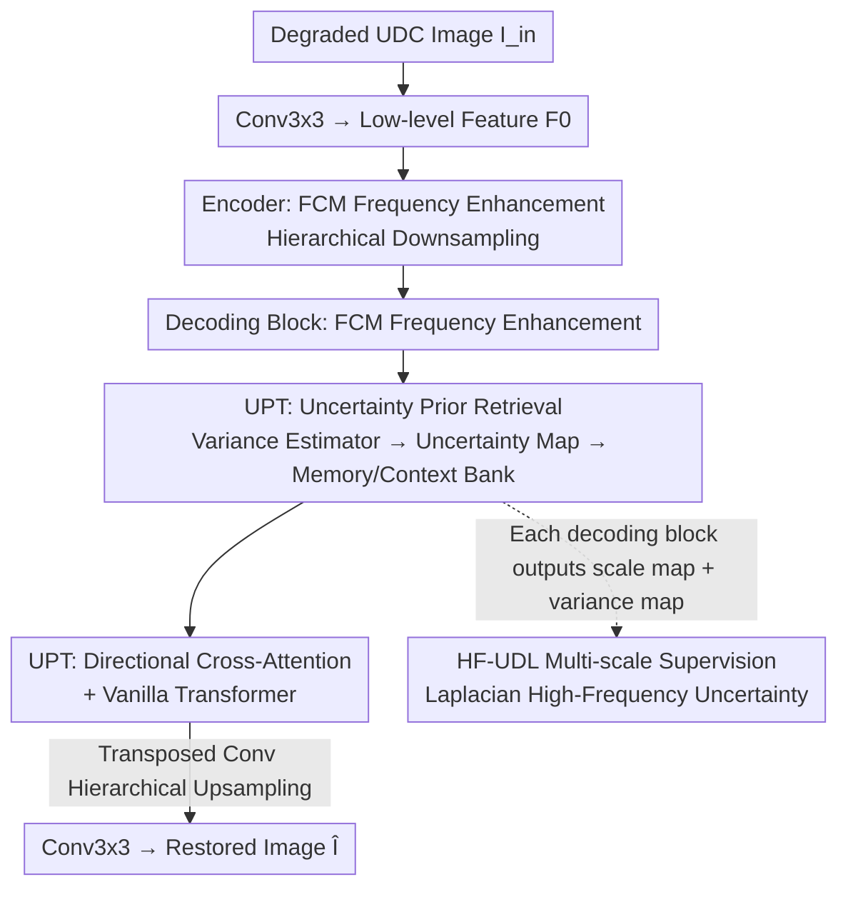

# UCMNet: Uncertainty-Aware Context Memory Network for Under-Display Camera Image Restoration

**Conference**: CVPR 2026  
**Paper**: [CVF Open Access](https://openaccess.thecvf.com/content/CVPR2026/html/Kim_UCMNet_Uncertainty-Aware_Context_Memory_Network_for_Under-Display_Camera_Image_Restoration_CVPR_2026_paper.html)  
**Code**: [Project Page](https://kdhrick2222.github.io/projects/UCMNet) (code promised to be released after publication)  
**Area**: Image Restoration / Under-Display Camera  
**Keywords**: Under-Display Camera (UDC), Image Restoration, Uncertainty Modeling, Memory Bank, Frequency Domain Enhancement

## TL;DR
UCMNet uses a pixel-wise uncertainty map to calibrate "where the degradation is most irregular and difficult to restore" in under-display camera (UDC) images. It then leverages a pair of learnable Memory/Context Banks to retrieve corresponding high-frequency context based on uncertainty patterns, enabling adaptive restoration of spatially non-uniform degradations. It achieves SOTA on POLED, TOLED, and SYNTH with approximately 30% fewer parameters compared to BNUDC (3.2M vs. 4.6M).

## Background & Motivation
**Background**: By hiding the camera underneath an OLED screen, under-display cameras (UDC) achieve a true full-screen experience. However, light passing through the display layer suffers from diffraction, scattering, and internal reflection, leading to reduced light transmittance, blur, noise, and flare. UDC restoration is thus a composite task combining denoising, deblurring, low-light enhancement, and super-resolution. Current mainstream methods follow three main paradigms: PSF-based physical modeling, joint learning frameworks, and frequency-domain separation networks (e.g., BNUDC’s dual-branch structure for restoring high/low frequencies separately, and FSI's frequency-spatial interaction).

**Limitations of Prior Work**: While current methods can restore rough low-frequency structures and maintain global color consistency, they still struggle to recover **fine high-frequency details**. The root cause is that most of them apply a **uniform restoration process** to the entire image. However, UDC degradation is highly spatially non-uniform: diffraction characteristics differ significantly between the center and the edges of the lens, and degradation patterns vary across different locations within the same image (e.g., grid artifacts, horizontal stripes). Utilizing a uniform operator to address highly variable local degradations inevitably leaves residual distortions.

**Key Challenge**: Deterministic restoration networks treat all pixels equally, failing to distinguish between "conforming regions" and "severe diffraction areas with high uncertainty." UDC restoration particularly requires allocating computation and attention toward these high-error regions with high uncertainty.

**Goal**: (1) Quantify the restoration uncertainty of each pixel, ensuring accurate estimation specifically in high-frequency detail regions; (2) Enable the network to perform differentiated and adaptive high-frequency restoration on different degraded regions based on this uncertainty.

**Key Insight**: Drawing inspiration from uncertainty modeling in deraining, desnowing, and super-resolution, uncertainty serves as a pixel-wise metric of prediction confidence, naturally yielding higher values in severely degraded regions. By treating uncertainty as a **prior**, the network can be guided to focus on challenging areas with diverse local degradations.

**Core Idea**: Using a high-frequency-sensitive uncertainty map as a "key" to retrieve "what high-frequency context should be compensated for this specific degradation pattern" from a pair of Memory/Context Banks, therewith replacing uniform restoration with uncertainty-guided spatially adaptive restoration.

## Method

### Overall Architecture
UCMNet is a U-shaped (encoder-decoder) residual network. The degraded input $I_{in}\in\mathbb{R}^{H\times W\times 3}$ first passes through a 3x3 convolution to produce low-level features $F_0\in\mathbb{R}^{H\times W\times C}$, which then enter the encoder for hierarchical downsampling, and are restored through the decoder using hierarchical upsampling. The core of the encoding block is the **Frequency Convolutional Module (FCM)**, which enhances features in the Fourier domain to counter the degradation caused by the display layer. In addition to the FCM, the decoding block incorporates the **Uncertainty Prior Transformer (UPT)** to perform uncertainty-guided feature refinement, followed by transposed convolutions for upsampling. Each decoding block is connected to a "mean estimator + variance estimator" pair, where the variance estimator yields the uncertainty map at that specific scale and the mean estimator yields the reconstruction map at that scale. Multi-scale supervision is simultaneously applied via the high-frequency uncertainty loss (HF-UDL).

### Key Designs

**1. FCM Frequency Convolutional Module: Explicitly Countering Display Layer Degradation in the Fourier Domain**

UDC degradation (diffraction, scattering) exhibits clear structural characteristics in the frequency domain, which are difficult to capture efficiently using pure spatial convolutions. Inspired by NAFBlock, FCM consists of a **frequency-domain feature enhancement branch** and a **spatial attention branch**: the former transforms features into the Fourier domain via FFT, enhances them with 1x1/3x3 convolutions, and transforms them back to the spatial domain via IFFT; the latter performs spatial modulation using a Simple Gate (SG) and Simplified Channel Attention (SCA). It is embedded into every encoder and decoder block as a foundational frequency-domain enhancement operator, recovering as much high-frequency structure as possible before passing features to subsequent uncertainty modules for local refinement.

**2. Uncertainty Prior Retrieval: Mapping "Degradation Patterns" to "Target High Frequencies" via Memory/Context Banks**

This is the core of UCMNet and the key distinction from uniform restoration methods. Within the UPT block, a variance estimator first predicts the uncertainty map $F_U$ from the input feature $F_{in}\in\mathbb{R}^{H'\times W'\times C}$, highlighting high-uncertainty regions. It then introduces a pair of learnable memory banks: a Memory Bank $M=[m_1,\dots,m_N]$ and a Context Bank $C=[c_1,\dots,c_N]$, each containing $N$ token pairs ($M,C\in\mathbb{R}^{N\times C}$). Each $m_i$ learns and stores an **uncertainty pattern**, while the paired $c_i$ stores the **compensatory high-frequency information matching that pattern**—essentially, the Memory Bank serves as the "address index" for the Context Bank.

During retrieval, the feature vector $f^u_j$ of each pixel in the uncertainty map is first compared with each $m_i$ using cosine similarity:

$$s_{ij}=\frac{m_i\, {f^u_j}^{\top}}{\lVert m_i\rVert\cdot\lVert f^u_j\rVert}$$

Applying a softmax to $s_{ij}$ along the memory bank dimension yields weights $w_{ij}$, which are then used to weighted-aggregate the context tokens to generate the retrieved context feature at that position $f^c_j=\sum_i w_{ij}c_i$. Consequently, each pixel "looks up the table" according to its own uncertainty pattern to retrieve the most appropriate high-frequency context $F_C$, naturally achieving spatial adaptation. Ablation studies (Table 6) demonstrate that using the uncertainty feature $F_U$ as a retrieval prior outperforms directly utilizing input feature $F_{in}$ by 0.18 dB, and outperforms a three-layer router without a prior by 0.33 dB—confirming that the uncertainty prior indicates "what needs to be compensated" more reliably than raw features.

**3. Directional Cross-Attention + Vanilla Transformer: Local Context Fusion Followed by Global Consistency Alignment**

After retrieving $F_C$, it must be fused with the input features. UPT employs cross-attention, specifically **designing the query/value to originate from $F_{in}$ and the key to originate from $F_C$**—meaning that the retrieved high-frequency context "guides" the restoration while preserving the input's spatial content. To model spatial directional dependencies, it reshapes $Q_1,K_1,V_1$ into vertical ($\mathbb{R}^{H'\times(W'C)}$) and horizontal ($\mathbb{R}^{W'\times(H'C)}$) representations, respectively, executing vertical/horizontal attention in parallel:

$$F_v=\mathrm{softmax}\!\Big(\frac{Q_vK_v^{\top}}{\sqrt{\alpha}}\Big)V_v,\quad F_h=\mathrm{softmax}\!\Big(\frac{Q_hK_h^{\top}}{\sqrt{\alpha}}\Big)V_h$$

After both outputs are reshaped back to $\mathbb{R}^{H'\times W'\times C}$, they are averaged and combined with a residual connection: $\hat F=0.5\times(F_v+F_h)+F_{in}$. This horizontal-vertical decomposition jointly leverages spatial dependencies in both directions for balanced feature refinement while significantly reducing the computational cost of full self-attention (corroborating the 30% parameter reduction). Subsequently, a Vanilla Transformer is applied to compute **self-attention along the channel dimension** for global long-range consistency: $F_{out}=\mathrm{Attn}(Q_2,K_2,V_2)+\hat F$. This two-stage approach of local directional refinement followed by global channel consistency corresponds perfectly to "locally compensating for details based on uncertainty, then unifying the global style."

**4. HF-UDL High-Frequency Uncertainty-Driven Loss: Directing Uncertainty Estimation to High Frequencies Rather Than Global Brightness**

The traditional uncertainty-driven loss (UDL) (Eq. 1) is formulated as $L_{UDL}=\exp(-s)\lVert\hat I-I_{gt}\rVert_1+2s$, which adaptively weights supervision using pixel-wise uncertainty $s$ to guide the network toward large-error regions. However, the authors observed that directly applying UDL is insufficient for restoring high-frequency details degraded by composite blur, noise, and low light in UDC, as UDL estimates raw pixel errors and is insensitive to texture edges. The core modification in HF-UDL is the **integration of a Laplacian operator $\Delta$** on both the restored and ground-truth images before error calculation, thereby restricting the loss to high-frequency components:

$$L_{HF\text{-}UDL}=\exp(-s)\,\lVert \Delta(\hat I)-\Delta(I_{gt})\rVert_1+2s$$

This forces the variance estimator to learn the **uncertainty of high-frequency features**, generating more reliable uncertainty maps (Fig. 8 shows that shallow scales capture fine structures while deep scales respond to coarse degradation patterns). HF-UDL is applied multi-scally at each decoding block, encouraging hierarchical uncertainty-aware refinement. The total loss is formulated as $L_{total}=\lambda_1 L_{HF\text{-}UDL}+\lambda_2 L_{PSNR}$, empirically set to $\lambda_1=100,\lambda_2=0.5$.

## Key Experimental Results

### Main Results
POLED/TOLED test sets (PSNR/SSIM↑, LPIPS/DISTS↓):

| Dataset | Metric | UCMNet | BNUDC (CVPR22) | FSI (ICCV23) | Parameter Comparison |
|--------|------|--------|---------------|-------------|----------|
| POLED-Test | PSNR/SSIM | **33.81 / 0.9625** | 33.39 / 0.9610 | 33.14 / 0.9546 | 3.2M vs 4.6M / 5.3M |
| POLED-Test | LPIPS/DISTS | **0.1718 / 0.1440** | 0.1748 / 0.1511 | 0.1948 / 0.1458 | — |
| TOLED-Test | PSNR/SSIM | **38.37 / 0.9802** | 38.22 / 0.9798 | 38.21 / 0.9789 | — |
| TOLED-Test | LPIPS/DISTS | **0.0933 / 0.0897** | 0.0988 / 0.0964 | 0.0991 / 0.1006 | — |

Synthetic dataset SYNTH (PSNR/SSIM↑):

| Method | Params (M) | PSNR↑ | SSIM↑ | LPIPS↓ | DISTS↓ |
|------|---------|-------|-------|--------|--------|
| BNUDC | 4.6 | 45.56 | 0.9940 | 0.0110 | 0.0155 |
| FSI | 5.3 | 45.69 | 0.9930 | 0.0126 | 0.0206 |
| **UCMNet** | **3.2** | **46.71** | **0.9942** | 0.0110 | **0.0150** |

UCMNet achieves comprehensive SOTA across the three benchmarks with fewer parameters (approx. 30% fewer than BNUDC); on SYNTH, its PSNR surpasses the runner-up FSI by approximately 1.0 dB. Moreover, it **does not require manual preprocessing like BNUDC/FSI**, directly processing raw POLED/TOLED images, thus reflecting superior robustness and generalizability.

### Ablation Study
Ablation on loss functions (POLED, PSNR/SSIM):

| Config | PSNR/SSIM | Description |
|------|-----------|------|
| $L_{PSNR}$ Only | 33.38 / 0.9600 | Baseline |
| + $L_{UDL}$ | 33.59 / 0.9619 | Adding standard uncertainty-driven loss, +0.21 dB |
| + $L_{HF\text{-}UDL}$ | **33.81 / 0.9625** | Replacing with the high-frequency variant, further +0.22 dB |

Ablation on UPT components (POLED, PSNR/SSIM):

| Configuration | PSNR/SSIM | Description |
|------|-----------|------|
| Pure vanilla transformer | 33.59 / 0.9618 | Without hv-attention or memory bank |
| + hv-attention | 33.64 / 0.9621 | Horizontal-vertical directional attention gain |
| + Cross-attention (Memory Bank only) | 33.69 / 0.9617 | Relying only on M yields limited contribution |
| + Context Bank (Full UPT) | **33.81 / 0.9625** | M+C paired retrieval yields the maximum gain |

Contextual prior selection ablation (POLED): Three-layer router without prior (33.48) $\rightarrow$ Retrieval using input feature $F_{in}$ (33.63) $\rightarrow$ Retrieval using uncertainty feature $F_U$ (**33.81**).

### Key Findings
- **Uncertainty prior is more effective than raw features**: Retrieving context with $F_U$ yields a 0.18 dB gain over $F_{in}$ and a 0.33 dB gain over no-prior baselines, demonstrating that the "uncertainty location" signal indicates where high-frequency modifications are needed far better than raw content.
- **Memory Bank has limited impact on its own and must be paired with Context Bank**: Utilizing only the Memory Bank for cross-attention (33.69) behaves similarly to pure hv-attention (33.64), suggesting that storing "uncertainty patterns" alone does not directly restore images. The actual high-frequency compensation is driven by the paired Context Bank (33.81), validating the "M as the key, C as the content" design.
- **Focusing on high frequency is the critical finishing touch**: Shifting from UDL to  HF-UDL by simply incorporating a Laplacian operator yields an extra 0.22 dB gain, visually transforming results from "containing residual artifacts" to "most closely matching GT with sharp details."
- **Separation of scales**: Deep uncertainty maps indicate that shallow levels capture fine structures while deeper levels respond to coarse degradation patterns. Multi-scale HF-UDL supervision encourages each layer to perform its designated role.

## Highlights & Insights
- **Decoupling "where to restore" and "what to compensate" into key-value retrieval**: Memory Bank learns uncertainty patterns as keys, while Context Bank learns high-frequency components as values for pixel-wise lookup. This "pattern $\rightarrow$ content" memory retrieval paradigm is transferable to other spatially non-uniform degradation tasks (e.g., deraining, dehazing, and spatially-varying deblurring).
- **Using the uncertainty map as a query key rather than a simple weighting tool**: While most uncertainty-based methods only use $s$ as a loss weight, UCMNet advances it to a prior signal that drives retrieval, leveraging the underlying information more deeply.
- **Parameter-efficient horizontal-vertical decomposed attention**: Splitting the 2D full attention into parallel vertical and horizontal 1D attention mechanisms is the primary factor allowing the model to outperform 4.6M/5.3M parameter models with only 3.2M parameters. This design is highly beneficial for on-device UDC applications with tight computational budgets.
- **High-frequency focusing via a simple Laplacian operator**: Adding a Laplacian operator to both the prediction and GT in the uncertainty loss shifts the focus of uncertainty estimation from "overall brightness errors" to "texture edge errors"—extremely simple conceptually, yet directly addressing the bottleneck of high-frequency loss in UDC images.

## Limitations & Future Work
- **Lack of systematic analysis on the memory bank capacity $N$**: The paper does not provide sensitivity curves of performance/VRAM relative to the token count $N$, leaving it unclear how to determine $N$ in practical deployments.
- **Validation limited to three UDC benchmarks**: Despite claims of applicability to "spatially non-uniform degradations," its transferability has not been validated on other spatially-varying degradation tasks, such as deraining, dehazing, or real-world mobile night-shot restoration.
- **Empirical loss weights**: The weights $\lambda_1 = 100, \lambda_2 = 0.5$ are purely empirical; their robustness across different environments and sensitivity to $\lambda$ are not reported.
- **Unreleased code**: Code has not yet been released (promised to be open-source post-publication), and reproducibility remains to be verified.
- **Future directions**: Upgrading the Memory/Context Banks into dictionaries that can expand online along with test degradations, or introducing explicit physical PSF priors to complement the uncertainty prior, which might further suppress diffraction artifacts at extreme boundaries.

## Related Work & Insights
- **vs. BNUDC (CVPR22)**: BNUDC uses a dual-branch structure to restore high and low frequencies separately, but it uniformly processes the entire image, ignoring spatially non-uniform uncertainty. UCMNet guides local adaptive restoration via pixel-wise uncertainty maps, leading in performance using 30% fewer parameters.
- **vs. FSI (ICCV23)**: FSI implements frequency-spatial interaction learning and requires manual preprocessing. UCMNet directly processes raw inputs, utilizing FCM for frequency-domain enhancement and UPT for uncertainty-based retrieval, showing superior robustness and generalizability.
- **vs. Classical UDL (Uncertainty-Driven Loss in Super-Resolution)**: Standard UDL estimates global pixel uncertainty to weight the loss; HF-UDL employs a Laplacian operator to constrain this focus to high frequencies and elevates the uncertainty estimate from a mere "loss weight" to a "retrieval prior," targeting UDC high-frequency degradation more accurately.
- **vs. PSF Physical Modeling Methods (e.g., DISCNet)**: Physical modeling relies on precise PSF priors and tends to prioritize low-frequency structure restoration. UCMNet takes a data-driven uncertainty-aware path, showing greater flexibility when handling complex, spatially-varying composite degradations in real-world images.

## Rating
- **Novelty**: ⭐⭐⭐⭐ Elevating uncertainty from a loss weight to a prior driving Memory/Context Bank retrieval ("pattern key $\rightarrow$ high-frequency value") is a novel and self-consistent combination for UDC restoration.
- **Experimental Thoroughness**: ⭐⭐⭐⭐ The evaluation on three benchmarks coupled with three sets of ablation studies (on the loss, UPT, and priors) is complete and leads to clear conclusions; however, analyses regarding memory bank capacity and cross-task transferability are absent.
- **Writing Quality**: ⭐⭐⭐⭐ The progression of motivation-method-ablation flows smoothly, with well-supported math formulations and diagrams; some notations (e.g., $F_C$'s retrieval dimensionality) require cross-checking with the diagram for full comprehension.
- **Value**: ⭐⭐⭐⭐ Refreshing the UDC SOTA with fewer parameters and no manual preprocessing is highly practical for on-device full-screen imaging, and the memory-retrieval paradigm holds potential for external generalization.

<!-- RELATED:START -->

## Related Papers

- [\[CVPR 2026\] Time-Aware One Step Diffusion Network for Real-World Image Super-Resolution](time-aware_one_step_diffusion_network_for_real-world_image_super-resolution.md)
- [\[CVPR 2026\] DeSpike: Defocus Deblurring and Image Reconstruction for Spike Camera](seeing_through_blur_tackling_defocus_in_spike-based_imaging.md)
- [\[CVPR 2026\] FAPE-IR: Frequency-Aware Planning and Execution Framework for All-in-One Image Restoration](fape-ir_frequency-aware_planning_and_execution_framework_for_all-in-one_image_re.md)
- [\[CVPR 2026\] LightRR: A Lightweight Network for Single Image Reflection Removal](lightrr_a_lightweight_network_for_single_image_reflection_removal.md)
- [\[ICLR 2026\] Text-Aware Image Restoration with Diffusion Models](../../ICLR2026/image_restoration/text-aware_image_restoration_with_diffusion_models.md)

<!-- RELATED:END -->
