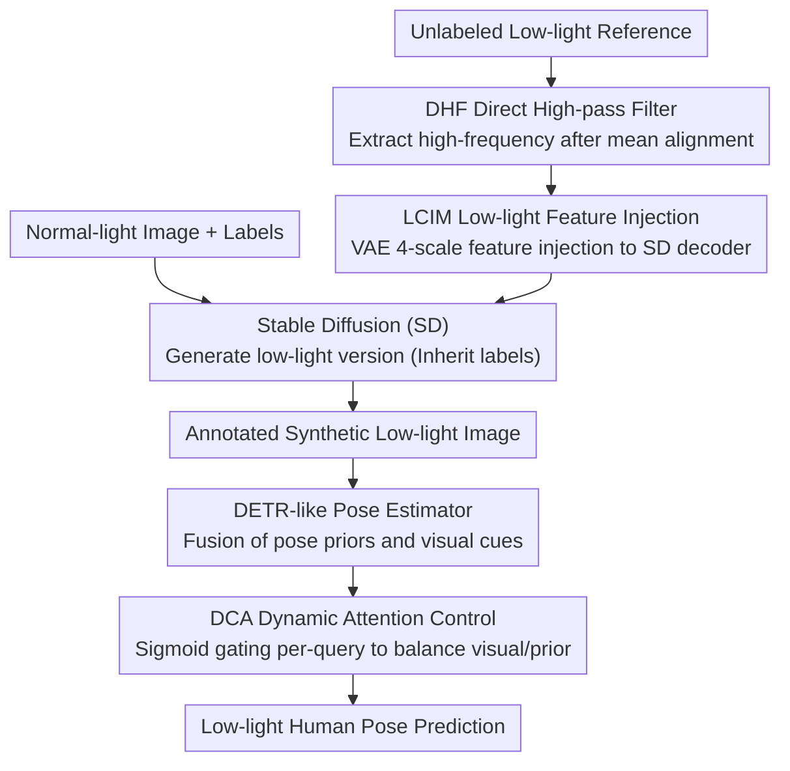

# UDAPose: Unsupervised Domain Adaptation for Low-Light Human Pose Estimation

**Conference**: CVPR 2026  
**arXiv**: [2604.10485](https://arxiv.org/abs/2604.10485)  
**Code**: VMIL/UDAPose  
**Area**: Image Restoration  
**Keywords**: Low-light human pose estimation, Domain adaptation, Stable Diffusion, Attention control, High-frequency injection

## TL;DR

UDAPose achieves a 56.4% AP improvement on low-light hard sets through Stable Diffusion-based low-light image synthesis (preserving high-frequency low-light features) and a Dynamic Attention Control module (adaptively balancing visual cues with pose priors).

## Background & Motivation

**Background**: Human pose estimation performs excellently under good lighting but suffers significant performance degradation in low-light conditions. Annotating low-light datasets is extremely difficult, making domain adaptation a viable alternative.

**Limitations of Prior Work**: (1) Manual enhancement (e.g., Gaussian noise) oversimplifies real low-light noise (comprising complex photon, thermal, and quantization noise); (2) Learning-based image translation (CycleGAN/StyleID) fails to preserve high-frequency low-light features; (3) Modern one-stage pose estimators query image features via cross-attention but over-rely on visual cues even when they are unreliable in low light.

**Key Challenge**: The effectiveness of domain adaptation depends on the realism of synthetic low-light images, whereas existing methods either oversimplify noise or lose critical high-frequency features. Simultaneously, pose models lack the ability to switch to pose priors when visual information is degraded.

**Goal**: (1) Synthesize training data that preserves high-frequency low-light features; (2) Enable pose models to adaptively balance visual cues and pose priors.

**Key Insight**: Using Stable Diffusion as a generative backbone to extract and inject high-frequency features from unlabeled low-light reference images, while modifying the fusion mechanism of DETR-like pose estimators.

**Core Idea**: DHF preserves high-frequency low-light features → LCIM multiscale injection → DCA adaptively controls visual/prior weights.

## Method

### Overall Architecture

UDAPose addresses the contradiction of "lacking labels in low light while synthetic data is unrealistic." The pipeline is divided into data synthesis and pose estimation. During training, annotated normal-light images are fed into a Stable Diffusion (SD) model to generate corresponding low-light versions, inheriting the original labels. The DHF and LCIM modules ensure these synthetic images carry realistic high-frequency noise rather than simple darkening. On the pose estimator side, the DCA module replaces the rigid summation of "visual cues + pose priors" in DETR-like architectures, allowing the model to decide which to trust when the image is degraded. During inference, SD is no longer required, and the trained pose model is applied directly to real low-light images.

### Key Designs

**1. Direct High-pass Filter (DHF): Preventing cropping from losing dark high-frequency components**

Real low-light noise (photon, thermal, and quantization noise) resides heavily in high frequencies. However, applying a standard high-pass filter yields $I_{HP}$ with a mean near zero and many negative values. Since the SD VAE encoder only accepts inputs in the range $[0, 1]$, negative values representing dark details are clipped. DHF shifts the mean back to the original image level before clipping:

$$I_{DHF} = I_{HP} + \big(\mathrm{mean}(I_{LL}) - \mathrm{mean}(I_{HP})\big)$$

By ensuring $\mathrm{mean}(I_{DHF}) = \mathrm{mean}(I_{LL})$, high-frequency details are lifted into a positive range, significantly reducing information loss during clipping. This mean alignment provides the basis for injecting realistic noise patterns.

**2. Low-light Characteristic Injection Module (LCIM): Multi-scale injection of noise patterns**

Preserving high frequencies is insufficient; these features must land at the correct spatial resolutions—fine-grained noise at fine scales and overall darkening at coarse scales. LCIM extracts features $\{z_1, \dots, z_4\}$ at four scales from the high-frequency map through the VAE encoder. After processing these into $\{f_1, \dots, f_4\}$ via lightweight convolutions, they are injected into the decoder via addition:

$$\hat{I}'_{LL} \leftarrow d_{final}\big(d_4(d_3(d_2(d_1(z_0)+f_1)+f_2)+f_3)+f_4\big)$$

Finally, channel statistics are aligned. Although trained under a reconstruction objective, it learns transferable noise patterns rather than a specific image, enabling generalization to real low-light scenes.

**3. Dynamic Attention Control (DCA): Allowing the model to distrust the image during degradation**

In DETR-like pose estimators, the pose prior $\mathbf{Q}_{pose}$ and visual cue $\mathbf{Q}_{image}$ are typically summed, implying fixed weights. The authors quantified the relative strength using the Frobenius norm ratio $\|\mathbf{Q}_{image}\|_2/\|\mathbf{Q}_{pose}\|_2$ and found it remains stable at approximately 1.7 regardless of lighting quality. This means visual cues always dominate, even when they are unreliable in low light. DCA replaces the rigid sum with adaptive gating: it concatenates $\mathbf{Q}_{pose}$ and $\mathbf{Q}_{image}$, passes them through a lightweight network with a sigmoid output to calculate a $[0, 1]$ gate weight. This allows the model to decide per-query whether to rely on vision or priors.

### Loss & Training

LCIM is trained using a combination of MSE and frequency domain loss:

$$\mathcal{L}_\mathcal{D} = \mathcal{L}_{MSE}(I, \hat{I}) + \lambda\,\mathcal{L}_{freq}(I, \hat{I})$$

The frequency domain loss uses sine weighting to emphasize mid-to-high frequencies, forcing the model to render noise patterns rather than just aligning global brightness. The pose model is then trained using the synthetic low-light data and inherited labels.

## Key Experimental Results

### Main Results

| Dataset | Metric | UDAPose (Ours) | Prev. SOTA | Gain |
|--------|------|---------|----------|------|
| ExLPose-test LL-H | AP | +10.1 | Best Prev. | 56.4% |
| EHPT-XC (Cross-dataset) | AP | +7.4 | Best Prev. | 31.4% |

### Ablation Study

| Configuration | AP | Description |
|------|-----|------|
| w/o DHF | Drop | Loss of high-frequency information |
| w/o LCIM | Drop | Low-light features not injected |
| w/o DCA | Drop | Visual cues dominate continuously |
| Gaussian Noise sub. | Much Lower | Manual augmentation is unrealistic |
| CycleGAN sub. | Lower | Over-darkening + lighting artifacts |
| Full UDAPose | **Optimal** | Synergy of all three components |

### Key Findings

- DHF’s mean alignment is simple but critical—without it, significant dark high-frequency information is lost.
- DCA allows the model to automatically switch to pose priors when keypoints are invisible, significantly improving predictions for difficult joints.
- Cross-dataset evaluation (EHPT-XC) validates the generalization capability of the synthetic data.

## Highlights & Insights

- **Simplicity of DHF**: A single mean alignment operation solves the high-frequency preservation problem, proving minimal yet effective.
- **DCA exposes architectural flaws**: The vulnerability of rigid summation in DETR-like architectures under degradation is a general issue.
- **No low-light labels required**: Extracting noise patterns from unlabeled low-light references lowers the deployment barrier.

## Limitations & Future Work

- It relies on Stable Diffusion as a generative backbone; while not needed for inference, SD weights are required during training.
- LCIM may lack sufficient low-light references in extremely dark scenarios.
- The DCA gating mechanism might require adjustment for different pose estimator architectures.

## Related Work & Insights

- **vs ELLA**: ELLA uses Gaussian white noise, which oversimplifies real-world noise patterns.
- **vs CycleGAN/StyleID**: Learning-based translation methods change global appearance but lose high-frequency low-light details.

## Rating

- Novelty: ⭐⭐⭐⭐ Targeted innovation with DHF+LCIM+DCA.
- Experimental Thoroughness: ⭐⭐⭐⭐ Convincing 56.4% AP improvement.
- Writing Quality: ⭐⭐⭐⭐ In-depth problem analysis (e.g., Frobenius norm ratio).
- Value: ⭐⭐⭐⭐ Directly valuable for real-world scenarios like security surveillance.

<!-- RELATED:START -->

## Related Papers

- [\[CVPR 2026\] 2-Shots in the Dark: Low-Light Denoising with Minimal Data Acquisition](2-shots_in_the_dark_low-light_denoising_with_minimal_data_acquisition.md)
- [\[CVPR 2026\] Bi-Bridge: Bidirectional Diffusion Bridges for Low-Light Image Enhancement](bi-bridge_bidirectional_diffusion_bridges_for_low-light_image_enhancement.md)
- [\[CVPR 2026\] Multinex: Lightweight Low-light Image Enhancement via Multi-prior Retinex](multinex_lightweight_low-light_image_enhancement_via_multi-prior_retinex.md)
- [\[ICCV 2025\] Low-Light Image Enhancement using Event-Based Illumination Estimation (RetinEV)](../../ICCV2025/image_restoration/low-light_image_enhancement_using_event-based_illumination_estimation.md)
- [\[CVPR 2026\] MR. Illuminate: Zero-Shot Low-Light Image Enhancement with Diffusion Prior](mr_illuminate_zero-shot_low-light_image_enhancement_with_diffusion_prior.md)

<!-- RELATED:END -->
