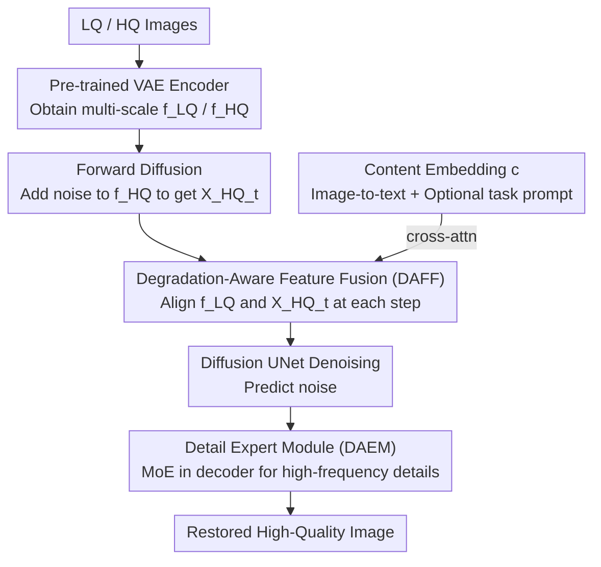

# UniLDiff: Unlocking the Power of Diffusion Priors for All-in-One Image Restoration

**Conference**: CVPR 2026  
**Paper**: [CVF Open Access](https://openaccess.thecvf.com/content/CVPR2026/html/Cheng_UniLDiff_Unlocking_the_Power_of_Diffusion_Priors_for_All-in-One_Image_CVPR_2026_paper.html)  
**Area**: Image Restoration / Diffusion Models  
**Keywords**: All-in-One Image Restoration, Latent Diffusion Models, Degradation-Aware Feature Fusion, Detail Expert Module, MoE

## TL;DR
UniLDiff constructs a unified image restoration framework using Stable Diffusion XL as a backbone. It employs "Degradation-Aware Feature Fusion (DAFF)" to dynamically inject low-quality features into the diffusion trajectory at each denoising step and a "Detail Expert Module (DAEM)" in the decoder via MoE to recover high-frequency details lost during VAE compression. It achieves SOTA perceptual quality in multi-task, composite degradation, and zero-shot real-world degradation scenarios.

## Background & Motivation
**Background**: Traditional image restoration (denoising, deraining, dehazing, etc.) mostly follows a "one model per degradation" paradigm, leading to poor generalization and high deployment costs. Consequently, All-in-One Image Restoration (AiOIR) has emerged. Recent AiOIR methods generally follow two paths: adding task-specific structures/MoE/contrastive learning to CNNs/Transformers, or leveraging the strong generative priors of Latent Diffusion Models (LDM).

**Limitations of Prior Work**: Existing methods rely heavily on **pre-defined degradation types and rigid priors**. Diffusion-based methods often condition on global prompts—text prompts provide only global semantics lacking spatial localization, while visual prompts rely on pre-trained degradation encoders assuming known and spatially uniform degradation. However, real-world degradation is often **composite, spatially heterogeneous, and unlabeled**, making global prompts unable to locate fine-grained local degradation. Furthermore, LDM suffers from texture loss and structural blurring due to the high compression ratio of the VAE encoder and the progressive nature of iterative sampling.

**Key Challenge**: There is a mismatch between "global prompt conditions" and "local heterogeneous degradation." Simultaneously, a fundamental conflict exists between "high compression in latent space" and "detail fidelity."

**Goal**: To enable diffusion models to **perceive and adapt to diverse/composite degradations** while **recovering high-frequency details** lost during compression, without relying on pre-defined degradation labels.

**Key Insight**: Instead of packing LQ information into a global prompt, it is treated as a **dynamic guidance signal that evolves across the denoising trajectory**, directly injected into the UNet. Detail issues are addressed separately during the decoding stage using an expert network.

**Core Idea**: Explicitly integrate "degradation-awareness" and "detail-awareness" into the diffusion process—DAFF aligns LQ features with the evolving latent at each denoising step, and DAEM supplements details in the decoder using MoE and skip connections.

## Method

### Overall Architecture
UniLDiff is based on Stable Diffusion XL. Low-quality (LQ) and high-quality (HQ) images are passed through a pre-trained VAE encoder to obtain multi-scale features $f^{LQ}$ and $f^{HQ}$. Forward diffusion adds noise to $f^{HQ}$ to obtain $X^{HQ}_t$ at each timestep. Two key modifications are introduced: (1) **DAFF** is inserted into the early layers of the diffusion UNet to align $f^{LQ}$ with the current $X^{HQ}_t$ at **every denoising step**; (2) **DAEM** is added to the VAE decoder to specifically recover high-frequency textures and fine structures. The framework optionally incorporates a content embedding $c$ from an image-to-text model (e.g., GPT-4o) for lightweight cross-attention semantic alignment, though prompts are not mandatory.

### Key Designs

**1. Degradation-Aware Feature Fusion (DAFF): Replacing static LQ injection with time-evolving dynamic alignment**

Directly concatenating $f^{LQ}$ and $X^{HQ}_t$ is problematic: as denoising progresses and $X^{HQ}_t$ approaches the clean HQ representation, a **static $f^{LQ}$** can become interference, damaging structural consistency. DAFF aims to make the fusion intensity dynamically controllable with timestep $t$. Inspired by the cascade structure of FLUX, it uses both double-stream and single-stream blocks.

Double-stream blocks process $f^{LQ}$ and $X^{HQ}_t$ in independent branches, applying LayerNorm and conditional modulation before calculating Q/K/V for joint attention:

$$Q^D_t, K^D_t, V^D_t = \mathrm{concat}[QKV(f^{LQ}),\, QKV(X^{HQ}_t)],\quad A^D_t = \mathrm{softmax}\!\Big(\frac{Q^D_t (K^D_t)^T}{\sqrt{d}}\Big) V^D_t$$

The output is gated and projected back to $X^{LQ}_{t,gate}$ and $X^{HQ}_{t,gate}$, enabling bidirectional interaction where the HQ latent receives degradation guidance while preserving its structural prior. Single-stream blocks concatenate the features into $f^{cat}_t$, normalize, and linearly project them to produce attention triplets and an auxiliary vector $M$. After calculating attention $A^S_t$, it is concatenated with $\phi(M)$ and passed through another linear layer for gated residual alignment:

$$f^{align}_t = f^{cat}_t + g \cdot \mathrm{Linear2}(A^S_t, \phi(M))$$

Where $\phi(\cdot)$ is an activation function and $g$ controls fusion intensity. The double-stream handles **structural decoupled alignment**, while the single-stream ensures **feature coherence and fine-grained modulation**.

**2. Detail Expert Module (DAEM): Recovering compression losses via MoE in the decoder**

To recover fine structures like text or facial contours lost during VAE compression, DAEM is placed in the decoder. It uses Mixture-of-Experts (MoE) to adapt to spatially diverse degradations and uses skip connections to retrieve high-resolution features from the encoder before compression. For each input $x$, a lightweight router performs top-k routing after adding noise:

$$\mathrm{Router}(x) = \text{top-}k\big(\mathrm{Softmax}(Wx + \xi)\big),\quad \xi \sim \mathcal{N}(0, \sigma^2)$$

Each expert $E_i$, built with NAFBlocks of different receptive fields, captures specific local patterns. To maintain global semantic coherence, a shared global branch $S(\cdot)$ with transposed self-attention performs element-wise modulation: $\hat{y}^i_E = E_i(x) \otimes S(x)$.

**3. Two-Stage Unified Training**

The training is split into two phases. **Phase 1 (Degradation Modeling)**: VAE and UNet are frozen; only DAFF is trained to align $f^{LQ}$ with $X^{HQ}_t$. Then the LQ encoder is unfrozen and jointly optimized with DAFF and the denoising network using the standard noise estimation loss $L_{\text{stage-1}} = \|\epsilon - \hat\epsilon_\theta(\sqrt{\bar\alpha_t}x^{HQ}_0 + \sqrt{1-\bar\alpha_t}\epsilon,\, f^{LQ}, c, t)\|_1$. **Phase 2 (Detail Refinement)**: Only DAEM in the decoder is trained using reconstruction loss $L_{recon}$, structural similarity $L_{ssim}$, and a load-balancing loss $L_{aux}$ to prevent expert collapse.

## Key Experimental Results

### Main Results
On a three-task joint training (dehazing, deraining, denoising), UniLDiff leads in perceptual metrics:

| Method | Type | PSNR↑ | SSIM↑ | LPIPS↓ | DISTS↓ | MUSIQ↑ | MANIQA↑ |
|------|------|-------|-------|--------|--------|--------|---------|
| DA-RCOT (TPAMI25) | Non-Diff | **32.60** | **0.9172** | 0.0622 | 0.0574 | 67.82 | 0.6658 |
| DFPIR (CVPR25) | Non-Diff | 32.75 | 0.9162 | 0.0758 | 0.0758 | 67.34 | 0.6679 |
| DiffUIR (CVPR24) | Diff | 31.89 | 0.9010 | 0.0959 | 0.0964 | 67.51 | 0.6570 |
| **Ours** | Diff | 32.18 | 0.9105 | **0.0651** | **0.0639** | **68.89** | **0.7038** |

In zero-shot Under-Display Camera (UDC) restoration, UniLDiff significantly outperforms DiffUIR-L and Unirestore across T-OLED and P-OLED datasets. Efficiency-wise, it takes ~2.05s for 20 steps on an A800, much faster than WeatherDiff (~128s).

### Ablation Study
Ablation of DAFF architecture (Table 6) and components (Table 7):

| Configuration | PSNR↑ | MUSIQ↑ | Description |
|------|-------|--------|------|
| No fusion (baseline) | 23.12 | 41.31 | No LQ injection |
| Double Stream only | 25.84 | 51.02 | Good alignment, unstable fusion |
| **Full DAFF** | **27.14** | **61.35** | Double + Single stream + Timestep modulation |
| DAFF + prompt + DAEM | **30.27** | **63.06** | Full model |

### Key Findings
- **DAEM drives PSNR gains**: Adding DAEM to DAFF increases PSNR from 27.36 to 30.21 (+2.85 dB), indicating that detail recovery is more critical for pixel fidelity than degradation awareness alone.
- **DAFF is more critical than task prompts**: DAFF significantly outperforms prompts in handling local heterogeneous degradations (rain, shadows).
- **Timestep modulation is the soul of DAFF**: Static spatial attention (RSA) performs much worse (24.08 PSNR) than the full DAFF, which modulates fusion intensity over time.
- **Perception vs. Fidelity**: Ours leads in LPIPS/MUSIQ but may trail slightly behind non-diffusion SOTA in PSNR/SSIM.

## Highlights & Insights
- **Dynamic LQ Guidance**: Shifting from "global prompts" to "step-wise dynamic fusion" addresses the fact that as the latent changes, the guidance should too.
- **Divide and Conquer**: Separating degradation alignment (DAFF in latent space) and detail recovery (DAEM in decoder) effectively targets the two inherent weaknesses of LDMs.
- **Embedded Guidance**: Integrating guidance directly into the backbone rather than using external adapters (like ControlNet) simplifies design and improves efficiency.

## Limitations & Future Work
- Inference speed (2s/image) is still slower than few-step models like DiffUIR (3 steps).
- Fidelity metrics (PSNR/SSIM) are lower than non-diffusion SOTA.
- Dependence on the large SD-XL backbone and external content embeddings (GPT-4o) increases resource requirements and potential reproducibility issues.

## Related Work & Insights
- **vs. DA-CLIP / AutoDIR**: These rely on global prompts for uniform degradation; Ours handles composite/heterogeneous cases via DAFF.
- **vs. DiffUIR**: DiffUIR is faster but UniLDiff provides higher quality via refined alignment.
- **vs. PromptIR / AdaIR**: Non-diffusion AiOIR methods have higher PSNR but fail to match the perceptual quality and zero-shot generalization of diffusion priors.

## Rating
- Novelty: ⭐⭐⭐⭐
- Experimental Thoroughness: ⭐⭐⭐⭐⭐
- Writing Quality: ⭐⭐⭐⭐
- Value: ⭐⭐⭐⭐

<!-- RELATED:START -->

## Related Papers

- [\[CVPR 2026\] Degradation-Consistent Test-Time Adaptation for All-in-One Image Restoration](degradation-consistent_test-time_adaptation_for_all-in-one_image_restoration.md)
- [\[CVPR 2026\] Retrieve-to-Restore: Efficient All-in-One Image Restoration with a Retrieval-Based Degradation Bank](retrieve-to-restore_efficient_all-in-one_image_restoration_with_a_retrieval-base.md)
- [\[CVPR 2026\] FAPE-IR: Frequency-Aware Planning and Execution Framework for All-in-One Image Restoration](fape-ir_frequency-aware_planning_and_execution_framework_for_all-in-one_image_re.md)
- [\[CVPR 2025\] Visual-Instructed Degradation Diffusion for All-in-One Image Restoration](../../CVPR2025/image_restoration/visual-instructed_degradation_diffusion_for_all-in-one_image_restoration.md)
- [\[ICLR 2026\] RestoreVAR: Visual Autoregressive Generation for All-in-One Image Restoration](../../ICLR2026/image_restoration/restorevar_visual_autoregressive_generation_for_all-in-one_image_restoration.md)

<!-- RELATED:END -->
