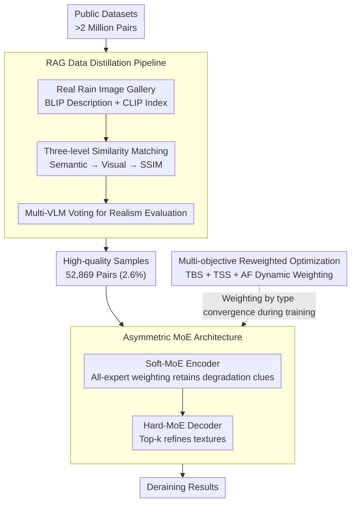

# UniRain: Unified Image Deraining with RAG-based Dataset Distillation and Multi-objective Reweighted Optimization

**Conference**: CVPR 2026  
**arXiv**: [2603.03967](https://arxiv.org/abs/2603.03967)  
**Code**: [https://github.com/QianfengY/UniRain](https://github.com/QianfengY/UniRain)  
**Area**: Image Restoration / Image Deraining  
**Keywords**: Unified Deraining, RAG Data Distillation, Multi-objective Optimization, Mixture of Experts, Day/Night  

## TL;DR

The UniRain unified image deraining framework is proposed, which filters high-quality samples from million-scale public datasets through RAG-driven data distillation. Combined with an asymmetric MoE architecture and a multi-objective reweighted optimization strategy, it achieves consistently superior performance across four degradation types: rain streaks and raindrops (day/night).

## Background & Motivation

1. **Background**: Existing deraining methods are usually designed for specific degradation types (rain streaks, raindrops, night rain, etc.), and their performance drops significantly on other types.
2. **Limitations of Prior Work**: Directly merging all public datasets (>2 million pairs) introduces issues with inconsistent data quality—some datasets have poor background quality or unrealistic synthesis, which interferes with model training. Training different degradation types with the same optimization objective leads to unbalanced learning.
3. **Key Challenge**: Increasing data volume does not simply equate to better generalization. Different degradation types vary in difficulty; during unified training, models tend to overfit easy types (e.g., night rain streaks) while ignoring difficult types (e.g., day raindrops).
4. **Goal**: A high-quality deraining model capable of unified processing for four rain degradation types.
5. **Key Insight**: Use RAG distillation at the data end to filter reliable samples, and employ asymmetric MoE and multi-objective optimization at the model end to balance different types.
6. **Core Idea**: Data quality is more important than data quantity; different degradation types require dynamically balanced optimization strategies.

## Method

### Overall Architecture

UniRain aims to process four rain degradations (day/night × rain streaks/raindrops) using a single model, based on the core judgment that "data quality is more valuable than data quantity, and different degradation types require dynamic balance." The work is split into two components: the **data end** first uses a RAG distillation pipeline to filter million-scale public data into 52,869 high-quality pairs (only 2.6%), ensuring the model is no longer fed with mixed-quality data; the **model end** uses an asymmetric MoE deraining network for reconstruction, with an additional multi-objective reweighting layer during training to dynamically weight the four types according to their respective convergence rhythms. The three designs below correspond to "what data to filter, how to build the network, and how to balance training."

### Key Designs

**1. RAG Data Distillation Pipeline: Using real rain images as reference benchmarks to make synthetic data quality assessment evidence-based.**

Directly merging all public datasets introduces many samples with poor backgrounds or unrealistic synthesis, but "quality" itself lacks an objective scale. The pipeline first constructs a real rain image database—each real image is given a text description via BLIP and indexed using visual features extracted by CLIP. For each candidate image to be filtered, three-level similarity matching is performed with increasing strictness: coarse filtering by semantic similarity (L2 distance of CLIP text encoder outputs), fine filtering by visual similarity (CLIP feature cosine similarity), and finally aligning spatial layout using Structural Similarity (SSIM) to retrieve the closest real reference image. After retrieval, the generation phase begins: the "real reference image + candidate image" are sent to VLMs to evaluate the realism of the candidate, with three VLMs voting and the majority deciding whether it stays. Compared to reference-free blind assessment, using real rain images as anchors makes the judgment of "whether this synthetic image looks like real rain" more reliable, with only 2.6% of data ultimately passing.

**2. Asymmetric MoE Architecture: Using different expert selection strategies for the encoder and decoder as they serve different roles.**

The encoding stage aims to capture various degradation clues as broadly as possible, while the decoding stage aims to precisely reconstruct texture details; the two have opposing requirements for "how to use experts." Consequently, a Soft-MoE is used for the encoder—all experts are combined with continuous weighting, discarding no paths to retain diverse degradation pattern information. A Hard-MoE is used for the decoder—Top-k routing activates only a few most relevant experts to concentrate capacity on fine texture reconstruction. Ablations show that using Soft-MoE for both only yields 27.91 PSNR, whereas this "soft encoding + hard decoding" asymmetric pairing reaches 28.93, confirming that allowing both ends to meet their specific needs is superior to a unified strategy.

**3. Multi-objective Reweighted Optimization Strategy: Dynamically weighting based on the real-time convergence speed of each degradation type to prevent the model from only learning simple types.**

The four degradation types vary in difficulty; unified training with fixed weights causes the model to overfit easy types (e.g., night rain streaks) and neglect difficult ones (e.g., day raindrops). The strategy introduces three collaborative metrics: the Type Balance Score (TBS) scores based on the slope of loss reduction for each type, down-weighting fast-converging types and up-weighting slow-converging types to tilt training resources toward laggards; the Type Stability Score (TSS) punishes types with divergent losses to avoid training instability after up-weighting; the Adaptive Factor (AF) switches between the two as training progresses—TBS dominates early on to promote balance across types, while TSS dominates later to ensure stable convergence. The weight $\omega_i(t)$ for each type $i$ at time $t$ is:

$$\omega_i(t) = \text{AF}(t)\cdot\text{TBS}(t) + (1-\text{AF}(t))\cdot\text{TSS}(t)$$

Thus, weights are no longer manually set constants but are adjusted following the actual learning curves of each type, allowing the losses of all four types to converge more synchronously.

### A Complete Example: How a candidate image is filtered into the training set

Take a synthetic rain image from a public dataset as an example through the distillation pipeline: it is first matched semantically by the CLIP text encoder to pinpoint a set of real images with similar descriptions from the real rain gallery; then, the set is narrowed down to those with the closest visual styles using CLIP visual feature cosine similarity; finally, SSIM is used to align spatial structures, locking onto one most-matching real reference image. This candidate image, along with the reference, is then sent to three VLMs to evaluate realism—if the majority vote it as "close to real rain," it is retained; otherwise, it is discarded. This entire pipeline acts on >2 million original data pairs, ultimately allowing only 52,869 pairs (2.6%) to pass. It is this chain of progressive narrowing and multi-VLM voting that transforms "data quality is more important than data quantity" from a slogan into an executable screening standard.

### Loss & Training

4 × RTX 4090, AdamW, 128×128 crop, batch size 8, 300,000 iterations.

## Key Experimental Results

### Main Results

| Dataset/Type | Metric | Ours | MSDT (Prev. SOTA) | Gain |
|--------------|--------|---------|-------------------|------|
| RainRAG Average | PSNR | 28.93 | 27.94 | +0.99 |
| RealRain-1k-H | PSNR | 33.74 | 30.91 | +2.83 |
| RainDS-real-RD | PSNR | 22.07 | 20.72 | +1.35 |
| WeatherBench | PSNR | 34.25 | 33.56 | +0.69 |

### Ablation Study

| Config | PSNR | SSIM | Description |
|--------|------|------|-------------|
| VLM only (No RAG) | 27.73 | 0.8358 | Lacks real reference |
| No generation stage | 28.36 | 0.8425 | No VLM quality assessment |
| Full Pipeline | 28.93 | 0.8515 | RAG distillation is effective |
| Soft-MoE Enc+Dec | 27.91 | 0.8465 | Pure soft is insufficient |
| Asymmetric MoE | 28.93 | 0.8515 | Optimal combination |

### Key Findings

- Training on all data is actually inferior to training on only 2.6% of distilled data.
- The feature distribution of the distilled dataset is broader and more diverse.
- Multi-objective optimization makes the loss curves of all four types converge more stably.
- The model can be extended to all-weather restoration (rain+snow+fog), achieving 26.01 PSNR, surpassing TransWeather's 24.70.

## Highlights & Insights

- **"Less is More" Data Philosophy**: Superior training results achieved using only 2.6% of the data compared to using the entire dataset.
- **First Application of RAG in Low-level Vision**: Innovatively using RAG technology for dataset distillation rather than model inference.
- **Dynamic Optimization with Three Triple-Collaborative Metrics**: The design of TBS+TSS+AF balances type equilibrium and training stability.

## Limitations & Future Work

- The RAG pipeline relies on VLM evaluation quality; VLMs themselves may have biases.
- The number of experts and Top-k values in the asymmetric MoE require manual tuning.
- Model complexity (FLOPs 126.5G) is lower than some methods but still not considered lightweight.

## Related Work & Insights

- **vs URIR**: URIR is the first unified deraining network but only validated in driving scenarios; UniRain is more general.
- **vs NeRD-Rain**: NeRD-Rain uses implicit neural representations for deraining but does not perform unified multi-type training.

## Rating

- Novelty: ⭐⭐⭐⭐ The combination of RAG data distillation and multi-objective optimization is novel.
- Experimental Thoroughness: ⭐⭐⭐⭐⭐ Multiple datasets + multiple scenarios + comprehensive ablation + weather extension.
- Writing Quality: ⭐⭐⭐⭐ Clear motivation illustrations, systematic ablations.
- Value: ⭐⭐⭐⭐ A practical framework for unified deraining; the data distillation idea can be widely migrated.

<!-- RELATED:START -->

## Related Papers

- [\[CVPR 2026\] EVLF: Early Vision-Language Fusion for Generative Dataset Distillation](evlf_early_vision-language_fusion_for_generative_dataset_distillation.md)
- [\[CVPR 2026\] Toward Real-world Infrared Image Super-Resolution: A Unified Autoregressive Framework and Benchmark Dataset](real_iisr_infrared_image_super_resolution_autoregressive.md)
- [\[CVPR 2026\] Human-Centric Multi-Exposure Fusion: Benchmark and Bi-level Cognition Distillation Framework](human-centric_multi-exposure_fusion_benchmark_and_bi-level_cognition_distillatio.md)
- [\[CVPR 2026\] GDPO-SR: Group Direct Preference Optimization for One-Step Generative Image Super-Resolution](gdpo-sr_group_direct_preference_optimization_for_one-step_generative_image_super.md)
- [\[CVPR 2026\] RAR: Restore, Assess, Repeat - A Unified Framework for Iterative Image Restoration](rar_restore_assess_repeat_a_unified_framework_for_iterative_image_restoration.md)

<!-- RELATED:END -->
