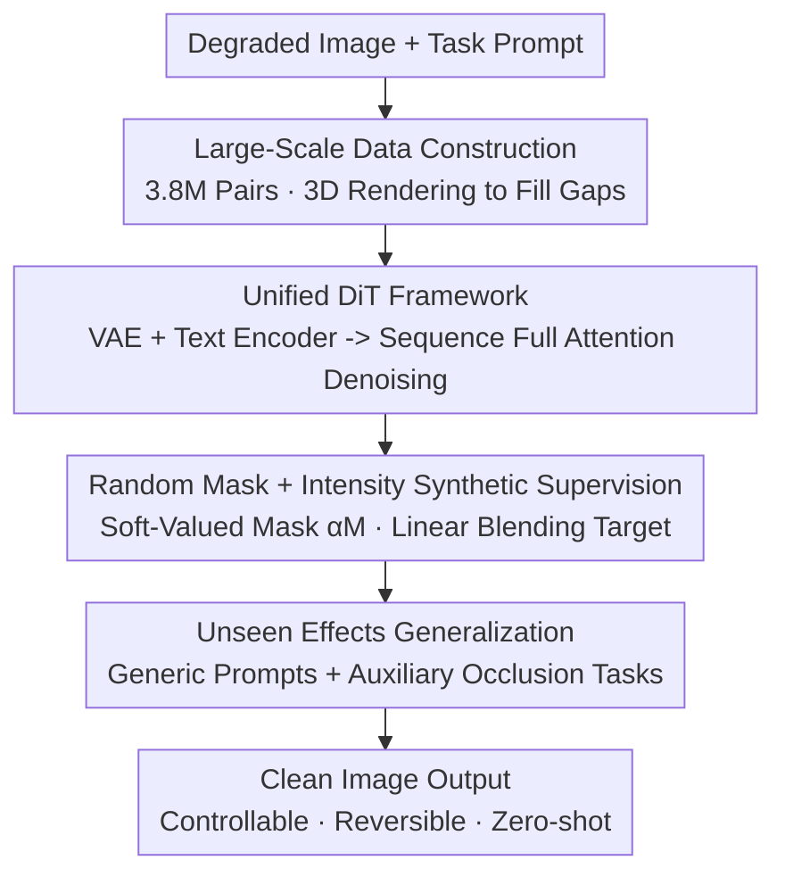

# UniSER: A Foundation Model for Unified Soft Effects Removal

**Conference**: CVPR 2026  
**Paper**: [CVF Open Access](https://openaccess.thecvf.com/content/CVPR2026/html/Zhang_UniSER_A_Foundation_Model_for_Unified_Soft_Effects_Removal_CVPR_2026_paper.html)  
**Code**: https://github.com/Evergreen0929/UniSER-Datasets (dataset only)  
**Area**: Image Restoration  
**Keywords**: Soft effects removal, Diffusion Transformer, Data-driven foundation model, Controllable intensity, Zero-shot generalization

## TL;DR
UniSER unifies four categories of "semi-transparent occlusions"—lens flare, haze, shadow, and reflection—into a single Soft Effects Removal (SER) task. By fine-tuning a Diffusion Transformer on 3.8 million pixel-aligned pairs, it achieves controllable (mask + intensity) and generalizable (zero-shot removal of unseen degradations) high-fidelity effects removal while preserving original scene identity, outperforming both specialized expert models and general large models like Nano Banana with a single unified model.

## Background & Motivation
**Background**: "Soft" degradations such as lens flare, haze, shadow, and reflection are common in real-world photography. They impair visual quality without completely destroying the underlying pixels. Historically, academia has treated these as separate problems—dehazing progressed from Dark Channel Prior to scattering parameter estimation networks, while shadow, flare, and reflection removal each developed their own "expert models" based on physical modeling, layer decomposition, or specialized datasets.

**Limitations of Prior Work**: Expert models are powerful in their respective domains but exhibit **poor scalability and lack shared underlying principles**, leading to failure in extremely diverse, in-the-wild scenarios. Conversely, text-driven general image editing models (e.g., GPT-4o, Flux Kontext, Nano Banana) **rely heavily on meticulously engineered prompts and show unstable performance** on fine-grained soft effects removal tasks. Furthermore, they lack pixel-level control; treating restoration as standard inpainting often alters local structures and destroys object identity, making them unsuitable for professional photo editing.

**Key Challenge**: Expert models are specialized but not general, while general foundation models are versatile but lack precision and fail to maintain identity. Neither paradigm captures the common nature of these degradations.

**Goal**: Propose a unified framework that simultaneously addresses multiple soft effect degradations, delivering expert-level fidelity, foundation model-level generalization, and precise spatial and intensity control for users.

**Key Insight**: The authors observe that despite their varied appearances, lens flare, haze, reflection, and shadow share a fundamental property: they are all **semi-transparent occlusions** that degrade the image without fully obliterating the underlying scene identity. Consequently, these tasks can be naturally unified into a single "occlusion deconstruction" problem.

**Core Idea**: Define a unified and scalable Soft Effects Removal task and follow a "data-centric" approach. By constructing a high-quality dataset of 3.8 million pairs and fine-tuning a DiT to learn robust restoration priors—while incorporating masks and intensities as control conditions—the controllable and generalizable UniSER is derived.

## Method

### Overall Architecture
The core pipeline of UniSER unifies the four types of soft effects removal into a **conditional latent space diffusion reconstruction** task. The inputs consist of a degraded image with soft effects, a task prompt (e.g., "remove haze"), and an optional intensity mask. The output is a clean image with the effects removed while preserving scene identity. The pipeline rests on two pillars: **On the data side**, pixel-aligned datasets from the four tasks are expanded and unified into 3.8 million pairs (using 3D rendering and physical atmospheric modeling to fill structural gaps in public datasets). **On the model side**, drawing inspiration from UniReal, the task is reformulated as "non-consecutive frame generation". A VAE encodes the input image into the latent space, while a text encoder generates instruction embeddings. These components are concatenated with a noisy target latent variable into a sequence fed into a DiT. Utilizing full attention, the DiT iteratively denoises the latent by observing both visual context and text instructions simultaneously, followed by a VAE decoder reconstruction. During training, a synthetic supervision target is generated via "random masks + intensity scalars," allowing the model to learn "where to remove and how much to remove," while facilitating generalization to unseen degradations using generic prompts and auxiliary occlusion tasks.

### Key Designs

**1. 3.8 Million Pairs Data-Centric Unified Supply: Filling Structural Gaps of Expert Datasets using 3D Rendering and Physical Mapping**

UniSER attributes performance bottlenecks to data rather than network architecture. Existing expert methods generalize poorly because public datasets are **highly imbalanced and synthetic**: flare removal lacks large-scale paired datasets, while haze synthesis is mathematically oversimplified. The authors aggregate open-source pixel-aligned data from flare, shadow, haze, and reflection domains, and build upon them via three sources: (1) real photography, (2) 2D synthesis, and (3) 3D rendering. Three custom datasets are introduced as highlights: **HALO**, which renders approximately 70K flare-image pairs in Blender across 78 indoor/outdoor 3D scenes. Unlike Flare7K which simply overlays flare layers, HALO outputs geometrically consistent and physically realistic flares (including reflective flares, glare, glow, and streaks). **LR-SRD** synthesizes 26K realistic shadow pairs by pasting shadow-free objects into backgrounds and generating corresponding shadow versions. **SYN-HAZE** utilizes monocular depth and a physical atmospheric rendering pipeline (controlling visibility, airlight color, scattering, and optical thickness, with procedural noise fields and path blur to model non-homogeneous haze) to synthesize highly realistic dense-haze data. The final balanced distribution of around 3.8M pairs provides the foundation for UniSER to learn content invariance and generalize to in-the-wild scenarios.

**2. Unified DiT Framework: Reformulating Heterogeneous Degradations into a Latent Space Generation Problem of "Semi-transparent Occlusion Deconstruction"**

How can a single model learn the four categories of degradations with vastly different visual outputs? The authors borrow the concept of **non-consecutive frame generation in latent space diffusion** from UniReal. Specifically, a VAE encoder compresses the input image into compact latents, and a text encoder encodes the task prompt into instruction embeddings. These are concatenated with the **noisy target latent variable** into a sequence fed into the DiT. The full attention of the DiT operates across the entire sequence, conditioning on both the visual context and the text instructions to iteratively predict and remove noise from the target latent. Finally, a VAE decoder reconstructs the restored image. The training employs a standard MSE loss on noise prediction with a **timestep-dependent weighting** scheme to balance contributions across noise levels. The crux of this design is that full attention allows the model to leverage generative priors to recover irreversible information in heavily occluded areas (e.g., overexposed flare regions or extremely dense haze) while anchoring onto untouched regions using visual conditioning to maintain identity consistency—a capability general inpainting models lack.

**3. Random Mask + Intensity Synthetic Supervision: Teaching the Model "Where to Remove" and "How Much to Remove" through a Blending Formula without Occlusion Mask Annotations**

Most training datasets **lack occlusion mask annotations**, yet UniSER aims to enable users to perform local editing with arbitrary masks and control intensity via a scalar. The authors elegantly bypass the lack of annotations using a synthetic supervision target. During training, random binary masks $M$ (using combinations of geometric primitives like rectangles and free-form brush strokes to simulate user inputs) are generated, alongside a uniformly sampled intensity scalar $\alpha\in[0,1]$. Rather than conditioning the model on binary masks, a **soft-valued mask** $\alpha M$ is provided, enabling the model to learn that "mask value of 1.0 = full restoration, 0.0 = keep unchanged, and intermediate values = partial removal". The corresponding supervision target is constructed by linearly interpolating between the clean ground truth $I_{gt}$ and the degraded input $I_{input}$ with the same $\alpha M$:

$$I_{target} = \alpha M_{blur}\cdot I_{gt} + (1-\alpha M_{blur})\cdot I_{input}$$

where $M_{blur}$ represents the mask smoothed via dilation and Gaussian blur for natural boundaries. Thus, the model is successfully guided to follow three rules: remove degradations within masked areas based on the given intensity, stay unchanged in non-degraded masked areas, and remain unchanged outside the mask. This coupling of a "soft mask condition + blending target" builds a continuous and intuitive mapping between control inputs and restoration levels, simultaneously addressing the lack of mask annotations and enabling spatial and intensity controls.

**4. Unseen Effects Generalization: Forcing the Model to Learn the Broader Concept of "Occlusion Removal" via Generic Prompts and Auxiliary Tasks**

Training solely on the four predefined categories would cause overfitting to specific vocabulary like "flare, haze, shadow, reflection", and fail on unseen degradations like rain or smudges. The authors employ two complementary fine-tuning strategies to achieve zero-shot generalization: (1) Randomly replacing task-specific prompts with the generic instruction "remove effects" forces the model to capture a **shared "removal" concept** across tasks rather than binding its capability to specific effect names. (2) Introducing an **auxiliary task** constructed using clean images. A randomized mask is applied to overlay semi-transparent or opaque patches onto clean images to synthesize a simulated degradation, and the model is trained to recover the image using only the generic prompt. This structurally tells the model that "any semi-transparent or opaque occlusion should be removed," cultivating a broader concept of "removing arbitrary occlusions" and allowing zero-shot removal of unseen degradations such as rain or smudges. Furthermore, due to the symmetric framework, simply **reversing the roles of input and target** during inference allows the same model to add or enhance effects on clean images, controlled by masks and intensity scalars.

## Key Experimental Results

### Main Results
The evaluation spans four tasks across eight standard benchmarks (Flare: Flare7K; Shadow: SRD, ISTD+, WSRD+; Haze: SOTS, HSTS; Reflection: SIR2, Nature20) using full-reference metrics (PSNR, SSIM). In addition, performance in real-world scenarios is assessed on 39 in-the-wild images using no-reference metrics (LIQE, Contrast gain) and QwenQA (removal percentage scored by Qwen2.5-VL-72B). The table below lists the full-reference results of the unified UniSER vs. task-specific expert models (excerpt):

| Task / Dataset | Metric | UniSER | Representative Expert SOTA | Conclusion |
|--------------|------|--------|--------------|------|
| Flare Flare7K | PSNR | 27.34 | Uformer 26.98 / Difflare 26.06 | Highest PSNR |
| Haze HSTS | PSNR / SSIM | 32.17 / 0.962 | MSFNet 31.03 / 0.931 | Best on both metrics |
| Shadow SRD | PSNR / SSIM | 34.16 / 0.971 | StableShadowDiff 33.63 / 0.968 | Best |
| Shadow ISTD+ | PSNR | 35.59 | StableShadowDiff 35.19 | Best |
| Reflection SIR2 | PSNR / SSIM | 25.98 / 0.911 | L-DiffER 25.18 / 0.911 | Best PSNR |

In the more challenging in-the-wild no-reference evaluation (Table 2), UniSER beats both expert and general foundation models across almost all four tasks. For instance, in QwenQA (removal percentage, higher is better): Flare is 92.7 (second best: Seedream 4.0 73.6 / Nano Banana 71.8), Shadow is 65.0 (second best: 36.3), Haze is 60.0 (second best: 52.7), and Reflection is 75.6 (second best: 56.7). Most LIQE and Contrast gain metrics are also optimal. While expert models fail to clean out-of-domain images completely or introduce artifacts, general large models suffer from severe identity drift.

### Ablation Study
The core ablation study compares Joint Task Learning (JTL, complete UniSER) with Single-Task Learning (STL, training separate models) (Table 4):

| Configuration | Flare Flare7K | Haze HSTS | Shadow ISTD+ | Reflection SIR2-wild | Notes |
|------|-------------|---------|-----------|---------------|------|
| STL (Single-Task) | 27.18 / 0.890 | 31.91 / 0.963 | 35.43 / 0.963 | 26.40 / 0.876 | One model trained individually per task with identical architecture |
| JTL (Complete Model) | 27.34 / 0.891 | 32.17 / 0.962 | 35.59 / 0.964 | 27.44 / 0.918 | Unified training across all four tasks |

(Format: PSNR / SSIM)

### Key Findings
- **Joint training consistently outperforms single-task training**: JTL is non-inferior to STL on all benchmarks of the four tasks, with the most notable improvement in reflection removal (SIR2-wild) (PSNR 26.40 -> 27.44, SSIM 0.876 -> 0.918). This validates the core hypothesis: the four soft effects share the nature of "semi-transparent occlusion", and the unified representations learned jointly benefit each individual task rather than conflicting with one another.
- **Data is the primary driver of generalization**: UniSER achieves parity with or slightly outperforms experts on standard benchmarks after in-domain fine-tuning, but its advantage in the wild is significantly larger than on standard datasets. This indicates that the "content invariance and robust priors" brought by the 3.8M dataset are key to its superior generalization.
- **Zero-shot generalization holds true**: The model successfully performs zero-shot removal of unseen degradations such as rain and smudges (Fig. 5d). This confirms that "generic prompts + auxiliary occlusion tasks" successfully generalize the model's capacity from predefined categories to "removing arbitrary occlusions."

## Highlights & Insights
- **The conceptualization of "semi-transparent occlusion" is elegant**: Unifying lens flare, haze, shadow, and reflection—which outwardly appear unrelated—into SER based on the properties "semi-transparent, reversible, and preservative of identity" forms the core of this paper. This unification enables shared data and model architectures, naturally unlocking generalization properties.
- **The soft value mask + linear blending target designs are readily reusable**: Conditioning on $\alpha M$ and using the same $\alpha M$ to interpolate and synthesize the supervision target enables the model to simultaneously learn "where to remove" and "how much to remove" without mask annotations. This approach of "coupling control signals and supervision targets using the same parameter" can be easily migrated to other controllable generation or editing tasks requiring continuous intensity adjustments.
- **Another solid case of data-driven triumphs over structural innovation**: The core model inherits UniReal's DiT directly. The actual effort is spent on data (3D rendered flare, physical modeling of haze, synthesized shadow pairs) and supervision design. This serves as a reminder to the image restoration and editing community that performance bottlenecks often lie in the data distribution rather than the network design.
- **Symmetry in restoration and synthesis**: Simply swapping input and output roles switches the model's functionality from "removal" to "addition", providing both a data augmentation tool and a creative utility within a single model.

## Limitations & Future Work
- **Acknowledged Limitations**: High computational overhead and intensive training resource requirements. Retraining a DiT-based foundation model on 3.8M pairs is costly.
- **Moderate advantages on standard benchmarks**: On in-domain standard datasets, UniSER mostly "matches or marginally outperforms" expert models (and sometimes requires fine-tuning), whereas its actual advantage is fully realized in-the-wild. Consequently, judging solely by traditional PSNR/SSIM metrics underrepresents its value as a foundation model, prompting the authors to adopt perceptually closer metrics like QwenQA.
- **Code/weights availability**: Currently, only the dataset repository is public, while the training code and weights remain unreleased, limiting reproducibility.
- **Evaluation relies on large vision models**: The in-the-wild QwenQA score is generated by Qwen2.5-VL-72B. VLM evaluations present inherent biases and should be treated with caution when performing horizontal comparisons.
- **Potential Improvements**: Distill or accelerate the DiT to reduce inference costs, or explore extending the "semi-transparent occlusion" framework to broader degradations like motion blur and noise.

## Related Work & Insights
- **vs. Expert Models (Dehazeformer, ShadowFormer, Difflare, DSRNet, etc.)**: Expert models perform strongly within their domains but collapse out-of-domain and in-the-wild. UniSER handles all four tasks with a single model while maintaining SOTA-level accuracy, excelling in generalization and controllability at the expense of training cost.
- **vs. General Image Editing Models (GPT-4o, Flux Kontext, Nano Banana, Seedream 4.0)**: General models are highly capable but show instability on fine-grained restoration, rely heavily on prompt tuning, and suffer from severe identity drift (red circles in Fig. 4). UniSER anchors identity using pixel-level mask and intensity controls, vastly outperforming them on the QwenQA metric (e.g., Flare: 92.7 vs 71.8).
- **vs. All-in-One Multi-Degradation Restoration ([12, 52, 56], etc.)**: Previous all-in-one studies attempted to address multiple degradations within a single framework but suffered from limited scalability and robustness in extremely diverse real-world settings. UniSER scales the problem to a foundation-model level (3.8M pairs + DiT), highlighting that "data scale + semi-transparent occlusion unification" is the key breakthrough.
- **vs. UniReal**: The architectural backbone directly borrows UniReal's "non-consecutive frame generation" paradigm. UniSER's contributions are not in structure, but rather in adapting it to the SER task, providing curated datasets, and designing mask/intensity-based supervision.

## Rating
- Novelty: ⭐⭐⭐⭐ The perspective of unifying four types of degradations under "semi-transparent occlusion" is highly insightful. However, the model backbone is inherited from UniReal, meaning the novelty resides primarily in the task formulation and data.
- Experimental Thoroughness: ⭐⭐⭐⭐ Evaluated robustly across eight benchmarks, in-the-wild cases, and JTL/STL ablation studies. However, the ablation dimensions are slightly constrained (lacking studies on data scale or individual control component deconstruction).
- Writing Quality: ⭐⭐⭐⭐ The motivation and core concepts are clearly articulated, and diagrams are intuitive.
- Value: ⭐⭐⭐⭐ A highly practical controllable effects-removal foundation model with 3.8M open-sourced pairs, delivering real-world value for image editing and restoration pipelines.

<!-- RELATED:START -->

## Related Papers

- [\[CVPR 2026\] FoundIR-v2: Optimizing Pre-Training Data Mixtures for Image Restoration Foundation Model](foundir-v2_optimizing_pre-training_data_mixtures_for_image_restoration_foundatio.md)
- [\[CVPR 2026\] Language-Guided One-Step Diffusion Model for Nighttime Flare Removal](language-guided_one-step_diffusion_model_for_nighttime_flare_removal.md)
- [\[CVPR 2025\] SoftShadow: Leveraging Soft Masks for Penumbra-Aware Shadow Removal](../../CVPR2025/image_restoration/softshadow_leveraging_soft_masks_for_penumbra-aware_shadow_removal.md)
- [\[CVPR 2026\] Restore, Assess, Repeat: A Unified Framework for Iterative Image Restoration](restore_assess_repeat_a_unified_framework_for_iterative_image_restoration.md)
- [\[CVPR 2026\] Flickerformer: A Duet of Periodicity and Directionality for Burst Flicker Removal](it_takes_two_a_duet_of_periodicity_and_directionality_for_burst_flicker_removal.md)

<!-- RELATED:END -->
