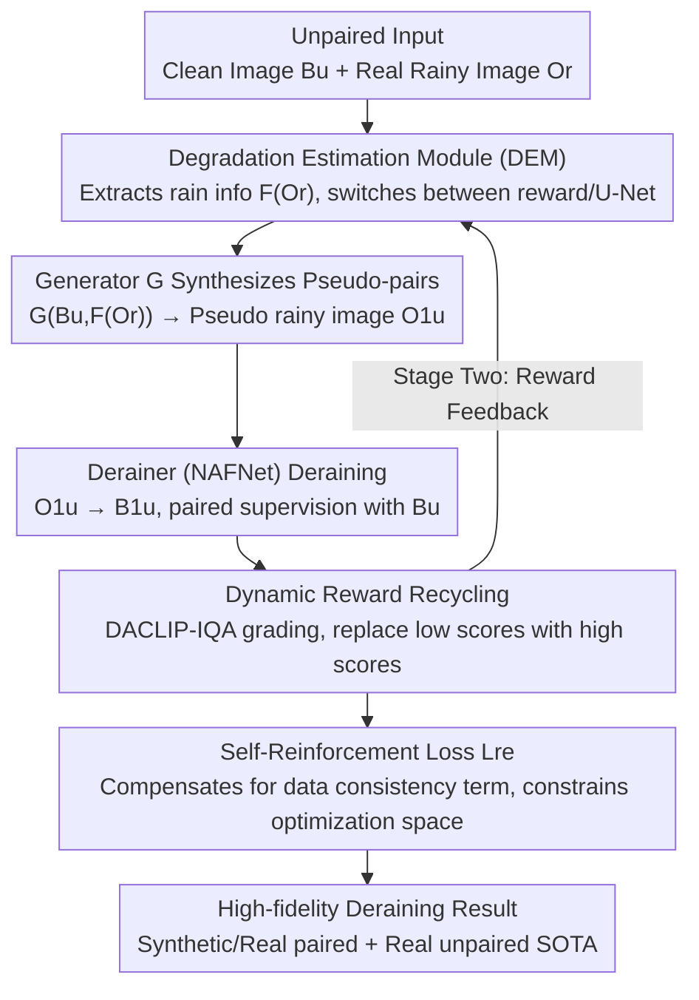

# Unpaired Image Deraining Using Reward-Guided Self-Reinforcement Strategy

**Conference**: CVPR 2026  
**Paper**: [CVF Open Access](https://openaccess.thecvf.com/content/CVPR2026/html/Chen_Unpaired_Image_Deraining_Using_Reward-Guided_Self-Reinforcement_Strategy_CVPR_2026_paper.html)  
**Code**: None  
**Area**: Image Restoration / Image Deraining  
**Keywords**: Unsupervised Deraining, Self-Reinforcement, VLM-IQA, Reward Recycling, Pseudo-paired Data

## TL;DR
To address the lack of paired supervision and the unconstrained optimization space in unsupervised image deraining, this paper proposes RGSUD. During training, a Vision-Language Model-based perceptual quality evaluator (DACLIP-IQA) is leveraged to "recycle" occasionally emergent high-quality derained results as rewards. These rewards are then utilized to simultaneously improve pseudo-paired data synthesis and construct a self-reinforcement loss that serves as a data consistency term. This constrains the optimization space and achieves state-of-the-art unsupervised performance on synthetic/real paired and real unpaired datasets.

## Background & Motivation

**Background**: Image deraining has evolved along two paths. Supervised methods (MPRNet, Restormer, DRSformer, NeRD-Rain) rely on paired training data ("synthetic rainy image - clean image") and achieve high metrics. However, synthetic data is mostly human-made, and the variety of real-world rain far exceeds synthetic distributions. Consequently, supervised models often suffer significant performance degradation when transferred to real scenes. Unsupervised deraining learns rain distribution directly from unpaired real rainy/clean images, showing stronger generalization, but suffers from much greater training difficulty.

**Limitations of Prior Work**: The core difficulty of unsupervised deraining lies in the **lack of explicit constraints in both domains**—there is neither supervision on "what the clean image corresponding to this rainy image looks like" nor stable rain degradation modeling, making the optimization under-constrained. Consequently, networks struggle to converge, yielding unstable results. Existing unsupervised methods (CycleGAN-based, contrastive learning-based DCD-GAN/NLCL, channel consistency prior-based CSUD) mainly rely on various regularization terms, but alignment with real clean images remains a persistent challenge.

**Key Challenge**: Unsupervised tasks inherently lack a "data consistency term", which is the $\|B-\mathcal{F}_\theta(O)\|^2$ term in the MAP framework—it cannot be formulated without ground truth (GT). Various methods can only stack regularizations (adversarial loss is equivalent to a regularization term), which fail to provide a clear optimization trajectory, resulting in slow convergence and poor alignment.

**Key Insight**: The authors discover an overlooked phenomenon from the training curves (Fig. 1a): **high-quality derained results occasionally emerge during unsupervised training**, but they are transient and left unutilized. These intermediate products are actually a form of implicit supervision. The key question is how to reliably identify "which intermediate result is of high quality." Traditional PSNR is inapplicable without GT, whereas Fig. 1b shows that DACLIP-IQA (a vision-language model-based metric) can provide no-reference perceptual scores consistent with human perception, successfully distinguishing different degrees of degradation and deraining.

**Core Idea**: This paper adapts the "reward-guided strategy" from reinforcement learning. Using VLM-IQA as the evaluator, the framework continuously **recycles** the highest-rated derained results during training as rewards. These rewards are then fed back into the optimization process: on one hand, they help synthesize more realistic pseudo-paired data; on the other hand, they construct a self-reinforcement loss to fill the missing data consistency term. This "constrains" the optimization space and drives convergence toward high-fidelity deraining results.

## Method

### Overall Architecture

RGSUD is a GAN-based unpaired deraining framework consisting of four components: **Derainer** (using NAFNet), **DEM** (Degradation Estimation Module, a U-Net + a switch), **Generator G** (a ResNet with 6 residual blocks), and **Discriminator D** (PatchGAN). The workflow operates as follows: given unpaired clean images $B_u$ and real rainy images $O_r$, it first synthesizes pseudo-paired rainy images, then performs deraining, and employs a reward pool to accumulate high-quality intermediate results to guide training.

The core data flow is $B_u\in B \to O^1_u\in O \to B^1_u\in B$: Generator $G$ converts a clean image $B_u$ into a rainy image $O^1_u$ based on the rain degradation extracted from a real rainy image $O_r$ (i.e., $G(B_u, F(O_r))\to O^1_u$, where $F(\cdot)$ represents the degradation information extracted by DEM). The Derainer then restores $O^1_u$ back to the clean domain as $B^1_u$. Thus, $(B_u, B^1_u)$ forms a pseudo-paired pair which can be directly supervised by PSNR/SSIM losses.

Training is split into two stages: **Stage 1** (black data flow) performs normal adversarial training, while "Recycling" continuously stores high-quality derained results in the reward pool (rewards are detached from backpropagation and do not contribute to gradients). The DEM switch is toggled to the black endpoint (extracting rain information via U-Net). **Stage 2** (black + orange data flows) introduces self-reinforcement constraints on top of the Stage 1 weights. The DEM switch is toggled to the orange endpoint—directly using the rewards as clean features while dynamically updating the rewards throughout training until deraining performance plateaus.

### Key Designs

**1. Dynamic Reward Recycling Mechanism: Using VLM-IQA as a No-reference Evaluator to Store Transient Good Results into a Reward Pool**

Since unsupervised training lacks GT, full-reference metrics like PSNR cannot be calculated, making it impossible to determine "which intermediate derained result is of high quality and worth keeping." This paper leverages the zero-shot IQA capability of a pre-trained VLM (DACLIP-IQA $\Psi(\cdot)$) to assign perceptual scores. The specific pipeline (Algorithm 1) is: for a rainy image dataset $D_r=\{x_i\}$, each image yields a derained result $x_i^{rec}=\mathrm{Der}(x_i)$ via the Derainer. Perceptual scores are evaluated for both the new result and the corresponding prior reward $x_i^r$ in the pool: $z_{rec}=\Psi(x_i^{rec})$ and $z_r=\Psi(x_i^r)$. If $z_{rec}>z_r$, the new result replaces the old reward in the pool; otherwise, the old one is retained. Thus, the reward pool consistently holds the "highest-quality derained images seen so far," dynamically updated during training (as shown in Fig. 2b, where 0.65/0.43 are dropped, and 0.88 replaces 0.79). DACLIP-IQA is selected over MUSIQ/NIMA because ablation studies (Table 7) show it provides the most accurate discrimination of deraining quality, leading to the highest PSNR—the quality of the rewards directly determines the performance ceiling of the entire mechanism.

**2. Degradation Estimation Module (DEM): Using Rewards as Clean Features to Bypass U-Net, Achieving More Accurate Rain Representation for Synthesizing Pseudo-paired Data**

To render a clean image $B_u$ into a rainy image, one must first identify "what the rain looks like." The traditional approach is to feed a real rainy image $O_r$ into a U-Net within DEM to extract clean features, and then compute the rain information $F(O_r)$ through a residual (rainy image minus clean features). The problem is that the clean features extracted by U-Net are often inaccurate, leading to imprecise rain information and low-quality synthesized pseudo-rainy images. The key design of this paper is to switch the DEM input to the reward pool in Stage 2: **directly using the high-quality derained results from the reward pool as the "clean features"**, bypassing the U-Net. Since the rewards are the current optimal outputs from the NAFNet derainer, which possesses restore capabilities far superior to U-Net, the rain information computed via residuals is much more precise. This in turn synthesizes higher-quality pseudo-paired data that boosts performance via the loss in Eq. (6)—more accurate rewards $\to$ more accurate rain information $\to$ better pseudo-paired data $\to$ stronger deraining capability $\to$ higher-quality rewards, establishing a stable and reliable gain loop.

**3. Self-Reinforcement Loss: Treating Recycled Rewards as the Missing "Data Consistency Term" to Provide a Clear Trajectory for Under-constrained Optimization**

This design addresses the core challenge of "lack of data consistency in unsupervised learning." The authors formulate supervised deraining as a MAP problem $\max_\theta p(\theta|O,B)\propto \max_\theta p(B|O,\theta)\cdot p(\theta)$, equivalent to the following minimization:

$$\arg\min_\theta \underbrace{\|B-\mathcal{F}_\theta(O)\|_F^2}_{\text{Data Consistency}}+\lambda\underbrace{P(\theta)}_{\text{Regularization}}$$

In unsupervised tasks, the adversarial loss can be viewed as a regularization term $P(\theta)$, while the data consistency term is entirely missing due to the absence of GT $B$. This lacks explicit constraints. This paper proposes using the recycled reward $B_{rw}$ to substitute for the missing clean reference:

$$\mathcal{L}_{re}=\|B_{rw}-B_r\|_F^2$$

which directly pulls the derained output $B_r$ toward high-quality rewards. Compared to prior unsupervised methods relying solely on regularizations, this term provides a clear optimization trajectory and higher fidelity, ensuring precise alignment of reconstructed results with the clean distribution. The total loss is the sum of the two stages: $\mathcal{L}_{total}=\mathcal{L}_{s1}+\lambda_2\mathcal{L}_{re}$, where the stage one loss $\mathcal{L}_{s1}=\min_G\max_D \mathcal{L}_{adv}+\lambda_1\mathcal{L}_{Der}$ contains the sum of four adversarial losses $\mathcal{L}_{adv}$ and the pseudo-pair loss $\mathcal{L}_{Der}=\mathcal{L}_{PSNR}(B_u,B_u^1)+\mathcal{L}_{SSIM}(B_u,B_u^1)$.

**4. Two-Stage Training Paradigm: Unsupervised Reward Accumulation Followed by Constrained Self-Reinforcement to Avoid Degradation Pollution During Cold Start**

The quality of rewards dictates the overall performance. At the beginning of training, derained results are poor and rewards are unreliable; introducing them as constraints immediately would misguide the model. Therefore, the authors split training into a "recycling stage" and a "self-reinforcement stage." Stage 1 conducts conventional unpaired adversarial training where rewards are detached and collected without generating gradients, allowing the network to build basic capabilities and gather good samples. Stage 2 activates the self-reinforcement loss and switches the DEM input to the rewards, allowing gradients to update dynamically until performance saturates. This order of accumulation before constraint ensures that rewards are sufficiently high-quality when entering the reinforcement phase, ensuring the gain loop functions correctly. This is validated by the ablation study on NLCL, where the SR strategy yielded almost no improvement due to poor initial deraining and unreliable rewards.

### Loss & Training

PyTorch + 4×V100; Adam ($\beta_1=0.9,\beta_2=0.999$), initial learning rate $2\times10^{-4}$; training images randomly cropped into $256\times256$ unpaired patches; weights $\lambda_1=1.0$, $\lambda_2=0.8$. When applying the SR strategy as a plug-in to other unsupervised methods, only 3 hours of additional training are required.

## Key Experimental Results

### Main Results

Evaluation using PSNR/SSIM on 7 paired datasets (synthetic Rain100L/Rain200L/DID-Data/DDN-Data + real SPA-Data/RealRain1K-L + night-time Night-Rain). RGSUD significantly outperforms other unsupervised methods on most datasets and remains highly competitive on night-time datasets, with some metrics even approaching supervised methods.

| Dataset (PSNR↑/SSIM↑) | CSUD (CVPR25) | DCD-GAN | RGSUD (Ours) | Gain over CSUD |
|---|---|---|---|---|
| Rain100L | 33.28 / 0.954 | 31.82 / 0.941 | **34.41 / 0.967** | +1.13 dB |
| Rain200L | 33.31 / 0.959 | 31.37 / 0.934 | **33.89 / 0.961** | +0.58 dB |
| DDN-Data | 28.92 / 0.882 | 28.66 / 0.878 | **29.59 / 0.898** | +0.67 dB |
| SPA-Data (Real) | 34.78 / 0.949 | 34.16 / 0.943 | **35.50 / 0.957** | +0.72 dB |
| RealRain1K-L (Real) | 32.71 / 0.959 | 30.49 / 0.939 | **32.88 / 0.955** | +0.17 dB |
| Night-Rain | 29.90 / 0.879 | 28.68 / 0.867 | **30.54 / 0.897** | +0.64 dB |

On no-reference perceptual metrics (CLIP-IQA, MUSIQ, Q-Align, DeQA-Score) and real unpaired datasets (SIRR, Real3000), RGSUD consistently outperforms other unsupervised methods. Specifically, DACLIP-IQA score (lower is better) on Real3000 is 0.018 vs. CSUD's 0.042, demonstrating superior generalization.

### Ablation Study

| Configuration | Rain100L PSNR | RealRain1K-L PSNR | Description |
|---|---|---|---|
| w/o SR strategy (baseline) | 33.04 | 31.31 | Adversarial + pseudo-paired only |
| **w/ SR strategy (Full)** | **34.41 (+1.37)** | **32.88 (+1.57)** | Reward recycling + self-reinforcement added |

| IQA Selection (Table 7, Rain100L PSNR) | Score | Meaning |
|---|---|---|
| MUSIQ | 33.56 | Average discriminative power |
| CLIP-IQA | 33.67 | Slightly better |
| **DACLIP-IQA** | **34.41** | Most accurate discrimination, final choice |

The SR strategy is also effective when added as a plug-in to other derainers/methods: replacing Derainer (Table 5) on NeRD-Rain yields Rain200L +0.78 dB, DRSformer +0.69 dB, Restormer +0.42 dB; as a plug-in to DCD-GAN/CSUD (Table 6), it yields +0.41/+0.68 dB on Rain100L, respectively.

### Key Findings

- **SR strategy is the primary driver of performance gain**: Removing it on RealRain1K-L results in a 1.57 dB drop, showing that "reward recycling + self-reinforcement constraint" yields the highest benefits for real-world complex rain.
- **The choice of reward evaluator is crucial**: DACLIP-IQA outperforms MUSIQ by nearly 0.85 dB—the quality of the rewards directly sets the ceiling of the closed loop, and lower-quality IQA can misguide the entire mechanism.
- **Strong transferability**: Improvements are observed across different derainers (Restormer/DRSformer/NeRD-Rain/NAFNet) and different unsupervised frameworks, indicating that the SR strategy is a general plug-in rather than tied to a specific network.
- **Cold start is a weakness**: On NLCL, where initial deraining is poor and rewards are unreliable, the SR strategy provides minimal improvement, proving that the closed loop cannot function without high-quality early rewards.

## Highlights & Insights

- **Recycling "occasionally emergent good results during training" as implicit supervision** is a clever observation. While others design rigid regularization constraints, this paper looks from another angle: high-quality intermediate results have always appeared, but we lacked an evaluator to identify them without GT, which VLM-IQA successfully addresses.
- **Formalizing the missing data consistency term from a MAP perspective and substituting it with rewards** frames the challenge of unsupervised learning as a clear mathematical omission. The self-reinforcement loss $\|B_{rw}-B_r\|^2$ directly compensates for this omission, making the logical loop clean and robust.
- **Replacing U-Net features with rewards in DEM** creates a transferable gain loop: any unpaired restoration task (dehazing, denoising, low-light enhancement) that estimates degradation before data synthesis can adopt the approach of using the current optimal output as the clean reference.
- **The SR strategy is an out-of-the-box plug-in**, requiring only an additional 3 hours of training to improve existing unsupervised methods, indicating high engineering value.

## Limitations & Future Work

- The authors acknowledge that when initial deraining results are poor, rewards become unreliable, directly dragging down the subsequent SR strategy (producing almost no improvement on NLCL). The method relies on a "sufficiently good starting point" and is unfriendly to extremely weak baselines.
- The framework relies heavily on the quality of perceptual scores from VLM-IQA (DACLIP-IQA). If IQA fails in certain degradations/scenes, systematic bias will be introduced into the rewards; ablation studies confirm that inferior IQA leads directly to a drop in performance.
- The reward pool must be maintained and evaluated for every training sample, meaning training overhead and GPU memory will scale up with dataset size; a detailed efficiency analysis on large-scale datasets is missing.
- The validation is primarily conducted on deraining. Although claimed to be generalizable to tasks using the "degradation estimation then synthesis" paradigm, empirical evidence for other degradation types (e.g., dehazing/denoising hybrid degradation) remains to be demonstrated.

## Related Work & Insights

- **vs CSUD (CVPR2025)**: CSUD relies on channel consistency prior as an unsupervised constraint, while this paper uses VLM-IQA reward recycling + self-reinforcement loss. The distinction is that this paper explicitly compensates for the missing data consistency term rather than relying on pure priors/regularizations, leading to a PSNR gain of ~0.6–1.1 dB across multiple datasets.
- **vs DCD-GAN / NLCL (CVPR2022)**: They compress the optimization space in the feature domain via contrastive learning, whereas this paper constrains it simultaneously through perceptual rewards and pseudo-paired data; the SR strategy can also be applied to them to yield further performance gains.
- **vs CycleGAN-based unsupervised deraining**: Although both utilize GANs to synthesize pseudo-pairs, this paper introduces a gain loop of "dynamic rewards $\to$ more accurate rain information $\to$ better pseudo-pairs," breaking free from pure cycle-consistency constraints.
- **vs VLM-IQA for Restoration (AutoDIR, CLIP denoising, etc.)**: Previous works mostly utilized VLM knowledge for supervised/automated restoration. This work is the first to introduce VLM-IQA as a dynamic reward source during unsupervised deraining training.

## Rating
- Novelty: ⭐⭐⭐⭐⭐ Intelligently introduces the RL reward concept + VLM-IQA into unsupervised deraining and explains rewards as the missing data consistency term from a MAP perspective. The approach is novel and highly self-consistent.
- Experimental Thoroughness: ⭐⭐⭐⭐⭐ Covers 7 paired + 2 unpaired datasets, multiple IQAs, transferability across different derainers/frameworks, plug-in validation, and downstream tasks.
- Writing Quality: ⭐⭐⭐⭐ The link between motivation, mechanism, and formulation is clear, with great coordination between Fig. 1 and Fig. 2; some notations ($B_r/B_{rw}$) are slightly dense.
- Value: ⭐⭐⭐⭐⭐ The SR strategy is plug-and-play, yields the most significant gains on real complex rain, and serves as an excellent reference for the unsupervised restoration community.

<!-- RELATED:START -->

## Related Papers

- [\[CVPR 2026\] RL-ScanIQA: Reinforcement-Learned Scanpaths for Blind 360deg Image Quality Assessment](rl-scaniqa_reinforcement-learned_scanpaths_for_blind_360deg_image_quality_assess.md)
- [\[CVPR 2026\] UniRain: Unified Image Deraining with RAG-based Dataset Distillation and Multi-objective Reweighted Optimization](unirain_unified_image_deraining_rag_dataset_distillation.md)
- [\[CVPR 2026\] ReasonX: MLLM-Guided Intrinsic Image Decomposition](reasonx_mllm-guided_intrinsic_image_decomposition.md)
- [\[CVPR 2026\] FinPercep-RM: A Fine-grained Reward Model and Co-evolutionary Curriculum for RL-based Real-world Super-Resolution](finpercep_rm_a_fine_grained_reward_model_and_co_evolutionary_curriculum_for_rl_ba.md)
- [\[ICCV 2025\] Blind Noisy Image Deblurring Using Residual Guidance Strategy](../../ICCV2025/image_restoration/blind_noisy_image_deblurring_using_residual_guidance_strateg.md)

<!-- RELATED:END -->
