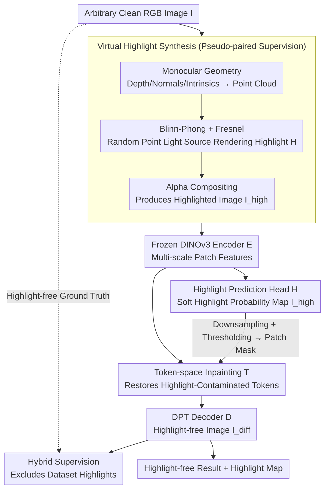

# UnReflectAnything: RGB-Only Highlight Removal by Rendering Synthetic Specular Supervision

**Conference**: CVPR 2026  
**Paper**: [CVF Open Access](https://openaccess.thecvf.com/content/CVPR2026/html/Rota_UnReflectAnything_RGB-Only_Highlight_Removal_by_Rendering_Synthetic_Specular_Supervision_CVPR_2026_paper.html)  
**Code**: https://alberto-rota.github.io/UnReflectAnything (Project Page)  
**Area**: Image Restoration / Highlight Removal  
**Keywords**: Highlight Removal, Specular Reflection, Synthetic Supervision, Token-space Inpainting, Endoscopic Images

## TL;DR
By rendering physically plausible synthetic specular highlights on arbitrary RGB images "out of thin air" using monocular geometry + Blinn-Phong/Fresnel shading, this method trains models without paired data. The model reconstructs specular-occluded tokens in the DINOv3 feature space back to their diffuse reflection states via inpainting, then decodes them into highlight-free images. It achieves competitive to SOTA performance across multiple natural and surgical (endoscopic) datasets.

## Background & Motivation
**Background**: Single-image specular highlight removal is an established problem. Classic methods rely on color priors, color ratios, and dichromatic reflection models to separate diffuse and specular components. Recent learning-based methods (e.g., HighlightNet, SpecularityNet, DHAN-SHR, StableDelight) directly learn diffuse-specular separation from data. Another line of work physically separates the two reflections using dedicated hardware such as polarization cameras or multi-flash setups.

**Limitations of Prior Work**: Highlight removal is inherently ill-posed—the specular component is saturated (pixels are clipped to white), spatially sparse, and entangled with geometry, material, and illumination. The biggest bottleneck for learning-based methods is the **lack of paired supervision data**. It is extremely difficult to acquire paired "with-highlight / without-highlight" images for the same scene. This is especially true in endoscopic surgical scenes where wet tissue and strong, non-uniform illumination generate large areas of intense highlights, making open-source paired specular-free ground truth non-existent. Consequently, synthetic training leads to a domain shift when applied to real or medical domains, often causing over-smoothing or color distortion at highlight boundaries. Although polarization-based methods are effective, they require specialized sensors, limiting their practicality.

**Key Challenge**: Supervision requires paired data, but paired data is almost impossible to obtain in real, especially medical, domains—this creates a deadlock of "wanting to learn but lacking labels."

**Goal**: (1) To remove highlights using only single RGB images without relying on any paired data or polarization hardware; (2) To generalize across two highly distinct domains: natural scenes and surgical environments.

**Key Insight**: Since real paired data is unavailable, **specular highlights are rendered onto arbitrary clean RGB images**. As long as the rendering is physically plausible, the original image naturally serves as its highlight-free ground truth, resolving the pairing issue. The key observation is that highlight shapes are entirely determined by geometry (normals, viewpoints, light sources). Modern monocular geometry estimation is now mature enough to infer depth, normals, and camera intrinsics from a single image, which can then drive a physical shading model to generate believable specular reflections.

**Core Idea**: Leveraging "monocular geometry + Blinn-Phong/Fresnel shading + random lighting" to render synthetic highlights to generate pseudo-paired supervision, and then performing inpainting in the DINOv3 token space to restore highlight-contaminated features to clean diffuse reflections.

## Method

### Overall Architecture
The pipeline consists of two branches. **Offline Supervision Generation**: Given any RGB image $I$, a monocular geometry network estimates depth, normals, and camera intrinsics, which are back-projected into a 3D point cloud with surface normals. A point light source is randomly sampled in camera coordinates, and a highlight intensity map $H$ is rendered using Blinn-Phong + Schlick-Fresnel shading. This map is alpha-composited with the original image to yield the "highlighted" image $I_{high}$. Consequently, $(I_{high} \to I)$ forms a training pair, where $I$ is the highlight-free ground truth. **Forward Highlight Removal**: Taking a real RGB image as input, the model $M$ extracts multi-scale patch features using a frozen DINOv3 encoder $E$. A lightweight highlight prediction head $H$ regresses a continuous highlight probability map $I_{high}$, which is downsampled and thresholded to construct a patch mask. The token inpainter $T$ restores the masked tokens in the feature space into clean diffuse reflection features. Finally, a DPT decoder $D$ decodes the restored multi-scale features into the highlight-free image $I_{diff}$. Formally, $I_{high}=H(E(I))$ and $I_{diff}=D(T(E(I), I_{high}))$.

### Key Designs

**1. Virtual Highlight Synthesis: Rendering physically plausible highlights on arbitrary RGB images to turn "no paired data" into "infinite paired data"**

This is the core masterstroke of the paper. Since real paired data is unavailable, the authors instead use geometry to "draw" highlights onto the image. Given a single image $I$, a pre-trained monocular geometry network (MoGe-2) is utilized to estimate the metric depth $D$, normal $n$, and camera intrinsics $K$. Each pixel $p=(u,v,1)^\top$ is back-projected to camera coordinates $X = D(p)\,K^{-1}p$ to yield a 3D point cloud with normals. A **point light source** $L$ is randomly sampled in camera coordinates (rather than directional light, as endoscopic light sources are located near the camera and require capturing distance attenuation and local highlights). The view and light vector directions are defined as $\mathbf{v}=\frac{\mathbf{X}}{\|\mathbf{X}\|}$ and $\mathbf{l}=\frac{\mathbf{L}-\mathbf{X}}{\|\mathbf{L}-\mathbf{X}\|}$, respectively. The half-angle vector is calculated as $\mathbf{h}=\frac{\mathbf{l}+\mathbf{v}}{\|\mathbf{l}+\mathbf{v}\|}$. The reflection coefficient $R=R_0+(1-R_0)(1-\mathbf{v}\cdot\mathbf{h})^5$ is calculated via Schlick-Fresnel, and the pixel-wise specular intensity is computed using Blinn-Phong shading:

$$\mathbf{H}=K_H\,R\,(\mathbf{n}\cdot\mathbf{h})^S,$$

where $K_H$ controls the overall intensity and $S$ controls the surface glossiness. During training, $K_H$, $S$, and the light source position $L$ are randomly sampled from empirically tuned uniform distributions to generate diverse highlight patterns. Finally, the rendered highlight is composited into the original image using an additive alpha mask: $I_{high}=(1-\mathbf{H})\,\mathbf{I}+\mathbf{H}\,(\mathbf{I}+K_H\,\mathbf{1}_3)$. Because the highlight shapes are constrained by realistic geometry, the rendering results are structurally self-consistent. Paired with the original image, they serve as physically plausible pseudo-paired samples—key to bypassing the scarcity of paired data.

**2. Token-space Diffuse Reflection Inpainting: Reformulating highlight removal as feature-space image completion**

Highlight pixels are saturated and clipped, meaning the original RGB information is lost; direct pixel-space filling easily leads to over-smoothing or hallucinations. The authors address this in the DINOv3 token feature space via inpainting: DINOv3-Large extracts multi-scale tokens $\mathcal{F}=\{F_1,...,F_4\}$ at four depths. The $I_{high}$ output by the highlight prediction head is average-pooled to patch resolution and thresholded based on mean intensity to obtain a patch mask $P$. The tokens to be inpainted are first replaced with a learnable mask token $f_{mask}$, then blended with a local mean prior $F_{mean}$ (computed by channel-wise neighborhood averaging with depthwise convolutions) based on a coefficient $\lambda$, and combined with fixed 2D positional encodings:

$$F_{seed}=P\odot[\lambda f_{mask}+(1-\lambda)F_{mean}]+(1-P)\odot F+E_{pos}.$$

The mask token acts as a semantic placeholder for the "missing content" rather than defaulting to zero; the positional encodings are **additive** (following ViT conventions) to restore the spatial awareness lost after token replacement. $F_{seed}$ goes through six ViT layers to perform self-attention between visible and masked tokens. Finally, the inpainted and original visible tokens are combined: $F_{comp}=P\odot\text{ViT}(F_{seed})+(1-P)\odot F$. Performing this in the feature space allows the model to leverage global semantic context to interpolate a coherent diffuse reflection appearance, which is then decoded to an image by $D$, yielding more robust results than pure pixel-space inpainting.

**3. Hybrid Supervision Excluding "Dataset Highlights": Preventing learning real highlights as white diffuse reflections**

A hidden pitfall is that the original image $I$ used for synthesis is often not completely highlight-free. In particular, endoscopic images are inherently cluttered with real highlights (referred to by the authors as **dataset highlights**, opposed to their rendered synthetic highlights). Treating these saturated pixels as "clean ground truth" for supervision would mislead the network to treat highlights as white diffuse surfaces. The authors use a high-brightness threshold $\tau_L$ (conservatively set to 0.95) to detect dataset highlights, constructing two masks: a supervision mask $m_{sup}$ indicating pixels with trustworthy ground truth (no dataset highlights), and a hole mask $m_{hole}$ marking all areas to be inpainted (the union of synthetic and dataset highlights). Token-level supervision is only applied on their intersection $\mathcal{M}=M_{hole}\cap M_{sup}$ (meaning it needs to be inpainted and has a trustworthy ground truth). The ground-truth token is extracted from the original clean image before adding highlights $F^*=E(I)$, using a loss combining cosine similarity and L1:

$$\mathcal{L}_{inp}=\frac{1}{|\mathcal{M}|}\sum_{i\in\mathcal{M}}\big[\alpha\|F^*_i-F_i\|_1+(1-\alpha)(1-F_i^{*}F_i^{\top})\big].$$

The highlight head $H$ is trained with a weighted sum of soft Dice + L1 + TV losses (Dice addresses class imbalance where highlights only occupy a small area, and TV suppresses noise). The decoder $D$ is pre-trained in an auto-encoding manner (L1 + SSIM) to stabilize the mapping from frozen DINOv3 features to RGB. During fine-tuning, three loss terms are added: a seam loss constrains color and gradient continuity only along a narrow ring at the inpaint boundary $r=\text{dilate}(m_{hole})-m_{hole}$ to eliminate seam lines; a specular loss uses a Charbonnier penalty on overly bright pixels in $I_{diff}$ to prevent resurfacing specular peaks; and a reconstructed RGB loss (excluding dataset highlights). This design of "creating supervision + excluding untrusted pixels" is exactly why the method operates robustly across both natural and surgical domains.

### Loss & Training
- Highlight Head: $\mathcal{L}_H=w_{dice}\mathcal{L}_{dice}+w_{L1}\mathcal{L}_{L1}+w_{TV}\mathcal{L}_{TV}$.
- Token Inpainting: Eq. (8), $\alpha=0.25$.
- Decoder Pre-training (Auto-encoding): $\mathcal{L}_{AE}=\|D(E(I))-I\|_1+(1-\text{SSIM})$.
- Decoder Fine-tuning: Combined Seam + Spec (Charbonnier) + RGB Reconstruction losses.
- Hyperparameters: $R_0=0.04$, $\tau_L=0.95$, $\lambda=0.5$, $\alpha=0.25$, $\tau_m=0.85$, $\epsilon=10^{-6}$. Depth estimation uses MoGe-2, $H$/$D$ use DPT, and the inpainter uses a 6-layer ViT. Training was on 1x A100 (80G), batch size 32, for 50 epochs, with an initial learning rate of $5\times10^{-4}$ linearly decaying every 10 epochs.

## Key Experimental Results

### Main Results
Covers multiple domains: indoor (SCRREAM, HouseCat6D), outdoor (CroMo), and endoscopic (SCARED, Cholec80, StereoMIS). Evaluation is split into two groups based on the availability of diffuse ground truth.

With paired ground truth (PSD/SHIQ/SSHR), full-reference metrics (selected):

| Dataset | Metric | Ours | DHAN-SHR | SpecularityNet |
|--------|------|------|----------|----------------|
| PSD | SSIM ↑ | **0.911** | 0.868 | 0.839 |
| PSD | MSEm ↓ | **0.004** | 0.006 | 0.007 |
| SHIQ | SSIM ↑ | **0.988** | 0.982 | 0.961 |
| SSHR | SSIM ↑ | **0.971** | 0.971 | 0.952 |

Ours is universally optimal in Structural Similarity (SSIM) (best at preserving structures and suppressing residue highlights). However, the authors honestly state that on SHIQ/SSHR, classic baselines show lower MSEm/PSNR, whereas their own PSNR is lower. This suggests that its detail fidelity in non-highlight regions is inferior—"lower global error but slightly weaker details."

No paired ground truth datasets, using LSR (Luminance Suppression Ratio, lower is better) + NIQE (Naturalness, lower is better), selected:

| Domain | Dataset | Metric | Ours | Runner-up |
|----|--------|------|------|------|
| Natural | CroMo | LSR ↓ | **0.012** | 0.028 (EndoSTTN) |
| Natural | SCRREAM | LSR ↓ | **0.002** | 0.039 (EndoSTTN) |
| Surgical | Cholec80 | LSR ↓ | **0.002** | 0.021 (EndoSTTN) |
| Surgical | StereoMIS | LSR ↓ | **0.022** | 0.052 (EndoSTTN) |

Ours leads almost across the board in LSR in both natural and surgical domains (cleanest highlight suppression), while NIQE is comparable or superior to the best baselines. This indicates that highlight suppression does not dim the entire image or disrupt natural statistics.

Downstream validation (relative pose estimation with DISK+LightGlue+MAGSAC++, epipolar error $E_{ep}$↓ / inlier ratio IR↑): This work achieves SOTA on CroMo with $E_{ep}=0.301$, IR=0.997; the advantage is even more consistent in the surgical domain, leading on StereoMIS with $E_{ep}=0.167$, IR=1.000. This indicates that highlight removal indeed improves keypoint localization and geometric alignment, which is particularly beneficial under clinical lighting.

### Ablation Study
> ⚠️ The main camera-ready text does not provide a standalone module ablation table (loss weights and scheduling details are moved to the Supp. Mat.). The table below is a qualitative breakdown of the "consequences of removing/modifying certain designs" compiled from the Discussion and design motivations, rather than numerical ablations in the paper.

| Configuration | Consequence | Explanation |
|------|------|------|
| Without excluding dataset highlights | Model mistakenly learns saturated highlights as white diffuse reflections | $\tau_L$ detection + supervision mask exclusion are key |
| Dynamic token mask to soft mask | Soft highlight regions are only weakly modified, often leaving remnants | Main text states: inpainter heavily relies on binary masks; soft masks fail on low-gradient gradual highlights |
| Replacing point light with directional light | Loss of distance attenuation/local highlights, leading to distortion in endoscopic scenes | Point light sources are designed for near-distance surgical illumination |

### Key Findings
- Designed with a **preference for conservative reconstruction/rejecting hallucinations**: It employs a feed-forward pipeline rather than diffusion. It prefers minimal changes over hallucinated details, which is a major benefit in "fidelity-first" medical scenarios, and is easier to deploy in real-time than diffusion-based methods.
- Cross-domain generalization mainly stems from synthetic supervision rather than real annotations: The same rendering pipeline provides physically plausible pseudo-paired samples for both natural and endoscopic images.
- The token inpainter heavily relies on binary highlight masks, which is currently the most prominent vulnerability.

## Highlights & Insights
- **The "generating supervision" paradigm is highly transferable**: Degradation tasks suffering from a "lack of paired data" (e.g., deraining, reflection removal, shadow removal) can be reformulated as "physically rendering degradation onto clean images." As long as the degradation pattern is determined by estimable geometry/physics, infinite paired samples can be generated out of thin air. This paradigm is more controllable than unpaired adversarial learning like CycleGAN.
- **Inpainting in the feature space** rather than the pixel space, leveraging the semantic context of DINOv3 to fill saturated, lost regions while avoiding the over-smoothing of pixel-space interpolation, is a highly reusable trick.
- **Explicitly excluding dataset highlights** addresses a commonly overlooked pitfall: using "images that already contain highlights" as the highlight-free ground truth self-contaminates training. A conservative threshold + supervision mask directs training signals toward high-confidence patches.

## Limitations & Future Work
- The authors acknowledge: The method is unreliable on transparent/refractive objects (where diffuse and specular reflections are hard to separate); it may degrade structures or resolution in non-highlight regions (lacking explicit edge/high-frequency priors); and the highlight supervision during training relies on an ad-hoc hard threshold, driven primarily by brightness cues and lacking semantic reasoning.
- The token inpainter heavily relies on binary highlight masks and often fails to remove gradual, low-gradient highlights (soft masks)—representing the most tangible failure mode.
- Self-assessment: Its PSNR is relatively low on SHIQ/SSHR, indicating insufficient detail fidelity in non-highlight regions ("low global error but weak local details").
- Future improvements: Relaxing the reliance on brightness cues (incorporating semantic/geometric priors into both training and inference) and adding explicit edge constraints or high-frequency priors to improve detail retention.

## Related Work & Insights
- **vs DHAN-SHR / SpecularityNet (Learning-based Highlight Removal)**: These methods rely on paired or polarized supervision to directly learn separation. Ours bypasses paired data and synthesizes supervision via rendering, achieving more stable SSIM and better generalization across surgical domains, though with slightly inferior individual PSNR and detail preservation.
- **vs StableDelight (Diffusion-based Reflection Removal)**: Diffusion methods often leave remnant glow, excessively dim the entire surgical frame, or introduce local structural inconsistencies. Ours offers a feed-forward, conservative reconstruction that preserves fidelity and is more suitable for real-time medical applications.
- **vs PolarAnything / PolarFree (Polarization Priors)**: These require polarization inputs or synthetic polarization cues. Ours operates on a single RGB image without additional sensor or calibration requirements, providing higher practicality.
- **vs Endo-STTN (Endoscopic Temporal Highlight Removal)**: Endo-STTN requires a binary highlight mask as an explicit query and propagates it temporally. Ours operates on a single image and predicts the mask natively.

## Rating
- Novelty: ⭐⭐⭐⭐⭐ Leveraging geometry-driven physical rendering to generate pseudo-paired supervision nicely bypasses paired data scarcity; the concept is elegant and highly transferable.
- Experimental Thoroughness: ⭐⭐⭐⭐ Validated across multiple domains and datasets, including downstream pose tasks, though the main text lacks a standalone module ablation table (moved to the supplementary material).
- Writing Quality: ⭐⭐⭐⭐ Motivations, pipeline, and formulations are clearly explained, with honest highlighting of its own weaknesses (PSNR tradeoffs and soft-mask failures).
- Value: ⭐⭐⭐⭐ Highly valuable for "paired-ground-truth-free" scenarios like endoscopy. Highlight removal also benefits downstream geometric estimation.

<!-- RELATED:START -->

## Related Papers

- [\[CVPR 2026\] Beyond the Ground Truth: Enhanced Supervision for Image Restoration](beyond_the_ground_truth_enhanced_supervision_for_image_restoration.md)
- [\[CVPR 2026\] Flickerformer: A Duet of Periodicity and Directionality for Burst Flicker Removal](it_takes_two_a_duet_of_periodicity_and_directionality_for_burst_flicker_removal.md)
- [\[CVPR 2026\] GFRRN: Explore the Gaps in Single Image Reflection Removal](gfrrn_explore_the_gaps_in_single_image_reflection_removal.md)
- [\[CVPR 2026\] UniSER: A Foundation Model for Unified Soft Effects Removal](uniser_a_foundation_model_for_unified_soft_effects_removal.md)
- [\[CVPR 2026\] LightRR: A Lightweight Network for Single Image Reflection Removal](lightrr_a_lightweight_network_for_single_image_reflection_removal.md)

<!-- RELATED:END -->
