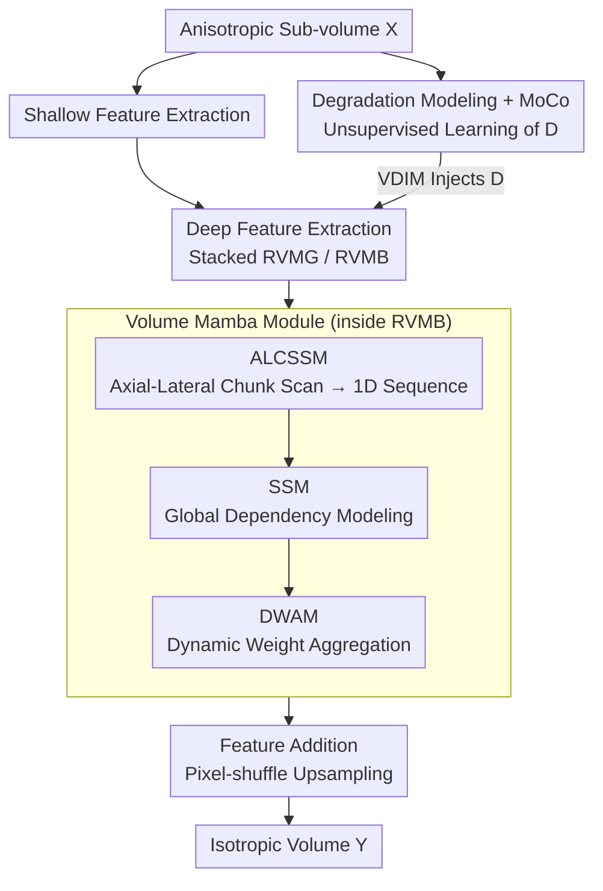

# VEMamba: Efficient Isotropic Reconstruction of Volume Electron Microscopy with Axial-Lateral Consistent Mamba

**Conference**: CVPR 2026  
**Paper**: [CVF Open Access](https://openaccess.thecvf.com/content/CVPR2026/html/Gao_VEMamba_Efficient_Isotropic_Reconstruction_of_Volume_Electron_Microscopy_with_Axial_Lateral_CVPR_2026_paper.html)  
**Code**: https://github.com/I2-Multimedia-Lab/VEMamba  
**Area**: Image Restoration / Volume EM Isotropic Reconstruction  
**Keywords**: Volume Electron Microscopy, Isotropic Reconstruction, Mamba, State Space Models, Self-supervised Degradation Modeling

## TL;DR
VEMamba serves as the first application of Mamba to the isotropic reconstruction of Volume Electron Microscopy (VEM). By employing "Axial-Lateral Chunk-based Selective Scanning (ALCSSM) + Dynamic Weight Aggregation (DWAM)," it rearranges 3D voxel dependencies into 1D sequences for linear-complexity modeling. It incorporates degradation priors via realistic simulation and Momentum Contrast (MoCo). The model achieves SOTA performance on EPFL and CREMI datasets with the lowest parameter count and computational overhead.

## Background & Motivation
**Background**: Volume Electron Microscopy (VEM) is a critical tool for observing nanoscale ultrastructures of cells and tissues in life sciences and clinical diagnosis. However, mainstream methods like serial section transmission electron microscopy (ssTEM) are limited by physical section thickness, producing **anisotropic** volume data—high lateral resolution ($x, y$) but poor axial resolution ($z$) (e.g., 5nm $\times$ 5nm $\times$ 10nm voxels). Methods like FIB-SEM that capture isotropic data are slow and expensive. Thus, algorithmic reconstruction into isotropic volumes (5nm $\times$ 5nm $\times$ 5nm) is a vital requirement.

**Limitations of Prior Work**: Due to the difficulty of obtaining paired isotropic ground truth, most methods shift toward self-supervision—training on high-resolution lateral slices and validating on the axial dimension. Existing self-supervised frameworks (GAN-based or Diffusion-based) have two fundamental flaws. First, most use **2D architectures**, failing to model inherent 3D spatial dependencies, leading to inter-slice inconsistency and artifacts. The few 3D Transformer-based methods face prohibitive computational and VRAM costs for high-resolution volumes. Second, existing methods typically use **simple downsampling** for simulation, failing to capture complex real-world degradations (blur, noise), causing performance drops on real data.

**Key Challenge**: 2D methods are computationally cheap but lose axial long-range dependencies; full 3D methods model axial dependencies but suffer from computational explosion. A path must be found between "3D modeling capability" and "computational feasibility."

**Key Insight**: Mamba (State Space Model) models global dependencies with **linear complexity** and is VRAM-friendly, making it ideal for large-scale 3D volumes. The authors propose that instead of stacking 2D slices (poor axial consistency), the model should directly process volume inputs with multi-directional scanning to force the flow of axial and lateral information.

**Core Idea**: Rearrange physically separate axial (inter-slice) and lateral (intra-slice) dependencies into **1D sequences suitable for Mamba**. Use orthogonal axial $\leftrightarrow$ lateral scanning to explicitly establish "axial-lateral consistency," while injecting real-world degradation as a self-supervised prior.

## Method

### Overall Architecture
VEMamba takes a single-channel anisotropic sub-volume $X \in \mathbb{R}^{F\times h\times W}$ ($F$ lateral slices) as input and reconstructs an isotropic volume $Y \in \mathbb{R}^{F\times H\times W}$, where $H = s\times h$ and $s$ is the axial magnification factor ($\times 4/\times 8/\times 10$). The network consists of four sequential stages:

1.  **Shallow Feature Extraction**: Convolution transforms $X$ into shallow features $F_S \in \mathbb{R}^{F\times C\times h\times W}$.
2.  **Degradation Extraction** (Parallel branch): Uses Momentum Contrast (MoCo) to learn an unsupervised degradation representation $D \in \mathbb{R}^L$.
3.  **Deep Feature Extraction**: Stacks multiple Residual Volume Mamba Groups (RVMG), each containing multiple Residual Volume Mamba Blocks (RVMB). Each RVMB = a Volume Mamba Module (VMM, for global context) + a ConvFFN (for local details) + a Volume Degradation Injection Module (VDIM, for injecting the prior $D$).
4.  **Reconstruction**: Sums shallow and deep features $F_S + F_D$, followed by pixel-shuffle upsampling and convolution to output $Y$.

VMM is the core, following three steps: ALCSSM partitions 3D features into chunks and flattens them into 1D sequences, SSM establishes global long-range dependencies, and DWAM adaptively fuses multi-directional sequences back to 3D. The training objective is a hybrid of $L_1$ and SSIM:

$$\mathcal{L}_{total} = \mathcal{L}_1(Y,\hat{Y}) + \mathcal{L}_{SSIM}(Y,\hat{Y})$$

### Key Designs

**1. ALCSSM: Rearranging 3D Axial-Lateral Dependencies into 1D Sequences for Consistency**

To address the trade-off between 2D methods (losing axial dependency) and 3D methods (computational explosion), ALCSSM avoids 3D attention by **orderly flattening 3D features into 1D sequences** for linear SSM processing. First, it splits the 3D feature tensor into two chunks along the channel dimension (inspired by MobileMamba). Then, multi-directional scans are performed along "Axial $\rightarrow$ Lateral" and "Lateral $\rightarrow$ Axial" paths, plus their reversals, resulting in **8 scanning trajectories** per chunk. The crucial point is that these scans are **orthogonal and continuous**. When SSM processes these sequences, it is forced to model both inter-slice (axial) and intra-slice (lateral) information flows simultaneously. "Axial-lateral consistency" is thus **structurally encoded** into the sequence rather than relying on soft loss constraints.

**2. DWAM: Adaptive Weighted Fusion Based on Scan Path Contribution**

While the 8 scan paths provide complementary information, simple addition may dilute useful information with noise. DWAM restores the 8 processed 1D sequences $\{x_i\}_{i=1}^{8}$ back to 3D: $F_1 = \text{Restore}(\{x_i\}_{i=1}^4)$, $F_2 = \text{Restore}(\{x_i\}_{i=5}^8)$. These are stacked and passed through an MLP to generate context-dependent dynamic weights $W_1 = \text{MLP}(\text{Stack}(F_1))$ and $W_2 = \text{MLP}(\text{Stack}(F_2))$. Finally, element-wise weighting and concatenation are performed:

$$\text{Out} = \text{Concat}(W_1 \odot F_1,\; W_2 \odot F_2)$$

This allows the model to dynamically emphasize the "most informative scan paths" based on input content, resulting in more robust 3D representations.

**3. Realistic Degradation Modeling + MoCo + VDIM: Self-supervised Learning of Degradation Priors**

To address the domain gap caused by simple downsampling, the authors model realistic degradation including blur, downsampling, and noise (using DiffuseEM parameters). To inform the network of the specific degradation in current data, MoCo is used for unsupervised representation learning. Two sub-volumes from the same volume along the axial direction form a positive pair, while those from different volumes form negative pairs. An encoder is trained with InfoNCE loss:

$$\mathcal{L}_D = -\sum_{i=1}^{N}\log\frac{\exp(q_i\cdot k_{i+}/\tau)}{\exp(q_i\cdot k_{i+}/\tau) + \sum_{j\ne i}\exp(q_i\cdot k_{j-}/\tau)}$$

After learning the representation $D$, VDIM injects it using channel-wise affine transformations: $F' = \text{Linear}(D)\odot \text{Norm}(F) + \text{Linear}(D)$. This provides the reconstruction network with a prior on the data's degradation state.

### Loss & Training
The main network (excluding the degradation branch) is optimized with hybrid $L_1$ + SSIM loss; the degradation branch is trained separately with InfoNCE. Adam optimizer is used with a learning rate of $5\times10^{-5}$, 10-epoch warmup, and cosine annealing over 200 epochs. Batch size is 2. Sub-volume sizes: $(32, 128, 128)$ for $\times 4$, $(16, 128, 128)$ for $\times 8$, and $(16, 160, 160)$ for $\times 10$. The backbone uses 4 RVMGs, each with 4 RVMBs.

## Key Experimental Results

### Main Results
Evaluated on EPFL (FIB-SEM isotropic, artificially degraded) and CREMI (ssTEM anisotropic, evaluated on lateral planes). Metrics include PSNR/SSIM/LPIPS:

| Dataset | Factor | Metric | Baseline | IsoVEM | EMDiffuse | VEMamba |
| :--- | :--- | :--- | :--- | :--- | :--- | :--- |
| EPFL | $\times 4$ | PSNR | 28.407 | 29.234 | 27.522 | **29.422** |
| EPFL | $\times 10$ | PSNR | 24.583 | 26.138 | 24.407 | **26.473** |
| CREMI | $\times 4$ | SSIM | 0.9133 | 0.9485 | 0.9326 | **0.9869** |
| CREMI | $\times 10$ | SSIM | 0.7379 | 0.8296 | 0.7214 | **0.9278** |

PSNR ranked first in 5 out of 6 settings (outperforming the runner-up by $\sim 0.2-0.3$ dB). SSIM ranked first in 4 out of 6. VEMamba's FLOPs and parameters are **the lowest** among deep methods (0.28T FLOPs, 0.94M parameters), achieving high efficiency.

### Downstream Task: Mitochondrial Segmentation (IoU, EPFL)
Reconstructed results were used to train a U-Net for segmentation:

| Factor | Baseline | IsoVEM | EMDiffuse | VEMamba | Isotropic GT |
| :--- | :--- | :--- | :--- | :--- | :--- |
| $\times 4$ | 0.6889 | 0.7351 | 0.7057 | **0.7464** | 0.7496 |
| $\times 8$ | 0.6111 | 0.6834 | 0.6197 | **0.6975** | — |
| $\times 10$ | 0.6099 | 0.6802 | 0.6151 | **0.6927** | — |

VEMamba outperformed others across all factors. At $\times 4$, the gap to isotropic GT was only 0.002, indicating reconstruction quality close to true isotropic data.

### Ablation Study (EPFL $\times 4$)
| Configuration | PSNR | SSIM | Remark |
| :--- | :--- | :--- | :--- |
| w/o ALCSSM (Standard Scan) | 29.381 | 0.7695 | -0.07 dB |
| w/o DWAM (Simple Sum) | 29.372 | 0.7684 | -0.061 dB |
| w/o MoCo | 29.396 | 0.7699 | -0.046 dB |
| Full Model | **29.442** | **0.7707** | — |

### Key Findings
- ALCSSM contributes the most (0.07 dB drop without it), validating the "axial-lateral consistent scanning" as the core component.
- The axial pixel error curve shows the full model follows the GT most closely and stably. Removing any module leads to significant fluctuations in axial deviation.
- Qualitative analysis shows IsoVEM hallucinates boundaries at high factors, while EMDiffuse lacks fidelity. VEMamba remains closest to GT without artifacts.
- The authors noted that LPIPS is pre-trained on RGB natural images, leading to a slight domain shift for grayscale EM images.

## Highlights & Insights
- **Encoding Physical Consistency via Scan Order**: Rearranging axial-lateral consistency into the 1D sequence structure itself is a clever design that could migrate to other anisotropic or multi-view volumetric tasks.
- **Efficiency**: First to use Mamba for VEM isotropic reconstruction, achieving SOTA with only 0.94M parameters and 0.28T FLOPs—highly attractive for real-world deployment.
- **Degradation Prior Injection**: Learning "how the data is degraded" as a representation and injecting it is a reusable paradigm for handling domain gaps in real-world super-resolution tasks.
- **Quantitative-to-Qualitative Validation**: Using downstream IoU instead of just PSNR/SSIM aligns the evaluation with biological utility.

## Limitations & Future Work
- **Small Quantitative Margin**: PSNR leads by $0.2-0.3$ dB, and ablation components contribute $0.05-0.07$ dB. The advantage largely rests on being "comparably effective but significantly more efficient."
- **LPIPS Domain Bias**: A lack of dedicated grayscale EM perceptual metrics limits the persuasiveness of perceptual quality assessment.
- **Degradation Generalization**: Parameters follow DiffuseEM; more verification is needed on diverse hardware-specific degradation distributions.
- **CREMI Evidence**: Due to sparse axial sampling, real ssTEM validation was performed only on the lateral plane, providing indirect evidence for real axial reconstruction.

## Related Work & Insights
- **vs. 2D GAN/Diffusion (e.g., EMDiffuse)**: These lack 3D continuity and are computationally heavy (EMDiffuse requires 22.51T FLOPs); VEMamba is 3D-native and much faster.
- **vs. Transformer-based 3D Methods (e.g., IsoVEM)**: These suffer from quadratic complexity and hallucinations; VEMamba uses linear SSM to avoid artifacts.
- **Insight**: The design of scanning paths (sequential information flow from SCST and chunking from MobileMamba) suggests that Mamba’s success in 3D vision depends on "how spatial dependencies are flattened into 1D."

## Rating
- Novelty: ⭐⭐⭐⭐ First application of Mamba in VEM isotropic reconstruction; the combination of axial-lateral scanning and degradation injection is novel.
- Experimental Thoroughness: ⭐⭐⭐⭐ Complete evaluation across two datasets, factors, downstream tasks, and error curves.
- Writing Quality: ⭐⭐⭐⭐ Clear logic, well-structured naming, and honest discussion of limitations.
- Value: ⭐⭐⭐⭐ Highly efficient (0.94M/0.28T) and practical for biomedical imaging deployment.

<!-- RELATED:START -->

## Related Papers

- [\[CVPR 2026\] Statistical Characteristic-Guided Denoising for Rapid High-Resolution Transmission Electron Microscopy Imaging](statistical_characteristic-guided_denoising_for_rapid_high-resolution_transmissi.md)
- [\[CVPR 2026\] Polarization State Tracing for Reflection Removal and Color-Consistent Reconstruction](polarization_state_tracing_for_reflection_removal_and_color-consistent_reconstru.md)
- [\[CVPR 2026\] Multi-Scale Gradient-Guided Unrolling Architecture with Adaptive Mamba for Compressive Sensing](multi-scale_gradient-guided_unrolling_architecture_with_adaptive_mamba_for_compr.md)
- [\[CVPR 2026\] DetectSCI: Toward Object-Guided ROI Reconstruction for High-Resolution Video Snapshot Compressive Imaging](detectsci_toward_object-guided_roi_reconstruction_for_high-resolution_video_snap.md)
- [\[CVPR 2026\] Degradation-Consistent Test-Time Adaptation for All-in-One Image Restoration](degradation-consistent_test-time_adaptation_for_all-in-one_image_restoration.md)

<!-- RELATED:END -->
