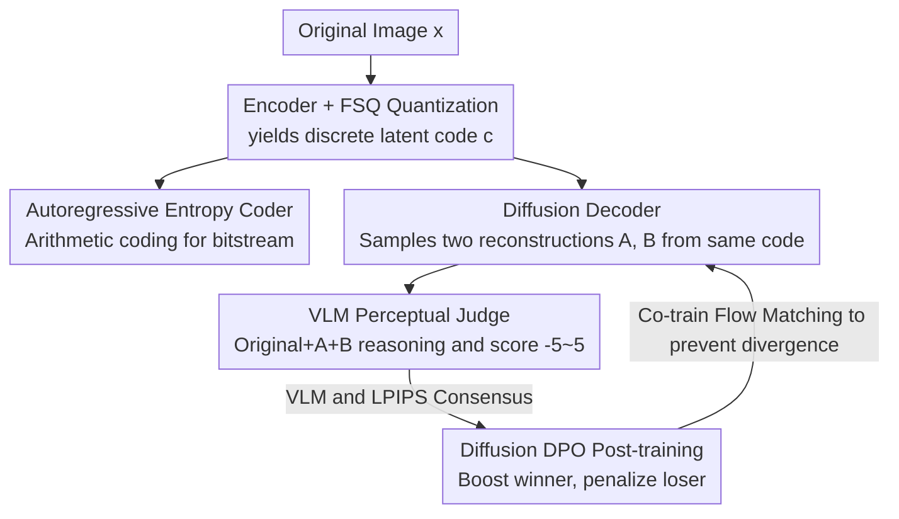

# VLIC: Vision-Language Models As Perceptual Judges for Human-Aligned Image Compression

**Conference**: CVPR 2026  
**Paper**: [CVF Open Access](https://openaccess.thecvf.com/content/CVPR2026/html/Sargent_VLIC_Vision-Language_Models_As_Perceptual_Judges_for_Human-Aligned_Image_Compression_CVPR_2026_paper.html)  
**Area**: Image Compression / Diffusion Models  
**Keywords**: Perceptual Compression, VLM Discrimination, Diffusion DPO, Diffusion Autoencoder, Human Alignment

## TL;DR
The authors discovered that off-the-shelf VLMs (Gemini 2.5-Flash) can zero-shot reproduce human pairwise preference judgments. By treating the VLM as a "perceptual judge" and utilizing Diffusion DPO to post-train a FlowMo-based diffusion autoencoder, they developed VLIC—an image compression system highly aligned with human perception that achieves SOTA performance across most perceptual metrics.

## Background & Motivation
**Background**: Perception-oriented image compression involves a trade-off between "bitrate (file size)" and "visual quality." Visual quality must align with human perception—humans are sensitive to regions like faces and text but insensitive to high-entropy textures like grass or hair. Early methods relied on distortion metrics such as PSNR/SSIM, which often contradict human judgment. Recent mainstream approaches involve training differentiable perceptual losses (LPIPS, DISTS, DreamSim, etc.) calibrated on large-scale human psychovisual datasets, which are then used to train GAN or diffusion-based compression models.

**Limitations of Prior Work**: Differentiable perceptual metrics have two major flaws. First, they are **exploitable**—directly optimizing these metrics results in training into their null-space, where scores improve but visual quality does not. Second, they exhibit **poor generalization**—networks calibrated on low-level visual differences might not agree with human judgment regarding high-level semantic differences, leading to performance drops across different datasets.

**Key Challenge**: To align compression with human perception, an accurate and general-purpose "perceptual judge" is required. However, training such a differentiable metric is both expensive (requiring human judgment data collection) and fragile (failing to generalize beyond calibration data).

**Goal**: Instead of training specialized differentiable perceptual metrics, can we directly leverage a model that inherently understands human visual priors as a judge and feed its judgments into the compression model?

**Key Insight**: The authors made a surprising observation—by feeding a pair of images (along with the original) to a VLM and having it **reason** about which reconstruction is closer to the original before giving a binary preference, the VLM can zero-shot reproduce human judgments on 2AFC datasets like BAPPS. As VLMs continue to improve with industry investment, this "perceptual judge" will naturally become stronger for free.

**Core Idea**: Use the VLM as a zero-shot perceptual judge to generate binary preferences, and then use Diffusion DPO to directly post-train the diffusion compression model using these **non-differentiable** preferences, bypassing the step of "distilling judgments into a differentiable metric network."

## Method

### Overall Architecture
VLIC is a **diffusion autoencoder** based compression system: an encoder deterministically compresses the image into a 1D discrete latent code, which a diffusion decoder then **stochastically** reconstructs. The pipeline operates on two levels: the compression backbone (encoding + FSQ quantization + autoregressive entropy coding + diffusion decoding) and post-training (sampling two reconstructions, VLM judging/ranking, and Diffusion DPO optimization). Crucially, since decoding is stochastic, the same latent code can yield two different reconstructions A and B, naturally forming the "winning/losing pair under the same condition" required by DPO to integrate VLM/LPIPS preference signals.

### Key Designs

**1. VLM as Zero-Shot Perceptual Judge: Judgment as Reward, Not Metric**

The pain point is that differentiable perceptual metrics are expensive and lack generalization. The authors take the opposite approach: providing a VLM (Gemini 2.5-Flash) with three images—original $x$, reconstruction A ($\hat{x}^A_0$), and reconstruction B ($\hat{x}^B_0$). The VLM first **describes the content and identifies artifacts/inconsistencies for each image**, then outputs a numerical score from $-5$ to $5$ (negative indicating A is better). This score is inherently a non-differentiable binary preference that cannot fit into GAN or differentiable loss frameworks, leading the authors to choose a preference optimization route. The value here lies in replacing "training a perceptual network" with "calling a large model that understands human visual priors," achieving human-level consistency on BAPPS zero-shot (see Table 2).

**2. Diffusion DPO Post-training: Injecting Preferences via Win-Loss Pairs**

With preference pairs $(\hat{x}^w_0, \hat{x}^l_0)$ (winner/loser), the authors use Diffusion DPO to push the model toward human preferences. The objective function is:

$$\mathcal{L}_{\text{DDPO}}(\theta) = -\mathbb{E}\,\log\sigma\big(-\beta\,\omega(\lambda_t)(\Delta_w - \Delta_l)\big)$$

Where $\Delta_w = \lVert\epsilon_w - \epsilon_\theta(\hat{x}^w_t, x, t)\rVert^2_2 - \lVert\epsilon_w - \epsilon_{\text{ref}}(\hat{x}^w_t, x, t)\rVert^2_2$, and $\Delta_l$ follows the same form for the loser. The intuition is to **reduce the denoising loss difference for the winner** and **increase it for the loser** relative to the reference policy $\epsilon_{\text{ref}}$, with $\beta$ as a KL weight controlling the deviation. Compared to DDPO which requires fine-tuning value functions/baselines, Diffusion DPO is more stable during cross-dataset training because the winner and loser share the same latent code condition (similar to GRPO with $n=2$). The authors also **jointly train with the original flow matching loss** $\mathcal{L}_{\text{Flow}}(\theta) = \mathbb{E}_{\epsilon,x,t}\lVert v - v_\theta(x, x_t, t)\rVert^2_2$ (where $v = \epsilon + x$ is the velocity), with the final objective $\mathcal{L}(\theta) = \mathcal{L}_{\text{DDPO}}(\theta) + \lambda_{\text{Flow}}\mathcal{L}_{\text{Flow}}(\theta)$. This allows for longer post-training without divergence. The encoder is not frozen during training, allowing it to learn features necessary to improve rewards.

**3. Triple Denoising Reward: Ensuring Reliable VLM Judgments**

VLMs can hallucinate or ignore content, especially when two reconstructions are **highly similar**, leading to self-contradiction (Figure 6: swapping A/B order yields opposite conclusions). Since DPO is sensitive to noisy rewards, the authors implemented three safeguards: (1) **Order Symmetrization**: For a fixed seed $i$, scoring is performed twice (A,B and B,A), taking the sign $r^i_A = \text{sign}(r^i_{A,0} + r^i_{A,1})$ to cancel position bias. (2) **Self-ensembling**: Taking a majority vote $r_A = \sum_{i=1}^n r^i_A$ over $n$ random seeds (main results use $n=3$). Figure 5 shows consistency with humans increases with seed count—essentially trading test-time compute for reward quality. (3) **Consensus Voting with LPIPS**: A preference pair is only used for training if VLM and LPIPS provide the **same** judgment. The combination significantly reduces noise, and experiments show the VLM+LPIPS ensemble outperforms either reward alone.

**4. FSQ Discrete Bottleneck + Autoregressive Entropy Coding: A Real Compressor**

The compression backbone is based on FlowMo, with the primary architectural change being the replacement of lookup-free quantization with Finite Scalar Quantization (FSQ) to eliminate commitment/entropy losses and simplify training. To make it a true compressor, the authors trained a **standalone autoregressive Transformer entropy coder** to model the 1D latent sequence, using arithmetic coding to compress tokens. This completes the transformation from a "diffusion autoencoder" to an end-to-end rate-controllable compression system. Inference supports tiled inference for arbitrary resolutions and shifted schedules, using classifier-free guidance by dropping latent codes with 10% probability.

### Loss & Training
Two-stage training: (1) Pre-training for 1,000,000 steps (Adam, lr $10^{-4}$, batch 256) using rectified flow + LPIPS loss on one-step denoising predictions; (2) DPO post-training for 8,000 steps (lr $5\times10^{-7}$, batch 256). Online sampling: the preference buffer of ~2,560 samples is refreshed every 250 steps, with **asynchronous** VLM querying—training continues using slightly outdated buffer data while VLM requests are processed in the background to hide latency. Training was performed on ImageNet $256\times256$ using 256 TPUv4s with JAX bfloat16 at two rate points: 0.07 and 0.21 bpp.

## Key Experimental Results

### Main Results
Evaluated on MS-COCO, CLIC 2020, and CLIC 2022 against HiFiC, PerCo, HFD, and PO-ELIC. Metrics include LPIPS, PSNR, FID, FD-DINO, and Human Elo (Elo is treated as the gold standard; PSNR is considered secondary as it inherently conflicts with perceptual metrics at fixed bitrates).

| Dataset | Key Finding | VLIC Performance |
|--------|---------|-----------|
| MS-COCO | Contains sensitive content (faces/text) | SOTA across perceptual metrics; superior fidelity for faces and text |
| CLIC 2020 | High resolution (vs. HiFiC, HFD) | Perceptual metrics (FD-DINO/FID/LPIPS) outperform HiFiC/HFD; PSNR slightly lower |
| CLIC 2022 | Only 30 images (vs. PO-ELIC, HiFiC) | Trails PO-ELIC, but PO-ELIC lacks code and low-res performance is unknown |

VLM reproduces human 2AFC judgments (Table 2, Zero-shot):

| Method | BAPPS-Val Acc | Compressed Images Acc |
|------|------------------|--------------------------|
| Human (Inter-annotator) | 73.99 | 72.15 |
| LPIPS | 69.56 | 92.32 |
| VLM (Gemini 2.5-Flash) | 69.44 | 83.80 |

> Note: LPIPS/VLM exceeding single humans on Compressed Images is attributed to visual similarity where single human judgments are noisier, rather than models being "smarter" than humans.

### Ablation Study
VLM Gain (Table 1, pre-entropy coding) and Reward Design components (Table 3, MS-COCO):

| Configuration | FD-DINO↓ | FID↓ | LPIPS↓ | PSNR↑ | Description |
|------|---------|------|--------|-------|------|
| Ours (VLIC) | 67.83 | 2.31 | 0.278 | 21.68 | Full Model |
| − w/o LPIPS Consensus | 67.68 | 2.10 | 0.280 | 21.29 | VLM only: better distribution metrics, worse pixel alignment (PSNR/LPIPS) |
| − w/o DPO Post-training | 82.31 | 2.40 | 0.300 | 21.27 | **Dramatic drop across all metrics**, largest performance loss |
| − w/o Self-ensembling | 68.36 | 2.15 | 0.280 | 21.53 | Reward becomes noisier; most metrics degrade |

In Table 1, at 0.21bpp, adding VLM (VLM+LPIPS) versus LPIPS-only post-training improved Human Elo from 1103 to 1112 and FD-DINO from 16.96 to 16.83. Gains were more pronounced at lower bitrates where images differ more and VLM judgments are less noisy.

### Key Findings
- **DPO Post-training is critical**: Removing it crashes all metrics, proving the "VLM Preference → Diffusion DPO" pipeline is the primary source of performance, not the backbone architecture.
- **VLM and LPIPS are complementary**: VLM alone yields better distribution metrics but degrades pixel-alignment metrics; LPIPS consensus balances both.
- **Self-ensembling trades compute for quality**: Increasing seeds from 1 to ~7-8 raises BAPPS accuracy from ~67% to ~71% before saturation.
- **Greater VLM gains at low bitrates**: When image differences are large, VLM judgments are more reliable and provide stronger reward signals.

## Highlights & Insights
- **"Judgment as reward, not distilled metric" is a clever paradigm shift**: Traditionally, perceptual judgments had to be distilled into a differentiable network to be usable. Here, the authors leverage the mature Diffusion DPO route (which handles non-differentiable preferences), bypassing distillation and avoiding "metric gaming" or generalization issues inherent in differentiable proxies.
- **Dual stochastic sampling of same latent naturally creates DPO pairs**: The inherent "weakness" of diffusion stochasticity is repurposed into a mechanism for generating conditioned preference pairs, similar to $n=2$ GRPO, making post-training highly stable.
- **Asynchronous VLM querying hides expensive judge latency**: Training on an old buffer while refreshing preferences in the background effectively amortizes the cost of using large models as rewards.
- **The noise-reduction stack** (symmetrization + voting + metric consensus) is a generalized recipe for any "LLM/VLM-as-judge" task—especially the consensus filter, which cleanly eliminates VLM hallucinations.

## Limitations & Future Work
- **High decoding latency**: Diffusion-based methods are inherently slower than GAN-based approaches. Additionally, VLM queries are significantly more expensive than small perceptual networks.
- **Dependency on VLM accuracy**: The system is capped by the judge's accuracy. VLMs still contradict themselves on highly similar images (Figure 6). While current ensembles mitigate this, the ceiling is set by the VLM.
- **Evaluation Caveats**: CLIC 2022 has only 30 images, and PO-ELIC lacks open-source code/models, making cross-dataset comparisons for those specific benchmarks less certain.
- **Future Directions**: Exploring lighter or distillable judges to reduce costs, or adaptively allocating ensemble/symmetrization budgets to "hard-to-judge" samples.

## Related Work & Insights
- **vs. LPIPS / DISTS / DreamSim**: These distill human judgment into a calibrated network. This work uses VLM as a zero-shot judge and treats preferences as RL rewards, avoiding null-space exploitation and cross-dataset generalization failures.
- **vs. HiFiC / PO-ELIC (GANs)**: GANs decode faster but rely on adversarial and differentiable perceptual losses. VLIC uses diffusion autoencoding + preference post-training, yielding stronger perceptual metrics but slower decoding.
- **vs. PerCo / HFD (Diffusion)**: Shares the diffusion autoencoder lineage (FlowMo) but introduces the "Diffusion Autoencoder + Diffusion DPO" training recipe with VLM preferences, distinguishing it from predecessors.
- **vs. RewardDance / HSPv3 (VLM as Diffusion Reward)**: Using VLMs as rewards for diffusion is not entirely new, but its application to human-aligned image compression—driven by the discovery that VLMs can reproduce human similarity judgments—is a contextual innovation.

## Rating
- Novelty: ⭐⭐⭐⭐ "VLM as zero-shot perceptual judge + Diffusion DPO" is a clean and persuasive combination.
- Experimental Thoroughness: ⭐⭐⭐⭐ Solid results across three datasets and multiple metrics + large human study; although small-set benchmarks remain a minor caveat.
- Writing Quality: ⭐⭐⭐⭐ Clear chain of motivation-discovery-method-analysis; failures are discussed transparently.
- Value: ⭐⭐⭐⭐ Provides a reproducible paradigm for using large models as perceptual judges, and benefits automatically from future VLM advancements.

<!-- RELATED:START -->

## Related Papers

- [\[CVPR 2026\] EVLF: Early Vision-Language Fusion for Generative Dataset Distillation](evlf_early_vision-language_fusion_for_generative_dataset_distillation.md)
- [\[CVPR 2026\] Perceptual Neural Video Compression with Color Separation and Rank Chain](perceptual_neural_video_compression_with_color_separation_and_rank_chain.md)
- [\[ICML 2026\] Consistent Diffusion Language Models](../../ICML2026/image_restoration/consistent_diffusion_language_models.md)
- [\[CVPR 2026\] White-Balance First, Adjust Later: Cross-Camera Color Constancy via Vision-Language Evaluation](white-balance_first_adjust_later_cross-camera_color_constancy_via_vision-languag.md)
- [\[ICLR 2026\] Activation Steering for Masked Diffusion Language Models](../../ICLR2026/image_restoration/activation_steering_for_masked_diffusion_language_models.md)

<!-- RELATED:END -->
