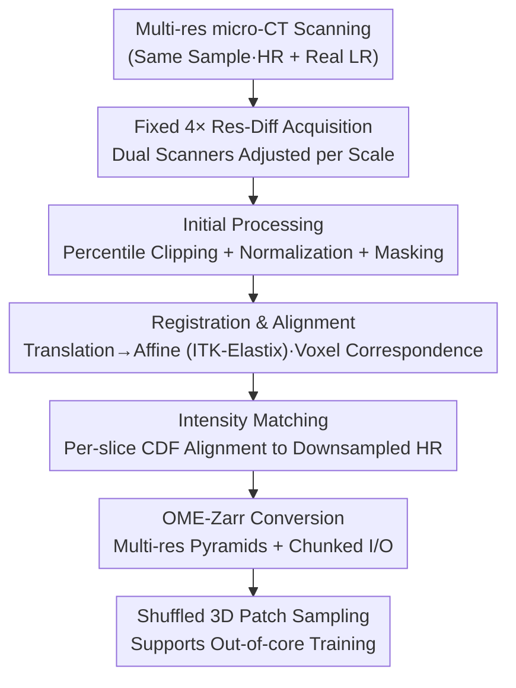

# VoDaSuRe: A Large-Scale Dataset Revealing Domain Shift in Volumetric Super-Resolution

**Conference**: CVPR 2026  
**Paper**: [CVF Open Access](https://openaccess.thecvf.com/content/CVPR2026/html/Hoeg_VoDaSuRe_A_Large-Scale_Dataset_Revealing_Domain_Shift_in_Volumetric_Super-Resolution_CVPR_2026_paper.html)  
**Code**: https://augusthoeg.github.io/VoDaSuRe/ (Available)  
**Area**: Image Restoration / Volumetric Super-Resolution / Dataset  
**Keywords**: Volumetric Super-Resolution, Paired Multi-Resolution Dataset, Domain Shift, micro-CT, OME-Zarr

## TL;DR
The authors construct VoDaSuRe—the largest **paired multi-resolution real CT dataset** to date ($\sim 194$ gigavoxels, 16 samples, 32 scans). It reveals a fact obscured by existing volumetric SR research: the "impressive performance" of current SOTA models stems primarily from training on **synthetic downsampled data**. Faced with **physically acquired real low-resolution scans**, these models output only spatially averaged blurry results and fail to reconstruct lost microstructures.

## Background & Motivation
**Background**: Volumetric super-resolution (SR) holds high promise in medical and scientific imaging for "recovering" missing details from low-resolution 3D scans. Recent CNN and ViT methods have reported impressive PSNR values of $\ge 35–40\text{ dB}$ at $4\times$ or higher magnification. However, most works (cited extensively) generate LR-HR pairs for training by **downsampling HR volumes** (Gaussian blur + bicubic/linear interpolation, or k-space truncation).

**Limitations of Prior Work**: Downsampling degradation models force an **overly idealized one-to-one correspondence** between LR and HR. Networks simply learn to "invert the downsampling operator" to achieve near-perfect reconstruction. This significantly diverges from real low-resolution scans. Real LR acquisitions often have higher contrast and better SNR but introduce CT-specific artifacts (beam hardening, motion, ring artifacts) and lose high-frequency structures that downsampling cannot simulate. Worse, existing volumetric SR benchmarks are dominated by medical images that are relatively smooth and lack fine structural changes, making the SR task "trivial."

**Key Challenge**: Researchers cannot verify whether "models are reconstructing microstructures or memorizing the inverse downsampling process" because there is a **fundamental lack of large-scale, paired real multi-resolution 3D datasets**. Small existing datasets ($\le 512^3$), narrow domains, or limited accessibility prevent fair and reproducible comparisons.

**Goal**: ① Create a sufficiently large and complex paired dataset physically acquired by the **same scanner at different resolutions**; ② Quantitatively answer whether SR models truly recover lost structures on real LR data.

**Key Insight**: By using the same micro-CT setup, the authors physically scan a real LR volume and synthesize an LR volume by downsampling the HR for each sample. Thus, the **only variable between the "synthetic" and "real" degradation paths is the source of resolution loss**, cleanly isolating the cause of domain shift.

**Core Idea**: Instead of inventing "more realistic downsampling models," this work **directly exposes the inflated performance of current evaluations using real multi-resolution scans** and open-sources this revealing large-scale benchmark.

## Method

### Overall Architecture
This is a dataset and diagnostic paper rather than a new network proposal. The "Method" comprises three parts: **(A) Data Acquisition Strategy**—determining resolution differences and scanner selection; **(B) Data Curation Pipeline**—processing raw scans into voxel-aligned, intensity-matched OME-Zarr paired volumes; **(C) Evaluation Protocol**—quantifying the domain shift between "downsampled vs. real LR" via in-domain, cross-domain, and ablation experiments. The input consists of raw multi-resolution X-ray CT scans of 16 biological/non-biological samples (human femur, vertebrae, animal bone, wood types, MDF, cardboard), and the output is a reproducible SR benchmark.

The data curation pipeline is a multi-stage serial process:

### Key Designs

**1. Physical Acquisition with Fixed $4\times$ Real Resolution Difference: Making every LR–HR pair a "non-trivial" SR task**
To avoid trivial tasks where the resolution difference is too small, or massive data with no structural gains where it is too large, the authors **fixed the HR-LR resolution difference at $4\times$**. Voxel sizes were adjusted per sample so that fine structures are **only fully resolved in HR**, ensuring an "information-rich and non-trivial" task. Two lab CT scanners were used: Nikon XT H 225 for human vertebrae/femurs and Zeiss Xradia Versa 520 for others. Higher resolution was achieved by **increasing the sample-to-detector distance**, which decreases contrast—a real-world physical trade-off that downsampling ignores.

**2. Registration + Intensity Matching Curiously: Bringing "Real LR" and HR to voxel-level comparability**
Real-scanned LR and HR volumes vary in field-of-view (FOV), pose, and contrast. Direct training would lead the network to learn misalignments rather than SR. The pipeline uses ITK-Elastix for registration: starting with translation followed by **affine registration** to allow small deformations for voxel-level correspondence. Then, **intensity matching** aligns the cumulative distribution function (CDF) of the registered LR slices to the downsampled HR slices. This step preserves structure while adjusting relative intensity, which is critical since $L_1$ loss is extremely sensitive to contrast differences.

**3. OME-Zarr Multi-resolution Pyramid + Out-of-core Loading: Enabling $\sim 194$ gigavoxels processing**
The volumes in VoDaSuRe are massive (average HR volume is $3330 \times 1820 \times 1870$ voxels), exceeding system memory. Data is stored in **OME-Zarr** format with local mean downsampling pyramids ($2\times/4\times/8\times$). Chunk sizes were optimized for 3D patch I/O. A PyTorch loader supports **concurrent 3D patch sampling + augmentation**, allowing training to run out-of-core without manual volume management.

**4. Downsampled vs. Registered Dual-Task + TV Quantification: Quantifying domain shift**
To quantify performance on real LR data, two tasks are defined on VoDaSuRe: **VoDaSuRe (downsampled)** using synthetic LR and **VoDaSuRe (registered)** using real physical LR. Beyond PSNR/SSIM, the authors introduce **Total Variation (TV)** to measure the amount of high-frequency structure in predicted volumes. Lower TV indicates smoother outputs with fewer details.

## Key Experimental Results

Experiments involved 8 SOTA methods: 6 volumetric (EDDSR, SuperFormer, MFER, mDCSRN, MTVNet, RRDBNet3D) and 2 2D methods (RCAN, HAT). All models were trained on an H100 for 100K steps using AdamW and $L_1$ loss with $32^3$ LR patches.

### Main Results (In-domain, $4\times$ magnification, representative methods)

| Method | CTSpine1K PSNR↑ | LIDC-IDRI PSNR↑ | VoDaSuRe(Downsampled) PSNR↑ | VoDaSuRe(Real) PSNR↑ |
|------|----------------|----------------|----------------------|--------------------|
| HAT | 30.44 | 29.50 | 16.61 | 15.41 |
| SuperFormer | 33.95 | 33.23 | 18.53 | 16.24 |
| MTVNet | 34.39 | 33.76 | 18.81 | 16.18 |
| RRDBNet3D | **35.57** | **35.26** | **19.08** | 16.22 |

**Key Findings**: On medical datasets, all methods achieved PSNR $\ge 35\text{ dB}$, appearing "solved." However, on VoDaSuRe (downsampled), the best result dropped to $19.08\text{ dB}$, indicating its microstructures are inherently harder. On **real registered LR**, performance dropped further (best $16.24\text{ dB}$), with outputs being significantly blurrier.

### Cross-domain (Train on Downsampled $\rightarrow$ Test on Real LR, $4\times$)

| Train $\rightarrow$ Test | Representative Method | PSNR↑ | SSIM↑ | LPIPS↓ |
|-----------|---------|-------|-------|--------|
| Downsampled $\rightarrow$ Real LR (2×) | RRDBNet3D | 16.74 | .4781 | .5092 |
| Downsampled $\rightarrow$ Real LR (4×) | RRDBNet3D | 14.94 | .3923 | .4542 |

Models trained on downsampled data fail to generalize to real LR data, proving that the standard training paradigm is insufficient for real-world accuracy.

### Ablation Study

| Ablation | Action | Conclusion |
|------|------|------|
| (a) Reg. Error | Intentionally misalign downsampled volumes | Misalignment only reduces sharpness; **cannot replicate** the characteristic smoothing of real LR. |
| (b) Perceptual Loss | $L_1$ + LPIPS ($\lambda=0.02$) | Increased texture but prediction remains unrealistic; **domain shift persists**. |
| (c) Dual Downsampling | Downsample both HR and Real LR by 2× | Performance/smoothing remains stable $\rightarrow$ domain shift is **inherent to real LR**. |
| (d) Generalization | Train on bamboo/oak; Test on elm/cypress | Comparable metrics $\rightarrow$ models generalize across microstructures but **still output smooth predictions**. |

## Highlights & Insights
- **"Falsification" via Data Generation**: The paper does not focus on model architecture but exposes an industry-wide evaluation shortcut (synthetic downsampling) using physical data.
- **Isolation of Variables**: By using the same scanner for HR, real LR, and downsampled LR, "degradation source" becomes the only variable, making the attribution of domain shift rigorous.
- **TV as a Diagnostic Proxy**: Total Variation effectively turns subjective "blurriness" into a quantifiable metric of high-frequency residue.
- **Engineering Contribution**: The OME-Zarr pyramid + out-of-core loader lowers the barrier for researchers to handle gigavoxel-scale 3D data.

## Limitations & Future Work
- **Problem Statement vs. Solution**: The paper reveals the domain shift but does not propose a method to bridge it; perceptual loss offers only partial relief.
- **Limited Samples**: 16 samples (32 scans) is small despite the voxel count, and the authors state the data **does not necessarily generalize to clinical MRI/CT**.
- **Metric Dependency**: PSNR/SSIM favor smooth predictions. More domain-specific metrics (e.g., porosity, lacunar statistics) are needed.

## Related Work & Insights
- **vs. Synthetic Downsampling**: Unlike works that simulate complex degradation models, this paper argues that the only way to expose real problems is through physical paired scanning.
- **vs. Existing Paired Datasets**: VoDaSuRe is several times larger in total voxel count ($\sim 194$ vs. $\sim 57.6$ gigavoxels) and spans more diverse microstructures (wood, composites, bone).
- **vs. Medical Benchmarks**: Medical SR is often "trivial" due to smooth data; VoDaSuRe's complex fibers and microstructures provide a far more challenging benchmark.

## Rating
- Novelty: ⭐⭐⭐⭐⭐ Exposing the evaluation paradigm via real data is insightful.
- Experimental Thoroughness: ⭐⭐⭐⭐⭐ Extensive cross-dataset and cross-domain testing.
- Writing Quality: ⭐⭐⭐⭐ Clear presentation, though some details are deferred to supplements.
- Value: ⭐⭐⭐⭐⭐ Open-source data and code provide a new direction for volumetric SR evaluation.

<!-- RELATED:START -->

## Related Papers

- [\[CVPR 2026\] CASR: A Robust Cyclic Framework for Arbitrary Large-Scale Super-Resolution with Distribution Alignment and Self-Similarity Awareness](casr_a_robust_cyclic_framework_for_arbitrary_large-scale_super-resolution_with_d.md)
- [\[CVPR 2026\] RAW-Domain Degradation Models for Realistic Smartphone Super-Resolution](rawdomain_degradation_models_smartphone_sr.md)
- [\[CVPR 2026\] Toward Real-world Infrared Image Super-Resolution: A Unified Autoregressive Framework and Benchmark Dataset](real_iisr_infrared_image_super_resolution_autoregressive.md)
- [\[CVPR 2026\] Event-Illumination Collaborative Low-light Image Enhancement with a High-resolution Real-world Dataset](event-illumination_collaborative_low-light_image_enhancement_with_a_high-resolut.md)
- [\[CVPR 2026\] ShiftLUT: Spatial Shift Enhanced Look-Up Tables for Efficient Image Restoration](shiftlut_spatial_shift_enhanced_look-up_tables_for_efficient_image_restoration.md)

<!-- RELATED:END -->
