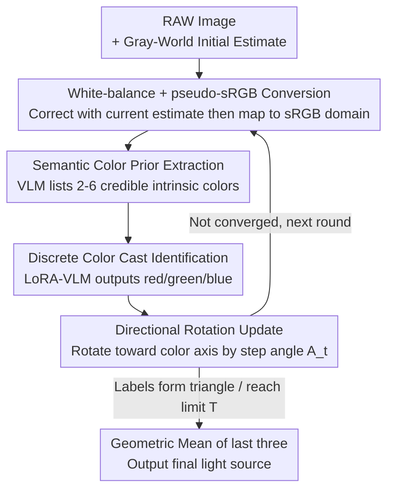

# White-Balance First, Adjust Later: Cross-Camera Color Constancy via Vision-Language Evaluation

**Conference**: CVPR 2026  
**arXiv**: [2605.19613](https://arxiv.org/abs/2605.19613)  
**Code**: https://github.com/NothingIknow/VLM-CC (Available)  
**Area**: Image Restoration / Color Constancy (Low-level Vision)  
**Keywords**: Color Constancy, Auto White Balance, Cross-camera Generalization, Vision-Language Models, Iterative Feedback

## TL;DR
This work reformulates color constancy (light source estimation) from "direct RGB regression" into a closed-loop process of "white-balance first, then let VLM provide feedback for iterative correction." In each round, the current estimate is used to white-balance the image and convert it into a pseudo-sRGB format. A LoRA-finetuned VLM judges whether the image remains red/green/blue-tinted, driving the rotation of the light source direction toward the corresponding axis until convergence. Without requiring target camera calibration or retraining, it achieves SOTA performance on four cross-camera benchmarks, significantly reducing errors in the most difficult 25% of samples.

## Background & Motivation
**Background**: The goal of computational color constancy (Auto White Balance, AWB) is to estimate the scene light source $\boldsymbol{\ell}$ and correct RAW images to appear as if "shot under neutral white light." Prevailing methods fall into three categories: physical, statistical (e.g., Gray-World, White-Patch, Gray-Edge), and the currently dominant learning-based methods—directly regressing light source RGB from RAW pixels.

**Limitations of Prior Work**: While high in accuracy, learning-based models are tightly coupled with the imaging pipeline (spectral response, CCM) of the training cameras. Performance drops significantly when switched to a different camera. This is the "cross-camera generalization" challenge: models overfit to the color response of training cameras, causing the learned mapping $f$ to fail when transferred to different sensors with varying RAW distributions.

**Key Challenge**: Existing cross-camera methods (Meta-AWB, DMCC, SIIE, C5, GCC, CCMNet) either require a few labels/white point measurements/pre-calibrated CCMs from the target camera or rely on generative priors. However, **the essence remains "taking un-white-balanced RAW to regress the light source in one step."** Sensor differences in the RAW domain are "generalization killers," and "one-step-to-answer" forward passes lack opportunities for self-correction.

**Key Insight**: The authors draw inspiration from human behavior—humans do not rely on RAW pixels when adjusting white balance. Instead, they examine objects with "known intrinsic colors" (e.g., paper, skin, sky) and iteratively refine the results based on whether the correction looks neutral. This suggests that reliable color constancy benefits from **semantic scene understanding**, and that "evaluating the white-balanced result" is more critical than "direct prediction from RAW."

**Core Idea**: Recast color constancy as an **iterative perceptual feedback** problem. Use a VLM as a "perceptual evaluator" to judge residual color casts (red/green/blue) in a shared sRGB color space. Discrete qualitative feedback drives directional updates instead of direct pixel-level RGB regression, achieving sensor invariance and interpretability.

## Method

### Overall Architecture
VLM-CC takes a RAW image as input and outputs the estimated light source $\hat{\boldsymbol{\ell}}^*$. The inference forms an **iterative closed loop**: ① Use any simple method (defaulting to Gray-World) for an initial light source estimate $\hat{\boldsymbol{\ell}}^{(1)}$; ② In each round, white-balance the RAW using the current estimate and convert it to **pseudo-sRGB** via the camera→XYZ→sRGB matrix (it is an approximation since the light is not yet fully corrected); ③ A pre-trained VLM extracts **semantic color priors** from the first-round result (identifying objects with reliable intrinsic colors); ④ A LoRA-finetuned VLM judges whether the dominant residual cast is red, green, or blue, conditioned on these semantic priors; ⑤ Accordingly **rotate the light source direction by a step angle** toward the corresponding axis in the chromaticity space and feed it into the next round. The final output is the normalized geometric mean of the last three estimates after convergence. This pipeline requires no target camera calibration or retraining.

Note that two pipelines share the same prompts and process: the **inference** pipeline (the five-step loop) and the **training** pipeline (data synthesis + LoRA finetuning for cast identification). The diagram below illustrates the inference loop.

### Key Designs

**1. White-balance first: Shifting judgment to the pseudo-sRGB domain instead of RAW**

The root cause of cross-camera failure is the vast difference in RAW distributions across sensors. Moreover, VLMs are not pre-trained on large-scale RAW data and cannot judge colors accurately from them. The authors first apply the current estimate at round $t$ to white-balance $W^{(t)}=I\oslash\hat{\boldsymbol{\ell}}^{(t)}$ (channel-wise division), then use the camera-to-XYZ matrix $M_{c\to x}$ (CCM from metadata) and a fixed XYZ-to-sRGB matrix $M_{x\to s}$ to project the image into a shared sRGB-like space: $I_{\text{srgb}}^{(t)}=M_{x\to s}M_{c\to x}W^{(t)}$. The goal is **not** to render correct sRGB but to move data into a color gamut closer to the VLM's pre-training distribution to reduce domain shift. This is the physical implementation of the "white-balance first, evaluate later" philosophy and the source of cross-camera invariance—sensor differences are absorbed into the same sRGB space by the CCM.

**2. Semantic Color Prior Extraction: Identifying "Known Intrinsic Color Anchors"**

Humans rely on objects like paper, skin, and sky whose colors under neutral light are known. The authors use the first-round white-balanced image $I_{\text{srgb}}^{(1)}$ with a structured prompt, letting the VLM output a list of 2–6 credible objects, each containing `{object, location, expected color, reasoning}`. This prior describes the scene's semantic structure and provides object-level "should-be" color cues, which are reused throughout the iteration. Since it comes from the first-round (often poorly corrected) image, the authors allow the VLM to perform a **reflection** after $N$ steps to re-evaluate and update priors using the cleaner $I_{\text{srgb}}^{(N)}$. Ablations show these semantic anchors are vital—errors in the Worst-25% samples aggravate significantly when using random priors or shuffled $14\times14$ patches.

**3. Discrete Color Cast Identification + Rotation Update: Driving continuous correction with qualitative judgment**

Why only output three discrete labels (red, green, blue) instead of regressing continuous RGB? VLMs are proficient at qualitative color description but insensitive to fine numeric values (treating numbers as discrete tokens). Given the current sRGB image and priors, the LoRA-VLM outputs $c^{(t)}\in\{\text{red},\text{green},\text{blue}\}$ (Eq. 4). This qualitative direction is translated into a continuous geometric update: take a unit vector $d(c^{(t)})$ aligned with the predicted cast, let $u^{(t)}=\text{Normalize}(\hat{\boldsymbol{\ell}}^{(t)})$, and $v^{(t)}=\text{Normalize}\big(d(c^{(t)})-(d(c^{(t)})^\top u^{(t)})u^{(t)}\big)$ (projecting $d$ to the direction orthogonal to the current estimate), then rotate by step angle $A_t$:

$$\hat{\boldsymbol{\ell}}^{(t+1)}=\text{Normalize}\big(\cos A_t\,u^{(t)}+\sin A_t\,v^{(t)}\big).$$

This **precisely rotates the light source direction by $A_t$** toward $d(c^{(t)})$. $A_t$ linearly decays from $3^\circ$ to $0.1^\circ$ (coarse-to-fine). This "qualitative label → continuous rotation" design avoids VLM numeric weaknesses while retaining fine-grained correction.

**4. Convergence Criteria and Stabilization: Detecting "Triangle Oscillation"**

When does the iteration stop? The authors monitor the cast prediction sequence. When three different labels **first appear**, it signals coarse convergence, and all remaining angles $A_t$ are halved. If the three labels appear again (forming a "triangle" oscillation) or the limit $T=20$ is reached, the process stops. The final estimate $\hat{\boldsymbol{\ell}}^*=\text{Normalize}\big((\hat{\boldsymbol{\ell}}^{(t)}\odot\hat{\boldsymbol{\ell}}^{(t-1)}\odot\hat{\boldsymbol{\ell}}^{(t-2)})^{1/3}\big)$ (Eq. 9) is the normalized geometric mean of the last three estimates, smoothing jitter near the optimal solution.

### Loss & Training
The objective is to align the VLM's "sRGB semantic priors" with the "physical light source direction" used to synthesize the sample. **Data Synthesis**: For each RAW image with GT light, a correctly white-balanced version is generated, after which the light direction is randomly perturbed (up to $\approx 17.5^\circ$) and reapplied to convert into sRGB. **LoRA Adaptation**: LoRA adapters are inserted into the vision tower, vision-language projector, and language model, with pre-trained weights frozen. **Loss**: Standard causal language modeling loss $\mathcal{L}_{\text{LM}}=-\sum_t \log p_\theta(y_t\mid y_{<t}, I_{\text{srgb}}, \text{prompt})$ (Eq. 10). Since the answer is a single color token, this simplifies to cross-entropy on that token. Backbone: Qwen2.5-VL 7B; LoRA rank $r=8$; AdamW optimizer; 800 iterations; effective batch size 512.

## Key Experimental Results

### Main Results
Evaluation on four RAW datasets (Gehler-Shi, NUS-8, Intel-TAU, Cube+) using a leave-one-out cross-dataset protocol (trained on others, tested on the hold-out). Metrics: Mean, Median, Trimean, Best-25%, and Worst-25% angular errors.

| Test Set (Leave-one-out) | Metric | Ours | Prev. SOTA (CCMNet/C5) | Gain |
|--------|------|------|----------|------|
| Gehler-Shi (Table 1) | Mean | **1.52** | 2.23 (CCMNet) | −31.8% |
| Gehler-Shi | Worst-25% | **3.29** | 5.46 | −39.7% |
| NUS-8 (Table 2) | Mean | **1.83** | 2.32 (CCMNet) | −21.1% |
| NUS-8 | Worst-25% | **3.88** | 5.18 | −25.1% |
| Cube+ (Table 3) | Mean | **1.51** | 1.68 (CCMNet) | −10.1% |
| NUS-8 Cross-sensor (Table 4) | Mean | **1.49** | 1.71 (CCMNet) | −12.9% |

In cross-dataset settings (Table 6, training on single datasets): NUS-8→Gehler Ours Mean 2.03 (CCMNet 2.38), Gehler→NUS-8 Ours Mean 2.07 (CCMNet 2.17). Standard 3-fold cross-validation on Gehler-Shi (Table 5) yields Ours Mean 1.34, outperforming cross-camera methods like GCC (1.91).

**Key Observation**: The Worst-25% error sees the most significant reduction, indicating that the method primarily benefits robustness in difficult scenes. As training data diversity increases, the advantage grows—on Gehler-Shi, the Mean error for CCMNet drops from 2.38 to 2.23 ($\approx -9\%$), whereas Ours drops from 2.03 to 1.52 ($\approx -26\%$).

### Ablation Study
Ablations on Gehler-Shi leave-one-out (Table 7).

| Dimension | Configuration | Mean | Worst-25% | Description |
|------|------|------|-----------|------|
| (a) Inference | one-step numerical | 3.59 | 7.22 | One-step RGB regression fails |
| | iterative numerical | 1.70 | 3.68 | "WB first" + per-round regression |
| | iterative discrete (Ours) | **1.52** | **3.29** | Discrete cast labels further improve |
| (b) Initialization | w/o init | 1.61 | 3.60 | Minimal change without init |
| | 2nd-order Gray-Edge | 1.58 | 3.29 | Insensitive to init type |
| | Gray-World (Ours) | **1.52** | 3.29 | |
| (c) VLM Scale | InternVL-3.5 1B | 1.73 | 3.87 | Still effective on other architectures |
| | Qwen2.5-VL 7B (Ours) | **1.52** | 3.29 | Scaling helps |
| (d) Semantic Cue | random color priors | 1.93 | 4.88 | Random priors degrade Worst-25% |
| | shuffled input (14×14) | 2.16 | 5.27 | Breaking structure hurts Worst-25% |
| (e) Finetuning | w/o finetuning | 14.33 | 23.29 | Unusable without finetuning |
| | LM & vision tower | **1.52** | **3.29** | Both are necessary |

### Key Findings
- **"White-balance first" is the key to performance**: one-step 3.59 → iterative 1.70. Recasting the problem into evaluation of corrected results is vastly superior to one-step regression.
- **Discrete labels > Numeric regression**: Indicated by the improvement from 1.70 to 1.52; VLMs are better at qualitative judgment.
- **Robust to initialization**: The iterative feedback corrects initial biases, converging to a stable solution regardless of whether Gray-World/Gray-Edge is used.
- **Semantic priors matter most for "hard" samples**: Best-25% remains stable while Worst-25% spikes without semantic anchors.
- **Finetuning vision tower is necessary**: The Vision encoder needs optimization for fine-grained color differences in un-white-balanced images.

## Highlights & Insights
- **VLM as "Perceptual Evaluator" instead of "Regressor"**: The paradigm shift avoids tasking the VLM with numeric regression (a known weakness). By using qualitative judgment (red/green/blue) and translating it via geometric rotation, the model gains continuous precision without numeric tokens.
- **Cracking cross-camera generalization via pseudo-sRGB**: Moving the judgment to a shared sRGB space (absorbing sensor differences via CCM) allows a single model to naturally cross cameras without target-specific retraining.
- **Leveraging label oscillation as a convergence signal**: A simple observation that "oscillating between different labels means the optimum is reached" provides a natural stopping criterion and step-size reduction.
- **Improved robustness in difficult corner cases**: The semantic feedback primarily helps when statistical methods fail (e.g., in large monochromatic scenes), which is highly valuable for real-world ISP applications.

## Limitations & Future Work
- **Single global light source assumption**: The model assumes $I=W\odot\boldsymbol{\ell}$, which does not account for mixed or local illumination.
- **Dependency on CCM**: Requires camera-to-XYZ matrices. Images without CCM metadata cannot be directly processed.
- **Inference cost**: Up to 20 VLM forward passes (7B model) are required. Real-time performance and energy consumption remain challenges.
- **Discrete granularity**: Reducing casts to three primary axes might limit the expression of complex tints (e.g., magenta), although iterative decay helps approximation.

## Related Work & Insights
- **Comparison with Learning-based (CCMNet/C5/GCC)**: These perform one-step regression from RAW and often require target sensor info. Ours uses iterative sRGB feedback and performs significantly better on Worst-25% without target info.
- **Comparison with Statistical (Gray-World)**: Statistical methods are biased by single-color objects. Ours uses Gray-World as a **start** and corrects its bias via semantic feedback.
- **Insight**: The paradigm of "apply an invertible transform to move data into the foundation model's comfort zone → use qualitative evaluation → translate to continuous refinement" is applicable to other regression tasks where semantic understanding is high but numeric precision is low (e.g., exposure or geometry estimation).

## Rating
- Novelty: ⭐⭐⭐⭐⭐ Recasting color constancy as iterative VLM feedback is a clean and powerful paradigm shift.
- Experimental Thoroughness: ⭐⭐⭐⭐⭐ Comprehensive coverage across four datasets and five ablation dimensions.
- Writing Quality: ⭐⭐⭐⭐ Clear reasoning; however, discussions on inference latency for the 7B model are limited.
- Value: ⭐⭐⭐⭐⭐ Addresses a core AWB pain point without requiring target labels. High practical value for ISP.

<!-- RELATED:START -->

## Related Papers

- [\[CVPR 2026\] EVLF: Early Vision-Language Fusion for Generative Dataset Distillation](evlf_early_vision-language_fusion_for_generative_dataset_distillation.md)
- [\[CVPR 2026\] Restore Text First, Enhance Image Later: Two-Stage Scene Text Image Super-Resolution with Glyph Structure Guidance](restore_text_first_enhance_image_later_two-stage_scene_text_image_super-resoluti.md)
- [\[CVPR 2026\] Bridging the Perception Gap in Image Super-Resolution Evaluation](bridging_the_perception_gap_in_image_super-resolution_evaluation.md)
- [\[CVPR 2025\] Vision-Language Gradient Descent-driven All-in-One Deep Unfolding Networks](../../CVPR2025/image_restoration/vision-language_gradient_descent-driven_all-in-one_deep_unfolding_networks.md)
- [\[CVPR 2026\] DeSpike: Defocus Deblurring and Image Reconstruction for Spike Camera](seeing_through_blur_tackling_defocus_in_spike-based_imaging.md)

<!-- RELATED:END -->
