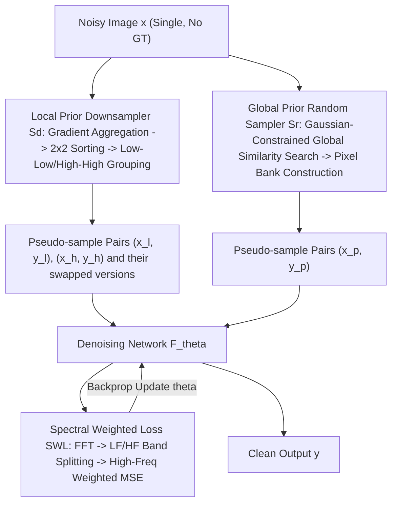

# Zero-Shot Image Denoising via Hybrid Prior-Guided Pseudo Sample Generation

**Conference**: CVPR 2026  
**Paper**: [CVF Open Access](https://openaccess.thecvf.com/content/CVPR2026/html/Zhao_Zero-Shot_Image_Denoising_via_Hybrid_Prior-Guided_Pseudo_Sample_Generation_CVPR_2026_paper.html)  
**Code**: To be confirmed (the paper claims it will be open-sourced)  
**Area**: Image Restoration / Zero-Shot Denoising  
**Keywords**: Zero-Shot Denoising, Pseudo Sample Generation, Spatial Locality, Non-Local Self-Similarity, Frequency Domain Loss

## TL;DR
ZS-HPD trains a denoising network using training pairs generated from a single noisy image. It utilizes a "gradient-sorted grouping" downsampler to capture local priors and a "Gaussian-constrained global random sampler" to capture non-local self-similarity priors. Combined with a frequency-domain loss that weights high-frequency components, ZS-HPD outperforms existing methods like Pixel2Pixel in both performance and efficiency.

## Background & Motivation

**Background**: Although supervised denoising achieves high performance, it relies on large-scale paired "noisy-clean" data, which is often unavailable in fields like medical imaging and astrophotography. Zero-shot denoising has emerged as a flexible alternative that performs denoising using only the noisy image itself by leveraging intrinsic image priors without external training data. Representative methods include Self2Self, ZS-N2N, ZS-N2M, and Pixel2Pixel.

**Limitations of Prior Work**: Existing zero-shot methods have significant drawbacks. Self2Self is effective but computationally expensive (taking 38 minutes for a 256×256 image). ZS-N2N is fast but suffers from substantial performance degradation. Pixel2Pixel builds a "pixel bank" using non-local self-similarity but relies on exhaustive search within a small window, which limits the search range for self-similarity and causes high memory overhead (peaking at 3.9GB) as the window size increases. Crucially, most methods utilize only **one** type of prior and generate low-quality pseudo-samples.

**Key Challenge**: Natural images exhibit two widespread priors: **Spatial Locality (P1)**, where adjacent pixels are highly correlated while distant ones are nearly independent; and **Non-Local Self-Similarity (P2)**, where similar image patches/textures recur at different locations. Existing methods either use P1 via fixed-pattern downsampling (ZS-N2N, Self2Self) or use P2 via pixel banks (Pixel2Pixel), without effectively **coupling** both. This is particularly problematic for real-world noise, which has complex spatial correlations that violate the "pixel independence" assumption relied upon by many methods.

**Goal**: To build a pseudo-sample generation framework guided by hybrid priors that fully utilizes both P1 and P2, achieving a better trade-off between performance and computational cost in zero-shot denoising.

**Core Idea**: Utilize two complementary samplers to extract local and global priors for constructing pseudo-training pairs—one based on local gradient-sorted grouping and another based on Gaussian-constrained global search. This is integrated with a "high-frequency weighted" spectral loss, as noise primarily contaminates high-frequency components.

## Method

### Overall Architecture

Given a noisy image $\mathbf{x}$, ZS-HPD aims to generate paired training samples from the image itself to train a denoising network $F_\theta(\cdot)$, such that it outputs a clean image $\mathbf{y}$ from a noisy input. The pipeline consists of two parallel samplers and a spectral weighted loss:

- **Local Prior Downsampler $S_d$**: Aggregates gradients in the local neighborhood of each pixel and sorts/groups them within 2×2 windows to produce two pairs of downsampled training samples: $(\mathbf{x}_\ell, \mathbf{y}_\ell)$ (low-gradient group) and $(\mathbf{x}_\hbar, \mathbf{y}_\hbar)$ (high-gradient group).
- **Global Prior Random Sampler $S_r$**: Searches for similar candidates for each pixel across the entire image conditioned on a Gaussian distribution to build a pixel bank $\mathbf{B}_p$, from which samples $(\mathbf{x}_p, \mathbf{y}_p)$ are drawn.
- **Spectral Weighted Loss (SWL)**: Performs FFT on both the network output and the target, splitting them into low-frequency (LF) and high-frequency (HF) bands, and computes MSE with higher weights assigned to the high-frequency components.

Engineering details: For downsampled samples $S_d$, the input/target are swapped to create additional training pairs ($(\mathbf{y}_\ell, \mathbf{x}_\ell)$, $(\mathbf{y}_\hbar, \mathbf{x}_\hbar)$). However, for $S_r$, the generated $(\mathbf{x}_p, \mathbf{y}_p)$ samples are sufficiently diverse and share the original image dimensions, so swapping does not improve performance but reduces efficiency.

### Key Designs

**1. Local Prior Downsampler $S_d$: Avoiding Blur through Gradient-Sorted Grouping**

Prior methods like ZS-N2N and Self2Self use **fixed-pattern** downsampling via interpolation or rigid strided sampling, which fails to utilize P1 fully and introduces blur and artifacts. $S_d$ guides sampling positions using gradient magnitudes. Horizontal and vertical Sobel gradients are calculated: $\mathbf{G}_\text{hor}(\mathbf{x}) = \mathbf{x} \ast \mathbf{S}_\text{hor}$ and $\mathbf{G}_\text{ver}(\mathbf{x}) = \mathbf{x} \ast \mathbf{S}_\text{ver}$. To suppress noise interference, gradients are aggregated via averaging in a $k\times k$ window centered at each pixel:

$$\bar{\mathbf{G}}_\text{hor}(\mathbf{x}) = \frac{\mathbf{G}_\text{hor}(\mathbf{x}) \ast \mathbb{I}_{k\times k}}{k^2}, \quad \bar{\mathbf{G}}_\text{ver}(\mathbf{x}) = \frac{\mathbf{G}_\text{ver}(\mathbf{x}) \ast \mathbb{I}_{k\times k}}{k^2}$$

The magnitude map is computed as $\mathbf{G}(\mathbf{x}) = \sqrt{\bar{\mathbf{G}}_\text{hor}^2(\mathbf{x}) + \bar{\mathbf{G}}_\text{ver}^2(\mathbf{x})}$. Within each 2×2 window, four pixels are sorted by gradient magnitude. The two lowest-gradient pixels are paired (1 & 2), and the two highest-gradient pixels are paired (3 & 4), forming $(\mathbf{x}_\ell, \mathbf{y}_\ell)$ and $(\mathbf{x}_\hbar, \mathbf{y}_\hbar)$.

This "low-low, high-high" pairing ensures that the underlying signal statistics match, satisfying the Noise2Noise assumption that paired samples share the same clean signal but different noise. This preserves fine textures and avoids interpolation blur. $S_d$ sampling takes <0.1s.

**2. Global Prior Random Sampler $S_r$: Global Search under Gaussian Constraint**

Pixel2Pixel builds pixel banks via **exhaustive** search in small windows (e.g., 40×40), which consumes massive memory and ignores long-range dependencies. $S_r$ replaces this with "sparse global random sampling + Gaussian priority" to build a pixel bank $\mathbf{B}_p \in \mathbb{R}^{h\times w\times c\times K}$:

- **Pixel Representation**: Similarity is measured using the Y (Luminance) channel of the YCbCr space within an $l\times l$ neighborhood $\mathbf{N}_l(u,v)$ to reduce color interference and computation.
- **Gaussian-Constrained Global Sampling**: For an anchor point $\mathbf{p}_0=(u_0,v_0)$, candidates are sampled across the **entire image**, but the sampling probability decays exponentially with the Euclidean distance to the anchor:

$$p(\mathbf{p}_i) = \frac{1}{2\pi\sigma_G^2}\exp\left(-\frac{\|\mathbf{p}_i - \mathbf{p}_0\|^2}{2\sigma_G^2}\right)$$

This integrates both priors: the global support captures distant similar textures (P2), while the Gaussian decay prioritizes nearby pixels (P1).

- **Top-K Candidate Selection**: For each candidate $\mathbf{p}_i$, the L1 distance $D(\mathbf{p}_0, \mathbf{p}_i) = \|\mathbf{N}_l(u_i,v_i) - \mathbf{N}_l(u_0,v_0)\|_1$ is measured, and the $K$ most similar pixels are stored in the bank.

Due to sparse sampling, $S_r$ takes only 0.41–2.09s, much faster than Pixel2Pixel. The generated samples exhibit lower spatial noise correlation, making them effective for real-world noise.

**3. Spectral Weighted Loss (SWL): High-Frequency Weighting**

In natural images, energy is concentrated at low frequencies, while noise is distributed more uniformly. Consequently, the high-frequency components of a noisy image are dominated by noise, obscuring clean details. SWL applies weighting in the Fourier domain. Both the network output $\hat{\mathbf{y}}_t = F_\theta(\mathbf{x}_t)$ and target $\mathbf{y}_t$ undergo FFT. A circular binary mask $\mathcal{M}_\text{LF}$ with radius $r$ defines low frequencies, and $\mathcal{M}_\text{HF} = 1 - \mathcal{M}_\text{LF}$ defines high frequencies:

$$\mathcal{L}_\text{LF} = \|\hat{\mathbf{y}}_t \odot \mathcal{M}_\text{LF} - \mathbf{y}_t \odot \mathcal{M}_\text{LF}\|_2^2, \quad \mathcal{L}_\text{HF} = \|\hat{\mathbf{y}}_t \odot \mathcal{M}_\text{HF} - \mathbf{y}_t \odot \mathcal{M}_\text{HF}\|_2^2$$

The total loss is $\mathcal{L}_\text{SWL} = \alpha\cdot\mathcal{L}_\text{LF} + \beta\cdot\mathcal{L}_\text{HF}$, where $\alpha=0.5$ and $\beta=1.0$. This forces the network to prioritize suppressing noise in high-frequency bands.

### Loss & Training
The network is an 8-layer fully convolutional network with 48 channels and 3×3 kernels. Adam optimizer is used for 1500 iterations. The learning rate starts at $10^{-3}$ for synthetic noise and $5\times10^{-4}$ for real noise, decaying by half at iterations 500 and 1000. Hyperparameters: gradient aggregation window $k=5$, $S_r$ candidates $M=1024$, $K=10$, $\sigma_G=10$, and frequency radius $r=0.2$.

## Key Experimental Results

### Main Results

On synthetic noise, ZS-HPD achieves state-of-the-art results among zero-shot methods in 11 out of 12 settings across Kodak24/McMaster18:

| Dataset / Noise | Metric | ZS-HPD | Pixel2Pixel | ZS-N2N | Self2Self |
|--------------|------|--------|-------------|--------|-----------|
| Kodak24 Gaussian σ=25 | PSNR/SSIM | **29.88/0.8376** | 29.31/0.8182 | 29.07/0.7924 | 28.39/0.8025 |
| Kodak24 Gaussian σ=50 | PSNR/SSIM | **26.36/0.7332** | 26.26/0.7185 | 24.81/0.6294 | 26.22/0.6970 |
| Kodak24 Poisson λ=50 | PSNR/SSIM | **30.12/0.8506** | 29.59/0.8232 | 29.45/0.8144 | 28.89/0.7960 |
| McMaster18 Poisson λ=50 | PSNR/SSIM | **31.64/0.8954** | 30.98/0.8811 | 30.36/0.8531 | 30.11/0.8314 |

On real-world noise (SIDD, PolyU, FMD), ZS-HPD consistently leads, outperforming Pixel2Pixel by 1.23 dB on SIDD:

| Dataset | BM3D | Self2Self | MASH | Pixel2Pixel | ZS-HPD |
|--------|------|-----------|------|-------------|--------|
| PolyU | 34.66/0.9132 | 35.97/0.9479 | 31.97/0.8934 | 36.11/0.9418 | **36.24/0.9504** |
| SIDD | 32.98/0.8235 | 33.11/0.8557 | 33.58/0.8639 | 34.34/0.8700 | **35.57/0.8705** |
| FMD (Microscopy) | 30.29/0.7663 | 27.59/0.7589 | 32.25/0.8093 | 32.34/0.8096 | **32.54/0.8301** |

Regarding efficiency, ZS-HPD requires only 780MB of peak memory (vs. 3902MB for Pixel2Pixel) for 256×256 images:

| Metric | ZS-N2N | Self2Self | Pixel2Pixel | ZS-HPD |
|------|--------|-----------|-------------|--------|
| Inference Latency | 14s | 38min | 26s | 28s |
| Peak Memory | 326MB | 966MB | 3902MB | **780MB** |
| Parameters | 22K | 1000K | 150K | 126K |

### Ablation Study

| Configuration | Kodak24 σ=25 PSNR | Explanation |
|------|---------------------------|------|
| $S_d$ only | 29.07 | Local prior alone is insufficient |
| $S_r$ only | 29.49 | Global prior alone is insufficient |
| Pixel2Pixel + $S_d$ | 29.54 | $S_d$ improves other methods |
| ZS-HPD ($S_d$+$S_r$) | **29.88** | Synergy significantly exceeds individual use |

### Key Findings
- **Complementarity is Key**: Neither $S_d$ nor $S_r$ is sufficient on its own. Combining them captures both fine details and long-range dependencies. Both samplers are plug-and-play and improve existing methods like Pixel2Pixel.
- **High-Frequency weighting is essential**: Spectral domain losses generally outperform spatial MSE. Performance drops when $\beta \le \alpha$, confirming that noise suppression should focus on high frequencies.
- **Real-world Noise Advantage**: The largest gains are observed on SIDD, as the hybrid prior suppresses the spatial correlation inherent in real noise more effectively than single-prior methods.

## Highlights & Insights
- **Dual Priors in One Distribution**: The Gaussian-constrained global sampler elegantly encodes both P1 and P2 in a single distribution, reducing memory usage to 1/5 of Pixel2Pixel while expanding the search range.
- **Gradient-Based Peer Selection**: Pairing pixels based on gradient magnitude ensures local signal consistency, a strategy that can be generalized to any "single-image pair generation" task.
- **Efficiency-Performance Trade-off**: ZS-HPD occupies the "sweet spot" (high SNR, low memory) among current zero-shot denoising methods.

## Limitations & Future Work
- **Per-Image Training**: Like other zero-shot methods, it requires 1500 iterations (approx. 28s) for each new image, which is costly for large datasets.
- **Hyperparameter Sensitivity**: Parameters like $\sigma_G$ and frequency radius $r$ might need adaptive tuning for unknown noise distributions.
- **Hard Frequency Mask**: The binary circle for LF/HF splitting is abrupt; soft transitions or learnable frequency weighting could improve results.

## Related Work & Insights
- **vs. Pixel2Pixel**: Replaces exhaustive local search with Gaussian-constrained global sparse sampling, reducing memory by 80% and improving PSNR by 1.23 dB on SIDD.
- **vs. ZS-N2N**: Replaces fixed downsampling with gradient-aware grouping to preserve fine textures.
- **vs. Self2Self**: Reduces processing time from 38 minutes to 28 seconds per image while achieving higher accuracy.

## Rating
- Novelty: ⭐⭐⭐⭐ Coupling local/non-local priors into samplers with high-frequency weighting is a clear and effective improvement.
- Experimental Thoroughness: ⭐⭐⭐⭐⭐ Comprehensive testing across synthetic, real-world, and microscopy noise.
- Writing Quality: ⭐⭐⭐⭐ Motivations and technical designs are clearly articulated with strong illustrative support.
- Value: ⭐⭐⭐⭐ Significantly advances the efficiency-performance frontier of zero-shot denoising.

<!-- RELATED:START -->

## Related Papers

- [\[CVPR 2026\] MR. Illuminate: Zero-Shot Low-Light Image Enhancement with Diffusion Prior](mr_illuminate_zero-shot_low-light_image_enhancement_with_diffusion_prior.md)
- [\[CVPR 2026\] Hybrid Agents for Image Restoration](hybrid_agents_for_image_restoration.md)
- [\[CVPR 2026\] Self-supervised Dynamic Heterogeneous Degradation Modeling for Unified Zero-Shot Image Restoration](self-supervised_dynamic_heterogeneous_degradation_modeling_for_unified_zero-shot.md)
- [\[ICLR 2026\] Turbo-DDCM: Fast and Flexible Zero-Shot Diffusion-Based Image Compression](../../ICLR2026/image_restoration/turbo-ddcm_fast_and_flexible_zero-shot_diffusion-based_image_compression.md)
- [\[CVPR 2026\] DPGF-Net: Dual-Prior Guided Fusion Network for Joint Assessment of Perceptual Quality and Semantic Consistency in AI-Generated Images](dpgf-net_dual-prior_guided_fusion_network_for_joint_assessment_of_perceptual_qua.md)

<!-- RELATED:END -->
