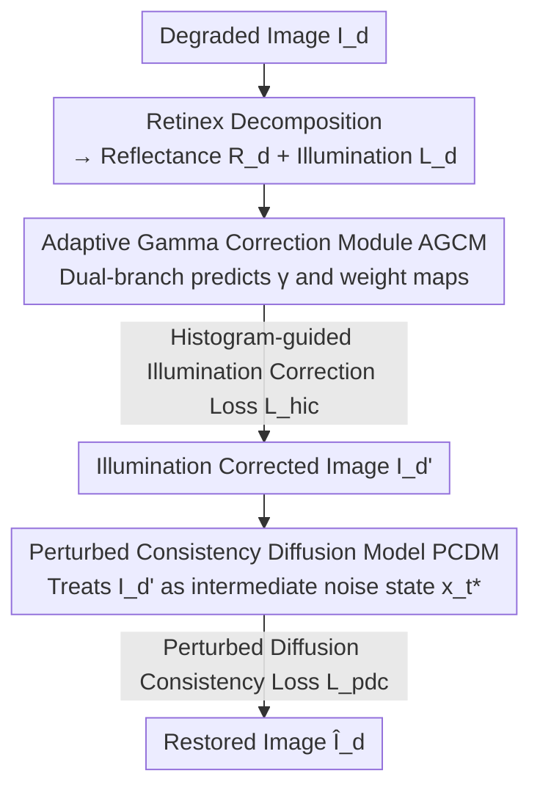

# ZeroIDIR: Zero-Reference Illumination Degradation Image Restoration with Perturbed Consistency Diffusion Models

**Conference**: CVPR 2026  
**arXiv**: [2605.11435](https://arxiv.org/abs/2605.11435)  
**Code**: https://github.com/JianghaiSCU/ZeroIDIR (Available)  
**Area**: Image Restoration / Low-light Enhancement / Diffusion Models  
**Keywords**: Zero-reference, Illumination degradation restoration, Adaptive Gamma correction, Perturbed consistency diffusion, Retinex

## TL;DR
ZeroIDIR decomposes illumination degradation image restoration into two steps: "Adaptive Illumination Correction + Diffusion Reconstruction." **It is trained exclusively on degraded images without any reference images or paired data**. First, the Adaptive Gamma Correction Module (AGCM) shifts the exposure to a natural distribution. Then, this corrected result is treated as an intermediate noise state and fed into the Perturbed Consistency Diffusion Model (PCDM) for detail refinement and denoising. It achieves leading performance among unsupervised methods and shows generalization to unseen scenes that even surpasses supervised methods.

## Background & Motivation

**Background**: Illumination Degradation Image Restoration (IDIR) requires simultaneously handling diverse scenarios including low-light, backlighting, and under/over-exposure. Traditional approaches rely on hand-crafted priors (Histogram Equalization, Retinex), while deep learning methods learn direct mappings from degraded to normal-light images using large-scale paired data. Recently, diffusion models have been introduced to IDIR to further improve perceptual quality due to their strong generative capabilities.

**Limitations of Prior Work**: Supervised methods (including supervised diffusion) heavily rely on paired data, which constrains the learned distribution and results in **poor generalization to unseen real-world scenes**. They perform well on training sets but suffer from over-exposure, noise amplification, and blurred details on different datasets. Among unsupervised routes, zero-shot methods leverage pre-trained diffusion priors but are limited by the capacity of pre-trained models and restricted degradation assumptions. Unpaired training methods struggle with the distribution mismatch between degraded images and unpaired normal-light references.

**Key Challenge**: Diffusion models excel at generating high-frequency details but exhibit **systematic bias in low-frequency generation (especially exposure)**. Directly using a single diffusion model to handle both exposure correction and detail reconstruction causes these two tasks to interfere with each other, leading to inaccurate exposure and lost details.

**Goal**: To unifiedly handle three categories of tasks—Low-Light Image Enhancement (LLIE), Backlit Image Enhancement (BIE), and Multi-Exposure Correction (MEC)—under the premise of **zero reference/paired data**, while ensuring generalization to real-world scenarios.

**Key Insight**: Since diffusion models have a weakness in "low-frequency exposure control" but a strength in "high-frequency detail generation," the **exposure correction should be decoupled from the diffusion process**. An independent module first corrects the illumination to a natural distribution, allowing the diffusion model to focus solely on detail reconstruction and denoising.

**Core Idea**: The restoration pipeline is decoupled into "AGCM Adaptive Illumination Correction → PCDM Diffusion Reconstruction." The corrected image is **reinterpreted as an intermediate noise state** on the diffusion trajectory. This allows for the construction of diffusion training samples without a clean target $\mathbf{x}_0$, enabling zero-reference training.

## Method

### Overall Architecture
Given a degraded image $I_d$, ZeroIDIR follows a two-step process. **Step 1: Illumination Correction**: Retinex decomposition splits the image into a reflectance map $\mathbf{R}_d$ (content information, assumed invariant to light) and an illumination map $\mathbf{L}_d$ (brightness and contrast). The Adaptive Gamma Correction Module (AGCM) performs spatially adaptive exposure correction only on $\mathbf{L}_d$ to obtain the illumination-corrected image $I_d'$. **Step 2: Diffusion Reconstruction**: $I_d'$ is treated as the intermediate noise state $\mathbf{x}_{t^*}$ and fed into the Perturbed Consistency Diffusion Model (PCDM). Leveraging the generative and denoising capabilities of diffusion, it restores details and suppresses noise to output the final restored image $\hat{I}_d$. The entire pipeline is trained only on low-quality degraded images without any reference or paired supervision.

### Key Designs

**1. Retinex Decoupling + Adaptive Gamma Correction Module (AGCM): Correcting exposure before diffusion**

To address the bias of diffusion models regarding low-frequency exposure, AGCM handles exposure correction independently at the front end. Crucially, it **operates only on the illumination component**: Retinex decomposes $I_d$ into $\mathbf{R}_d$ and $\mathbf{L}_d$, and correction is applied solely to $\mathbf{L}_d$. This preserves the content structure in the reflectance map and avoids amplifying residual noise in dark areas. The module uses two branches: concatenating $\mathbf{L}_d$ and $\mathbf{R}_d$ through convolutional blocks to obtain structure-guided illumination-aware features $\mathcal{F}_s$, while $\mathbf{L}_d$ itself acts as a global exposure prior through Channel Attention (CA) to predict two **spatially-varying** Gamma maps $\{\gamma_u, \gamma_o\} \in \mathbb{R}^{H \times W \times 1}$ for under- and over-exposed regions respectively. Spatial weight maps $\{\mathcal{W}_u, \mathcal{W}_o\}$ predicted from $\mathcal{F}_s$ adaptively balance the contributions. The corrected illumination map is:

$$\mathbf{L}_d' = \mathcal{W}_u \mathbf{L}_d^{\gamma_u} + \mathcal{W}_o \mathbf{L}_d^{\gamma_o},$$

which is then multiplied by the reflectance map: $I_d' = \mathbf{L}_d' \odot \mathbf{R}_d$. Compared to traditional global Gamma correction, these pixel-wise maps can simultaneously handle under-exposed and over-exposed regions within a single image.

**2. Histogram-guided Illumination Correction Loss $\mathcal{L}_{hic}$: Using natural exposure statistics as an anchor**

Without normal-light targets for alignment in a zero-reference setting, AGCM needs a target for exposure levels. The authors observed that the illumination histograms of normal-light images across multiple benchmarks exhibit a **stable and concentrated distribution**. By aggregating histograms from approximately 20k normal-light images, an empirical prior distribution $\mathbf{H}_{\text{prior}}$ is formed. The corrected illumination histogram is then pulled toward this prior using KL divergence:

$$\mathcal{L}_{hic} = D_{KL}\big(\mathcal{H}(\mathbf{L}_d') \,\|\, \mathbf{H}_{\text{prior}}\big),$$

where $\mathcal{H}(\cdot)$ is the histogram operator. This loss injects the statistical knowledge of "natural exposure appearance" into training, replacing missing reference images with real-world exposure statistics.

**3. Perturbed Consistency Diffusion Model (PCDM): Reinterpreting corrected images as intermediate states**

While AGCM corrects exposure, it may still leave noise and lost details. PCDM fills these gaps. Since clean targets $\mathbf{x}_0$ are unavailable, standard forward diffusion $\mathbf{x}_t = \sqrt{\bar\alpha_t}\mathbf{x}_0 + \sqrt{1-\bar\alpha_t}\boldsymbol{\epsilon}_t$ cannot be performed. The key insight of PCDM is to **treat the corrected image $I_d'$ as a partially diffused version (at timestep $t^*$) of its unknown high-quality counterpart**, denoted as $\mathbf{x}_{t^*}$. To construct training samples, further noise is added to $\mathbf{x}_{t^*}$ for $\Delta t$ steps:

$$\mathbf{x}_t = \sqrt{\tfrac{\bar\alpha_t}{\bar\alpha_{t^*}}}\,\mathbf{x}_{t^*} + \sqrt{1-\tfrac{\bar\alpha_t}{\bar\alpha_{t^*}}}\,\boldsymbol{\epsilon}_t,\quad t = t^*+\Delta t,$$

with $t^*$ and $\Delta t$ randomly sampled. The denoising network $\boldsymbol{\epsilon}_\theta$ is trained with the standard loss $\mathcal{L}_{diff} = \|\boldsymbol{\epsilon}_t - \boldsymbol{\epsilon}_\theta(\mathbf{x}_t, t, \mathbf{y})\|_2$. Crucially, the **condition $\mathbf{y}$ is the corrected image $I_d'$ rather than the original degraded image**, allowing the diffusion model to ignore exposure and focus on detail reconstruction.

**4. Perturbed Diffusion Consistency Loss $\mathcal{L}_{pdc}$: Constraining trajectories to the intermediate state**

To prevent the diffusion trajectory from drifting and generating artifacts in the absence of supervision, $\mathcal{L}_{pdc}$ is introduced. It estimates the clean image $\hat{\mathbf{x}}_0$ from the predicted noise, diffuses it forward by $t^*$ steps to get the reconstructed state $\hat{\mathbf{x}}_{t^*} = \sqrt{\bar\alpha_{t^*}}\hat{\mathbf{x}}_0 + \sqrt{1-\bar\alpha_{t^*}}\boldsymbol{\epsilon}_{t^*}$, and enforces consistency with the original intermediate state $\mathbf{x}_{t^*}$ in VGG-16 feature space:

$$\mathcal{L}_{pdc} = \big\|\phi(\mathbf{x}_{t^*}) - \phi\big(\sqrt{\bar\alpha_{t^*}}\hat{\mathbf{x}}_0 + \sqrt{1-\bar\alpha_{t^*}}\boldsymbol{\epsilon}_{t^*}\big)\big\|_2,$$

where $\phi(\cdot)$ denotes VGG-16. This ensures the output remains faithful to the AGCM correction result while improving stability.

### Loss & Training
A **two-stage training** strategy is used with approximately 10k low-quality degraded images:

- **Stage 1 (Train AGCM, freeze PCDM)**: $\mathcal{L}_{stage1} = \mathcal{L}_{exp} + \lambda_1\mathcal{L}_{hic} + \lambda_2\mathcal{L}_{eatv}$. $\mathcal{L}_{exp}$ is the exposure control loss from Zero-DCE; $\mathcal{L}_{eatv}$ is an edge-aware total variation loss $\sum_{i\in\{u,o\}}\|\nabla\gamma_i\cdot\exp(-\lambda_g\nabla\mathbf{R}_d)\|_2$ for smoothness.
- **Stage 2 (Train PCDM, freeze AGCM)**: $\mathcal{L}_{stage2} = \mathcal{L}_{diff} + \lambda_3\mathcal{L}_{pdc}$.
- Hyperparameters $\lambda_1, \lambda_2, \lambda_3, \lambda_g = 0.5, 0.1, 1.0, 20.0$; $T=1000$ (20 steps for sampling), $t^* \in [0, 50]$, $\Delta t \sim \mathcal{U}(t^*, T-t^*)$.

## Key Experimental Results

### Main Results
ZeroIDIR was compared against Supervised Learning (SL) and Unsupervised Learning (UL) methods across LLIE, BIE, and MEC tasks.

**Low-Light Image Enhancement (LLIE)** — Outperforms nearly all unsupervised methods and even exceeds supervised methods on LSRW/MIT5K (indicating better generalization):

| Dataset | Metric | ZeroIDIR | Best Unsupervised Competitor | Note |
|-------|------|----------|----------------|------|
| LOL | PSNR / SSIM / LPIPS | 20.874 / 0.811 / 0.167 | LightenDiff 20.190 / 0.809 / 0.182 | Best in UL |
| LSRW | PSNR / SSIM / LPIPS | 18.823 / 0.563 / 0.301 | LightenDiff 18.388 / 0.525 / 0.313 | Beats SL UHDFour (17.300) |
| MIT5K | PSNR / SSIM / LPIPS | 20.327 / 0.806 / 0.151 | LightenDiff 21.248 / 0.799 / 0.181 | Best LPIPS/SSIM |

**Backlit Image Enhancement (BIE)** — Ranked first in both distortion and perceptual metrics:

| Dataset | Metric | ZeroIDIR | Second Best |
|-------|------|----------|------|
| BAID | PSNR / SSIM / LPIPS | 21.753 / 0.871 / 0.133 | CLIP-LIT 21.705 / 0.862 / 0.151 |
| Backlit300 | NIQE↓ / CLIPIQA↑ | 3.070 / 0.563 | LightenDiff 3.559 / 0.499 |

**Multi-Exposure Correction (MEC)** — Best on SICE for distortion and perception, demonstrating cross-dataset generalization:

| Dataset | Subset | Metric | ZeroIDIR | Note |
|-------|------|------|----------|------|
| SICE | Under | PSNR / SSIM / LPIPS | 18.573 / 0.659 / 0.215 | Best including SL |
| SICE | Over | PSNR / SSIM / LPIPS | 16.975 / 0.661 / 0.259 | Best including SL |

### Ablation Study

AGCM Ablations (LOL / SICE-over, PSNR):

| Configuration | LOL PSNR | SICE-over PSNR | Note |
|------|---------|----------------|------|
| Trad. GC $\gamma=0.3/6.0$ | 16.332 | 13.890 | Global Gamma lacks versatility |
| w/o Retinex | 18.378 | 14.434 | Amplifies noise/color bias |
| w/o $\mathcal{L}_{hic}$ | 18.406 | 14.032 | Unstable exposure correction |
| Default (AGCM) | 19.599 | 14.506 | Full AGCM |

PCDM Ablations (LOL / SICE-over, PSNR):

| Configuration | LOL PSNR | SICE-over PSNR | Note |
|------|---------|----------------|------|
| GC + PCDM | 18.369 | 15.562 | PCDM still improves trad. GC |
| $\mathbf{y}=I_d$ | 17.571 | 15.520 | Exposure bias reintroduced |
| w/o $\mathcal{L}_{pdc}$ | 19.780 | 16.012 | Trajectory drift / Artifacts |
| Default (PCDM) | 20.874 | 16.975 | Full model |

### Key Findings
- **Decoupling is the primary performance driver**: Changing the condition from $\mathbf{y}=I_d$ to $I_d'$ improved LOL PSNR from 17.571 → 20.874, proving the effectiveness of removing exposure from diffusion.
- **Retinex decomposition is essential**: Removing it amplifies noise in dark regions, showing that correction should specifically target the illumination component.
- **Generalization advantage**: While SL methods are stronger on their own training sets (LOL), ZeroIDIR outperforms them on unseen datasets (LSRW/MIT5K/SICE).

## Highlights & Insights
- **Clever reinterpretation of the corrected image**: Treating $I_d'$ as a diffusion state $\mathbf{x}_{t^*}$ allows the training of diffusion models without clean targets $\mathbf{x}_0$.
- **Targeted fix for Diffusion Bias**: Instead of forcing a single model to do everything, the low-frequency exposure (a Diffusion weakness) is delegated to AGCM, while high-frequency details (a Diffusion strength) are left to PCDM.
- **Statistical Priors over Reference Images**: The histogram-guided loss encodes "natural exposure" as a reusable statistical trick for any task lacking paired labels but possessing natural distribution data.

## Limitations & Future Work
- **Dependency on Retinex quality**: The process assumes clean reflectance/illumination separation; failure in decomposition propagates downstream.
- **Representativeness of Priors**: $\mathbf{H}_{\text{prior}}$ might pull artistic or non-standard exposures toward the "average natural" look.
- **Zero-reference vs. Supervised Gap**: It still lags behind SL methods on their training distribution (e.g., LOL).

## Related Work & Insights
- **vs. Supervised Diffusion (Reti-Diff)**: These are constrained by paired data; Ours generalizes better by decoupling exposure.
- **vs. Zero-shot Diffusion (AGLLDiff)**: Zero-shot methods rely on pre-trained priors and can suffer from artifacts; Ours is purpose-trained and higher quality.
- **vs. Unsupervised Curves (Zero-DCE)**: Those lack generative detail reconstruction; Ours adds PCDM to significantly enhance denoising and detail.

## Rating
- Novelty: ⭐⭐⭐⭐⭐ 
- Experimental Thoroughness: ⭐⭐⭐⭐⭐ 
- Writing Quality: ⭐⭐⭐⭐ 
- Value: ⭐⭐⭐⭐⭐ 

<!-- RELATED:START -->

## Related Papers

- [\[CVPR 2026\] Self-supervised Dynamic Heterogeneous Degradation Modeling for Unified Zero-Shot Image Restoration](self-supervised_dynamic_heterogeneous_degradation_modeling_for_unified_zero-shot.md)
- [\[CVPR 2026\] PnP-CM: Consistency Models as Plug-and-Play Priors for Inverse Problems](pnp-cm_consistency_models_as_plug-and-play_priors_for_inverse_problems.md)
- [\[CVPR 2026\] Event-Illumination Collaborative Low-light Image Enhancement with a High-resolution Real-world Dataset](event-illumination_collaborative_low-light_image_enhancement_with_a_high-resolut.md)
- [\[CVPR 2026\] Degradation-Robust Fusion: An Efficient Degradation-Aware Diffusion Framework for Multimodal Image Fusion in Arbitrary Degradation Scenarios](degradation-robust_fusion_an_efficient_degradation-aware_diffusion_framework_for.md)
- [\[CVPR 2026\] MR. Illuminate: Zero-Shot Low-Light Image Enhancement with Diffusion Prior](mr_illuminate_zero-shot_low-light_image_enhancement_with_diffusion_prior.md)

<!-- RELATED:END -->
