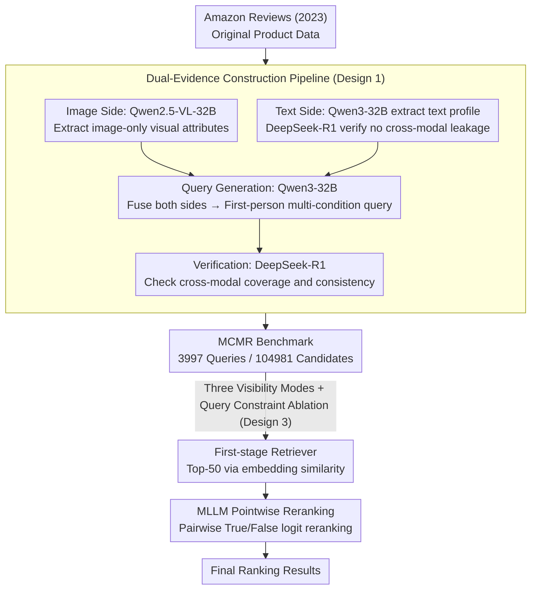

# Beyond Global Similarity: Towards Fine-Grained, Multi-Condition Multimodal Retrieval

**Conference**: CVPR 2026  
**arXiv**: [2603.01082](https://arxiv.org/abs/2603.01082)  
**Code**: [github.com/EIT-NLP/MCMR](https://github.com/EIT-NLP/MCMR)  
**Area**: Information Retrieval  
**Keywords**: multi-condition retrieval, fine-grained matching, dual-evidence, MLLM reranking, cross-modal reasoning

## TL;DR

Proposes the MCMR (Multi-Conditional Multimodal Retrieval) large-scale benchmark. Through a dual-evidence design (where certain attributes are inferable only from images and others only from text), it ensures that retrieval tasks cannot be solved using a single modality. This work systematically evaluates 5 retrievers and 7 MLLM rerankers, revealing significant modality asymmetry and gaps in fine-grained reasoning.

## Background & Motivation

**Background**: Multimodal retrieval has evolved from global semantic alignment in the CLIP era to instruction-conditioned retrieval based on MLLMs (e.g., VLM2Vec, GME, MM-Embed). However, evaluation benchmarks remain limited to coarse-grained or single-condition matching.

**Limitations of Prior Work**:

1. Classic benchmarks (MS-COCO, Flickr30K) only evaluate global image-text alignment without compositional reasoning.
2. Fine-grained benchmarks like FashionIQ and CIRR focus on single visual editing, which can essentially be solved using only images.
3. Multi-condition benchmarks like MultiConIR operate solely in text-only settings without cross-modal components.
4. MERIT introduces interleaved multimodal queries but relies on reference image comparison and does not distinguish between visual vs. text attribute sources.

**Key Challenge**: Existing benchmarks are either fine-grained but single-condition, or multi-condition but single-modality. No benchmark simultaneously satisfies the three dimensions of fine-grained attributes, multi-condition queries, and cross-modal evidence.

**Goal**: Construct a retrieval benchmark that truly tests cross-modal compositional reasoning capabilities.

**Key Insight**: Design a "dual-evidence" constraint—each product must contain at least one attribute inferable only from the image and at least one inferable only from the text.

**Core Idea**: The dual-evidence design makes the task impossible for single modalities to solve, thereby truly testing the model's cross-modal compositional reasoning capability.

## Method

### Overall Architecture

MCMR aims to create a multimodal retrieval benchmark that cannot be solved by either image or text alone. Users describe desired products using first-person natural language, and the system must accurately recall the item from hundreds of thousands of candidates, with discriminative clues intentionally split between image and text sides. The work consists of two parts: a multi-stage pipeline (attribute extraction → quality filtering → query generation → verification) to generate data from Amazon Reviews (2023), and the evaluation of retrievers and rerankers under a unified protocol. It covers five domains (Tops, Bottoms, Jewelry, Shoes, Furniture), with 3,997 queries against 104,981 candidate products.

| Domain | Queries | Candidates |
|--------|---------|------------|
| Tops | 991 | 29,986 |
| Bottoms | 803 | 29,514 |
| Shoes | 847 | 24,997 |
| Jewelry | 602 | 5,491 |
| Furniture | 754 | 14,993 |
| **Total** | **3,997** | **104,981** |

### Key Designs

**1. Dual-Evidence Data Construction Pipeline: Enforcing Cross-Modal Dependencies**

Unlike previous benchmarks (FashionIQ, CIRR) that can be solved by looking at images alone, or MultiConIR which stays in pure text, MCMR's core constraint is that every item must have at least one "image-only inferable" attribute and one "text-only inferable" attribute. In implementation, the image side uses Qwen2.5-VL-32B to generate structured visual summaries (color, texture, structural details) from product images, strictly excluding functional/speculative content. The text side uses Qwen3-32B to extract JSON profiles from titles/descriptions, verified by DeepSeek-R1 for no cross-modal leakage. Queries are generated by Qwen3-32B fusing both sides and verified independently. A double-blind study of 100 samples confirmed that generated queries match the quality of human-written ones (4.33 vs 4.41, preference rate 47% vs 49%).

**2. MLLM Pointwise Reranking: Compensating for Coarse Embedding Retrieval**

Global embedding similarity can filter candidates but fails to rank fine details accurately. MCMR takes the top-50 from first-stage retrievers and uses MLLMs to judge relevance for each "query-candidate" pair. Inputs include the text query, candidate image, and candidate text metadata. The model outputs normalized True/False logits as relevance scores. Evaluating seven rerankers, lychee-reranker-mm performed best across all cutoffs (nDCG@1=92.35), showing a massive gap compared to the best first-stage retriever, CORAL (26.57).

**3. Three Candidate Visibilities + Query-side Ablation: Deconstructing Modality Contribution**

To verify that the dual-evidence constraint forces cross-modal dependence, evaluation uses three candidate visibilities: Fused (Image+Text), Image-only, and Text-only. Simultaneously, query-side ablation is performed (retaining all constraints, removing image constraints, or removing text constraints) while scanning the number of constraints $k_T = k_I \in \{1,2,3,4,5\}$. This design identifies which modality clues a model relies on.

## Key Experimental Results

### Main Results: Comparison of Retrievers under Fused Modality

| Model | Parameters | R@1 | R@10 | R@100 | MRR | nDCG@10 |
|-------|------------|-----|------|-------|-----|---------|
| CORAL | 3B | 26.57 | 53.34 | 77.73 | 34.94 | 39.35 |
| LLaVE | 7B | 24.99 | 53.13 | 78.64 | 33.15 | 37.88 |
| MM-EMBED | 8B | 21.74 | 47.91 | 74.16 | 29.35 | 33.75 |
| GME-Qwen2VL | 7B | 21.23 | 45.74 | 73.52 | 28.35 | 32.48 |
| LamRA | 7B | 17.96 | 43.30 | 73.24 | 25.27 | 29.53 |
| VLM2Vec | 4B | 1.83 | 7.03 | 18.96 | 3.11 | 4.02 |

### MLLM Reranker Comparison (on LLaVE top-50 pool)

| Reranker | Parameters | nDCG@1 | nDCG@5 | nDCG@10 | nDCG@50 |
|----------|------------|--------|--------|---------|---------|
| lychee-reranker-mm | 8B | **92.35** | **93.41** | **94.42** | **94.86** |
| InternVL3 | 8B | 80.28 | 81.95 | 84.66 | 86.61 |
| Qwen3-VL-Reranker | 8B | 78.69 | 80.79 | 83.51 | 85.57 |
| Qwen2.5-VL | 32B | 78.22 | 79.87 | 82.58 | 84.88 |
| Qwen2.5-VL | 7B | 74.16 | 77.26 | 80.26 | 82.84 |

### Ablation Study: Impact of Modality Visibility on Candidate Side (R@10)

| Setting | GME | LLaVE | MM-EMBED | CORAL |
|---------|-----|-------|----------|-------|
| Fused | 45.74 | 53.13 | 47.91 | 53.34 |
| Image-only | **51.10** | 3.93 | 35.68 | 33.53 |
| Text-only | 29.60 | 29.43 | 34.50 | 22.88 |

### Key Findings

- R@1 is only 18-27% while R@100 reaches 78%: Coarse retrieval is feasible, but fine-grained ranking is extremely difficult.
- Significant modality asymmetry: GME's R@10 actually increases in the image-only setting (51.10 vs 45.74), while LLaVE's collapses from 53.13 to 3.93.
- Text-only is consistently weaker than fused and image-only; visual clues are the primary discriminative features in MCMR.
- MLLM reranking improves nDCG@1 from 26.57 (best first-stage CORAL) to 92.35 (lychee-reranker), showing a massive gap.
- Increasing the number of query constraints ($1T+1I \rightarrow 5T+5I$) monotonically improves R@10 with diminishing returns.

## Highlights & Insights

- The first multimodal retrieval benchmark to simultaneously satisfy fine-grained attributes, multi-condition queries, and cross-modal evidence.
- The "dual-evidence" design ensures the task cannot be solved by a single modality, truly testing cross-modal integration.
- The significant performance gap between first-stage retrievers and rerankers (nDCG@1: 26.57 vs 92.35) reveals fundamental limitations of embedding-based global matching.
- Identifies a complementary pattern where visual clues dominate top-rank precision while text metadata stabilizes long-tail ranking.
- Human verification confirms that auto-generated queries are indistinguishable in quality from human-written ones.

## Limitations & Future Work

- Currently covers only product/e-commerce domains (5 categories) and has not expanded to general scenarios (news, medical, scientific literature).
- Queries consist entirely of text; interleaved image-text queries (e.g., "Find something like this image but made of cotton") were not explored.
- Candidate pool size is ~100k, short of real-world e-commerce systems (millions/billions); scalability remains to be verified.
- Pointwise reranking is computationally expensive and cannot be directly applied to large-scale retrieval without more efficient solutions.
- Parameter count does not dictate reranking ability: Qwen2.5-VL (32B) is outperformed by lychee-reranker (8B), but the underlying reasons lack analysis.

## Related Work & Insights

- **vs MERIT**: MERIT relies on reference image comparisons; MCMR's pure text queries better reflect real-world user search habits. MERIT also does not differentiate attribute source modalities.
- **vs MultiConIR**: MultiConIR conducts multi-condition retrieval in a pure text setting; MCMR extends this to cross-modal environments.
- **vs FashionIQ/CIRR**: These single visual-editing benchmarks allow attributes to be verified solely from images; MCMR's dual-evidence design is more challenging.
- Insight: Future research could explore hierarchical retrieval architectures that decompose multi-conditions into sub-tasks or introduce condition-aware sparse attention during the retrieval stage.

## Rating

- Novelty: ⭐⭐⭐⭐ Original benchmark design satisfying three dimensions; introduction of dual-evidence is valuable.
- Experimental Thoroughness: ⭐⭐⭐⭐⭐ Comprehensive coverage of 5 retrievers + 7 rerankers, 3 modality settings, and ablations on both candidate and query sides.
- Writing Quality: ⭐⭐⭐⭐ Clearly defined problems, in-depth experimental analysis, and intuitive comparison tables.
- Value: ⭐⭐⭐⭐ Fills a gap in multi-condition cross-modal retrieval benchmarks; the analysis of the gap between rerankers and retrievers provides significant guidance.

<!-- RELATED:START -->

## Related Papers

- [\[CVPR 2026\] Language-driven Fine-grained Retrieval](language-driven_fine-grained_retrieval.md)
- [\[CVPR 2026\] POGA: Paraphrased and Oppositional Graph Alignment for Fine-Grained Cross-Modal Retrieval](poga_paraphrased_and_oppositional_graph_alignment_for_fine-grained_cross-modal_r.md)
- [\[CVPR 2026\] MuCo: Multi-turn Contrastive Learning for Multimodal Embedding Model](muco_multi-turn_contrastive_learning_for_multimodal_embedding_model.md)
- [\[CVPR 2026\] M4-RAG: A Massive-Scale Multilingual Multi-Cultural Multimodal RAG](m4-rag_a_massive-scale_multilingual_multi-cultural_multimodal_rag.md)
- [\[ACL 2025\] Atomic LLM: A Fine-Grained Information Retrieval Evaluation Benchmark for Language Models](../../ACL2025/information_retrieval/atomic_llm_a_fine-grained_information_retrieval_evaluation_benchmark_for_languag.md)

<!-- RELATED:END -->
