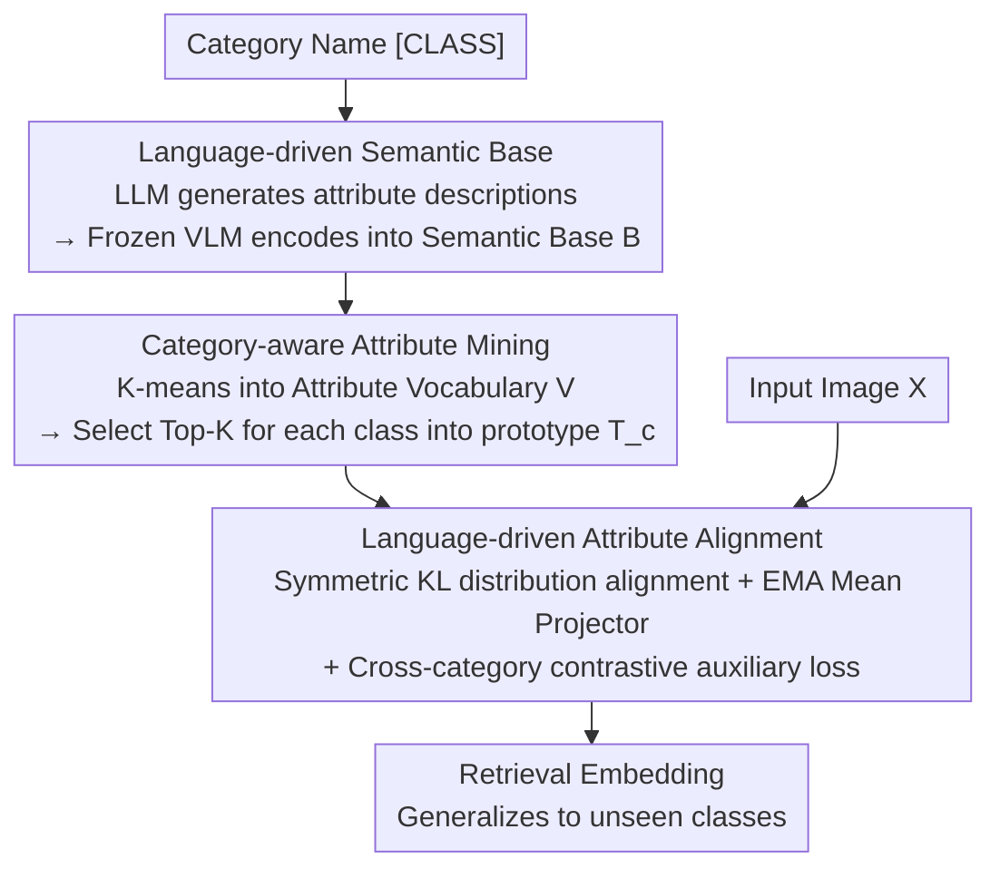

# Language-driven Fine-grained Retrieval

**Conference**: CVPR 2026  
**Paper**: [CVF Open Access](https://openaccess.thecvf.com/content/CVPR2026/html/Wang_Language-driven_Fine-grained_Retrieval_CVPR_2026_paper.html)  
**Code**: To be confirmed  
**Area**: Information Retrieval  
**Keywords**: Fine-grained Image Retrieval, Language-driven Supervision, Attribute Vocabulary, LLM+VLM, Unseen Class Generalization

## TL;DR
LaFG replaces the semantically sparse one-hot category name supervision in Fine-Grained Image Retrieval (FGIR) with "attribute-level language prototypes." It leverages an LLM to expand category names into attribute descriptions, uses a frozen VLM to encode and cluster these into a dataset-level attribute vocabulary, and aggregates the Top-K attributes per category into prototypes to supervise the retrieval model. This establishes comparability across inter-class details, achieving SOTA results on CUB / Cars / SOP while significantly improving generalization to unseen classes.

## Background & Motivation

**Background**: Fine-Grained Image Retrieval (FGIR) aims to retrieve visually similar images of the **same sub-category** under a broad category (e.g., identifying the same bird species or car model), and requires retrieval capabilities for **unseen sub-categories** not present during training. Dominant approaches (localization-based or metric-based) typically use **one-hot encoding** of category names as supervision to learn a discriminative embedding space.

**Limitations of Prior Work**: One-hot supervision is semantically extremely sparse—it compresses category names into global identifiers, discarding part/attribute-level information such as "head" or "wing patterns." Consequently, when facing unseen classes, visually similar local regions (e.g., similar wing patterns of different bird species) collapse into nearly identical representations in the embedding space, failing to capture the comparability between fine-grained details and leading to a breakdown in generalization.

**Key Challenge**: The essence of FGIR is "comparing details," but one-hot supervision only informs the model that "this is Category A and that is Category B." It **never explicitly tells the model which attributes A and B share or lack**—specifically missing the supervision required for cross-category detail comparability.

**Goal**: To redefine category names from simple "indices" to "semantic anchors" by automatically **generating → purifying → aligning** a set of attribute-level supervision signals to replace one-hot labels.

**Key Insight**: LLMs can generate batch attribute descriptions based on category names, and the text encoder of a VLM (such as CLIP) can project these descriptions into a "vision-aligned" semantic space. Coupling the two allows expanding category names into vision-alignable attribute supervision. However, raw LLM outputs are often incomplete, redundant, or noisy. The key is to design a framework that automatically denoises, completes, and aligns these descriptions with visual evidence.

**Core Idea**: Use LLM+VLM to expand category names into a "dataset-level attribute vocabulary → category language prototypes," and then use distribution alignment to guide visual features toward details consistent with the linguistic descriptions, thereby explicitly modeling detail comparability.

## Method

### Overall Architecture
LaFG is a three-stage pipeline consisting of "Generation → Purification → Alignment." The input is the category name (plus training images), and the output is a retrieval embedding model that generalizes to unseen classes.

Stage 1: **Language-driven Semantic Base**: Uses an LLM (e.g., GPT-4) to expand each category name into $n$ attribute-oriented descriptions via prompts, which are then encoded by a frozen VLM text encoder $\Phi_t$ into a vision-aligned space to form the semantic base $\mathcal{B}$. Stage 2: **Category-aware Attribute Mining**: Performs K-means clustering on description embeddings across all classes to form a dataset-level attribute vocabulary $\mathcal{V}$ (for denoising and completion via related classes). Then, the category embedding of "a photo of [CLASS]" is used as a query to select the Top-K most relevant attributes for each category, adaptively aggregating them into a category language prototype $T_c$ to replace the one-hot label. Stage 3: **Language-driven Attribute Alignment**: Uses two modality-specific projectors to map visual embeddings and language prototypes into an attribute-aligned space, performing **distribution** alignment via symmetric KL divergence (equipped with an EMA mean projector to prevent collapse), guiding the retrieval model toward visual details consistent with language descriptions; a cross-category contrastive auxiliary loss is added.

### Key Designs

**1. Language-driven Semantic Base: Expanding one-hot category names into vision-aligned attribute embeddings**

Addressing the "sparse one-hot semantics" issue. Using category names as semantic anchors, a frozen LLM follows a fine-grained prompt (requiring the generation of $n$ descriptions containing global semantics, fine-grained texture details, and distinguishing features from visually similar sub-categories) for each sub-category $c$ to generate a description set $D_c$. A frozen VLM text encoder $\Phi_t$ is then used to encode each description into a **vision-aligned** semantic manifold, yielding the category's attribute embedding set $\mathcal{B}_c=\{\Phi_t(D_c^i)\mid D_c^i\in D_c\}\in\mathbb{R}^{n\times d}$. These are stacked into the semantic base $\mathcal{B}=[\mathcal{B}_1,\cdots,\mathcal{B}_C]\in\mathbb{R}^{C\times n\times d}$. The key is leveraging the VLM’s ability to "understand language from a visual perspective," ensuring text attributes land in a space alignable with image features. Compared to using category names directly or manual templates, LLM-generated descriptions carry much richer discriminative details.

**2. Category-aware Attribute Mining: Clustering into an attribute vocabulary for denoising/completion, then aggregating Top-K into prototypes**

Addressing the issue that "raw LLM descriptions are incomplete, redundant, and noisy." Instead of directly fusing text for each category, the authors perform K-means clustering on all description embeddings across the training set to form $|N|$ universal attributes, constituting the dataset-level attribute vocabulary $\mathcal{V}=\mathcal{K}(\mathcal{B},|N|)=\{a_i\}_{i=1}^{|N|}$. Each cluster center $a_i$ represents a common semantic pattern recurring across multiple descriptions. The vocabulary serves two purposes: **denoising** (merging duplicate semantics, filtering out noise) and **completion** (borrowing complementary attributes from visually related classes). Subsequently, category-aware selection is performed: "a photo of [CLASS]" is generated and encoded into $t_c$ (approximating the semantic center), which acts as a query to retrieve the Top-K attributes $\mathcal{V}_c$ from the vocabulary, fused adaptively into the category prototype:

$$T_c = t_c + \sum_{k=1}^{K}\sigma\!\big(t_c^{\top}a_k\big)\cdot a_k,$$

where $\sigma(\cdot)$ performs softmax normalization on the similarities between $t_c$ and $a_k$. This $T_c$ serves as the attribute-level supervision target replacing the one-hot label—it is more robust than single LLM descriptions (via clustering) and more specific than category names (via Top-K attributes).

**3. Language-driven Attribute Alignment: Distribution-level KL alignment + EMA Mean Projector to prevent premature collapse**

Addressing "how to truly align visual cues in images with attribute-level prototypes." For an input image $X$, the retrieval model $\mathcal{F}$ extracts embedding $V\in\mathbb{R}^d$. Two modality-specific linear projectors $P_v$ (visual) and $P_t$ (language prototype) map $V$ and its category prototype $T_c$ into an attribute-aligned space. Since each projector only sees a single modality, they learn the attribute distribution of that modality; if both projectors produce the **same distribution** for the same embedding, the embedding is modality-invariant. This is quantified via symmetric KL divergence $\hat{\mathcal{L}}_{ali}$.

To prevent **premature convergence** where projectors simply copy each other's outputs without establishing true distribution alignment, the authors introduce a **Mean Projector**. Using Exponential Moving Average (EMA), they maintain parameters $E^{(t)}[\theta]=(1-\alpha)E^{(t-1)}[\theta]+\alpha\theta$ and rewrite the symmetric KL into $\mathcal{L}_{ali}$ against the mean projector. Since the mean projector is gradient-free, $\mathcal{L}_{ali}$ solely optimizes the retrieval model, forcing visual distributions to match category prototypes and allowing language attributes to attend to multiple visual regions. **Aligning distributions rather than single embeddings** is crucial for preserving instance-specific cues while maintaining alignment with language.

### Loss & Training
- Cross-category contrastive auxiliary loss $\mathcal{L}_{aux}$: Sampling $N$ classes with 2 instances each per batch ($K=2N$), pulling anchor $z_i$ towards same-class positive $z_j$ and pushing others away, $\mathcal{L}_{aux}(z_i)=-\log\frac{\exp(-D(z_i,z_j)/\tau)}{\sum_{k\neq i}\exp(-D(z_i,z_k)/\tau)}$, where $D$ is the squared Euclidean distance of normalized vectors and $\tau$ is temperature.
- Total loss $\mathcal{L}=\mathcal{L}_{aux}+\beta\cdot\mathcal{L}_{ali}$, where $\beta$ balances the terms.
- Backbone: ImageNet pre-trained ViT, input $256\times256$ randomly cropped to $224\times224$, SGD (lr $1\times10^{-5}$, momentum 0.9, weight decay $1\times10^{-4}$), batch 900, 200 epochs.

## Key Experimental Results

**Metric Description**: **Recall@K (R@K)**—For each query, get the Top-$M$ similar images; if at least one is a same-class positive, it counts as 1. Testing classes are **strictly non-overlapping** with training classes to evaluate generalization to unseen categories.

### Main Results
Datasets: CUB-200-2011 (first 100 classes training, last 100 testing), Stanford Cars 196 (98/98), Stanford Online Products (SOP, ~11k training / ~11k testing).

| Method | Backbone | CUB R@1 | CUB R@2 | CUB R@4 |
|------|------|---------|---------|---------|
| DIML (TPAMI24) | ViT | 76.7 | - | - |
| HypViT (CVPR22) | ViT | 85.6 | 91.4 | 94.8 |
| HIER (CVPR23) | ViT | 85.7 | 91.3 | 94.4 |
| DDML (AAAI25) | ViT | 86.0 | 91.7 | 95.2 |
| VPTSP-GI (ICLR24) | ViT | 86.6 | 91.7 | 94.8 |
| **Ours LaFG** | ViT | **87.2** | **92.4** | **95.2** |

LaFG outperforms the strongest competitor VPTSP-GI by 0.6 percentage points (86.6→87.2) on CUB R@1. ⚠️ The original paper Table 3 reports full columns for Cars / SOP, which were truncated in the provided data; refer to the original paper for those values.

### Ablation Study
Constraint Ablation (CUB-200-2011, R@1):

| Configuration | R@1 | Description |
|------|-----|------|
| $\mathcal{L}_{aux}$ only | 82.6% | Contrastive loss only, no detail comparability |
| $\mathcal{L}_{aux}+\hat{\mathcal{L}}_{ali}$ | 85.3% (+2.7) | Added basic symmetric KL alignment |
| $\mathcal{L}_{aux}+\mathcal{L}_{ali}$ (Mean Projector)| ⚠️ 86.5% (+3.9) | Added EMA Mean Projector variant |
| Full ($\mathcal{L}_{aux}+\mathcal{L}_{ali}$ configuration)| 87.2% (+4.2) | Complete model |

LLM+VLM Synergy Ablation (CUB, R@1):

| Language Source | R@1 | Description |
|----------|-----|------|
| VLM + Handcrafted Template | 83.7% | "a photo of [·]" style templates |
| VLM + LLM (No Vocab) | 85.3% (+2.6) | LLM descriptions but no clustering |
| VLM + LLM (Full) | 87.2% (+3.5) | LLM descriptions + Vocab denoising/completion |

### Key Findings
- **Attribute Vocabulary (Denoising + Completion) is critical**: The jump from 85.3% (no vocab) to 87.2% (full) proves that using cluster-purified descriptors is far more reliable than raw LLM outputs.
- **LLM descriptions outperform handcrafted templates**: 83.7%→85.3% indicates significant semantic gain from expanding category names into attribute descriptions.
- **Mean Projector solves collapse**: Without the EMA Mean Projector, alignment converges prematurely due to projectors "copying" each other; adding it fully releases the potential of the alignment loss.

## Highlights & Insights
- **Redefining "Category names as semantic anchors instead of indices"**: This insight addresses the fundamental flaw of one-hot supervision and provides a transferable LLM→VLM→Vocab→Prototype path for tasks with sparse category supervision.
- **Cross-category clustering for denoising + completion**: This engineering choice addresses LLM hallucinations/redundancy while allowing visually similar categories to "borrow" attributes, effectively purifying noisy corpus into usable supervision.
- **Distribution alignment + EMA Mean Projector**: This is a robust training trick. Self-distillation structures where two projectors align are prone to collapse; using a moving average to break the gradient loop is a clean solution.

## Limitations & Future Work
- Supervision quality heavily depends on LLM generation quality and the VLM (CLIP) text-vision alignment. Performance may degrade in specialized fine-grained domains (medical, industrial defects) where CLIP coverage is poor. Sensitivity to hyper-parameters $|N|$ and Top-K was not fully explored.
- The gain over the strongest competitor (CUB R@1 +0.6) is relatively small; improvements are most evident in the ablation studies. ⚠️
- Future Directions: Making the attribute vocabulary dynamic during training rather than a one-time offline clustering; introducing image feedback to correct LLM attributes that conflict with visual evidence.

## Related Work & Insights
- **vs. General FGIR (A2-Net / DDML / NIA)**: These use one-hot supervision and fail to learn inter-class detail comparability; LaFG expands labels into attribute prototypes for better unseen class generalization.
- **vs. Vision-Language Alignment**: Traditional VLM alignment focuses on token-level or multi-level semantic consistency with category names treated as global identifiers; LaFG projects visual embeddings into a distribution-level similarity space induced by VLM prototypes.
- **vs. Language-guided Learning**: Most existing work uses static language features as fixed supervision and does not handle imprecise or incomplete descriptions; LaFG introduces an attribute vocabulary for noise-robust complementary attribute selection.

## Rating
- Novelty: ⭐⭐⭐⭐ High. Redefining FGIR supervision via LLM+VLM prototypes is clear; individual components are somewhat standard.
- Experimental Thoroughness: ⭐⭐⭐⭐ Three benchmarks and dual ablations; results are self-consistent.
- Writing Quality: ⭐⭐⭐⭐ Logical flow from motivation to specific mechanisms.
- Value: ⭐⭐⭐⭐ The "category name as anchor + vocab denoising" paradigm is transferable to various sparse supervision tasks.

<!-- RELATED:START -->

## Related Papers

- [\[CVPR 2026\] Beyond Global Similarity: Towards Fine-Grained, Multi-Condition Multimodal Retrieval](beyond_global_similarity_towards_fine-grained_multi-condition_multimodal_retriev.md)
- [\[CVPR 2026\] POGA: Paraphrased and Oppositional Graph Alignment for Fine-Grained Cross-Modal Retrieval](poga_paraphrased_and_oppositional_graph_alignment_for_fine-grained_cross-modal_r.md)
- [\[ACL 2025\] Atomic LLM: A Fine-Grained Information Retrieval Evaluation Benchmark for Language Models](../../ACL2025/information_retrieval/atomic_llm_a_fine-grained_information_retrieval_evaluation_benchmark_for_languag.md)
- [\[ACL 2026\] GIFT: Guided Fine-Tuning and Transfer for Enhancing Instruction-Tuned Language Models](../../ACL2026/information_retrieval/gift_guided_fine-tuning_and_transfer_for_enhancing_instruction-tuned_language_mo.md)
- [\[ICML 2026\] Less Is More: Elevating RAG via Performance-Driven Context Compression](../../ICML2026/information_retrieval/less_is_more_elevating_rag_via_performance-driven_context_compression.md)

<!-- RELATED:END -->
