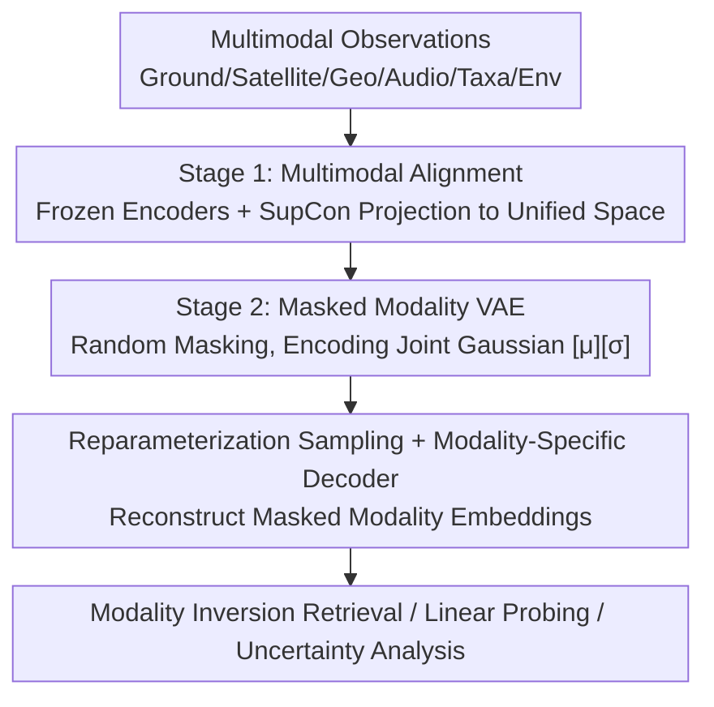

# ProM3E: Probabilistic Masked MultiModal Embedding Model for Ecology

**Conference**: CVPR 2026  
**Paper**: [CVF Open Access](https://openaccess.thecvf.com/content/CVPR2026/html/Sastry_ProM3E_Probabilistic_Masked_MultiModal_Embedding_Model_for_Ecology_CVPR_2026_paper.html)  
**Code**: https://vishu26.github.io/prom3e (Open source committed)  
**Area**: Information Retrieval / Multimodal Representation Learning  
**Keywords**: Any-to-any generation, Masked modality reconstruction, Probabilistic embedding, Modality inversion retrieval, Ecology multimodality

## TL;DR
ProM3E utilizes an "align-then-fuse" two-stage framework to train a Masked Variational Autoencoder (MVAE) within the embedding space. By inferring Gaussian distribution representations of missing modalities from a small subset of visible modalities, it supports any-to-any modality generation, modality inversion retrieval, and uncertainty analysis regarding "which modalities to fuse." It comprehensively outperforms TaxaBind on ecological multimodal tasks.

## Background & Motivation
**Background**: Ecological tasks (species distribution modeling, fine-grained classification, audio recognition) naturally involve diverse modalities such as ground images, satellite imagery, geographic coordinates, species sounds, taxonomic text, and environmental covariates. Most existing domain multimodal models assume all or specific modalities are present during inference and cannot complete missing modalities.

**Limitations of Prior Work**: To bypass the requirement for "complete modalities," the industry has turned to Any-to-Any models. However, these models typically require massive "all-paired" data for training (e.g., student-teacher / JEPA paradigms). As the number of modalities grows, paired data becomes harder to obtain; modalities like hyperspectral or MRI are difficult to capture or synthesize. More critically, many multimodal data lack one-to-one correspondence—one satellite image may correspond to multiple ground photos.

**Key Challenge**: Any-to-Any models must be trained at scale but are constrained by the scarcity of all-paired data and the reality of many-to-many, non-pixel-level correspondences between modalities. Performing reconstruction directly in the raw signal space is both expensive and inapplicable to modalities without direct correspondence.

**Goal**: Design a data-efficient, scalable, and modality-flexible framework that can infer missing modalities from a few observations and quantify "which modality fusion is most beneficial for a specific downstream task."

**Key Insight**: Since raw signals are hard to correspond, reconstruction is moved to the **embedding space**. By first aligning all modalities into a unified space, missing modality reconstruction becomes "token completion in the embedding space," requiring only small-scale all-paired data. Probabilistic modeling (VAE) then naturally characterizes many-to-many correspondences and uncertainty.

**Core Idea**: First use ImageBind/TaxaBind to align all modalities into a unified embedding space, then train a lightweight Masked MVAE to learn the joint Gaussian distribution of modalities, reconstructing masked modality embeddings by sampling from visible modalities.

## Method

### Overall Architecture
ProM3E follows a two-stage design. **Phase 1: Multimodal Alignment**: Using the TaxaBind training recipe, six ecological modalities are projected into a unified embedding space via modality-specific encoders (Transformers for image/satellite/audio/taxa; Random Fourier Feature networks for coordinates; Feed-forward networks for environmental covariates). Image-text encoders are frozen, and other modalities are aligned one-by-one to the ground image modality using symmetric SupCon loss—this step relies on large-scale image-paired data but only performs global alignment. **Phase 2: Masked Modality Training**: The aforementioned encoders are frozen. Each modality embedding is treated as a token to train a Transformer encoder-decoder **MVAE**. The encoder outputs a joint Gaussian distribution, from which the decoder samples to reconstruct masked modality embeddings. Since modalities are already aligned, this stage requires only small-scale all-paired data. Once trained, it supports modality inversion retrieval and linear probing.

### Key Designs

**1. Two-stage "Align-then-Fuse": Minimizing All-Paired Data Requirements**

The biggest practical obstacle for Any-to-Any models is the scarcity of all-paired data. ProM3E sidesteps this by splitting the problem: the first step only requires "image-unimodal" pairs (much easier to obtain than "all modalities present"), using the TaxaBind recipe + symmetric SupCon to align each modality to a ground image anchor. The second step, because modalities are already in the same space, only requires the fusion module to learn joint distributions over "aligned embeddings." This significantly reduces the necessary volume of all-paired data—experimentally, the MultiNat dataset with only 79,317 all-paired samples was sufficient, and a 27M parameter MVAE was trained on a single H-100 in **2.5 GPU hours**. This decoupling makes the framework both scalable and data-efficient.

**2. Masked Modality VAE: Learning Joint Distributions in Embedding Space for Many-to-Many Correspondence**

Since correspondences between different modalities are not one-to-one, ProM3E reconstructs **global modality embeddings** rather than raw signals. The MVAE encoder treats each modality embedding as a token, uses modality identity tokens as positional encodings, and introduces two special tokens $[\mu]$ and $[\sigma]$ to learn the mean and diagonal covariance of the joint distribution ($[\sigma]$ actually learns log-variance). Register tokens are added for noise suppression and cross-modal structure memory. The encoding functions are $\mu_G, \log\sigma_G^2 = E(G)$, where $G$ is the subset of visible modalities. **Masking Strategy**: Following MultiMAE, only 1-2 visible modalities are randomly kept during training. The decoder uses the reparameterization trick $Z_i(G) = \mu_G + \sigma_G \cdot \epsilon_i$ (where $\epsilon_i \sim \mathcal{N}(0,1)$) and passes the sample to modality-specific decoders $\hat{f}_i(G) = D_i(Z_i(G))$ to reconstruct modality margins. Probabilistic modeling naturally captures many-to-many mappings and uncertainty.

**3. Contrastive Reconstruction Loss + VIB Regularization: Preventing Centroid Collapse and Zero Variance**

Directly using Euclidean distance for reconstruction can cause the model to collapse all samples toward the modality centroid. ProM3E first calculates the Euclidean distance between predicted and ground-truth embeddings $d_i^G(j,j) = \|\hat{f}_i^j(G) - f_i^j\|_2$, then applies an InfoNCE-style contrastive objective:

$$L_{recon}(m_i) = \frac{1}{N}\sum_{j=1}^{N} \frac{e^{[\alpha \cdot d_i^G(j,j)+\beta]}}{\sum_{p=1}^{N} e^{[\alpha \cdot d_i^G(j,p)+\beta]}}$$

where $\alpha, \beta$ are scaling/translation parameters (analogous to InfoNCE temperature) and $N$ is the batch size. The contrastive form forces the model to learn **intra-modality distributions** rather than collapsing. Simultaneously, Variational Information Bottleneck (VIB) loss regularizes the distribution toward a standard Gaussian using the closed-form KL divergence $L_{VIB} = -\frac{1}{2}(1+\log\sigma_G^2 - \mu_G^2 - \sigma_G^2)$ to prevent $\sigma$ from reaching zero. The total loss $L(m_i) = L_{recon}(m_i) + \lambda L_{VIB}$ is averaged across all modalities.

**4. Modality Inversion Retrieval: Mixing Cross-modal and Intra-modal Similarity**

Traditional cross-modal retrieval only calculates similarity between the query modality and the target modality (pure cross-modal). ProM3E leverages its **modality inversion** capability—given a query embedding $f_q$, the model can reconstruct the target modality embedding $\hat{f}_t(G)$. It then mixes the query embedding with the reconstructed target: $f_q = (1-\delta)f_q + \delta \hat{f}_t(G)$, where $\delta$ is a mixing coefficient chosen via a validation set. The final similarity integrates **cross-modal interaction** (original query $\leftrightarrow$ target) and **intra-modal interaction** (reconstructed target $\leftrightarrow$ real target), yielding superior results across all retrieval settings.

## Key Experimental Results

### Main Results
Modality-specific encoders were initialized with pre-trained TaxaBind. The 27M parameter MVAE was trained on MultiNat with a single H-100, batch size 1024, for only 2.5 GPU hours.

| Task / Dataset | Metric | ProM3E | TaxaBind | ImageBind |
|--------|------|------|----------|------|
| Zero-shot Classification iNat-2021 (Unimodal) | Acc | 75.83% | 70.09% | — |
| Zero-shot Classification TaxaBench-8k (Unimodal) | Acc | 39.45% | 34.45% | — |
| Zero-shot Classification iNat-2021 (Bimodal) | Acc | ~78.3% | ~73.7% | ~72.0% |
| Cross-modal Retrieval TaxaBench-8k | R@1 | 17.87% | 8.43% | 8.79% |
| Cross-modal Retrieval TaxaBench-8k | R@5 | 43.16% | 21.72% | 22.72% |

In cross-modal retrieval, ProM3E outperformed TaxaBind and ImageBind across all input/target modality combinations, nearly doubling R@1 in some settings (17.87% vs 8.43%). Species image classification led across 6 fine-grained datasets, with gains up to +5% for unimodal and +10% for multimodal. Linear probing for audio species showed gains up to +12%.

### Ablation Study
The paper primarily analyzes design choices (with some details in the appendix).

| Design Choice | Key Finding | Description |
|------|---------|------|
| Hidden vs. Reconstructed for Probing | Hidden is better | Latent representations are more suitable for linear probing than reconstructed ones. |
| Inclusion of all tokens (incl. register) | Inclusion is better | Register tokens provide positive contributions to downstream tasks. |
| Retrieval $\delta$ mixing coefficient | Optimized via val set | Mixing cross/intra-modal similarity is superior to pure cross-modal retrieval. |
| Number of masked visible modalities (1-2) | Scalable at inference | Training on few modalities allows effective absorption of more modalities at inference. |

### Key Findings
- **Modality inversion mixed retrieval is key to doubling performance**: Incorporating reconstructed target embeddings into the query integrates intra-modality interaction, making it significantly stronger than pure cross-modal retrieval.
- **Outstanding data efficiency**: Phase two requires only ~80,000 all-paired samples, 27M parameters, and 2.5 GPU hours. This validates the "align, then fuse in embedding space" strategy for reducing all-paired data requirements.
- **Interpretability via probabilistic modeling**: Learned uncertainty can analyze "which modalities are most informative" and whether fusing multiple modalities reduces representation uncertainty, as well as tracking changes in the modality gap.
- **Multimodal Gains**: The gain in multimodal settings (up to +10%) is greater than in unimodal settings (up to +5%), indicating that the MVAE effectively captures complementary information between modalities.

## Highlights & Insights
- **Masked Reconstruction in Embedding Space**: Sidestepping the "no pixel-perfect correspondence" bottleneck by turning Any-to-Any generation into embedding token completion is both modality-agnostic and data-saving—this logic is transferable to remote sensing or medicine.
- **"Align-then-Fuse" Decoupling**: Combining easily obtained image-unimodal pairs for Phase 1 with small-scale all-paired data for Phase 2 is a highly practical recipe for engineering Any-to-Any models.
- **Probabilistic Representation as an Analytical Tool**: Uncertainty is not just a byproduct but a means to answer "what to fuse"—the "learning what to fuse" perspective is highly insightful for multimodal design.
- **Modality Inversion Retrieval**: Re-feeding generative capabilities back into retrieval (using reconstructed embeddings to augment queries) is a simple but effective and reusable trick.

## Limitations & Future Work
- **Dependence on Phase 1 Alignment**: The method relies on "pre-aligned" modalities. If TaxaBind/ImageBind alignment is poor, Phase 2 cannot compensate. Heavy reliance on the TaxaBind recipe also limits plug-and-play migration to other domains.
- **Domain Specificity**: Modalities, datasets (iNaturalist/MultiNat/TaxaBench-8k), and evaluations are centered on ecological species observations. Generalization to generic multimodal or other vertical domains remains unvalidated.
- **Global vs. Fine-grained Reconstruction**: For downstream tasks requiring pixel-level or local correspondence (e.g., segmentation), global embedding reconstruction may be insufficient; the paper suggests patch-wise contrastive learning could be used if pixel-level data exists.
- ⚠️ The main text provides only directions for hyperparameters like $\alpha, \beta, \lambda$ and some ablations; details are deferred to the appendix.

## Related Work & Insights
- **vs. TaxaBind**: Both are ecological multimodal foundations, but TaxaBind uses deterministic alignment and cannot complete missing modalities. ProM3E adds a masked MVAE for Any-to-Any generation and modality inversion.
- **vs. ImageBind / MultiMAE**: ImageBind performs alignment but not generative completion. MultiMAE performs masked reconstruction in raw/patch signal space, requiring pixel correspondence. ProM3E moves reconstruction to the embedding space for many-to-many modalities.
- **vs. PCME / PCME++**: Also uses probabilistic (Gaussian) representations for uncertainty, but they focus on cross-modal similarity for image-text pairs. ProM3E extends probabilistic modeling to a 6-modality joint distribution with masked reconstruction.
- **vs. 4M (Mizrahi et al.)**: 4M relies on existing models to synthesize paired data for Any-to-Any training. ProM3E targets "hard-to-synthesize, hard-to-pair" modalities (hyperspectral, satellite-ground) by reconstructing in the embedding space.

## Rating
- Novelty: ⭐⭐⭐⭐ Embedding space masked MVAE + modality inversion retrieval + "learning what to fuse," a novel combination.
- Experimental Thoroughness: ⭐⭐⭐⭐ Comprehensive coverage of classification/retrieval/probing + uncertainty/gap analysis, though some ablations are in the appendix.
- Writing Quality: ⭐⭐⭐⭐ Clear motivation, logical two-stage structure, complete formulas.
- Value: ⭐⭐⭐⭐ High data/compute efficiency (2.5 GPU hours) + missing modality completion; very practical for data-scarce domains like ecology.

<!-- RELATED:START -->

## Related Papers

- [\[CVPR 2026\] MuCo: Multi-turn Contrastive Learning for Multimodal Embedding Model](muco_multi-turn_contrastive_learning_for_multimodal_embedding_model.md)
- [\[CVPR 2026\] Mask to Align, Weight to Disambiguate: Reliable Unsupervised Cross-Modal Hashing with Masked-Weight Contrast](mask_to_align_weight_to_disambiguate_reliable_unsupervised_cross-modal_hashing_w.md)
- [\[ACL 2026\] FLARE: Task-Agnostic Embedding Model Evaluation via Normalizing Flows](../../ACL2026/information_retrieval/flare_task-agnostic_embedding_model_evaluation_through_a_normalization_process.md)
- [\[ICLR 2026\] HUME: Measuring the Human-Model Performance Gap in Text Embedding Tasks](../../ICLR2026/information_retrieval/hume_measuring_the_human-model_performance_gap_in_text_embedding_tasks.md)
- [\[CVPR 2026\] Beyond Global Similarity: Towards Fine-Grained, Multi-Condition Multimodal Retrieval](beyond_global_similarity_towards_fine-grained_multi-condition_multimodal_retriev.md)

<!-- RELATED:END -->
