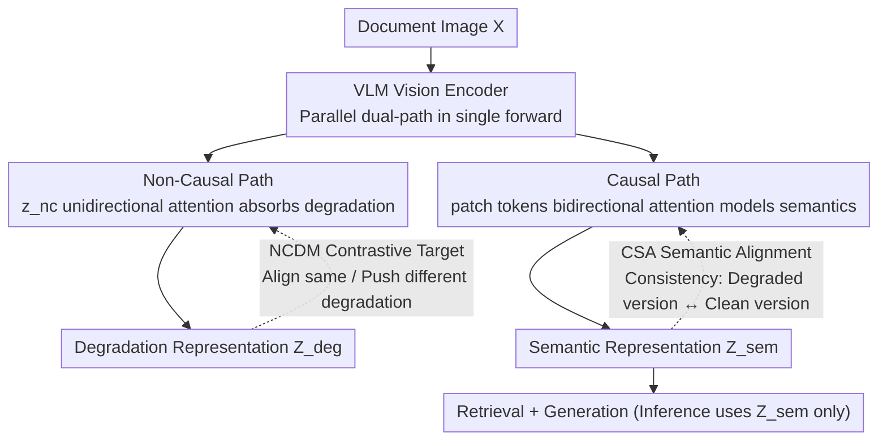

# RobustVisRAG: Causality-Aware Vision-Based Retrieval-Augmented Generation under Visual Degradations

**Conference**: CVPR 2026  
**arXiv**: [2602.22013](https://arxiv.org/abs/2602.22013)  
**Code**: [https://robustvisrag.github.io/](https://robustvisrag.github.io/)  
**Area**: Information Retrieval  
**Keywords**: VisRAG, Robustness, Causal Inference, Visual Degradations, Dual-Path Encoding

## TL;DR
RobustVisRAG is a causality-guided dual-path framework that decouples semantic-degradation entanglement in VisRAG by capturing signals through a non-causal path while learning pure semantics via a causal path. It achieves performance gains of 7.35%, 6.35%, and 12.40% in retrieval, generation, and end-to-end tasks under real-world degradation, respectively, while maintaining performance on clean data.

## Background & Motivation
**Background**: VisRAG avoids OCR errors by directly encoding document images for retrieval and generation using VLMs, becoming a mainstream solution for document QA.

**Limitations of Prior Work**:
   - Both TextRAG and VisRAG suffer significant performance degradation under degraded inputs (blur, noise, low light, shadows, etc.).
   - Semantic and degradation factors are entangled in the VisRAG vision encoder: degradation distorts the embedding space, leading to retrieval mismatches and unstable generation.
   - Dual failure modes: Incorrect documents may be retrieved (degradation-polluted representations), and even if retrieved correctly, generation may fail (degradation-misled reasoning).

**Key Challenge**: In the representation space of existing VLM encoders, semantic factors $S$ and degradation factors $D$ are entangled. Since the observed image $X$ is a collider node of $S$ and $D$, conditioning on $X$ opens the non-causal path $S \leftrightarrow D$.

**Goal**: To maintain VisRAG robustness under degraded inputs without increasing inference costs, while avoiding performance loss on clean inputs.

**Key Insight**: Analyze how degradation affects VisRAG using Structural Causal Models (SCM), then cut off non-causal paths via causal intervention (do-operator).

**Core Idea**: Learn decomposed representations $Z = [Z_{sem}, Z_{deg}]$ such that the semantic component remains invariant to degradation, which is equivalent to the causal intervention $P(A|do(D=d_0))$.

## Method

### Overall Architecture
RobustVisRAG addresses the issue where the vision encoder mixes document "semantics" and "degradations" into a single embedding, causing failure under blur or low light. The architecture physically separates these components within the encoder using two paths: a **non-causal path** dedicated to absorbing degradation signals and a **causal path** for pure semantics. Upon receiving a document image, both paths run in parallel during a single forward pass: the non-causal path "extracts" degradation, while the causal path outputs clean semantic vectors $Z_{sem}$ for downstream tasks. During training, NCDM and CSA objectives constrain these paths. At inference time, only $Z_{sem}$ is used, introducing no additional overhead.

### Key Designs

**1. Non-Causal Path: A "One-Way" Bypass for Degradation Information**

Degradation factor $D$ typically diffuses through the attention mechanism to every patch, polluting semantic embeddings. This path introduces a learnable non-causal token $z_{nc}^{(0)}$ with **unidirectional attention** constraints: $z_{nc}$ can attend to all patch tokens, but patch tokens cannot see $z_{nc}$. Layer by layer, it gathers degradation cues from patches:

$$z_{nc}^{(l+1)} = z_{nc}^{(l)} + \sum_j \alpha_{nc \leftarrow j}^{(l)}\, v_j^{(l)}$$

The final layer $Z_{deg} = z_{nc}^{(L)}$ serves as the unique representation of the image's degradation pattern. The "one-way" nature is critical: degradation is collected into the $z_{nc}$ pocket without any backflow channel to modify patches, structurally isolating degradation from semantics.

**2. Causal Path: Modeling Semantics While Rejecting Degradation Backflow**

While the non-causal path extracts degradation, the causal path generates the semantic representations for downstream use. Patch tokens maintain **bidirectional attention** to model document content normally, but specifically exclude the non-causal token. Thus, the aggregated semantic representation:

$$Z_{sem} = \text{Agg}(x_1^{(L)}, \dots, x_T^{(L)})$$

follows only the clean causal chain $S \to Z_{sem}$, remaining unaffected by the degradation stored in $z_{nc}$. This separation aligns with the paper's causal argument: treating $X$ as a collider typically opens the non-causal path $S \leftrightarrow D$; diverting degradation to $z_{nc}$ is equivalent to performing intervention $P(A\mid do(D=d_0))$, cutting the shortcut.

**3. NCDM: Ensuring Non-Causal Tokens Learn "Distortion Recognition"**

A bypass alone does not guarantee $z_{nc}$ extracts degradation. Non-Causal Distortion Modeling (NCDM) utilizes a contrastive target: samples with the same degradation type are pulled closer in the $Z_{deg}$ space, while different types are pushed apart:

$$\mathcal{L}_{NCDM} = \max\big(0,\ \|Z_{deg}^a - Z_{deg}^p\|_2^2 - \|Z_{deg}^a - Z_{deg}^n\|_2^2 + \delta\big)$$

where $a/p/n$ represent the anchor, positive sample (same degradation), and negative sample (different degradation), with margin $\delta$. This trains $z_{nc}$ as a degradation classifier pocket, ensuring semantics stay pure in the causal path.

**4. CSA: Anchoring Semantic Representations Against Leakage**

Even with a bypass, residual degradation might leak into $Z_{sem}$. Causal Semantic Alignment (CSA) directly aligns the **semantic representations of the degraded version and clean version of the same document**, requiring $Z_{sem}$ to remain consistent regardless of degradation. Combined with NCDM, this creates a push-pull effect: NCDM drives degradation into $z_{nc}$, while CSA anchors semantics under varying conditions, making $Z_{sem}$ insensitive to degradation.

### Loss & Training
Joint optimization of $\mathcal{L}_{NCDM} + \mathcal{L}_{CSA}$ with original retrieval/generation losses. Training requires paired degraded-clean data (or degradation type labels) for NCDM contrast and CSA alignment. Both paths produce $Z_{sem}$ and $Z_{deg}$ in a single forward pass; only $Z_{sem}$ is used during inference, resulting in zero additional overhead compared to the original VisRAG.

## Key Experimental Results

### Main Results

| Method | Retrieval (Real-Degrade) | Generation (Real-Degrade) | End-to-End (Real-Degrade) |
|------|:---------:|:---------:|:---------:|
| VisRAG baseline | ~70% | ~55% | ~45% |
| VisRAG-FT (full finetune) | ~73% | ~57% | ~48% |
| Two-Stage Restoration | ~72% | ~56% | ~47% |
| **RobustVisRAG** | **~77%** | **~61%** | **~57%** |
| Gain | **+7.35%** | **+6.35%** | **+12.40%** |

### Distortion-VisRAG Dataset

**QA Pairs**: 367K  
**Document Types**: 7 domains (papers, charts, tables, slides, handwritten notes, etc.)  
**Synthetic Degradations**: 12 types (blur, noise, compression, etc.)  
**Real Degradations**: 5 types (low light, shadows, paper damage, etc.)  
**Multiple Severity Levels**: ✓  

### Key Findings
- RobustVisRAG maintains performance on clean data, showing that causal separation does not damage standard understanding capabilities.
- Perceptual quality improvements from image restoration (Two-Stage) do not necessarily translate into retrieval/generation gains.
- Full-Parameter Fine-Tuning (FFT) improves robustness but risks forgetting pre-trained knowledge and fails to decouple semantics from degradation.
- The end-to-end improvement (12.40%) significantly exceeds individual retrieval or generation gains, indicating a cumulative effect of the improvements.

## Highlights & Insights
- **Elegant Application of Causal Modeling**: Uses SCM to analyze degradation propagation in VisRAG, theoretically deriving the necessity of representation decomposition and translating this into a concrete network design (non-causal token + unidirectional attention).
- **Distortion-VisRAG Dataset**: The first benchmark specifically designed for VisRAG under degradation, filling an evaluation gap with both synthetic and real-world cases.
- **Zero Inference Overhead**: The causal and non-causal paths are processed in the same forward pass; discarding $Z_{deg}$ at inference makes the solution highly practical.

## Limitations & Future Work
- The contrastive learning for degradation modeling in the non-causal path may be insufficient for complex mixed degradations.
- Training requires paired clean-degraded data (or labels), which is costly to obtain in some scenarios.
- Generalization to unseen degradation types needs further validation.
- Currently limited to document images; robustness for natural scene images remains unexplored.

## Related Work & Insights
- **vs. TeCoA / FARE (Adversarial Robustness)**: These focus on small perturbations under $\ell_p$ norm constraints, unsuitable for natural degradations (blur, low light). RobustVisRAG addresses broader degradation types by learning explicit degradation representations.
- **vs. Restoration → VisRAG Pipeline**: Restoration improves perceptual quality but does not guarantee semantic consistency, whereas RobustVisRAG achieves semantic protection directly within the encoder.

## Rating
- Novelty: ⭐⭐⭐⭐ Combination of causal modeling and dual-path encoders is innovative.
- Experimental Thoroughness: ⭐⭐⭐⭐⭐ Comprehensive benchmark with synthetic and real degradation.
- Writing Quality: ⭐⭐⭐⭐ Rigorous formalization in the causal analysis section.
- Value: ⭐⭐⭐⭐ Robustness in VisRAG is a critical practical issue.

<!-- RELATED:START -->

## Related Papers

- [\[AAAI 2026\] Knowledge Completes the Vision: A Multimodal Entity-aware Retrieval-Augmented Generation Framework for News Image Captioning](../../AAAI2026/information_retrieval/knowledge_completes_the_vision_a_multimodal_entity-aware_retrieval-augmented_gen.md)
- [\[ACL 2026\] Disco-RAG: Discourse-Aware Retrieval-Augmented Generation](../../ACL2026/information_retrieval/disco-rag_discourse-aware_retrieval-augmented_generation.md)
- [\[ACL 2026\] Utility-Oriented Visual Evidence Selection for Multimodal Retrieval-Augmented Generation](../../ACL2026/information_retrieval/utility-oriented_visual_evidence_selection_for_multimodal_retrieval-augmented_ge.md)
- [\[ACL 2025\] VISA: Retrieval Augmented Generation with Visual Source Attribution](../../ACL2025/information_retrieval/visa_retrieval_augmented_generation_with_visual_source_attribution.md)
- [\[CVPR 2026\] CC-VQA: Conflict- and Correlation-Aware Method for Mitigating Knowledge Conflict in Knowledge-Based Visual Question Answering](cc-vqa_conflict-_and_correlation-aware_method_for_mitigating_knowledge_conflict_.md)

<!-- RELATED:END -->
