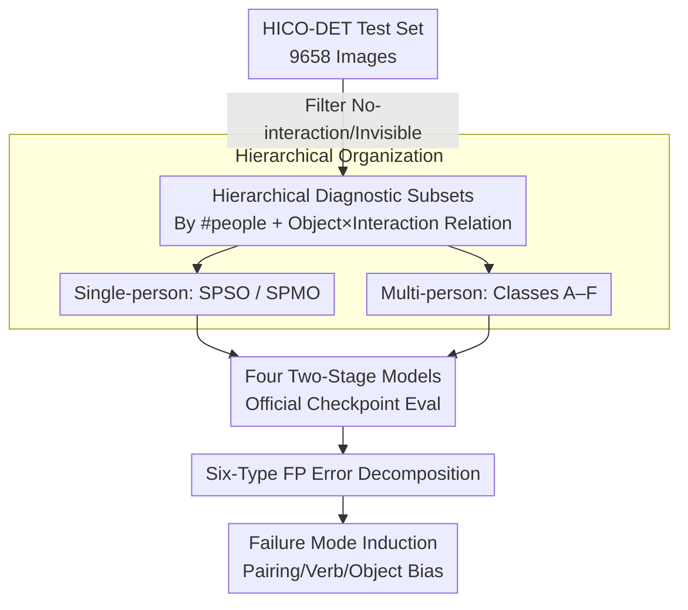

# A Study of Failure Modes in Two-Stage Human–Object Interaction Detection

**Conference**: CVPR 2026  
**arXiv**: [2604.13448](https://arxiv.org/abs/2604.13448)  
**Code**: https://florawlm.github.io/DiagHOI/ (Project Page)  
**Area**: Interpretability / Human–Object Interaction Detection (HOI) / Failure Mode Analysis  
**Keywords**: HOI Detection, Failure Mode Diagnosis, Error Decomposition, Multi-person Scenes, Object-conditioned Bias

## TL;DR
This is a **diagnostic study** rather than a new method: instead of creating a large-scale benchmark, the authors reorganize the HICO-DET test set into a series of controllable interaction configuration subsets based on "number of people × object relationships × interaction relationships." By decomposing false positive predictions into six error categories, they systematically reveal exactly where two-stage HOI models fail in multi-person, multi-object-of-the-same-class, and fine-grained interaction scenarios. The conclusion is that high $mAP$ does not equate to true relational reasoning capability; verb prediction errors and object-conditioned biases are the primary pathologies masked by aggregate metrics.

## Background & Motivation
**Background**: Human–Object Interaction (HOI) detection aims to identify "what a person does to an object" triplets (e.g., ride bicycle, hold cup) in images. Current mainstream approaches follow two paths: **two-stage** methods that first use a detector to localize persons and objects and then classify the interaction for candidate pairs, and one-stage methods that use Transformers to predict triplets directly. Regardless of the path, the community evaluates almost exclusively using a single aggregate metric—mean Average Precision ($mAP$).

**Limitations of Prior Work**: $mAP$ is an "averaged-to-the-end" number that indicates overall accuracy but fails to explain **why models fail and in what scenarios**. Worse, existing benchmarks (HICO-DET, V-COCO, SWiG-HOI) do not explicitly distinguish scene structures—single-person vs. multi-person, same object instance vs. different instances of the same class, same action vs. different actions. These errors with vastly different root causes are lumped together, and localization failures (human–object pairing) are mixed with interaction recognition errors, making them impossible to disentangle.

**Key Challenge**: Over 60% of the HICO-DET test set consists of single-person images, where human–object pairing ambiguity is virtually non-existent. Consequently, $mAP$ is dominated by these "easy cases," while the critical and difficult multi-person scenarios are rare and drowned out. The result is that **strong benchmark scores do not imply reliable visual relationship reasoning**, yet this remains invisible in the numbers.

**Goal**: Instead of competing on benchmark scale, this paper answers "exactly how two-stage HOI models fail under controlled variations of interaction configurations." This is split into two sub-questions: (1) How does performance change across different scene configurations (number of people, shared objects, interaction consistency)? (2) Can errors be decomposed into interpretable components (person/object detection, pairing, interaction classification) to localize root causes?

**Key Insight**: The authors choose to **study only two-stage methods** because they physically separate "detection" and "interaction modeling," making interaction-related failure modes easier to isolate and observe. Combined with a **structured reorganization** of HICO-DET—slicing the same data differently—they expose failure modes previously hidden by aggregate metrics.

**Core Idea**: Replace "single $mAP$" with "hierarchical diagnostic subsets + six-type false positive error decomposition." By interrogating HOI detection across multiple interpretable dimensions, the model's failure modes are brought out of the black box.

## Method

### Overall Architecture
This work does not train any new models; it is a **diagnostic pipeline**. Starting from the HICO-DET test set, it filters out images with no interaction or invisible objects, then stratifies by "number of people" and subdivides into controllable interaction configurations based on "object relationship × interaction relationship." Four off-the-shelf two-stage HOI models (using official checkpoints without fine-tuning) are evaluated on these subsets. All false positive predictions are decomposed into six error types, followed by class-level $mAP$ comparison, error distribution analysis, confidence analysis of verb errors, and object-conditioned bias analysis to derive interpretable observations of failure modes.

The pipeline is a linear diagnostic structure: "Data Reorganization → Model Evaluation → Error Decomposition → Mode Induction."

### Key Designs

**1. Hierarchical Diagnostic Subsets: Slicing Controllable Interaction Ladders from One Dataset**

Addressing the pain point that existing benchmarks mix errors with different root causes, the authors **reorganize** the HICO-DET test set into a controllable hierarchical tree. The first layer splits by the number of people: single-person images naturally eliminate "human–object pairing" ambiguity to study object ambiguity alone, while multi-person images introduce pairing and interaction assignment ambiguity. The single-person branch is divided into **SPSO** (Single Person Single Object, simplest) and **SPMO** (Single Person Multi Object, introducing object selection ambiguity). The multi-person branch crosses two axes—**Object Relationship** (sharing the same object instance / different instances of the same class / different classes) × **Interaction Relationship** (same action vs. different actions), resulting in six classes **A–F**: A (same instance same action, lowest ambiguity), B (same instance different actions, interaction assignment ambiguity), C/D (different instances of same class, instance-level ambiguity), E/F (different classes different actions, complex but nearly absent in HICO-DET, E has only 1 image, F has 9). This progression from SPSO → SPMO → Multi-person forms a **ladder of increasing ambiguity**, allowing each failure mode to be observed in isolation rather than blended in a single $mAP$. A detail worth highlighting is the definition of "different interactions": it includes not only completely different actions (one person holds, one throws) but also cases where **one person performs a clearly identifiable extra action** (both ride horse but only one also holds), a subtle asymmetry that frequently triggers pairing errors.

**2. Multi-Annotator Consensus Class Protocol: Ensuring Diagnostic Label Reliability**

Each subset label (SPSO/SPMO/A–F) is a **new diagnostic dimension** overlaid on the original HICO-DET annotations. Since distinguishing "same/different interaction" can be subjective (especially for asymmetric actions), the authors used **three independent annotators + majority voting** to determine every image's class. Pre-agreed rules for "different interaction" (including the extra action cases mentioned above) were used to unify the standard. Only images where **all three reached a consensus** were retained in the final analysis, filtering out ambiguous samples to ensure reliable class-level evaluation. This design, while seemingly tedious, is the premise for the validity of the diagnostic conclusions.

**3. Six-Type False Positive Error Decomposition: Breaking "Wrong" into "Which Step was Wrong"**

To address the "knowing right/wrong but not the cause" limitation of $mAP$, the authors first define false positives using standard HOI matching criteria: a prediction is **correct** if and only if the person box, object box $IoU > 0.5$ with a ground-truth pair, and both predicted verb and object classes are correct. Each ground-truth matches at most one prediction sorted by confidence; unmatched predictions are false positives. Each false positive is then decomposed into **six error types**: person box error, object box error, verb classification error, object classification error, human–object pairing error, and duplicate prediction. Critically, **these six types are not mutually exclusive**, meaning a single prediction can trigger multiple error categories—realistically reflecting that a failure often involves multiple components breaking down simultaneously. Using this decomposition, the authors can plot error type distributions for each configuration class.

### Key Findings
Since this is an analytical study with no modules to ablate, the core empirical findings are summarized below:
- **Multi-person < Single-person**: $mAP$ for all four models drops when moving from single-person to multi-person scenarios, confirming that multi-person is harder; yet HICO-DET is dominated by single-person cases, thus $mAP$ overestimates true relational reasoning.
- **Class C is a Consistent Bottleneck**: While A–D were generally not much worse than single-person (as interaction patterns simplify after filtering), Class C (different instances of same class, same action) consistently showed lower performance across all models, pointing to **instance-level ambiguity** as a common root cause.
- **Pairing Errors Concentrated in C/D**: The proportion of human–object pairing errors in C/D is significantly higher than in A/B, matching the "multi-instance of same class" design intent. Models like HOLa and LAIN, which construct pairs using **instance-level features** (rather than cropped region features), showed lower pairing error rates.
- **Verb Errors are the Primary Pathology**: Verb prediction errors are the most frequent error type across all configurations and **persist even at high confidence levels** in B/D/SPMO—indicating this is not "uncertainty" but "confident error," which cannot be solved simply by adjusting thresholds.
- **Object-conditioned Bias**: HOI performance is determined not just by the frequency of the HOI class, but also by the **verb distribution conditioned on the object**. Once an object is detected, models tend to predict the dominant verb for that object (e.g., detecting sports ball leads to predicting "kick"), revealing a reliance on object-verb co-occurrence priors.

## Key Experimental Results

### Evaluation Settings & Subset Scale
Four representative two-stage models were tested using official best checkpoints without extra training: ADA-CM, CMMP, HOLa (ViT-L), and LAIN (ViT-B).

| Subset | Image Count | Description |
|------|--------|------|
| Single-person Total | 6,124 / 9,658 | >60% of test set; dominates $mAP$ |
| SPSO (Single person single object) | 5,897 | Simplest configuration |
| SPMO (Single person multi object) | 227 | Introduces object selection ambiguity |
| A (Same instance same action) | 513 | Multi-person, low ambiguity |
| B (Same instance diff action) | 303 | Interaction assignment ambiguity |
| C (Diff instance same action) | 621 | Instance-level ambiguity, performance bottleneck |
| D (Diff instance diff action) | 146 | Instance-level + interaction ambiguity |
| E / F (Diff object classes) | 1 / 9 | Too rare for quantitative conclusions |

### Failure Mode Diagnostic Results
| Phenomenon | Occurrence | Inferred Root Cause |
|------|----------|----------|
| $mAP$ drops Single → Multi | All models | Multi-person is harder, masked by aggregate metrics |
| Class C has lowest performance | All models | Multi-instance of same class → Instance-level pairing ambiguity |
| High % of pairing errors | C / D | Difficulty distinguishing object instances with same label |
| Lower pairing errors | HOLa / LAIN | Use of instance-level features instead of cropped region features |
| High person box errors | A / B (Shared obj) | Spatial overlap and mutual occlusion in multi-person scenes |
| Prominent object-related errors | SPMO | Harder localization with multiple candidate objects for one person |
| Persistent high-confidence verb errors | B / D / SPMO | Co-existence of semantically similar hypotheses; "confident error" |
| Object-conditioned verb bias | horse/ball/etc. | Models favor verbs that frequently co-occur with detected objects |

## Highlights & Insights
- **"Diagnostic Paradigm via Slicing"**: Without creating new data or training models, the structured reorganization of an existing benchmark reveals failure modes hidden by $mAP$. This "zero-cost diagnostic" approach is transferable to any task dominated by a single aggregate metric (detection, segmentation, VQA).
- **Non-mutually Exclusive Error Design**: Acknowledging that "a failure often involves multiple components breaking down" avoids distortion from forced single attribution, making the error distribution plots truly representative of reality.
- **"Confident Error" Observation**: Verb errors persisting at high confidence prove the issue is representation/reasoning rather than calibration. This negates the idea that simple thresholding can improve quality and directs future work toward relationship modeling.
- **Quantifying Shortcut Learning**: Visualizing the correlation between object-conditioned verb distributions and $mAP$ demonstrates that HOI models often default to "detect object → find most common verb," a substantial contribution to HOI interpretability.

## Limitations & Future Work
- **Limitations**: The analysis relies on HICO-DET annotations which lack **instance-level identity** info, limiting fine-grained analysis of associations in complex scenes. Only consensus images were kept, excluding complex overlapping configurations.
- **Observation on Method Scope**: Only four two-stage models were evaluated; whether these conclusions generalize to **one-stage/Transformer models** is unverified. Quantifying Classes E/F was impossible due to data scarcity (1/9 images).
- **Future Directions**: Introduce labels with instance IDs or synthetic data to fill the gap for C/D/E/F ambiguity; extend the diagnostic framework to one-stage methods; design mechanisms to model fine-grained relationships between multiple human–object pairs to solve "high-confidence verb errors."

## Related Work & Insights
- **vs. Traditional HOI Benchmarks**: Those rely on $mAP$ and triplet matching for standardized comparison. This paper argues $mAP$ masks the separation of pairing ambiguity and interaction identification. It doesn't replace them but adds structured diagnostic dimensions.
- **vs. CrossHOI-Bench / Semantic Eval**: Those expand evaluation via VLM comparisons or open-vocabulary similarity but still focus on overall performance. This paper differs by **explicitly modeling scene structure** and classifying error types to answer "how" and "why."
- **vs. Two-Stage Methods (ADA-CM, etc.)**: This paper treats them as subjects for diagnosis rather than competitors. It provides design guidance for future work, such as "instance-level features benefit pairing" and the need for scene-wide multi-pair relationship modeling.

## Rating
- Novelty: ⭐⭐⭐⭐ Innovative perspective (diagnosis over score-chasing), though using existing data.
- Experimental Thoroughness: ⭐⭐⭐ Solid decomposition/analysis, but limited to four models, one dataset, and sparse data for classes E/F.
- Writing Quality: ⭐⭐⭐⭐ Clear motivation, well-defined subsets and error types, logically consistent.
- Value: ⭐⭐⭐⭐ Exposes real failure modes and object biases hidden by $mAP$, providing methodological and diagnostic value to the HOI community.

<!-- RELATED:START -->

## Related Papers

- [\[CVPR 2026\] HUMORCHAIN: Theory-Guided Multi-Stage Reasoning for Interpretable Multimodal Humor Generation](humorchain_theory-guided_multi-stage_reasoning_for_interpretable_multimodal_humo.md)
- [\[CVPR 2026\] Rounded or Streamlined Head? Bridging Concept Bottleneck Models and Attribute-Described Object Parts](rounded_or_streamlined_head_bridging_concept_bottleneck_models_and_attribute-des.md)
- [\[ICLR 2026\] PolySHAP: Extending KernelSHAP with Interaction-Informed Polynomial Regression](../../ICLR2026/interpretability/polyshap_extending_kernelshap_with_interaction-informed_polynomial_regression.md)
- [\[AAAI 2026\] Can LLMs Truly Embody Human Personality? Analyzing AI and Human Behavior Alignment in Dispute Resolution](../../AAAI2026/interpretability/can_llms_truly_embody_human_personality_analyzing_ai_and_human_behavior_alignmen.md)
- [\[ICLR 2026\] One Language, Two Scripts: Probing Script-Invariance in LLM Concept Representations](../../ICLR2026/interpretability/one_language_two_scripts_probing_script-invariance_in_llm_concept_representation.md)

<!-- RELATED:END -->
