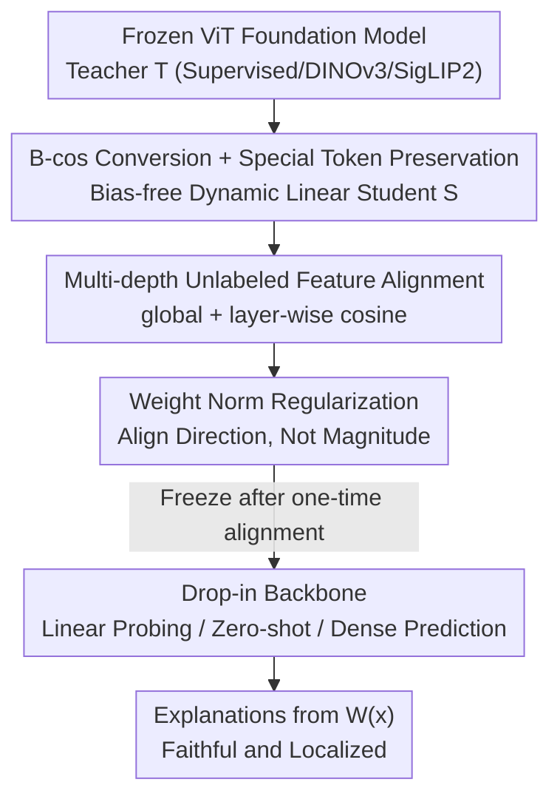

# Align Once to Explain: Feature Alignment for Scalable B-cosification of Foundational Vision Transformers

**Conference**: CVPR 2026  
**Paper**: [CVF Open Access](https://openaccess.thecvf.com/content/CVPR2026/html/Maser_Align_Once_to_Explain_Feature_Alignment_for_Scalable_B-cosification_of_CVPR_2026_paper.html)  
**Code**: https://github.com/rmaser/aloe  
**Area**: Interpretability / Vision Foundation Models  
**Keywords**: B-cos Networks, Feature Alignment, Inherently Interpretable, Vision Foundation Models, Label-free Distillation

## TL;DR
ALOE utilizes a one-time, label-free "teacher-student feature alignment" to convert frozen ViT foundation models (Supervised / DINOv3 / SigLIP2) into inherently interpretable B-cos versions. Once aligned, the backbone can be used as a drop-in replacement for tasks like classification, zero-shot, and dense prediction, improving accuracy by $>4.9$ percentage points over original B-cosification on ViTs while providing faithful and localized explanations with $100–1000\times$ higher data efficiency.

## Background & Motivation
**Background**: Large-scale vision foundation models like DINOv3, CLIP, and SigLIP2 are the default backbones for modern transfer learning and zero-shot tasks. However, their decision-making processes remain black boxes. To explain them, the mainstream approach is post-hoc attribution (e.g., Integrated Gradients, AttnLRP, Grad-CAM), but these explanations are often noisy and not necessarily faithful to the model.

**Limitations of Prior Work**: An alternative is "inherently interpretable architectures"—imposing architectural constraints to ensure faithful explanations. **B-cos networks** are a representative example: by replacing linear layers with bias-free, dynamically linear B-cos transformations, the entire network becomes equivalent to an input-dependent dynamic linear mapping $y(\mathbf{x})=\mathbf{W}(\mathbf{x})\,\mathbf{x}$, where $\mathbf{W}(\mathbf{x})$ serves as an exact, visualizable "explanation" of the model's computation. Training B-cos from scratch is prohibitively expensive; thus, **B-cosification** ([4]) was proposed to convert existing models into B-cos variants. However, B-cosification was designed for supervised CNNs and performs poorly on ViTs, sometimes even losing to training from scratch. Since modern foundation models are almost exclusively ViTs, its practical utility is limited.

**Key Challenge**: B-cosification relies on "supervised fine-tuning on original tasks" to recover performance. For ViTs, this requires labels and fails to recover the general feature geometry of foundation models, leading to significant degradation in downstream transfer and zero-shot capabilities—creating a rift between interpretability and maintaining foundation model performance.

**Goal / Key Insight**: The authors reframe the problem as "**Feature Alignment**" instead of "Task Fine-tuning." Since the objective is for the B-cos student to retain the teacher’s general representations, the student should directly approximate the frozen teacher in representation space without relying on labels or specific downstream tasks.

**Core Idea**: Treat the frozen foundation model as the teacher and its B-cosified version as the student. Use **label-free multi-layer cosine feature alignment** to align the student's embedding geometry with the teacher's. By aligning **once**, the resulting B-cos backbone can be reused as a drop-in for all downstream tasks, amortizing the cost of interpretability (Align **Once** to Explain).

## Method

### Overall Architecture
ALOE is a three-step pipeline: **(1) B-cos Conversion** → **(2) Align Once** → **(3) Deploy and Reuse**. The input is a frozen ViT foundation model teacher $\mathcal{T}$ (Supervised, self-supervised DINOv3, or vision-language SigLIP2). First, a structure-preserving transformation copies it into a bias-free, dynamically linear B-cos student $\mathcal{S}$. Then, using unlabeled web images, the student’s global embeddings and layer-wise token features are aligned to the teacher using a cosine objective. Once aligned, the student backbone is frozen and used for linear probing, zero-shot, or dense prediction tasks, where explanations come naturally from $\mathbf{W}(\mathbf{x})$ without task-specific tuning.

### Key Designs

**1. B-cos Conversion + Special Token Preservation: Dynamic Linearity without Breaking ViT Computation Routing**

The B-cos transform is the foundation of interpretability, replacing every linear unit with:
$$\mathrm{B\text{-}cos}(\mathbf{x};\mathbf{w}) = \Big(\big|\cos(\mathbf{x},\mathbf{w})\big|^{\,B-1}\times \widehat{\mathbf{w}}\Big)^{\!\top}\mathbf{x} = \mathbf{w}(\mathbf{x})^{\top}\mathbf{x},$$
where $\widehat{\mathbf{w}}=\mathbf{w}/\lVert\mathbf{w}\rVert_2$ and $B$ controls alignment strength. The cosine power term provides nonlinearity and "presses" weights toward the input direction. For $B>1$, it encourages weight-input alignment, making the resulting dynamic linear mapping $\mathbf{W}(\mathbf{x})$ focus on task-relevant regions. Converting follows [4]: patch embeddings, MLP blocks, and projection head linear layers are replaced with B-cos layers ($B=2$), all biases are removed (including normalization layers), and non-centered normalization is used. Self-attention is already dynamically linear and kept as-is, along with position embeddings. 3-channel inputs are expanded to 6-channels $(r,g,b,1-r,1-g,1-b)$ to support color explanations.

A ViT-specific challenge is that `[CLS]` and register tokens (as in DINOv3) are critical for performance. The authors **keep these special token pathways identical to the teacher**, ensuring one-to-one token matching during alignment. This preserves the foundation model's original routing—a prerequisite for faithful B-cos explanations on ViTs. (SigLIP2 uses attention pooling outputs instead).

**2. Multi-depth Unlabeled Feature Alignment: Global + Layer-wise Cosine for Geometry and Stability**

This replaces "supervised fine-tuning." The objective consists of a **global term** to preserve the final embedding space geometry and a **layer-wise token term** to preserve intermediate computations and stabilize optimization:
$$\mathcal{L} = \lambda_{\mathrm{g}}\,\mathcal{L}_{\mathrm{global}} + \lambda_{\mathrm{l}}\,\mathcal{L}_{\mathrm{layers}} + \mathcal{L}_{\mathrm{reg}}.$$
The global term is the cosine distance of the final image representation $\mathcal{L}_{\mathrm{global}} = \frac{1}{|\mathcal{B}|}\sum_{\mathbf{x}}\big(1-\cos(E_{\mathcal{S}}(\mathbf{x}),E_{\mathcal{T}}(\mathbf{x}))\big)$. Layer-wise terms calculate cosine distance for every token $t$ at selected depths $\ell$. Supervision is applied at three equidistant depths $\mathcal{L}_{\mathrm{depth}}=\{\lfloor L/3\rfloor,\lfloor 2L/3\rfloor,L\}$, specifically aligning tokens that carry semantic weight (e.g., `[CLS]`+registers for DINOv3, pooling embeddings for SigLIP2).

**3. Weight Norm Regularization: Aligning Direction, Not Magnitude**

Student weight norms can diverge during long training. The authors add a term to couple the **Frobenius norm of shared layer weight matrices**:
$$\mathcal{L}_{\mathrm{reg}} = \alpha\sum_{\ell\in\mathcal{P}}\big(\lVert\mathbf{W}^{(T)}_\ell\rVert_F - \lVert\mathbf{W}^{(S)}_\ell\rVert_F\big)^2.$$
This encourages the student to align with the teacher's **direction** while constraining the magnitude, preventing weight explosion.

**4. Cosine as Default Alignment Target: Scale-invariant and Stable**

Cosine distance was chosen over MSE or InfoNCE because feature scales vary significantly between tokens and models. Cosine is scale-invariant and directly optimizes angular consistency, which is the original objective for models like DINOv3 and SigLIP. Ablations show cosine and SigLIP are most consistent, but cosine is simpler.

### Loss & Training
Alignment data uses unlabeled web image sets (CC3M / CC12M / YFCC15M). The teacher is frozen, and the student is trained using AdamW with a cosine learning rate scheduler and mixed precision. $B=2$, biases are 0, and no weight decay is used. The student is early-stopped on a 30k held-out subset based on alignment loss. Batch size is 1024.

## Key Experimental Results

### Main Results
Evaluated on ViT-B/16 across 10 datasets with linear probing, ALOE significantly outperforms vanilla B-cosification and approaches the original foundation model (Teacher row):

| Teacher Paradigm (ViT-B/16) | Metric | B-cosification | ALOE | Teacher | Gain (vs B-cosif.) |
|--------------------|------|----------------|------|------|-------------------|
| Supervised [20] | IN1k LP top-1 | 71.76 | **81.00** | 80.74 | +9.24 p.p. |
| Supervised [20] | Avg. (10 datasets) | 66.99 | **80.23** | 79.13 | +13.24 p.p. |
| SigLIP2 | Avg. (10 datasets) | 80.86 | **88.48** | 89.63 | +7.62 p.p. |
| DINOv3 | Avg. (10 datasets) | 73.68 | **89.50** | 90.25 | +15.82 p.p. |
| DINOv3 | k-NN IN1k | 71.03 | **81.39** | 82.27 | +10.36 p.p. |
| SigLIP2 | Zero-shot IN1k@1 | 61.01 | **77.20** | 78.07 | +16.19 p.p. |

For dense prediction (NYUv2 Monocular Depth), ALOE significantly outperforms B-cosification: relative $\delta_1$ improved from 0.83 to 0.94, and RMSE dropped from 0.46 to 0.30, nearing the DINOv3 teacher (0.97 / 0.24). Regarding interpretability, ALOE's GridPG localization score reached 84.2%, compared to 54.4% for the teacher's AttnLRP.

### Ablation Study

| Configuration | Key Metric | Description |
|------|---------|------|
| global-only | 75.51 | SigLIP2 avg. LP, global embedding alignment only |
| +$L$ | 77.85 | Adds final layer-wise alignment |
| +$\{2/3,L\}$ | 85.24 | Adds layer at 2/3 depth, large jump |
| +$\{1/3,2/3,L\}$ | **85.42** | Final configuration (3 equidistant depths) |
| +All layers | 84.93 | Aligning all layers slightly degrades performance |

Data Efficiency: Reducing YFCC15M data from 100% to 1% (~150k images) kept SigLIP2 IN1k LP accuracy almost flat (83.80% → 83.33%), which is only ~0.0015% of SigLIP2's original training corpus.

### Key Findings
- **Depth alignment contributes most**: Adding alignment at 2/3 depth provides the largest boost, proving intermediate token preservation is vital for ViT transfer performance.
- **Extreme data efficiency**: $100–1000\times$ fewer images are needed to recover generalization because aligning pre-trained geometry is much easier than learning it from scratch.
- **Cross-paradigm consistency**: All teachers benefit, and larger models approach the teacher more closely, especially for DINOv3 (+15.82 p.p. avg.).

## Highlights & Insights
- **Reframing B-cosification as "Feature Alignment"**: Swapping supervised fine-tuning for representation space alignment is the key breakthrough. This bypasses label dependence and unifies generalization and fidelity into a single cosine objective.
- **"Align Once, Explain Everywhere"**: The cost of interpretability is paid once. The resulting backbone provides inherent $\mathbf{W}(\mathbf{x})$ explanations for any downstream task without per-task tuning.
- **Special token preservation is the critical detail**: Maintaining `[CLS]`/register pathways to match the teacher's routing addresses the specific blind spot that caused previous CNN-based B-cosification to fail on ViTs.
- **Multimodal Potential**: Aligned B-cos SigLIP2 can provide token-level visual explanations for zero-shot VLMs and can even be integrated into LLaVA-style models (e.g., Gemma-9B) for visual grounding of generated tokens.

## Limitations & Future Work
- **MLLM end-to-end gap**: Passing explanations through language models still relies on post-hoc AttnLRP; fully end-to-end inherently interpretable MLLMs are future work.
- **Teacher dependence**: Performance is capped by the teacher's quality. ⚠️
- **Explanation Metrics**: Fidelity is measured using proxies like GridPG and Pixel Flipping, which have a gap with actual human understanding.

## Related Work & Insights
- **vs B-cosification [4]**: [4] used supervised fine-tuning on CNNs. ALOE uses label-free alignment for ViTs, providing a $>4.9$ p.p. accuracy lead and preserving zero-shot capabilities.
- **vs B-cos from scratch [9]**: Training from scratch at foundation model scale is too costly. ALOE achieves parity with $100–1000\times$ less data.
- **vs Post-hoc attribution (AttnLRP, etc.)**: ALOE’s explanations are guaranteed by architecture ($\mathbf{W}(\mathbf{x})$ as a precise decomposition), resulting in significantly higher localization scores (GridPG).

## Rating
- Novelty: ⭐⭐⭐⭐ Reconceptualizing interpretability as label-free alignment for ViTs.
- Experimental Thoroughness: ⭐⭐⭐⭐⭐ Covers 3 paradigms, multiple scales, and 10+ datasets.
- Writing Quality: ⭐⭐⭐⭐ Clear motivation and architecture; detailed metrics.
- Value: ⭐⭐⭐⭐⭐ Provides a practical, high-efficiency path for inherently interpretable foundation backbones in safety-sensitive scenarios.

<!-- RELATED:START -->

## Related Papers

- [\[CVPR 2026\] CIGMA: Causal Information-Gain Mechanistic Attribution of Attention Heads in Vision Transformers](cigma_causal_information-gain_mechanistic_attribution_of_attention_heads_in_visi.md)
- [\[ICLR 2026\] Block Recurrent Dynamics in Vision Transformers](../../ICLR2026/interpretability/block_recurrent_dynamics_in_vision_transformers.md)
- [\[CVPR 2026\] Language Models Can Explain Visual Features via Steering](language_models_can_explain_visual_features_via_steering.md)
- [\[ICLR 2026\] xRFM: Accurate, scalable, and interpretable feature learning models for tabular data](../../ICLR2026/interpretability/xrfm_accurate_scalable_and_interpretable_feature_learning_models_for_tabular_dat.md)
- [\[CVPR 2026\] Inside-Out: Measuring Generalization in Vision Transformers Through Inner Workings](inside-out_measuring_generalization_in_vision_transformers_through_inner_working.md)

<!-- RELATED:END -->
