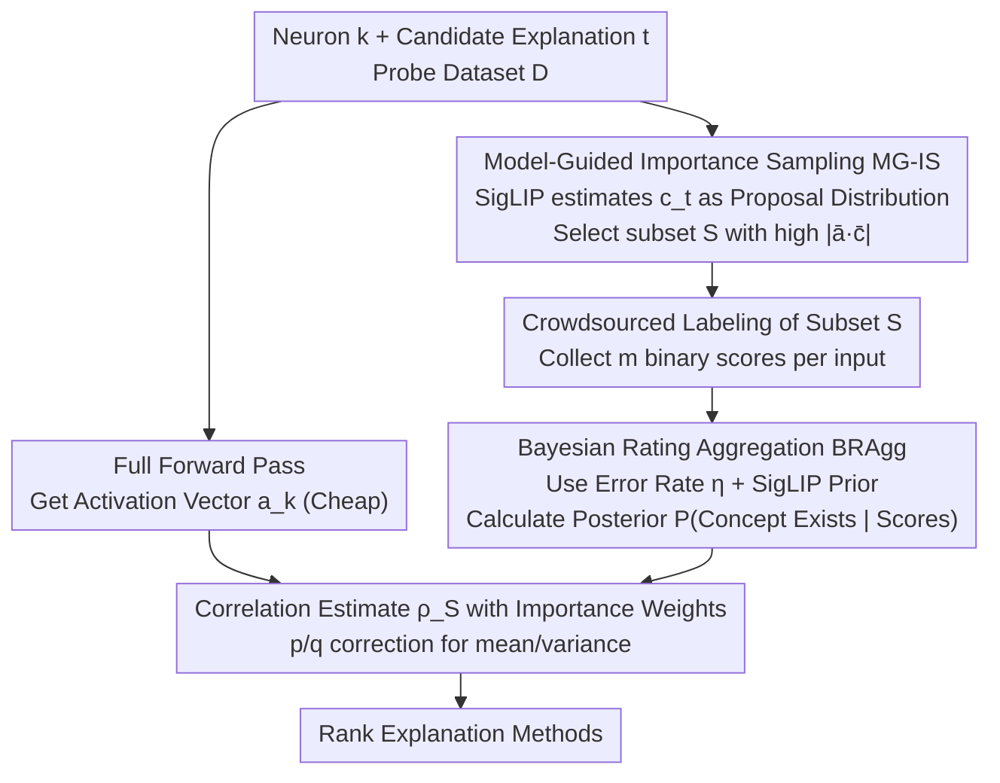

# Beyond Top Activations: Efficient and Reliable Crowdsourced Evaluation of Automated Interpretability

**Conference**: CVPR 2026  
**Paper**: [CVF Open Access](https://openaccess.thecvf.com/content/CVPR2026/html/Oikarinen_Beyond_Top_Activations_Efficient_and_Reliable_Crowdsourced_Evaluation_of_Automated_CVPR_2026_paper.html)  
**Code**: https://github.com/Trustworthy-MLLab/Efficient-Interpretability-Eval  
**Area**: Interpretability Evaluation  
**Keywords**: Neuron explanation, crowdsourced evaluation, importance sampling, Bayesian aggregation, mechanistic interpretability

## TL;DR
For the problem of "how to evaluate automated neuron explanations," this paper utilizes **Model-Guided Importance Sampling (MG-IS)** to select the most informative inputs for crowdsourced labeling and **Bayesian Rating Aggregation (BRAgg)** to remove noise. This reduces the cost of a reliable full-distribution correlation evaluation from approximately \$90k to \$2.16k (~40×). Using this method, the authors systematically compare mainstream interpretability methods across multiple vision models, finding that Linear Explanations perform best overall, surprisingly outperforming recent LLM-based methods.

## Background & Motivation
**Background**: A core task in mechanistic interpretability involves assigning a textual explanation to a single neuron (or a direction in activation space), such as "this neuron recognizes dogs." Many automated methods exist to generate such explanations—those based on concept-labeled datasets (Network Dissection, INVERT), CLIP-based methods (CLIP-Dissect, Linear Explanations), and recent Large Language Model (LLM)-based methods (DnD, MAIA). However, there is a lack of reliable means to **determine which explanation is more accurate or which method is superior**.

**Limitations of Prior Work**: The mainstream protocol involves presenting the **top-activating images** of a neuron alongside candidate explanations to crowdsourced workers and asking, "Does this description fit these images?" NeuronEval [24] pointed out that this protocol only measures **Recall**—it only checks if the explanation covers high-activation samples. It completely ignores whether the concept mentioned in the description also appears in low-activation samples or if all images fitting the description actually activate the neuron (**Precision**). Consequently, this evaluation **favors overly broad, non-specific** explanations, leading to unreliable method rankings.

**Key Challenge**: To be accurate, the evaluation should switch to a more reliable metric—the **Pearson correlation coefficient** $\rho(a_k, c_t)$ between the neuron activation vector $a_k$ and the concept presence label vector $c_t$ (NeuronEval verified this captures both sensitivity and specificity without requiring arbitrary binarization of real-valued activations). However, calculating the correlation coefficient requires statistics on concept presence across the **entire probe dataset**, leading to two problems with prohibitive labor costs: ① **High labeling costs**: For a dataset of 50,000 images, labeling a single (neuron, explanation) pair with 3 people per image would cost ~$600; evaluating thousands of neurons approaches \$1M. ② **High labeling noise**: Human judgments on concept presence are inherently error-prone, which is fatal for rare concepts (false positives can outnumber true positives); hiring more workers to suppress noise further multiplies costs.

**Goal**: To reduce the total cost of reliable crowdsourced evaluation to an affordable level without sacrificing the "full-distribution, correlation coefficient" metric, thereby enabling a large-scale systematic comparison.

**Core Idea**: Costs are high because of "uniform and repetitive" labeling—much of the budget is spent on samples that contribute almost nothing to the correlation coefficient and on redundant scoring to combat noise. This paper addresses **which samples to label** (Importance Sampling) and **how to recover the true value from noisy scores** (Bayesian Posterior). By using a cheap model (SigLIP) as a prior/proposal distribution to guide both steps, the cost is reduced by approximately 40×.

## Method

### Overall Architecture
To evaluate the quality of a (neuron $k$, explanation $t$) pair, one essentially estimates the correlation coefficient:

$$\rho(a_k, c_t) = \frac{1}{|\mathcal{D}|}\frac{\sum_{i}([a_k]_i-\mu(a_k))([c_t]_i-\mu(c_t))}{\sigma(a_k)\sigma(c_t)}$$

The activation vector $a_k$ can be computed fully in one forward pass (cheap). The expensive part is the concept vector $c_t$, where each component $[c_t]_i=P(t|x_i)$ represents whether concept $t$ appears in image $x_i$, requiring human labels. The bottleneck of the pipeline is "how to estimate $c_t$ (and thus $\rho$) accurately using as few and as clean human labels as possible." This paper splits this into two serial optimizations: first, **MG-IS** decides **which inputs** to send for labeling (reducing sample count), then **BRAgg** decides **how to aggregate multiple noisy labels per input** into $[c_t]_i$ (reducing scores per input). Both steps leverage the cheap SigLIP model to inject prior knowledge, finally calculating $\rho_S$ on the reduced subset $S$ using an importance-weighted estimator to rank methods.

### Key Designs

**1. MG-IS: Using a cheap model to focus the labeling budget on samples that "truly impact the correlation"**

A fatal flaw of uniform (Monte Carlo) sampling is that concepts of interest are often rare in the dataset; a small random batch may contain almost no positive examples, leading to inaccurate correlation estimates. MG-IS stems from the variance optimality of importance sampling—when estimating $\mathbb{E}_{x\sim P}[h(x)]$, the optimal proposal distribution $q^*(x)$ that minimizes variance satisfies $q^*(x)\propto |h(x)|p(x)$. Applying this to the correlation coefficient leads to the optimal sampling probability:

$$q^*(x_i)\propto |\bar a_{ki}\cdot \bar c_{ti}|$$

This means sampling images where the product of "normalized activation × normalized concept" has a large absolute value. Since $c_t$ is unknown prior to measurement, the authors use the cheap **SigLIP** to predict an approximation $c_t^{siglip}$ to construct the proposal distribution $q^{siglip}$. To ensure the estimator remains unbiased (requiring $q(x)>0$ wherever $p(x)h(x)\neq 0$) and to leave room for SigLIP errors, the final proposal is a mixture of the proxy and the uniform distribution:

$$q^{\text{MG-IS}}(x)=(1-\gamma)\,q^{siglip}(x)+\gamma\,p(x),\quad \gamma=0.2$$

In practice, 80% of samples are SigLIP-guided, and 20% come from uniform sampling. Since estimation on subset $S$ is biased, **importance corrections using $p(x_i)/q(x_i)$** must be applied level-by-level to the concept vector's mean, variance, and correlation (activations $a_k$ use true values as they are fully available):

$$\rho_S=\frac{1}{|S|}\sum_{i\in S}\frac{p(x_i)}{q(x_i)}\,[\bar a_k]_i\cdot[\bar c_t]_i$$

Simulations show that for the same precision, MG-IS saves ~13–15× samples compared to uniform sampling, or yields ~65% lower error given the same budget.

**2. BRAgg: Treating multiple noisy labels as Bayesian evidence rather than simple voting**

Crowdsourced labels are naturally noisy (AMT error rates are measured at ~$\eta=23\%$). Traditional methods either **average** or use **majority voting** on $m$ binary scores to get $[c_t]_i$. However, neither models the uncertainty of whether the concept exists, making them prone to false positives for rare concepts. BRAgg instead estimates $[c_t]_i$ as the **posterior probability** $P([c_t^*]_i=1\mid R_{ti})$, where $R_{ti}=\{r^1_{ti},\dots,r^m_{ti}\}$ are all labels for the (input, concept) pair:

$$[c_t]_i=\frac{P(R_{ti}\mid C_{ti})\,P(C_{ti})}{P(R_{ti}\mid C_{ti})\,P(C_{ti})+P(R_{ti}\mid \lnot C_{ti})\,P(\lnot C_{ti})}$$

The likelihood term assumes each rater independently makes mistakes with error rate $\eta$. Letting $\alpha_{ti}=\sum_j r^j_{ti}$ be the number of "present" votes, then $P(R_{ti}\mid C_{ti})=(1-\eta)^{\alpha_{ti}}\eta^{(m-\alpha_{ti})}$ and $P(R_{ti}\mid \lnot C_{ti})=\eta^{\alpha_{ti}}(1-\eta)^{(m-\alpha_{ti})}$. Two types of priors $P(C_{ti})$ are used: **Uniform Prior** sets a constant $\beta=0.05$ (reflecting rarity); **SigLIP Prior** uses $[c_t^{siglip}]_i$ directly (clipped to $[0.001,0.999]$), effectively fusing human ratings with the cheap model. In simulations ($\eta=23\%$), BRAgg(SigLIP) achieves the lowest error with only a few raters, saving ~2–10× (avg ~3×) labels compared to majority voting.

### Cost Example: Expense per (neuron, explanation) pair
With the optimized parameters, the large-scale study evaluates only **180 inputs per pair, with 3 raters per input**, totaling 540 evaluations. In a task where 15 images are bundled for \$0.06, the cost per pair is $=\frac{0.06}{15}\times180\times3=\$2.16$. In contrast, uniform sampling + majority voting would require ~22,560 evaluations to reach the same error—a ~40× difference, which reduces the total study cost from \$90k to \$2.16k.

## Key Experimental Results

### Savings per Technique (Simulation Setting 1, Target RCE 27.5%)
| Configuration | Evaluations Needed | Relative to Baseline |
|------|------------------|---------|
| Uniform + Majority Voting (Baseline) | 22560 | 1× |
| BRAgg only | 14607 | ~1.5× Gain |
| MG-IS only | 1760 | ~13× Gain |
| **MG-IS + BRAgg** | **550** | **~40× Gain** |

> RCE = Relative Correlation Error (Eq. 12). MTurk real-world verification (Setting 2) shows consistent trends: MG-IS+BRAgg reaches 19.8% RCE within a 550 evaluation budget, while uniform sampling fails to reach that level within the tested sample sizes.

### Large-scale Study: Method Ranking (Pearson Correlation, Higher is Better, l=1)
| Method | RN-50 Layer4 (SigLIP Eval) | ViT-B-16 Layer11 (SigLIP Eval) |
|----------|------|------|
| **LE(SigLIP)** [23] | **0.2413** | **0.2968** |
| LE(label) [23] | 0.1793 | 0.2704 |
| INVERT (l=1) [7] | 0.1904 | 0.1849 |
| CLIP-Dissect [22] | 0.1242 | 0.0335 |
| DnD [1] (LLM) | 0.1867 | 0.1343 |
| MAIA [29] (LLM) | 0.1534 | 0.1049 |
| MILAN [15] | 0.0920 | 0.0194 |

### Key Findings
- **Linear Explanations are strongest overall**, ranking first in both automated SigLIP evaluation and human crowdsourced evaluation (aggregated via BRAgg(SigLIP)). The authors attribute this to LE being the only method optimized to explain the **entire activation range** rather than just top activations.
- **LLM-based methods (DnD, MAIA) did not outperform simple baselines**, despite providing precise descriptions for some neurons. Reasons include: ① Focus on top activations → overly specific explanations that fail on lower activations; ② Instability → higher variance in LLM description quality.
- **SigLIP automated evaluation is quite reliable**: It yields an RCE of 32.1% on the full dataset (vs 27.9% for humans). While human rating remains the gold standard, automated evaluation is a practical alternative when budgets are extremely tight.
- **Overall correlations remain low** (best around 0.2), suggesting significant room for improvement in current neuron explanation methods or the need for more inherently interpretable models.

## Highlights & Insights
- **Interpret evaluation as a statistical estimation problem**: While most work focuses on "generating better explanations," Ours focuses on "evaluating explanations cheaply and unbiasedly" with theoretical grounding in variance-optimal sampling.
- **"Dual-use" of SigLIP**: The same cheap model serves as the proposal distribution for MG-IS and the prior for BRAgg, injecting model knowledge in a way that allows for correction by humans, thus avoiding the trap of "blindly trusting automated metrics."
- **Importance of correction weights**: Unbiased correlation estimation on a subset requires multi-level $p/q$ corrections for means and variances. The fact that raw activations are "free" (fully available) was cleverly exploited to reduce the number of variables needing estimation.

## Limitations & Future Work
- **Scope limited to vision and single-concept (l=1) explanations**: Complex logic or linear combination explanations were only evaluated automatically in the appendix; crowdsourced experiments did not cover them. Transferability to LLM neurons or SAE latents is not yet verified.
- **Homogeneous error rate $\eta$**: While the uniform $\eta$ performed slightly better in tests, the 23% value derived from ImageNet labels might over-estimate noise, as ImageNet labels themselves contain errors.
- **Dependency on SigLIP quality**: The benefits of MG-IS and BRAgg rely on SigLIP's coarse concept estimation. In specialized domains (medical, etc.) where SigLIP performs poorly, the gains may decrease.
- **Future Directions**: Extending MG-IS+BRAgg to multi-concept explanations and LLM/SAE neurons; using domain-specific cheap evaluators; and modeling rater heterogeneity.

## Related Work & Insights
- **vs. NeuronEval [24]**: NeuronEval identified the theoretical flaws in "Recall-only" top-activation metrics. Ours makes their proposed "Correlation" metric practically affordable for large-scale human studies.
- **vs. Traditional Crowdsourced Denoising (e.g., Dawid-Skene [27,32])**: Those methods typically require a **fixed set of annotators** to estimate individual abilities. BRAgg works with anonymous/transient AMT raters by using a global error rate and model priors.
- **vs. Evaluated Methods (e.g., Linear Explanations [23])**: This work acts as the "referee" rather than a new "player." Its findings provide evidence that researchers should invest in explaining the full activation distribution rather than just optimizing for top activations.

## Rating
- Novelty: ⭐⭐⭐⭐ Re-framing interpretability evaluation as a statistical problem with optimal sampling and Bayesian denoising is novel and effective.
- Experimental Thoroughness: ⭐⭐⭐⭐ Dual verification (simulation + real AMT), multiple models (RN-50/ViT), and comparisons across 5+ methods.
- Writing Quality: ⭐⭐⭐⭐ Clear progression from motivation to challenges, solutions, and verification.
- Value: ⭐⭐⭐⭐ A 40× cost reduction makes reliable large-scale evaluation accessible to the interpretability community.

<!-- RELATED:START -->

## Related Papers

- [\[ICLR 2026\] Formal Mechanistic Interpretability: Automated Circuit Discovery with Provable Guarantees](../../ICLR2026/interpretability/formal_mechanistic_interpretability_automated_circuit_discovery_with_provable_gu.md)
- [\[ICML 2026\] Beyond Additive Decompositions: Interpretability Through Separability](../../ICML2026/interpretability/beyond_additive_decompositions_interpretability_through_separability.md)
- [\[ACL 2025\] Enhancing Automated Interpretability with Output-Centric Feature Descriptions](../../ACL2025/interpretability/output_centric_interpretability.md)
- [\[NeurIPS 2025\] Beyond Components: Singular Vector-Based Interpretability of Transformer Circuits](../../NeurIPS2025/interpretability/beyond_components_singular_vector-based_interpretability_of_transformer_circuits.md)
- [\[ACL 2026\] Similarity-Distance-Magnitude Activations](../../ACL2026/interpretability/similarity-distance-magnitude_activations.md)

<!-- RELATED:END -->
