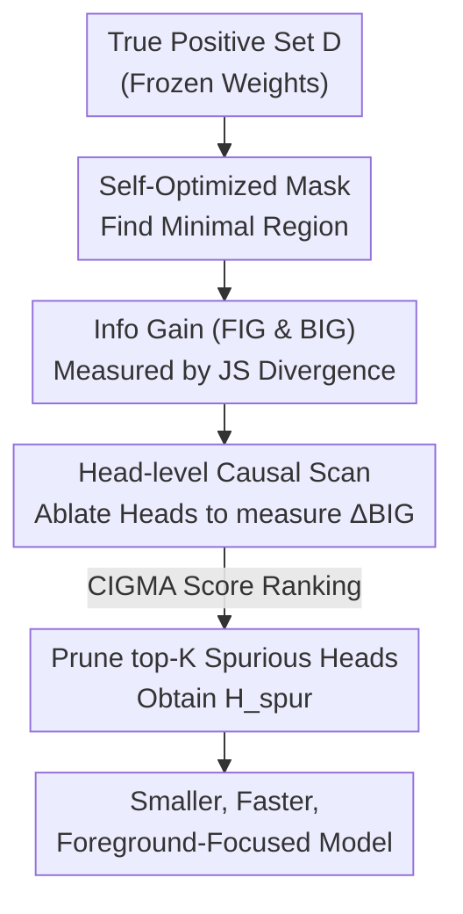

# CIGMA: Causal Information-Gain Mechanistic Attribution of Attention Heads in Vision Transformers

**Conference**: CVPR 2026  
**Paper**: [CVF Open Access](https://openaccess.thecvf.com/content/CVPR2026/html/Maliha_CIGMA_Causal_Information-Gain_Mechanistic_Attribution_of_Attention_Heads_in_Vision_CVPR_2026_paper.html)  
**Code**: https://github.com/MaishaMaliha1/CIGMA.git  
**Area**: Mechanistic Interpretability / Attention Head Attribution  
**Keywords**: Attention Head Attribution, Spurious Correlation, Information Gain, Causal Intervention, Training-free Pruning

## TL;DR
CIGMA quantifies the contribution of each attention head to background shortcuts using two counterfactual edits (masking foreground/background). By ranking heads according to causal information gain and surgically zeroing out the top-K "spurious heads," ViT/VLM models are encouraged to shift attention from the background to foreground objects without requiring training. This leads to classification accuracy gains of 7.6–24.8 percentage points and an approximately 83% reduction in background dependency.

## Background & Motivation
**Background**: ViTs and Large Vision-Language Models (LVLMs) exhibit strong performance in classification and visual reasoning, but they possess a massive number of parameters and visual tokens (e.g., LLaVA-1.5-13B uses 576 visual tokens per image, accounting for up to 87% of the input; InternVL uses up to 1792 tokens). To enable edge deployment, the community has developed numerous token or structural pruning methods (DivPrune, EfficientLLaVA, MDP, TopV, ATP-LLaVA) with the goal of "reducing compute without sacrificing accuracy."

**Limitations of Prior Work**: These models often follow "background shortcuts"—relying on scene context (like grass or sky) rather than the object itself for classification—which harms robustness, calibration, and interpretability. Existing pruning methods focus solely on efficiency/accuracy and **fail to locate which specific attention heads are transmitting background signals**. Consequently, they lack causal validation and may inadvertently damage useful computations during pruning, often leaving background dependencies intact.

**Key Challenge**: To eliminate spurious correlations, one must first answer: "Which internal component of the model is responsible for this behavior?" However, methods like attention visualization or gradient attribution only provide **correlation** (what is being watched), failing to answer the **causal** question: "Will the prediction actually change if this component is removed?"

**Goal**: (1) Automatically identify the minimal foreground evidence region the model relies on; (2) Quantify the dependency strength of each image on foreground vs. background; (3) Precisely locate and remove the minority of attention heads specialized in processing the background, all without training.

**Key Insight**: The authors combine three lines of inquiry: perturbation-based explanations (finding the minimal region that maintains prediction), information bottleneck-style shifts in distribution under controlled edits, and the observation that many attention heads are redundant. By using a minimal foreground mask and information-theoretic contrasts, they isolate foreground/background effects and perform head-level causal interventions to locate the spurious subnetwork.

**Core Idea**: The reduction in background information gain after ablating a head is used as that head's causal spurious score (CIGMA score). By ranking and removing the top-K heads, the background shortcut subnetwork can be surgically excised.

## Method

### Overall Architecture
Given a frozen pre-trained classifier $f_\theta: \mathcal{I} \to \mathbb{R}^C$, CIGMA executes a three-stage, purely analytical pipeline—without updating any weights—on a set of **correctly classified true-positive images** $D=\{I_1,\dots,I_N\}$:

1.  **Self-Optimized Foreground Mask**: For each image, a low-resolution continuous mask is learned via gradient optimization to find the minimal foreground region that, when kept, leaves the prediction distribution almost unchanged.
2.  **Foreground/Background Information Gain**: This mask is used to construct "foreground-only" and "background-only" counterfactual images. The change in prediction distribution relative to the original image (FIG / BIG) is measured to characterize the model's dependency on each region.
3.  **Head-level Causal Scan**: The Q/K/V/O weights of each attention head are sequentially zeroed out to observe the average drop in Background Information Gain (BIG), yielding the CIGMA score. The top-K heads by score are removed as the "spurious subnetwork" $H_{\text{spur}}$.

The process treats the ViT as a circuit where heads can be toggled rather than a black box: first defining "background dependency" via information theory, then locating "who causes it" through causal ablation.

### Key Designs

**1. Self-optimized foreground mask: Letting the model identify its own dependencies**

To discuss "foreground vs. background dependency," a definition of "foreground" is required. The authors avoid external segmentation labels by formulating this as an optimization problem. For each image $I_i$, a low-resolution continuous mask $M_i\in[0,1]^{h\times w}$ ($h=w=32$) is learned. After bilinear upsampling $U(M_i)$, a counterfactual image keeping only the foreground is constructed, with the background replaced by a neutral baseline $B_i$:

$$I_{i,\text{keep}}(M_i) = U(M_i)\odot I_i + (1-U(M_i))\odot B_i$$

The baseline $B_i$ is the mean color of the image (preserving global color statistics while removing spatial structure). The optimization objective has three weighted terms:

$$M_i^* = \arg\min_{M_i}\; \lambda_{JS}\cdot \mathrm{JS}\big(q_i,\, p_\tau(y\mid I_{i,\text{keep}}(M_i))\big) + \lambda_1\|M_i\|_1 + \lambda_{TV}\,\mathrm{TV}(M_i)$$

The first term uses JS divergence to match the original prediction distribution $q_i$ (preserving the entire belief, not just top-1). The second term ($\ell_1$) forces the mask to be minimal, and the third (total variation) ensures spatial continuity. After approximately 250 Adam iterations, the mask is binarized at a percentile threshold (retention ratio $\rho=0.35$) to obtain $S_i$. These "foregrounds" are the **pixels the model itself deems critical**, rather than human-annotated boxes.

**2. Foreground/Background Information Gain: Quantifying dependency via JS Divergence**

Using the mask $S_i$, two complementary counterfactual images are created: $I_{i,\text{-fg}}$ (foreground masked, background kept) and $I_{i,\text{-bg}}$ (background masked, foreground kept). The prediction distributions $q_{i,\text{-fg}}$ and $q_{i,\text{-bg}}$ are obtained. Their deviation from the original distribution $q_i$ is measured using JS divergence to define FIG and BIG:

$$\mathrm{FIG}_i = \mathrm{JS}(q_i,\, q_{i,\text{-fg}}), \qquad \mathrm{BIG}_i = \mathrm{JS}(q_i,\, q_{i,\text{-bg}})$$

The intuition is straightforward: a large change when the foreground is removed (high FIG) implies heavy dependence on foreground evidence. A large change when the background is removed (high BIG) indicates the model extracts significant information from the background, suggesting a spurious correlation. JS divergence is preferred over KL as it is symmetric, bounded by $[0, \log 2]$, and yields finite values even for non-overlapping distributions.

**3. Head-level causal scan and CIGMA score: Identifying spurious heads via ablation**

This is the causal core. For each head $h$ in the ViT ($L$ layers $\times H$ heads), a "surgical ablation" is performed by zeroing out the Q, K, V, and Output projection weights for that head's specific dimension subset $S_h$:

$$(W_Q)_{S_h,:}=0,\;(W_K)_{S_h,:}=0,\;(W_V)_{S_h,:}=0,\;(W_O)_{:,S_h}=0$$

This makes the head's contribution to the residual stream zero while leaving others intact. Background information gain $\mathrm{BIG}_i^{(-h)}$ is recomputed on the ablated model $f_\theta^{(-h)}$. The CIGMA score is the average drop in BIG across the image set:

$$\mathrm{CIGMA}(h) = \frac{1}{N}\sum_{i=1}^{N}\Big(\mathrm{BIG}_i - \mathrm{BIG}_i^{(-h)}\Big)$$

A positive score indicates that removing the head reduces background dependency—meaning the head was processing background information. A score near zero or negative suggests the head handles foreground or is insignificant. This is a **causal rather than correlational** measure. The top-K heads (experimentally $K=16$) are then removed to form $H_{\text{spur}}$.

### Mechanism: Correcting from Golden retriever to English Foxhound
Figure 2 in the paper illustrates the process: for an image of a dog, the baseline model is misled by the background to predict "Golden retriever." CIGMA learns the minimal foreground mask (circling the dog), and finds $\mathrm{BIG} > \mathrm{FIG}$. Through causal ablation, it identifies the heads responsible for the drop in BIG. After removing these background heads, the model correctly predicts "English Foxhound," and Grad-CAM heatmaps shift from the background to the dog.

### Loss & Training
The process is entirely **training-free**; weights are frozen, and no gradients update the backbone (mask optimization only updates the low-res mask). Key hyperparameters: mask resolution $32 \times 32$, Adam learning rate $0.05$, 250 iterations; weights $\lambda_{JS}=1.0, \lambda_1=0.01, \lambda_{TV}=0.1$; binarization at 65th percentile ($\rho=0.35$); softmax temperature $\tau=1.0$; true-positive set $D$ includes 40% of correctly classified images; $K=16$. CIGMA can also be applied to fine-tuned models.

## Key Experimental Results

### Main Results (Zero-shot, Training-free; 3 Datasets × 3 VLM Backbones)
All numbers are means of 3 runs. Results for InternVL2-26B:

| Dataset | Metric | Original | MDP (Strong Baseline) | CIGMA (Ours) |
|--------|------|----------|------------------|----------------|
| CIFAR-10 | Acc↑ / BIR↓ | 92.0 / 0.35 | 92.3 / 0.34 | **99.6 / 0.068** |
| CIFAR-100 | Acc↑ / BIR↓ | 75.9 / 0.43 | 76.1 / 0.42 | **97.9 / 0.051** |
| Tiny-ImageNet | Acc↑ / BIR↓ | 68.0 / 0.46 | 68.3 / 0.45 | **90.4 / 0.071** |

Across all 9 combinations: CIGMA improves accuracy by 7.6–24.8 percentage points (avg +18.6) and reduces BIR by 79.5%–88.1% (avg -83.4%). Calibration (NLL/ECE) is 5–20× better than baselines. Notably, standard token pruning methods like ATP-LLaVA often increase BIR.

> ⚠️ BIR (Background Influence Ratio, lower is better) is detailed in Appendix B. It measures how much prediction changes when masking foreground vs. background (likely $\mathrm{BIG}/(\mathrm{FIG}+\mathrm{BIG})$).

### Comparison with Task Training (Ours (ft) vs. CoBalT / RAVL / CHG)
Even on fine-tuned backbones, CIGMA (ft) improves accuracy by 4.7–22.9 points and reduces BIR by 41.7–86.0% compared to Original (ft). It consistently outperforms CHG (Causal Head Gating) by 5.4–20.0 accuracy points.

### Ablation Study (Tiny-ImageNet, InternVL2-26B)

| Configuration | Top-1 Acc | Description |
|------|-----------|------|
| K=0 (Baseline) | 79.6% | No pruning |
| **K=16 (Optimal)** | **82.1%** | Pruning 16 spurious heads (peak performance) |
| K=32 | 80.2% | Excessive pruning, damages foreground features |
| TP Ratio 10% | 81.1% | Too few images, unstable CIGMA scores |
| **TP Ratio 40% (Optimal)** | **82.1%** | Sufficient diversity |

### Key Findings
- **Head-level intervention > Token/Structural pruning**: Background shortcuts are caused by a specific minority of heads. Targeted removal is far more effective than general token pruning.
- **Optimal pruning scale**: Performance peaks at $K=16$ and drops at $K=32$, confirming that spurious subnetworks are sparse.
- **Transferability to Medical Imaging**: In brain tumor MRI studies (ViT-B/16), removing top-16 spurious heads corrected false negatives and shifted Grad-CAM attention to the lesion.

## Highlights & Insights
- **Interpretability as a Scalpel**: The CIGMA score enables "surgical pruning"—moving beyond just visualization to actual model repair.
- **Causality vs. Correlation**: By using post-ablation behavioral changes instead of just attention weights, CIGMA avoids the common correlation traps of saliency maps.
- **Plug-and-play**: It works on frozen backbones (ideal for scenarios where retraining is impossible) but scales to fine-tuned models.
- **Model-defined Foreground**: Using the model's own minimal sufficient region for masking is more faithful to its actual decision logic than using human-annotated bounding boxes.

## Limitations & Future Work
- **Task Specificity**: Validated primarily on classification tasks and relatively small datasets; its efficacy on detection or open-ended VQA remains unexplored. ⚠️ CIFAR images have low resolution; structural separation on such small inputs requires caution.
- **Scanning Overhead**: Sequential ablation cost grows linearly with $L \times H$. Interactions between heads (e.g., if removing A changes B's score) were not deeply analyzed.
- **Dependency on True Positives**: The analysis relies on correctly classified images, possibly ignoring spurious paths present in misclassified or "spurious-correct" samples.

## Related Work & Insights
- **vs. Token Pruning**: These methods aim for efficiency via tokens/channels. CIGMA specifically targets background signals for reliability; the two are orthogonal and can be combined.
- **vs. Causal Head Gating (CHG)**: CHG requires end-to-end training for gating. CIGMA is training-free and shows superior accuracy (by 5.4–20.0 points).
- **vs. Perturbation-based Explanation**: CIGMA adapts "minimal sufficient masks" for head-level causal attribution, providing a novel synthesis of these tools.

## Rating
- Novelty: ⭐⭐⭐⭐ Combines info-theory and causal ablation into an actionable pruning framework.
- Experimental Thoroughness: ⭐⭐⭐⭐ Broad coverage of backbones and medical case studies, though limited to classification.
- Writing Quality: ⭐⭐⭐⭐ Clear logical flow from motivation to causal proof.
- Value: ⭐⭐⭐⭐ Provides a practical, training-free tool for diagnosing and fixing spurious correlations.

<!-- RELATED:START -->

## Related Papers

- [\[NeurIPS 2025\] Causal Head Gating: A Framework for Interpreting Roles of Attention Heads in Transformers](../../NeurIPS2025/interpretability/causal_head_gating_a_framework_for_interpreting_roles_of_attention_heads_in_tran.md)
- [\[CVPR 2026\] Align Once to Explain: Feature Alignment for Scalable B-cosification of Foundational Vision Transformers](align_once_to_explain_feature_alignment_for_scalable_b-cosification_of_foundatio.md)
- [\[ICML 2026\] Singular Vectors of Attention Heads Align with Features](../../ICML2026/interpretability/singular_vectors_of_attention_heads_align_with_features.md)
- [\[ICLR 2026\] From Concepts to Components: Concept-Agnostic Attention Module Discovery in Transformers](../../ICLR2026/interpretability/from_concepts_to_components_concept-agnostic_attention_module_discovery_in_trans.md)
- [\[CVPR 2026\] Inside-Out: Measuring Generalization in Vision Transformers Through Inner Workings](inside-out_measuring_generalization_in_vision_transformers_through_inner_working.md)

<!-- RELATED:END -->
