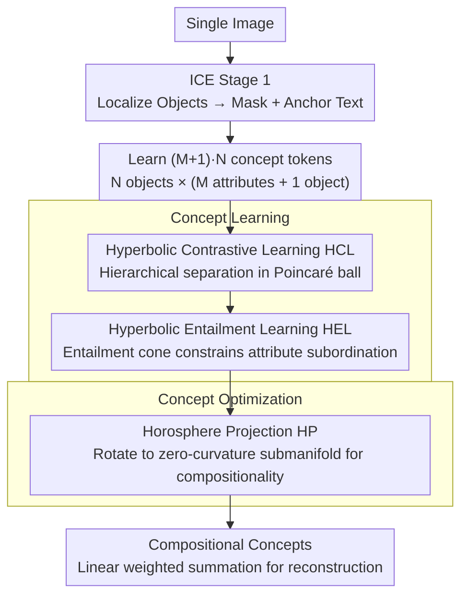

# CI-ICE: Intrinsic Concept Extraction Based on Compositional Interpretability

**Conference**: CVPR 2026  
**arXiv**: [2603.11795](https://arxiv.org/abs/2603.11795)  
**Code**: None  
**Area**: Interpretability / Concept Extraction  
**Keywords**: Concept extraction, compositionality, hyperbolic space, Poincaré ball, Horosphere projection, diffusion models  

## TL;DR

This work proposes the CI-ICE task and the HyperExpress method: it leverages hierarchical modeling capabilities in hyperbolic space (Poincaré ball) to extract compositional object-level/attribute-level intrinsic concepts. By ensuring the compositionality of the concept embedding space via Horosphere projection, it achieves a concept decoupling $ACC_1$ of 0.504 on UCEBench (a 55% improvement over 0.325 for ICE).

## Background & Motivation

**Background**: Unsupervised Concept Extraction (UCE) aims to extract human-understandable visual concepts (objects, colors, materials) from a single image, serving as a key tool for model interpretability. ConceptExpress and AutoConcept can extract concepts from single images, while ICE further enables the separation of object-level and attribute-level concepts.

**Limitations of Prior Work**: (1) ConceptExpress/AutoConcept can only extract object-level concepts and cannot disentangle attributes like color or material; (2) Although ICE separates objects and attributes, it does not guarantee compositionality—extracted concepts cannot be reconstructed into the original complex concept through simple combinations; (3) CCE considers compositionality but requires multiple images containing the same concept, which limits its practical utility.

**Key Challenge**: Concept "decoupling" $\neq$ concept "compositionality"—existing methods focus only on decoupling while ignoring the compositional structure of the concept space, leading to irreversible and incomprehensible concept decomposition paths.

**Goal**: To extract intrinsic visual concepts from a single image that are both hierarchically decoupled (object-level vs. attribute-level) and compositional (capable of being recombined to reconstruct the original concept).

**Key Insight**: Leveraging the inherent hierarchical modeling capability of hyperbolic space for concept learning and utilizing the zero-curvature property of the horosphere to ensure compositionality.

**Core Idea**: Learn hierarchical concept relationships in the Poincaré ball and project them onto the horosphere to guarantee linear compositionality.

## Method

### Overall Architecture

HyperExpress addresses CI-ICE by both decoupling concepts into object/attribute levels and ensuring these concepts can be recombined into the original concept. The task is partitioned into two pipelines: **Concept Learning** (Hyperbolic Contrastive Learning HCL + Hyperbolic Entailment Learning HEL, responsible for positioning concepts on the Poincaré ball with correct hierarchies and subordinations) and **Concept Optimization** (Horosphere Projection HP, responsible for rotating learned concepts onto a zero-curvature submanifold to satisfy linear composition). Procedurally, the method utilizes the first stage of ICE to locate objects and obtain masks $\mathcal{M}$ and anchor text $\mathcal{T}^{anchor}$, followed by learning $(M+1)\cdot N$ concept token embeddings ($N$ objects, each paired with $M$ attribute concepts and 1 object concept).

### Key Designs

**1. Hyperbolic Contrastive Learning HCL: Utilizing hyperbolic distance to naturally separate different concept hierarchies**

Euclidean space is ill-suited for representing hierarchical structures like "object-attribute," as diverse concepts are crowded into a finite volume. HCL utilizes a CLIP encoder with learnable weights $W$, then maps tokens to the Poincaré ball via the exponential map $\exp_0(\cdot)$. It then uses hyperbolic triplet loss to separate distances in two steps: first, it distinguishes object-level from attribute-level concepts by pulling the anchor closer to the corresponding object concept than to the attribute concepts, $\mathcal{L}^{obj}_{triplet,k} = \max(0,\, d_{\mathbb{D}}(v_k^{anchor}, v_k^{obj}) - d_{\mathbb{D}}(v_k^{anchor}, v_k^{att}) + \gamma)$; second, it further distinguishes between different attributes of the same object. Hyperbolic space is chosen because its volume grows exponentially with the radius, allowing distinct concepts to be naturally pushed further apart, which is better suited for hierarchical modeling than Euclidean space.

**2. Hyperbolic Entailment Learning HEL: Modeling "attributes belong to objects" as geometric entailment cones**

Simply separating concepts is insufficient; explicit subordination (e.g., "metal is an attribute of a robot") must be established. Otherwise, decoupled concepts remain independent, losing hierarchical information. HEL constructs an entailment cone for each object concept in the Lorentz model, requiring its attribute concepts to fall within the cone. The entailment loss is given by $\mathcal{L}_{entail,k} = \max(0,\, \cos(\omega(v_k^{obj})) - \cos(\theta(v_k^{obj}, v_k^{att})))$, where $\omega$ is the cone's half-angle and $\theta$ is the spatial angle between the object and the attribute; the loss is zero when the angle falls within the cone. Consequently, the object-attribute subordination is no longer implicit in distance but is geometrically readable.

**3. Horosphere Projection HP: Enabling linear composition of concepts on a zero-curvature submanifold**

The previous steps establish hierarchy and subordination, but decoupled concepts still cannot be reconstructed by simple addition—a limitation in ICE. HP specifically enforces compositionality: it identifies $n$ geodesic directions in hyperbolic space to maximize projection variance and uses an orthogonal matrix $Q$ to rotate them onto a horosphere (a zero-curvature submanifold). This projection possesses two key properties: first, it is distance-preserving,

$$d_{\mathbb{H}}(\pi(x), \pi(y)) = d_{\mathbb{H}}(x, y)$$

Thus, the previously learned hierarchy and entailment relationships are preserved; second, the horosphere inherits the flatness of Euclidean space, allowing concepts to satisfy linear combination,

$$R([V_i] \cup [V_j]) = w_i R([V_i]) + w_j R([V_j])$$

Intuitively, once the concepts of "robot," "metal," and "gold" are projected onto the submanifold, a weighted sum can reconstruct "golden metal robot," making the decomposition-recombination path reversible and interpretable.

### Loss & Training

The total loss is $\mathcal{L} = \mathcal{L}_{recon} + \lambda_{triplet} \mathcal{L}_{triplet} + \lambda_{attention} \mathcal{L}_{attention} + \lambda_{entail} \mathcal{L}_{entail}$. $\mathcal{L}_{recon}$ is the reconstruction loss for diffusion model denoising; $\mathcal{L}_{triplet}$ includes both object-level and attribute-level triplet losses; $\mathcal{L}_{attention}$ is the Wasserstein attention alignment loss (aligning T2I attention to mask regions); and $\mathcal{L}_{entail}$ is the entailment loss. The implementation is based on Stable Diffusion.

## Key Experimental Results

### Main Results (UCEBench)

| Method | SIM_I (%) | SIM_C (%) | $ACC_1$ (%) | $ACC_3$ (%) |
|---|---|---|---|---|
| Break-A-Scene | 0.627 | 0.773 | 0.174 | 0.282 |
| ConceptExpress | 0.689 | 0.784 | 0.263 | 0.385 |
| AutoConcept | 0.690 | 0.770 | 0.350 | 0.520 |
| ICE | 0.738 | 0.822 | 0.325 | 0.518 |
| **HyperExpress** | 0.699 | 0.786 | **0.504** | **0.736** |

### Ablation Study (D1 Dataset)

| HCL | HEL | HP | SIM_I | SIM_C | $ACC_1$ | $ACC_3$ |
|---|---|---|---|---|---|---|
| ✔ | ✗ | ✗ | 0.625 | 0.769 | 0.326 | 0.509 |
| ✔ | ✔ | ✗ | 0.688 | 0.771 | 0.330 | 0.518 |
| ✔ | ✗ | ✔ | 0.621 | 0.765 | 0.348 | 0.522 |
| ✔ | ✔ | ✔ | **0.699** | **0.786** | **0.504** | **0.736** |

### Key Findings

- **Massive Improvement in ACC Metrics**: $ACC_1$ increased from 0.325 (ICE) to 0.504 (+55%), and $ACC_3$ increased from 0.518 to 0.736 (+42%), demonstrating that compositionality brings a qualitative change to concept decoupling.
- **Three Modules are Essential**: The full HCL+HEL+HP configuration nearly doubled $ACC_3$ (0.509 → 0.736) compared to HCL alone.
- **HP Module Contribution**: Removing HP caused $ACC_3$ to drop from 0.736 to 0.518, identifying the Horosphere projection as the key to compositionality.
- **Trade-off in SIM Metrics**: SIM_I/SIM_C are slightly lower than those of ICE (0.699 vs 0.738), indicating that compositionality constraints limit the reconstruction precision of individual concepts.

## Highlights & Insights

- Innovation at the task definition level: introducing "compositionality" as a core objective for concept extraction—concept decomposition should be reversible.
- The use of hyperbolic space for visual concept extraction is a novel entry point; its hierarchical modeling capability naturally matches object-attribute hierarchies.
- The mathematical properties of the Horosphere projection are elegant: maintaining hierarchies via distance preservation in hyperbolic space while ensuring linear combination through a zero-curvature submanifold.
- Qualitative combination paths are intuitive: "robot" + "metal" + "gold" → "golden metal robot."

## Limitations & Future Work

- **SIM Metric Trade-off**: There is a conflict between compositionality and single-concept reconstruction accuracy; SIM_I is approximately 5% lower than that of ICE.
- **Pre-set Number of Objects/Attributes**: $N$ and $M$ must be specified in advance, which is inflexible for complex scenes.
- **Inference Efficiency**: The computational overhead of hyperbolic operations and Horosphere projection in high-dimensional embeddings has not been analyzed.
- **Limited Verification**: Generalization to other T2I models (DALL-E/Imagen) beyond Stable Diffusion remains to be verified.

## Related Work & Insights

- **vs ICE**: ICE separates objects/attributes but does not guarantee compositionality, making combination paths difficult to understand; HyperExpress achieves reversible decomposition-recombination via hyperbolic space and HP projection.
- **vs CCE**: CCE considers compositionality but requires multiple images and is restricted to Euclidean space, making it difficult to capture hierarchical relationships.
- **vs ConceptExpress/Break-A-Scene**: These methods only extract object-level concepts and cannot separate attributes.
- **Insights**: The application of hyperbolic space in visual concept modeling deserves further exploration; compositionality as a core interpretability metric has broad applicability.

## Rating

⭐⭐⭐⭐ (4/5)

**Reasoning**: The task definition (CI-ICE) is innovative, and the method design (hyperbolic space + Horosphere projection) is mathematically elegant with clear motivation, achieving a massive boost in ACC metrics (+55%). The three-module design clearly decouples objectives: HCL handle hierarchy, HEL handles association, and HP handles compositionality. Deductions are for the trade-off in SIM metrics and verification on only one T2I model.

<!-- RELATED:START -->

## Related Papers

- [\[ACL 2026\] Towards Intrinsic Interpretability of Large Language Models: A Survey of Design Principles and Architectures](../../ACL2026/interpretability/towards_intrinsic_interpretability_of_large_language_modelsa_survey_of_design_pr.md)
- [\[CVPR 2026\] Towards Faithful Multimodal Concept Bottleneck Models](towards_faithful_multimodal_concept_bottleneck_models.md)
- [\[CVPR 2026\] Measuring the (Un)Faithfulness of Concept-Based Explanations](measuring_the_unfaithfulness_of_concept-based_explanations.md)
- [\[CVPR 2026\] Rethinking Concept Bottleneck Models: From Pitfalls to Solutions](rethinking_concept_bottleneck_models_from_pitfalls_to_solutions.md)
- [\[ACL 2026\] Constructing Interpretable Features from Compositional Neuron Groups](../../ACL2026/interpretability/constructing_interpretable_features_from_compositional_neuron_groups.md)

<!-- RELATED:END -->
