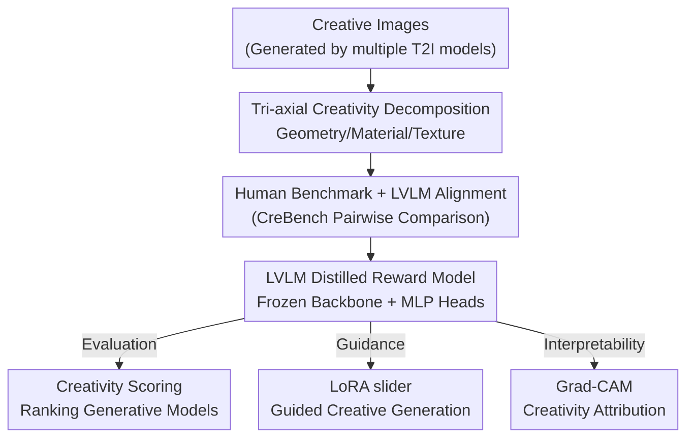

# CREward: A Type-Specific Creativity Reward Model

**Conference**: CVPR 2026  
**arXiv**: [2511.19995](https://arxiv.org/abs/2511.19995)  
**Code**: https://han-j-y.github.io/creward_prj/ (Available)  
**Area**: Interpretability / Creativity Evaluation / Reward Models / Image Generation  
**Keywords**: Creativity Metric, Type-Specific Reward Model, LVLM Annotation, Preference Learning, LoRA slider

## TL;DR
This paper decomposes "visual creativity" along the image formation pipeline into three interpretable axes: **Geometry / Material / Texture**. It first establishes a human benchmark, CreBench, via expert pairwise comparisons to confirm that Large Vision-Language Models (LVLMs) align closely with human judgment regarding creativity. Subsequently, a lightweight type-specific reward model, CREward (comprising a frozen visual backbone and MLP heads), is distilled from LVLM-generated preference labels. This model is applied across three domains: creativity evaluation, creative sample filtering / LoRA slider-guided generation, and Grad-CAM based interpretability.

## Background & Motivation
**Background**: With the rapid advancement of text-to-image (T2I) diffusion models, generating creative images has become a prominent research direction. However, the **quantification** of creativity remains an unresolved challenge. Existing works often rely on expensive manual scoring or adopt general vision metrics such as FID, CLIPScore, or Improved Precision/Recall as proxies.

**Limitations of Prior Work**: General metrics are not designed for "creativity"—they measure fidelity, distribution distance, or text-image alignment, failing to capture whether "this chair is creative." The few specialized metrics also have flaws: Rarity Score is constrained by training distribution bias; Wang et al. operationalized Boden’s "novelty / value / surprise" criteria, but only "novelty" is computable at the single-sample level.

**Key Challenge**: Existing methods treat creativity as an **indivisible scalar**. However, creativity is a complex phenomenon; an image might have a "weird shape but ordinary material" or "mediocre modeling but dazzling texture." Using a single value is neither interpretable nor allows for **directional control** over generation (e.g., there is no lever to specifically enhance material creativity).

**Goal**: (1) Provide a precise, quantifiable, and interpretable definition of creativity; (2) Develop a reward model usable for both **evaluation** and **generation guidance**; (3) Avoid dependence on human labeling or closed-source models.

**Key Insight**: The authors observe that creativity in visual design naturally unfolds along the **image formation / 3D rendering pipeline**—Geometry (shape and structure), Material (surface material properties), and Texture (surface patterns). This corresponds to the hierarchical processing of human vision, which handles coarse-grained global structures before fine-grained details.

**Core Idea**: Utilize a "type-specific reward model" instead of a "single scalar" to measure creativity. Creativity is decomposed along the geometry, material, and texture axes, and a lightweight reward model is distilled from LVLM labels, making creativity both evaluatable and guidable via LoRA.

## Method

### Overall Architecture
To address the issues of unreliability and uncontrollability in creativity measurement, the workflow proceeds in two stages: **first, proving that LVLMs can judge type-specific creativity like humans, then distilling this judgment into a lightweight reward model for downstream use**. Specifically, the authors establish CreBench-Human by having experts perform pairwise comparisons across five object categories (chairs, cars, handbags, bowls, vases). They then feed the same prompts to Gemini-2.5 and Gemma-3 to verify Spearman correlation between LVLM and human rankings. After confirming alignment, they synthesize large-scale creative images using multiple T2I models and LLM-generated type-specific prompts. 5,000 preference pairs are labeled by the open-source Gemma-3. Finally, CREward is trained—consisting of a frozen visual backbone (SigLIP) and 5-layer MLP heads—outputting four scalar scores (Geometry, Material, Texture, Overall) for each image using a pairwise logistic loss. CREward can score generative models, guide diffusion denoising via LoRA sliders, and perform pixel-level attribution using Grad-CAM.

### Key Designs

**1. Tri-axial Creativity Decomposition: Anchoring "Creativity" to the Image Formation Pipeline**

Addressing the pain point where creativity is treated as an uninterpretable and uncontrollable single scalar, the authors propose decomposing it along the 3D rendering pipeline: **Geometry (shape/structure)**, **Material (surface material properties)**, and **Texture (surface patterns)**. This decomposition is not arbitrary; it corresponds to the physical process of how images are "generated" and aligns with the hierarchical human visual system. This brings four benefits: fine-grained interpretable evaluation, controllability over creative direction, encouragement of cross-dimensional exploration for diversity, and stronger alignment with human perception. Table 3 quantifies an interesting conclusion: **Geometry has the highest correlation with "Overall Creativity"** (Human 0.84, Gemini 0.96, CREward 0.80), while Texture is the weakest, indicating that structural/shape factors dominate the perception of creativity.

**2. Human Benchmark + LVLM Alignment: Anchoring Human Perception via Pairwise Comparison**

Since absolute scoring is unstable even for the same annotator, the authors use **pairwise comparisons**. Five experts with over four years of design training analyzed 25 images per object (20 creative images + 5 "a/an {obj}" base images as anchors). 100 random pairs were sampled such that each image appeared 8 times. The **win rate** (proportion preferred / appearances) determines the ground-truth ranking for CreBench-Human. The critical step is verifying if LVLMs can replace humans: using the same instructions for Gemini-2.5 (closed-source) and Gemma-3 (open-source) to calculate Spearman correlation with human rankings. Results show Gemini-2.5 correlations even **exceeded inter-human agreement** (e.g., Geometry 0.80 > Human 0.71), while Gemma-3 matched or exceeded human consistency in Material/Texture. This justifies using LVLM labels for large-scale replacement of manual labor.

**3. CREward Reward Model: Distilling LVLM Preferences into a Lightweight Differentiable Scorer**

Directly using LVLMs for online evaluation is computationally expensive and hard to embed in training loops. Thus, authors distill Gemma-3 preferences into a lightweight reward model. Training data is synthesized using 5 T2I models (Hunyuan-DiT, PixArt, Kandinsky v3, SD v3.5 Large, Flux-schnell) with prompts generated by ChatGPT-5 (20 prompts per type). Gemma-3 provides type-specific and overall preference labels for 5,000 pairs. Preference learning is framed as a binary classification of triplets $(x_A, x_B, y)$, where $y \in \{+1, -1, 0\}$ represents $x_A$ wins / $x_B$ wins / tie. Ties are excluded during training using a mask $m(y) = \mathbb{1}[y \neq 0]$. For type $c$, the pairwise logistic score and loss for scalar reward $f_\theta^{(c)}$ are:

$$v^{(c)}(x_A, x_B, y) = \sigma\big(y \cdot [f_\theta^{c}(x_A) - f_\theta^{c}(x_B)]\big)$$

$$L(\theta, c) = -\mathbb{E}_{(x_A, x_B, y) \sim D}\big[\log\big(m(y)\, v^{(c)}(x_A, x_B, y)\big)\big]$$

Architecturally, the **visual backbone is frozen, and only a 5-layer MLP head is trained** (ReLU, dropout $p=0.2$). SigLIP was selected as the backbone after sweeping VGG16, CLIP, DreamSim, and DINOv3 (Table 2). Despite being trained only on Gemma-3 labels, CREward achieves the second-highest correlation on human benchmarks, even surpassing Gemini-2.5 in Texture.

**4. Three Applications: Evaluation, Guidance, and Interpretability**

CREward supports three types of applications. **Evaluation**: As a scorer to compare T2I models, finding that Hunyuan-DiT scores highest across types, while the distilled Flux-schnell scores lowest. **Creative Sample Acquisition + Guided Generation**: Scoring maximum samples per prompt to filter Top/Bottom creative samples for designers (Top 2% samples truly inspired industrial designers). Furthermore, the score is used as a signal to train **CREward-LoRA sliders** via one-step extrapolation to mitigate credit assignment issues in iterative denoising. The loss includes a creativity gain term and a standard noise prediction term:

$$\mathcal{L}_{\text{cre}} = -f_\theta^{(c)}(\hat{\mathbf{x}}_{0,t}), \quad \mathcal{L}_{\text{pre}} = \|\epsilon_\phi(\mathbf{x}_t, p, t) - \epsilon\|_2^2, \quad \mathcal{L} = \mathcal{L}_{\text{cre}} + \lambda \mathcal{L}_{\text{pre}}$$

**Interpretability**: Since CREward is differentiable, Grad-CAM allows visualization of pixels contributing most to each creativity type.

## Key Experimental Results

### Main Results
Spearman rank correlation (↑) and preference accuracy (Acc., ↑) against human rankings on CreBench-Human. CREward, trained only on Gemma-3 labels, ranks second overall and surpasses closed-source Gemini in Texture:

| Type | Metric | Inter-Human | Gemini-2.5 | **CREward(ours)** | Gemma-3 | Surprise |
|------|------|------|------|------|------|------|
| Geometry | Rank Corr. | 0.71 | **0.80** | 0.59 | 0.56 | 0.42 |
| Geometry | Acc.(%) | - | **0.87** | 0.72 | 0.71 | 0.66 |
| Material | Rank Corr. | 0.63 | **0.75** | 0.72 | 0.66 | 0.51 |
| Material | Acc.(%) | - | **0.84** | 0.77 | 0.65 | 0.71 |
| Texture | Rank Corr. | 0.46 | 0.74 | **0.76** | 0.60 | 0.49 |
| Texture | Acc.(%) | - | 0.73 | **0.74** | 0.64 | 0.66 |
| Overall | Rank Corr. | 0.65 | **0.68** | 0.61 | 0.57 | 0.56 |

### Ablation Study
Visual backbone selection (Table 2, Test Acc.). SigLIP performed best overall:

| Backbone | Params | Geometry | Material | Texture | Overall |
|------|------|------|------|------|------|
| VGG16 | 138M | 0.72 | 0.72 | 0.75 | 0.74 |
| CLIP | 304M | 0.80 | 0.77 | 0.80 | 0.78 |
| DreamSim | 267M | 0.76 | 0.73 | 0.79 | 0.78 |
| DINOv3 | 824M | 0.78 | 0.70 | 0.76 | 0.78 |
| **SigLIP** | 422M | **0.81** | **0.78** | 0.80 | **0.82** |

Correlation between types and overall creativity (Table 3, Geometry dominates overall perception):

| Type | Human | Gemini-2.5 | Gemma-3 | CREward |
|------|------|------|------|------|
| Geometry | 0.84 | 0.96 | 0.75 | 0.80 |
| Material | 0.65 | 0.82 | 0.67 | 0.44 |
| Texture | 0.58 | 0.71 | 0.69 | 0.39 |

### Key Findings
- **Backbone selection is critical**: SigLIP (the visual encoder of Gemma-3) achieved the best accuracy, suggesting that visual representations homologous to the annotating LVLM are more distillation-friendly.
- **Geometry > Material > Texture**: Geometry has the highest correlation with overall creativity (0.80), while Texture is the weakest (0.39). Prioritizing structural innovation is a "shortcut" to high overall creativity scores.
- **Open-source labels are sufficient**: CREward verifies that distillation from open-source LVLMs like Gemma-3 is enough to model creativity without relying on expensive human or closed-source labels.
- **Generative model variance**: Hunyuan-DiT scores highest in creativity, while distilled Flux-schnell scores lowest, confirming that distillation often sacrifices diversity for fidelity.

## Highlights & Insights
- **Anchoring abstract "creativity" to the image formation pipeline**: Decomposing creativity into GMT axes is physically interpretable and matches human visual hierarchy, turning "controllable creativity" into an operational coordinate system.
- **"Verify then Distill" methodology is transferable**: Using a small human benchmark to validate LVLM alignment before massive labeling is a robust paradigm for any "subjective yet consensual" evaluation task.
- **Reward model "one fish, three ways"**: A single differentiable CREward serves as a scorer (evaluation), a LoRA target (guidance), and an attribution map (explanation).
- **Honest reporting of limitations**: The authors explicitly note entanglement in LoRA sliders originating from the base model's entangled representations, pointing toward future improvements.

## Limitations & Future Work
- **Novelty-heavy, Value-light**: The preference data assumes minimum visual quality, focusing on "Novelty." CREward might score low-semantic, high-noise images highly. Balancing this with a value estimator (CLIP/BLIP-VQA) is suggested.
- **Inter-type Entanglement**: LoRA sliders still exhibit cross-type side effects, reflecting entangled representations in the base models.
- **Scenario constraints**: Currently validated only on single objects with clean backgrounds.
- **Conceptual Limitations**: The GMT decomposition may struggle with high-level conceptual innovation (e.g., designing a chair in a hugging pose) as it is inherently tied to the rendering pipeline.

## Related Work & Insights
- **vs Surprise (Wang et al.)**: Surprise only handles novelty at the single-sample level and is type-agnostic; CREward is type-specific and significantly more correlated across all axes.
- **vs Rarity Score**: Rarity depends on training distribution and is uninterpretable; CREward aligns with human perception across GMT dimensions.
- **vs Generative Reward Models**: Unlike ImageReward which uses human labels for general preference, CREward is the first **creativity-oriented** and **type-specific** reward model distilled from LVLMs.
- **vs ConceptLab / C3**: While these are generation methods, CREward provides horizontal evaluation—finding ConceptLab excels in material/texture while C3 consistently improves geometry.

## Rating
- Novelty: ⭐⭐⭐⭐⭐ First type-specific creativity reward model anchoring abstract creativity to interpretable GMT axes.
- Experimental Thoroughness: ⭐⭐⭐⭐ Includes human benchmarks, LVLM alignment, and multiple applications, though the human benchmark object count (5) is relatively small.
- Writing Quality: ⭐⭐⭐⭐ Clear motivation and rich visualizations; some table column headers require cross-referencing to confirm.
- Value: ⭐⭐⭐⭐⭐ Provides a unified tool for evaluating, guiding, and explaining creativity in AI; open-source data facilitates extension.

<!-- RELATED:START -->

## Related Papers

- [\[ICLR 2026\] Latent Thinking Optimization: Your Latent Reasoning Language Model Secretly Encodes Reward Signals in Its Latent Thoughts](../../ICLR2026/interpretability/latent_thinking_optimization_your_latent_reasoning_language_model_secretly_encod.md)
- [\[CVPR 2025\] Attribute-formed Class-specific Concept Space: Endowing Language Bottleneck Model with Better Interpretability and Scalability](../../CVPR2025/interpretability/albm_attribute_concept_space.md)
- [\[NeurIPS 2025\] Rectifying Shortcut Behaviors in Preference-based Reward Learning](../../NeurIPS2025/interpretability/rectifying_shortcut_behaviors_in_preference-based_reward_learning.md)
- [\[AAAI 2026\] Probing Preference Representations: A Multi-Dimensional Evaluation and Analysis Method for Reward Models](../../AAAI2026/interpretability/probing_preference_representations_a_multi-dimensional_evaluation_and_analysis_m.md)
- [\[ACL 2026\] Learning What Matters: Dynamic Dimension Selection and Aggregation for Interpretable Vision-Language Reward Modeling](../../ACL2026/interpretability/learning_what_matters_dynamic_dimension_selection_and_aggregation_for_interpreta.md)

<!-- RELATED:END -->
