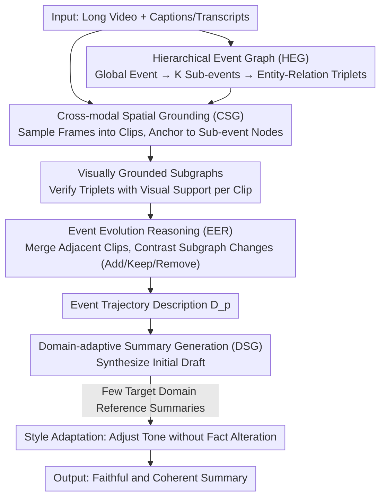

# Cut to the Chase: Training-free Multimodal Summarization via Chain-of-Events

**Conference**: CVPR 2026  
**arXiv**: [2603.06213](https://arxiv.org/abs/2603.06213)  
**Code**: [GitHub](https://github.com/youxiaoxing/CoE)  
**Area**: Interpretability  
**Keywords**: Multimodal Summarization, Training-free, Chain-of-Event Reasoning, Hierarchical Event Graph, Cross-domain Generalization

## TL;DR

This paper proposes CoE, a training-free multimodal summarization framework. By constructing a Hierarchical Event Graph (HEG) to guide chain-of-event reasoning, it surpasses SOTA video CoT baselines on 8 datasets, achieving an average improvement of +3.04 ROUGE, +9.51 CIDEr, and +1.88 BERTScore.

## Background & Motivation

**Background**: Multimodal Summarization (MMS) aims to generate concise text summaries from multi-source inputs such as video, text, and images. It is applied in scenarios like instructional videos, lectures, and news broadcasts. While multimodal large language models (MLLMs) have brought breakthroughs in video understanding, applying them directly to long video summarization still faces challenges.

**Limitations of Prior Work**: (1) Dependence on domain-specific supervision—existing MMS models (e.g., MLASK, MMSum) rely on large-scale paired data and domain-specific fine-tuning, resulting in poor cross-domain generalization (performance drops significantly when transferred from VIEWS to other datasets). (2) Implicit fusion and weak cross-modal alignment—fusion often occurs in implicit latent spaces, lacking explicit reasoning for vision-text correspondences, which leads to semantic drift. (3) Flattened temporal modeling—video CoT models treat videos as flat sequences of frames/clips, lacking explicit modeling of hierarchical events and causal transitions, making it difficult to capture global event evolution.

**Core Idea**: Replace implicit holistic fusion with explicit hierarchical event modeling to achieve interpretable, training-free, and cross-domain robust summarization.

## Method

### Overall Architecture

CoE addresses training-free multimodal summarization for long videos: it does not fine-tune any parameters and relies solely on VLM/LLM prompting to compress a long video into a faithful and coherent summary. The pipeline first understands the video content as a Hierarchical Event Graph (the "what" skeleton), then anchors video frames to this graph for visual alignment, infers "how events evolve" by comparing changes between adjacent segments, and finally describes this event trajectory as a summary, followed by domain-specific linguistic refinement. The four modules form a pipeline where the structured output of one step serves as the input for the next, ensuring the reasoning process is interpretable and traceable rather than a black-box fusion in latent space.

### Key Designs

**1. Hierarchical Event Graph (HEG): Constructing a Three-layer Skeleton to Replace Flat Frame Sequences**

A recurring issue in video CoT is treating videos as flat sequences of frames/clips, failing to capture global events and causal transitions. CoE instead lets the LLM extract a three-layer event graph from text (captions/transcripts) before looking at frames: the top layer is the Global Event layer, summarizing the main theme; the middle is the Sub-event layer, decomposing the theme into $K$ semantically coherent components; the bottom is the Entity-Relation layer, modeling key entities and their interactions (as triplets) within each sub-event. This graph serves as the semantic anchor for all subsequent reasoning, acting as an outline before referencing the visual content.

**2. Cross-modal Spatial Grounding (CSG): Anchoring Video Frames to the Event Graph for Visual Evidence**

Since HEG is derived from text, it lacks visual support. CSG aligns visual content with the graph: it samples video frames, groups them into short clips $\{C_j\}$, and uses HEG sub-event nodes as semantic anchors to align each clip to its most relevant sub-event. Post-alignment, it identifies entity-relation triplets within the clip that have visual support, constructing a visually grounded subgraph $\mathcal{G}_k^{(j)}$ for sub-event $k$ at clip $j$. This step ensures "textual claims" are "visually verified," establishing explicit vision-text correspondences to avoid semantic drift.

**3. Event Evolution Reasoning (EER): Inferring Narrative Flow via Subgraph Transitions**

With clip-level visual subgraphs, CoE merges adjacent clips belonging to the same sub-event with consistent subgraph content into longer segments. It then compares the differences between subgraphs of adjacent segments—identifying which entity relations are added, retained, or removed. These "add/keep/remove" changes signal event progression, which is used to derive an event trajectory description $\mathcal{D}_p$, stringing isolated clips into a causal and temporal narrative. This is the essence of "chain-of-events": summary coherence stems from explicit event tracking rather than hoping the model learns it from flat sequences.

**4. Domain-adaptive Summary Generation (DSG): Draft Synthesis and Lightweight Style Alignment**

The final step synthesizes the event trajectory into an initial summary $\hat{s}_{\text{init}}$. However, summary tone and rhetoric vary across domains (e.g., instructional vs. news). To address this, DSG performs lightweight style adaptation using a few target-domain reference summaries $\mathcal{Y}_{\text{ref}}$, adjusting the tone and structure without modifying factual content. This allows CoE to maintain cross-domain generalization while fitting target-domain linguistic habits, though it requires a few reference examples.

### A Complete Example

Take a news video as an example: HEG extracts the skeleton "Flood Report" with $K=3$ sub-events: "Flood Occurrence / Rescue Starts / Post-disaster Settlement," including triplets like <Rescue Team, Transfer, Residents>. CSG segments sampled frames and aligns them: early frames of flooded streets are anchored to "Flood Occurrence," middle frames of boats are anchored to "Rescue Starts," and triplets are visually verified. EER merges segments with consistent subgraphs and contrasts them: the transition from "Flood Occurrence" to "Rescue Starts" shows a new relation <Rescue Team, Transfer, Residents>, deriving the trajectory "Rescue teams intervened to transfer residents after the flood hit." DSG then synthesizes the draft and adapts the tone based on news-style references. Every sentence in the final summary can be traced back to specific evidence.

### Loss & Training

This is a training-free framework and does not require a loss function. The process is driven entirely by VLM/LLM prompting, where "reasoning" occurs through structured graph construction and comparison rather than gradient updates.

## Key Experimental Results

### Main Results: Average Performance Across 8 Datasets

| Method | ROUGE↑ | CIDEr↑ | BERTScore↑ |
| :--- | :--- | :--- | :--- |
| TCoT | baseline | baseline | baseline |
| CoF | +0.5 | +2.1 | +0.3 |
| ViTCoT | +1.2 | +4.5 | +0.9 |
| CoS | +1.8 | +5.2 | +1.1 |
| **CoE (Ours)** | **+3.04** | **+9.51** | **+1.88** |

### Ablation Study

| Module | Contribution to Gain |
| :--- | :--- |
| HEG Construction | Provides structured semantic skeleton |
| CSG Cross-modal Grounding | Fine-grained vision-text alignment |
| EER Event Evolution | Models temporal coherence |
| DSG Style Adaptation | Cross-domain linguistic style alignment |

### Key Findings

- CoE maintains stable performance across 8 domains in a zero-shot setting, while supervised methods degrade significantly.
- Each module contributes independently and complementarily.
- The framework is consistently effective across different MLLM backbones (e.g., GPT-4o, Gemini).
- Increasing parameter scale leads to steady performance improvements.

## Highlights & Insights

- The **training-free** design provides exceptional cross-domain generalization, addressing the long-standing dependency on supervision in MMS.
- The Hierarchical Event Graph mimics human cognition, progressing from global context to sub-events and then to entity relations.
- The Event Evolution Reasoning module explicitly models causal transitions, surpassing simple flattened temporal modeling.
- Lightweight style adaptation aligns with domain-specific linguistic habits using minimal references.

## Limitations & Future Work

- Performance depends on MLLM quality (e.g., GPT-4o), and inference costs are high.
- Video frame sampling strategies may miss critical content.
- Style adaptation requires a small number of target-domain reference summaries, meaning it is not strictly zero-resource.
- HEG construction quality is limited by the extraction capabilities of the LLM.

## Related Work & Insights

- Compared to video CoT methods like CoF and ViTCoT, CoE adopts a global event perspective rather than local frame-level reasoning.
- Compared to traditional MMS methods (MLASK, MMSum), CoE requires no training.
- The Hierarchical Event Graph concept can be extended to tasks like video understanding and long-document summarization.

## Rating
- Novelty: ⭐⭐⭐⭐
- Experimental Thoroughness: ⭐⭐⭐⭐⭐
- Writing Quality: ⭐⭐⭐⭐
- Value: ⭐⭐⭐⭐

<!-- RELATED:START -->

## Related Papers

- [\[ICLR 2026\] Emergence of Superposition: Unveiling the Training Dynamics of Chain of Continuous Thought](../../ICLR2026/interpretability/emergence_of_superposition_unveiling_the_training_dynamics_of_chain_of_continuou.md)
- [\[CVPR 2026\] Towards Faithful Multimodal Concept Bottleneck Models](towards_faithful_multimodal_concept_bottleneck_models.md)
- [\[CVPR 2026\] From Weights to Concepts: Data-Free Interpretability of CLIP via Singular Vector Decomposition](from_weights_to_concepts_data-free_interpretability_of_clip_via_singular_vector_.md)
- [\[NeurIPS 2025\] Curvature Tuning: Provable Training-free Model Steering From a Single Parameter](../../NeurIPS2025/interpretability/curvature_tuning_provable_training-free_model_steering_from_a_single_parameter.md)
- [\[CVPR 2026\] HUMORCHAIN: Theory-Guided Multi-Stage Reasoning for Interpretable Multimodal Humor Generation](humorchain_theory-guided_multi-stage_reasoning_for_interpretable_multimodal_humo.md)

<!-- RELATED:END -->
