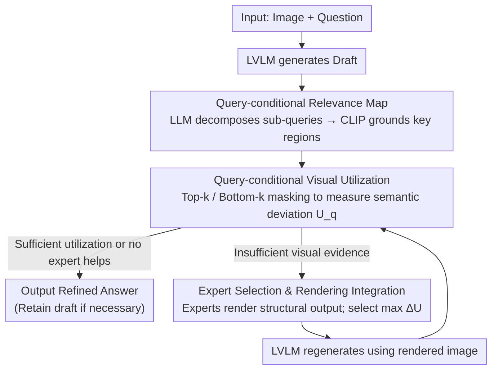

# Draft and Refine with Visual Experts

**Conference**: CVPR 2026  
**arXiv**: [2511.11005](https://arxiv.org/abs/2511.11005)  
**Code**: [GitHub](https://github.com/SungheonJeong/DnR)  
**Area**: Interpretability  
**Keywords**: Visual Utilization Quantification, Agent Framework, Hallucination Mitigation, Visual Expert Collaboration, Training-free

## TL;DR

Proposes DnR (Draft and Refine), an agent framework based on a query-conditional Visual Utilization metric. This framework quantifies an LVLM's actual reliance on visual evidence and iteratively improves visual grounding to reduce hallucinations through rendering feedback from external visual experts (detection/segmentation/OCR, etc.).

## Background & Motivation

**Hallucination Issues in LVLMs**: Current Large Vision-Language Models rely excessively on linguistic priors rather than visual evidence, leading to ungrounded hallucinatory responses.

**Lack of Quantification for Visual Utilization**: Existing methods fail to measure the extent to which an LVLM actually relies on visual input during the reasoning process.

**Limitations of tool-calling**: Existing agent systems decide to call experts via language-driven Chain-of-Thought (CoT) or textual confidence, which inherits the biases of the language model itself.

**High Cost of Learning-based Coordination**: Jointly optimizing multiple experts requires expensive and inflexible joint training.

**Non-equivalence of Visual Information**: Different questions require focus on different image regions; globally enhancing visual reliance may introduce unnecessary noise.

**Core Problem**: Can a VLM autonomously decide when and which visual expert to call based on its own perceptual needs rather than linguistic biases?

## Method

### Overall Architecture

DnR aims to solve a specific dilemma: LVLM responses often "sound correct but ignore the image"—the model guesses based on language priors, and it is difficult to determine if visual evidence was used or to force the model to re-examine the image. DnR decomposes this into a "Draft then Refine" closed loop. The model first generates a draft response; the system then measures how much this answer depends on key image regions rather than asking "are you sure" (which would only retrieve language-model confidence). If visual utilization is insufficient, an external visual expert (detection, segmentation, OCR, etc.) renders clues back onto the image. The LVLM then regenerates the answer based on the refined image until visual utilization is sufficiently increased. The entire pipeline is training-free and experts are plug-and-play.

### Key Designs

**1. Query-conditional Relevance Map: Identifying "Where to Look"**

Not all pixels are relevant to a given query. Globally enhancing visual reliance might amplify noise. DnR first utilizes an LLM to decompose question $q$ into visually localizable sub-queries $Q=\{q_1,\dots,q_m\}$ (e.g., "Where is the red car?", "What is written on the plate?"). A CLIP-based localization model then computes spatial relevance for each sub-query, averaged into a query-conditional relevance map $r(x|q)=\frac{1}{m}\sum_{q_i\in Q} R(x|q_i)$. This map identifies which regions serve as evidence, centering all subsequent perturbations and measurements on problem-relevant areas.

**2. Query-conditional Visual Utilization: Quantifying Vision-Reliance**

Identifying relevance is insufficient; one must quantify if the LVLM's draft actually utilized these regions. DnR employs controlled perturbations: it performs Gumbel-k sampling based on the relevance distribution to generate two masks—Top-k (masking high-relevance regions) and Bottom-k (masking low-relevance regions). A semantic encoder $g(\cdot)$ compares the "pre-occlusion" and "post-occlusion" predictions to calculate semantic deviation $d_\tau$. Utilization is defined as the weighted expectation of deviations under both mask types:

$$U_q(x) = \alpha \cdot \mathbb{E}_{\tau \in \mathcal{M}_q^{\text{top}}}[d_\tau] + (1-\alpha) \cdot \mathbb{E}_{\tau \in \mathcal{M}_q^{\text{bottom}}}[d_\tau]$$

The intuition is straightforward: if the model uses visual evidence, masking key regions (Top-k) should cause significant semantic change (high $d_\tau$), while masking irrelevant regions (Bottom-k) should have minimal impact (low $d_\tau$). The weight $\alpha$ is adaptively determined by the entropy and contrast of the relevance map. This scalar $U_q(x)$ serves as the unified metric for deciding whether to refine, derived entirely from the model's perceptual behavior.

**3. Expert Selection and Rendering Integration: Visual Cues over Prompting**

If utilization is low, DnR avoids modifying prompts or feeding structured text (which forces information back into the linguistic channel). Instead, it allows candidate experts to render their structured outputs directly onto the original image—highlighting detection boxes, graying out areas outside segmentation masks, or overlaying OCR text. The system re-queries the LVLM with this modified image. The expert that maximizes the utilization gain is selected:

$$j^* = \arg\max_j \left(U_q^{(j)} - U_q^{\text{base}}\right)_+$$

An expert is only adopted if the gain is positive. If no expert improves utilization, the system skips refinement to avoid introducing artifacts. To manage the linear cost of evaluating many experts, a lightweight selector $S_\theta$ can be trained to predict the optimal expert. This mechanism allows new experts to be integrated without modifying the LVLM architecture or requiring joint training.

### Loss & Training

The main framework is entirely training-free. The only optional component is a lightweight selector $S_\theta$, trained via cross-entropy to predict the optimal expert: $\mathcal{L} = -\mathbb{E}[\log S_\theta(j^*|s)]$, where $j^*$ is the ground-truth optimal expert obtained via exhaustive search and $s$ is the current state.

## Key Experimental Results

### Main Results: Draft vs DnR using IDEFICS on multiple benchmarks

| Benchmark | Draft | DnR | Gain |
|-----------|-------|-----|------|
| VQAv2 | 37.8 | 47.85 | +10.05 |
| GQA | 24.1 | 25.5 | +1.4 |
| VCR | 15.58 | 21.11 | +5.53 |
| VSR | 52.76 | 54.27 | +1.51 |
| MME | 1392 | 1432 | +40 |

### Ablation Study

| Analysis Dimension | Finding |
|---------|------|
| Revision Rate | Significant variation across tasks (VQAv2: 29.8%, GQA: 1.5%) |
| Correction/Degradation | VQAv2: 46.2% Correction vs 14.3% Degradation |
| Pearson/Spearman Correlation | GQA 0.449/0.364, VCR 0.38/0.421 |

### Key Findings

- There is a significant positive correlation between visual utilization and task accuracy.
- Revision rates are highest for tasks requiring fine-grained visual understanding.
- The effectiveness of rendering strategies (graying/blurring/highlighting) varies by expert and task.
- The framework integrates new experts without any retraining.

## Highlights & Insights

- **Quantifiable Visual Utilization Metric**: For the first time, a metric is proposed to provide a measurable evaluation standard for an LVLM's visual grounding.
- **Clever Rendering Mechanism**: Transforms structured expert outputs into visual cues that the LVLM can process directly, requiring no architectural changes.
- **Utilization-Driven Selection**: More reliable than language-driven CoT because it is based on the actual perceptual behavior of the model.
- **High Modularity**: The framework is highly modular, allowing for plug-and-play integration of new experts.

## Limitations & Future Work

- Rendering strategies and parameters require tuning for specific datasets and models.
- The inference overhead of multiple masks and re-queries is significant.
- Exhaustive expert evaluation scales linearly with the number of experts (mitigated by the lightweight selector).
- The visual utilization metric heavily depends on the quality of the relevance maps.

## Related Work & Insights

- Compared to procedural reasoning agents like VisProg, DnR does not require code execution.
- Compared to hallucination mitigation methods (e.g., VCD, OPERA), DnR approaches the problem from the perspective of "visual utilization," making it more principled.
- The rendering integration approach could inspire tool-calling paradigms in other domains.

## Rating
- Novelty: ⭐⭐⭐⭐⭐
- Experimental Thoroughness: ⭐⭐⭐⭐
- Writing Quality: ⭐⭐⭐⭐
- Value: ⭐⭐⭐⭐

<!-- RELATED:START -->

## Related Papers

- [\[CVPR 2026\] ERMoE: Eigen-Reparameterized Mixture-of-Experts for Stable Routing and Interpretable Specialization](ermoe_eigen-reparameterized_mixture-of-experts_for_stable_routing.md)
- [\[AAAI 2026\] DR.Experts: Differential Refinement of Distortion-Aware Experts for Blind Image Quality Assessment](../../AAAI2026/interpretability/drexperts_differential_refinement_of_distortion-aware_experts_for_blind_image_qu.md)
- [\[CVPR 2026\] Pixel2Phys: Distilling Governing Laws from Visual Dynamics](pixel2phys_distilling_governing_laws_from_visual_dynamics.md)
- [\[CVPR 2026\] Language Models Can Explain Visual Features via Steering](language_models_can_explain_visual_features_via_steering.md)
- [\[CVPR 2026\] Learning complete and explainable visual representations from itemized text supervision](learning_complete_and_explainable_visual_representations_from_itemized_text_supe.md)

<!-- RELATED:END -->
