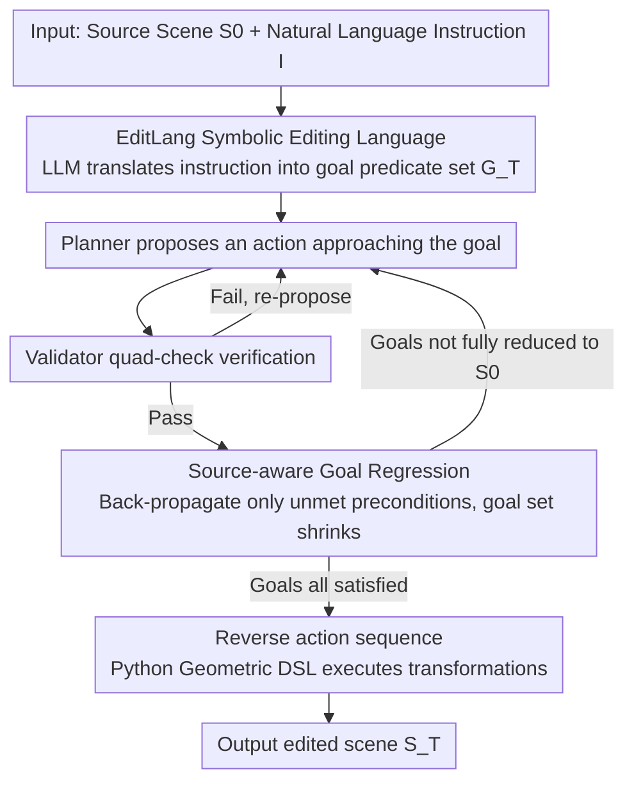

# Edit-As-Act: Goal-Regressive Planning for Open-Vocabulary 3D Indoor Scene Editing

**Conference**: CVPR 2026  
**arXiv**: [2603.17583](https://arxiv.org/abs/2603.17583)  
**Code**: [GitHub](https://seongraenoh.github.io/edit-as-act/)  
**Area**: Interpretability  
**Keywords**: 3D scene editing, goal regression, PDDL, LLM planning, symbolic reasoning

## TL;DR
This work redefines open-vocabulary 3D indoor scene editing as a goal-regressive planning problem. It introduces the PDDL-style symbolic language EditLang and an LLM-driven Planner-Validator loop to derive minimal editing sequences from target states. The method achieves the best balance across instruction faithfulness (69.1%), semantic consistency (86.6%), and physical plausibility (91.7%) across 63 editing tasks.

## Background & Motivation

**Background**: Existing 3D indoor scene editing methods primarily fall into three categories: data-driven layout generation (e.g., DiffuScene/EditRoom using diffusion models), constraint optimization (e.g., Holodeck/AnyHome converting language into spatial constraints), and image editing + 3D lifting (e.g., ArtiScene editing in 2D followed by 3D reconstruction).

**Limitations of Prior Work**: Each of the three types only satisfies a subset of the three critical requirements: instruction faithfulness, semantic consistency (not moving what should not be moved), and physical plausibility (no collisions/suspension). Layout generation methods tend to change scenes globally; constraint optimization can lead to shifts in non-target objects due to large-scale re-optimization; image editing lacks 3D reasoning and produces structural artifacts.

**Key Challenge**: Current methods treat editing as a generative task (a single forward pass to output the entire scene), making it extremely difficult to ensure "only modifying what needs to be changed while preserving the rest."

**Goal**: To simultaneously achieve instruction faithfulness, semantic consistency, and physical plausibility in 3D scene editing.

**Key Insight**: Inspired by embodied agents and classical AI planning, this work treats editing as a goal-satisfaction problem: "user instructions define a desired world state, and editing should be the minimal action sequence that makes that state true." Deriving actions backward from the goal to the current scene naturally ensures minimized editing.

**Core Idea**: Transform scene editing from a "generation problem" into a "planning problem," using STRIPS-style goal regression to ensure minimal editing, verifiability, and physical consistency.

## Method

### Overall Architecture
The core problem addressed is modifying only necessary parts of a scene while maintaining physical plausibility. Edit-As-Act does not treat editing as "generating a whole new scene" but as a sequence of actions derived backward from the desired state. Given a source scene $S_0$ and a natural language instruction $I$, the system first uses an LLM to translate the instruction into a set of EditLang symbolic goal predicates $G_T$ ("what the user wants the world to look like"). It then enters a Planner-Validator loop: the Planner proposes an action to approach the current goal, and the Validator checks it against four criteria. Once approved, the goal set is shrunken towards the source scene via source-aware regression. The process stops when all goals are reduced to those already satisfied in $S_0$. The reversed action sequence is then executed using a Python geometric DSL to obtain $S_T$. In this pipeline, the LLM only serves as a "proposer," while acceptance is determined by formal rules.

### Key Designs

**1. EditLang Symbolic Language: Mapping Free-text Editing to Verifiable Symbolic Space**

Forward generation methods struggle to ensure "only moving what is necessary" because they operate directly on pixels or layouts without a checkable intermediate representation. EditLang adopts PDDL concepts to build a domain for scene editing: predicates characterize geometric, topological, and physical relationships, such as `supported(x,y)`, `contact(x,y)`, `collision(x,y)`, `stable(x)`, and `facing(x,y)`. Each action is defined as a triple $\langle \text{pre}(a), \text{add}(a), \text{del}(a) \rangle$, where preconditions, added facts, and deleted facts are explicitly stated. States transition via $s' = (s \setminus \text{del}(a)) \cup \text{add}(a)$. Actions cover geometric rearrangement, object addition (Add), and appearance modification (Stylize).

Unlike traditional PDDL with fixed symbols, EditLang dynamically binds predicates to specific objects in the scene during parsing, allowing it to handle open-vocabulary instructions without pre-defined entity tables. Once editing is expressed as symbolic actions, it becomes inherently verifiable, interpretable, and composable.

**2. Source-aware Goal Regression: Minimizing Editing Cost**

Classic STRIPS regression expands all preconditions backward from the goal, even if those conditions are already satisfied in the current scene. This causes the planner to "reconstruct" parts that were already correct, which is a primary source of over-editing. This work modifies the regression formula to a source-aware version:

$$G_{t-1} = (G_t \setminus \text{add}(a_t)) \cup (\text{pre}(a_t) \setminus S_0)$$

The key is the term $\text{pre}(a_t) \setminus S_0$. Only preconditions not already satisfied in the source scene $S_0$ are passed back to the previous layer of the goal set for further planning. Satisfied conditions are skipped, preventing unnecessary actions. This mechanism ensures that the goal set shrinks with each step and the action sequence remains minimal.

**3. Planner-Validator Dual Modules: LLM Proposal with Formal Rule Backing**

LLM-proposed actions may be incorrect or revoke already achieved goals. Thus, the Validator performs a four-fold check on every proposal: Goal-orientedness requires $\text{add}(a_t)$ to satisfy at least one goal in $G_t$; Monotonicity requires $\text{del}(a_t) \cap G^{\text{sat}}_{\leq t} = \emptyset$, preventing the deletion of previously satisfied goals; Context Consistency ensures editing aligns with room-specific constraints; and Formal Validity ensures actions follow the EditLang schema. The Validator also maintains domain invariants (no collisions, single support surface, etc.).

This division of labor—LLM proposals + formal verification—filters out erroneous actions and provides termination guarantees: monotonicity implies that satisfied goals only increase, and given a finite state space, the planning loop must converge.

## Key Experimental Results

### Main Results

**Averages across 9 scene categories in E2A-Bench**

| Method | Instruction Faithfulness (IF)↑ | Semantic Consistency (SC)↑ | Physical Plausibility (PP)↑ |
|:---|:---:|:---:|:---:|
| LayoutGPT-E | 42.3 | 48.8 | 78.6 |
| AnyHome | 57.6 | 60.5 | 84.5 |
| ArtiScene-E | 48.3 | 51.2 | 90.3 |
| **Ours (Edit-As-Act)** | **69.1** | **86.6** | **91.7** |

### Ablation Study

| Room Category | IF | SC | PP | Note |
|:---|:---:|:---:|:---:|:---|
| Dining Room | 89.7 | 95.3 | 92.7 | Best performance, high structural constraints |
| Kitchen | 55.0 | 92.3 | 93.7 | Lower IF but very high SC/PP |
| Bedroom | 45.7 | 73.1 | 91.9 | High layout flexibility leads to lower IF |
| Computer Room | 73.6 | 88.0 | 94.1 | Clear object relationships |

### Key Findings
- Edit-As-Act is the only method performing best across all three metrics (IF, SC, and PP).
- Semantic consistency (86.6%) significantly outperforms the second-best, AnyHome (60.5%), proving the effectiveness of the minimal editing strategy.
- Performance is highest in structured scenes (Dining Room, Computer Room). In flexible scenes (Bedroom), the IF is lower, suggesting symbolic planning is more advantageous when constraints are well-defined.
- Physical plausibility (91.7%) is slightly better than ArtiScene-E (90.3%) because editing actions explicitly check for collisions and support.

## Highlights & Insights
- **Paradigm Shift**: Shifting 3D editing from a "generation problem" to a "planning problem" is a fundamental perspective change. With a structured action space and goal regression, minimality, verifiability, and composability are naturally achieved.
- **LLM as Planner, not Generator**: Instead of letting the LLM directly output the results, it proposes actions in a symbolic space subject to a formal Validator. This "LLM-proposer + Formal-validator" architecture is highly extensible.
- **Source-aware Regression**: A small but crucial improvement over classic STRIPS that automatically filters satisfied conditions, avoiding redundant reasoning and editing.

## Limitations & Future Work
- Dependency on LLM reasoning capabilities; complex multi-step tasks might still lead to planning errors.
- The E2A-Bench consists of only 63 tasks, and evaluation relies heavily on LVLM scoring.
- The predicate set in EditLang, while covering major relationships, has limited expressiveness for fine-grained spatial relationships (e.g., "50cm from the wall").
- Lack of support for continuous optimization (e.g., vague instructions like "make the room look more spacious").

## Related Work & Insights
- **vs LayoutGPT**: LayoutGPT uses LLM forward generation for layouts but lacks a verification mechanism; its IF (42.3) is significantly lower than ours (69.1).
- **vs AnyHome**: Constraint optimization methods perform well in physical plausibility (84.5) but suffer in semantic consistency (60.5) because re-optimization often moves non-target objects.
- **vs ArtiScene**: Image editing followed by 3D lifting is decent in PP (90.3) but weak in IF (48.3) and SC (51.2), as 2D operations cannot guarantee 3D consistency.

## Rating
- Novelty: ⭐⭐⭐⭐⭐ Introducing classic AI planning (STRIPS/PDDL) into 3D scene editing is a highly creative paradigm shift.
- Experimental Thoroughness: ⭐⭐⭐ The benchmark size is small (63 tasks), and evaluation depends on LVLMs.
- Writing Quality: ⭐⭐⭐⭐⭐ The progression from motivation to formal definitions and method design is exceptionally clear.
- Value: ⭐⭐⭐⭐ The combination of LLMs and symbolic planning offers significant insights for embodied AI.

<!-- RELATED:START -->

## Related Papers

- [\[ICLR 2026\] Latent Planning Emerges with Scale](../../ICLR2026/interpretability/latent_planning_emerges_with_scale.md)
- [\[ICML 2026\] A Behavioural and Representational Evaluation of Goal-Directedness in Language Model Agents](../../ICML2026/interpretability/a_behavioural_and_representational_evaluation_of_goal-directedness_in_language_m.md)
- [\[ICLR 2026\] PoSh: Using Scene Graphs to Guide LLMs-as-a-Judge for Detailed Image Descriptions](../../ICLR2026/interpretability/posh_using_scene_graphs_to_guide_llms-as-a-judge_for_detailed_image_descriptions.md)
- [\[ICLR 2026\] Interpretable 3D Neural Object Volumes for Robust Conceptual Reasoning](../../ICLR2026/interpretability/interpretable_3d_neural_object_volumes_for_robust_conceptual_reasoning.md)
- [\[NeurIPS 2025\] Evaluating LLMs in Open-Source Games](../../NeurIPS2025/interpretability/evaluating_llms_in_open-source_games.md)

<!-- RELATED:END -->
