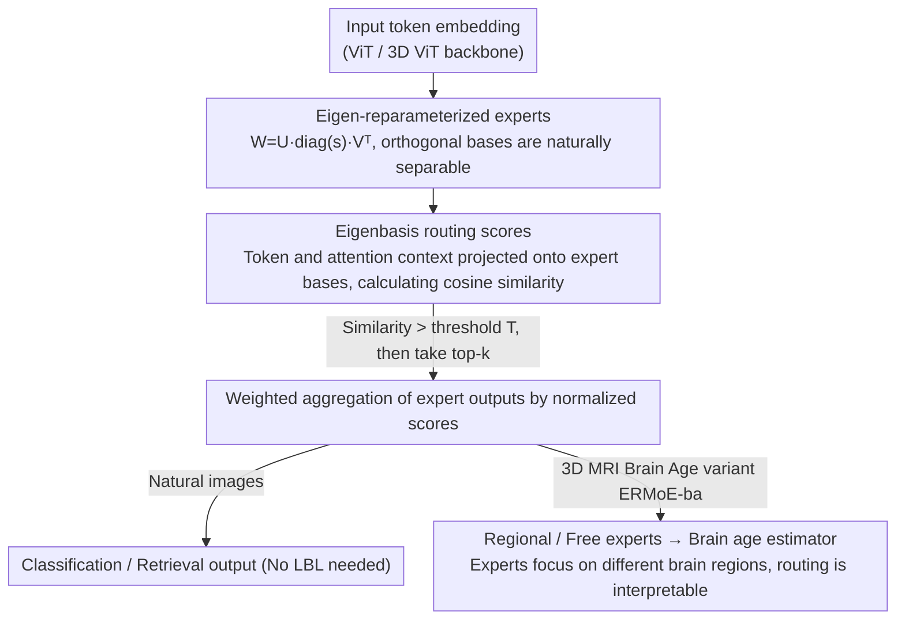

# ERMoE: Eigen-Reparameterized Mixture-of-Experts for Stable Routing and Interpretable Specialization

**Conference**: CVPR 2026  
**arXiv**: [2511.10971](https://arxiv.org/abs/2511.10971)  
**Code**: None  
**Area**: Interpretability  
**Keywords**: Mixture-of-Experts, Eigen-reparameterization, Routing Stability, Expert Specialization, Vision Transformer

## TL;DR
ERMoE proposes reparameterizing MoE expert weights within an orthogonal eigenbasis and substituting traditional routing logits with eigenbasis alignment scores (cosine similarity), enabling stable routing and interpretable expert specialization without the need for auxiliary load balancing losses.

## Background & Motivation
1. **Background**: MoE architectures expand model capacity via sparse activation. However, the misalignment between routing logits and expert structures leads to routing instability and underutilization, while load imbalance creates computational bottlenecks.
2. **Limitations of Prior Work**: Although auxiliary Load Balancing Loss (LBL) reduces imbalance, it introduces interfering gradients that weaken expert specialization and downstream accuracy. The root cause is the decoupling of the representation spaces between the router and the experts.
3. **Key Challenge**: The router must accurately assign tokens to the most suitable experts, yet traditional learnable routing logits operate in a free parameter space with no intrinsic link to the experts' actual representation capabilities.
4. **Goal**: To design a routing mechanism where assignment decisions directly reflect the intrinsic representation subspace of each expert, fundamentally resolving the routing-expert misalignment.
5. **Key Insight**: Weight reparameterization via SVD-style eigenvalue decomposition allows routing to be based on feature-basis alignment rather than learned logits.
6. **Core Idea**: Each expert's weight is decomposed into orthogonal eigenbases $\mathbf{W}^{(e)} = \mathbf{U}^{(e)} \text{diag}(s^{(e)}) \mathbf{V}^{(e)\top}$, where routing scores are defined as the cosine similarity between token features and expert bases.

## Method

### Overall Architecture
ERMoE addresses the issue in traditional MoEs where "the router and experts speak different languages." Routing logits are learned in a free parameter space independent of what experts actually represent, resulting in unstable assignments and uneven utilization that typically require forced correction via auxiliary LBL. ERMoE reformulates expert weights into orthogonal eigenbases and derives routing scores directly from the alignment between tokens and these bases. The pipeline is as follows: a ViT backbone extracts token embeddings; upon entering an ERMoE block, the router projects the token features and their attention-weighted context into each expert's eigenbasis to calculate cosine similarities as scores. Experts with scores exceeding a threshold $T$ are considered, and the top-k are selected for weighted output aggregation. This process eliminates the need for any load balancing loss.

### Key Designs

**1. Eigen-reparameterized Experts: Making Expert Directions Naturally Separable**

In traditional MoEs, experts learn weights in a free parameter space, often leading to highly overlapping subspaces, redundant representations, or representation collapse. ERMoE applies an SVD-like decomposition $\mathbf{W}^{(e)} = \mathbf{U}^{(e)} \,\text{diag}(s^{(e)})\, \mathbf{V}^{(e)\top}$ to each expert's weight, where $\mathbf{U}^{(e)}, \mathbf{V}^{(e)}$ are orthogonal matrices and $s^{(e)}$ represents learnable scaling factors. Orthogonal constraints mathematically ensure that subspaces spanned by different experts are separated. This forces experts to occupy distinct representation directions, reducing feature redundancy and providing clean, comparable bases for alignment-based routing.

**2. Eigenbasis Routing Scores: Rebinding Routing to Expert Representation Space**

With experts possessing orthogonal bases, routing no longer relies on arbitrary logits. For a given expert, ERMoE projects the input token and its attention-weighted context into that expert's eigenbasis. The routing score is the cosine similarity between these two projections; a high score indicates the token aligns with the expert's representation subspace. Only experts with similarity exceeding a confidence threshold $T$ qualify for selection, followed by a weighted aggregation of the top-k. Since scores directly measure "feature-basis alignment," assignment decisions naturally reflect actual representation capability, removing the need for LBL and avoiding its interfering gradients. Experiments show this alignment-based routing naturally produces a flatter load distribution, making load balance a byproduct of alignment rather than an explicit constraint.

**3. ERMoE-ba Brain Age Prediction Variant: Transferring Routing to 3D Medical Imaging with Interpretability**

To demonstrate versatility, the authors extend the 2D ViT to a 3D ViT for processing T1 MRI volumes. Routing occurs between "regional experts" and "free experts," with weighted outputs fed to a brain age estimator. A key benefit is that because expert directions are separable, different experts spontaneously focus on different brain regions. Consequently, routing patterns can be interpreted as anatomically meaningful specializations. Interpretability is not an additional module but an emergent property of the orthogonal bases.

### Loss & Training
The model uses only standard classification or regression losses without any auxiliary load balancing loss. Orthogonal constraints are maintained during training via Cayley parameterization or Gram-Schmidt orthogonalization to ensure $\mathbf{U}^{(e)}$ and $\mathbf{V}^{(e)}$ remain strictly orthogonal.

## Key Experimental Results

### Main Results

| Dataset | Metric | ERMoE | V-MoE | Soft MoE | Gain |
|--------|------|-------|-------|---------|------|
| ImageNet | Top-1 Acc | SOTA | Runner-up | - | Clear Edge |
| COCO (Retrieval) | R@1 | SOTA | - | Runner-up | Improvement |
| Flickr30K (Retrieval) | R@1 | SOTA | - | - | Improvement |
| Brain Age Prediction | MAE | Lower >7% | - | - | Significant |

### Ablation Study

| Configuration | Key Metric | Description |
|------|---------|------|
| Full ERMoE | Optimal | Orthogonal bases + Eigenbasis routing |
| Standard Routing Logits | Decrease | Lack of content alignment |
| With LBL | Decrease | LBL introduces interfering gradients |
| Non-orthogonal Experts | Decrease | Increased expert overlap |

### Key Findings
- ERMoE achieves a flatter expert load distribution without LBL, suggesting alignment-based routing naturally facilitates load balancing.
- The brain age variant reveals anatomically interpretable expert specialization, with different experts focusing on specific brain regions.
- The Gini coefficient is significantly reduced from DINO's 0.97, confirming the mitigation of routing imbalance.

## Highlights & Insights
- **Fundamental Solution to Misalignment**: Instead of patching symptoms (adding LBL), the problem is eliminated at the representation level.
- **Interpretability as a Side Benefit**: Orthogonal bases make expert directions separable, leading to naturally interpretable specialization patterns.
- The methodology is potentially transferable to MoE models in the NLP domain.

## Limitations & Future Work
- Orthogonal constraints introduce some training computational overhead.
- Validation is currently limited to ViT; large-scale language MoE models have not been tested.
- The setting of threshold $T$ affects performance and requires hyperparameter tuning.

## Related Work & Insights
- **vs V-MoE**: V-MoE first introduced sparse experts to ViT but still uses standard routing logits. ERMoE replaces these with more stable eigenbasis scores.
- **vs Soft MoE**: Soft MoE uses soft assignments instead of hard top-k, but scoring remains in an auxiliary space. ERMoE binds scoring to the experts' internal representations.

## Rating
- Novelty: ⭐⭐⭐⭐⭐ Eigen-reparameterization + alignment-based routing is a fundamental innovation.
- Experimental Thoroughness: ⭐⭐⭐⭐ Multi-task validation and brain age applications demonstrate interpretability.
- Writing Quality: ⭐⭐⭐⭐ Deep problem analysis and clear mathematical formulation.
- Value: ⭐⭐⭐⭐⭐ Provides a new paradigm for MoE routing.

<!-- RELATED:START -->

## Related Papers

- [\[ICML 2026\] The Expert Strikes Back: Interpreting Mixture-of-Experts Language Models at Expert Level](../../ICML2026/interpretability/the_expert_strikes_back_interpreting_mixture-of-experts_language_models_at_exper.md)
- [\[CVPR 2026\] Draft and Refine with Visual Experts](draft_and_refine_with_visual_experts.md)
- [\[AAAI 2026\] DR.Experts: Differential Refinement of Distortion-Aware Experts for Blind Image Quality Assessment](../../AAAI2026/interpretability/drexperts_differential_refinement_of_distortion-aware_experts_for_blind_image_qu.md)
- [\[ACL 2025\] IRT-Router: Effective and Interpretable Multi-LLM Routing via Item Response Theory](../../ACL2025/interpretability/irt_router_multi_llm.md)
- [\[CVPR 2026\] Hierarchical Concept Embedding & Pursuit for Interpretable Image Classification](hierarchical_concept_embedding_pursuit_for_interpretable_image_classification.md)

<!-- RELATED:END -->
