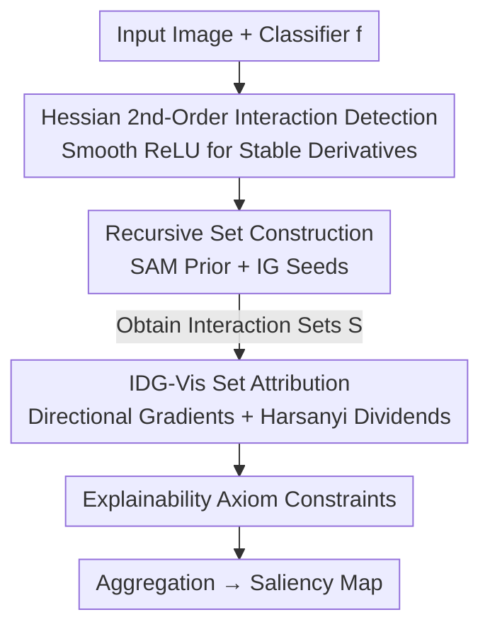

# H-Sets: Hessian-Guided Discovery of Set-Level Feature Interactions in Image Classifiers

**Conference**: CVPR 2026  
**arXiv**: [2604.22045](https://arxiv.org/abs/2604.22045)  
**Code**: https://github.com/ayushimehrotra/H-Sets (Available)  
**Area**: Explainability / Feature Attribution / Segmentation Prior  
**Keywords**: Feature Interactions, Hessian, Saliency Map, Harsanyi Dividends, SAM

## TL;DR
H-Sets utilizes the input Hessian to detect second-order (non-additive) interactions between pixels, recursively merging them into semantically coherent feature sets. It then scores each set using IDG-Vis (Integrated Directional Gradients + Harsanyi Dividends) at the set level, ultimately producing saliency maps that are sparser and more faithful than existing methods.

## Background & Motivation
**Background**: Feature attribution is a primary tool for explaining deep network predictions, assigning importance scores to each input feature (pixel), such as Integrated Gradients (IG) and various gradient/perturbation-based methods.

**Limitations of Prior Work**: Most attribution methods only consider the **marginal effect**—how much a single feature contributes in isolation—while ignoring **feature interactions**: the non-additive influence of a group of features acting together that cannot be explained by the sum of individual effects. In image classification, object semantics arise precisely from inter-pixel dependencies (a bird's "beak+eye+crest" jointly determine the class); looking at single pixels in isolation fails to provide a clear explanation.

**Key Challenge**: Existing interaction-based methods have critical weaknesses. Game-theoretic methods (Faith-Shap, Shapley-Taylor) require enumerating subsets, which leads to exponential explosion at image scales. Integrated Hessians detect and attribute pairwise interactions along a path but are extremely expensive. Archipelago can only find "islands" at a **coarse granularity** like superpixels/segments, losing pixel-level dependencies. MoXI reduces complexity to quadratic using patch insertion/deletion, but the patch granularity loses pixel details. In short: **they are either too coarse, too expensive, or violate explainability axioms**.

**Goal**: To discover high-order ($>2$ features) interaction sets at pixel resolution and assign scalar importance to these sets that satisfy a comprehensive set of explainability axioms.

**Key Insight**: Decouple "detection" and "attribution," using the most suitable tool for each. The Hessian's second-order derivatives naturally characterize local curvature and are best at **capturing the existence of interactions**, but they underestimate interaction strength in gradient saturation regions, making them unsuitable for scoring. Integrated directional gradients along a path are better for **stable value assignment**. Thus, the Hessian is used only for "detection," while directional gradients handle "attribution."

**Core Idea**: Use the Hessian to find pairwise interactions and recursively grow them into high-order sets (using SAM segmentation as a spatial prior to ensure coherence). Then use IDG-Vis to treat each set as a coalition in a cooperative game and calculate its "pure interaction contribution" via Harsanyi dividends.

## Method

### Overall Architecture
H-Sets takes an image $\mathbf{x}\in\mathbb{R}^d$ and a classifier $f$, outputting a saliency map. It consists of two main stages: **Stage 1 (Interaction Detection)** uses the Hessian to find strong pairwise interactions and recursively expands them into several semantically coherent interaction sets $\mathcal{S}$ (default $|\mathcal{S}|=5$) using SAM masks as a spatial prior. **Stage 2 (Interaction Attribution)** uses IDG-Vis to calculate a scalar importance score for each set $\mathcal{I}\in\mathcal{S}$, then aggregates all set scores into a single saliency map. The entire pipeline is constrained by a set of game-theoretic and attribution axioms to ensure predictable output behavior.

### Key Designs

**1. Hessian for Second-Order Interaction Detection: Using Curvature Instead of Mask Search**

The limitation is that pure first-order gradients cannot see joint effects between features—two pixels might both be "unimportant" individually, but jointly perturbing them significantly changes the output. H-Sets defines pairwise interactions via Hessian elements $\mathbf{H}_{f_c}=\frac{\partial^2 f_c(\mathbf{x})}{\partial x_i \partial x_j} > \mu$; if the mixed second-order partial derivative of two pixels exceeds threshold $\mu$, they interact. Each element of $\mathbf{H}_{f_c}$ measures how "jointly perturbing $x_i,x_j$ affects the output," which naturally characterizes local curvature and is more faithful to highly non-linear networks than first-order derivatives. Unlike Archipelago, which relies on mask search, this is **curvature-driven** and does not require repeated trials in mask space.

However, the Hessian has two engineering hurdles. First, ReLU is not second-order differentiable. While Integrated Hessians use SoftPlus as a substitute, the authors found SoftPlus introduces noisy interactions, so they use a smooth approximation $h(z)$ (Eq. 1) proposed by Zhang et al., which preserves ReLU behavior while providing stable Hessians. Second, gradient saturation regions (where the model becomes locally flat) cause high-order derivatives to vanish, underestimating interaction strength—which is why the authors **only use the Hessian for detection, not for scoring**.

**2. Recursive Set Construction: Growing Pairwise Interactions into High-Order, Semantically Coherent Sets**

Pairwise interactions are insufficient; the authors seek high-order sets where $|\mathcal{I}|>2$, based on the principle that "if a high-order interaction exists, all its subsets are also interactions." The procedure: first use IG to select the highest attribution pixel within each SAM mask as a **seed** $x_i$ (ensuring it is important to the prediction and located in an interpretable region). Then calculate $\mathbf{H}_{f_c}[i,j]$ for all $x_j$, forming a candidate set $X$ of pixels exceeding $\mu$, and iteratively merge them into $\mathcal{I}$ in order of interaction strength until $|\mathcal{I}|=\nu$ or no more terms can be added. If the set is not full, the strongest interacting pixel in $X$ is used as a new seed to continue expansion. Two hyperparameters $\mu$ (interaction threshold to remove weak connections) and $\nu$ (maximum features per set, drawing from the "explanation order" in Shapley-Taylor) control the scale and relevance of the sets.

Crucially, **SAM is merely a replaceable spatial prior**: it does not affect gradients or attribution values; it only ensures merging occurs preferentially within the same segment for spatial coherence. The authors prove this in the ablation study by replacing SAM with QuickShift or even no segmentation. Repeating this for each SAM mask yields $|\mathcal{S}|=5$ interaction sets.

**3. IDG-Vis Set Attribution: Treating Interaction Sets as Cooperative Game Coalitions**

Once sets are identified, they must be scored. The challenge is "how to measure only the joint contribution from the interaction, excluding individual marginal effects." The authors model this as a positive transferable utility (TU) game $(N,v)$, where the $N$ players are input pixels and the characteristic function $v$ assigns a value to any coalition. Since $v$ cannot distinguish between individual and interactive contributions, the **Harsanyi dividend** is introduced: $d(v,T)=\sum_{S\subseteq T}(-1)^{|T|-|S|}v(S)$ (Eq. 2), which extracts the "unique joint contribution" of coalition $T$.

The function $v$ is instantiated using IDG-Vis—a set-level extension of IDG from text to images. For set $\mathcal{I}$, a direction vector $\mathbf{a}$ is constructed (elements $a_i=x_i-x_i'$ inside the set, 0 outside, normalized to $\hat{\mathbf{a}}$). The directional gradient is taken as the absolute value $\nabla_{\mathcal{I}}f(\mathbf{x})=|\nabla f(\mathbf{x})\cdot\hat{\mathbf{a}}|$ (absolute values are used for compatibility with positive TU-games). This is then integrated along a linear path from baseline $\mathbf{x}'$ to input $\mathbf{x}$ to suppress gradient noise and saturation (Eq. 5). The set score approximates the Harsanyi dividend via Monte Carlo sampling over the power set $\mathcal{P}(\mathcal{I})$ (Eq. 6), computed using $t$ samples and $m$ Riemann sum steps (Eq. 7), with $t,m\in[50,100]$. Finally, set scores are aggregated into a saliency map.

**4. Axiomatic Alignment: Making Set Attribution Comparable and Predictable**

If explainability methods do not satisfy axioms, scores are not comparable across different inputs/models and may produce counter-intuitive results. IDG-Vis is proven to satisfy **four game-theoretic axioms** (Non-negativity, Null Player, Monotonicity, Superadditivity) and **five attribution axioms** (Approximate Completeness—set scores sum to approx. logit difference $f_c(\mathbf{x})-f_c(\mathbf{x}')$, Sensitivity, Implementation Invariance, Linearity, Symmetry Preservation). This is its core theoretical advantage over many interaction methods that only satisfy a subset of axioms (proof in Appendix E).

## Key Experimental Results

Setup: Evaluated on **ImageNet** and **CUB** (fine-grained birds) validation sets across four backbones: VGG16, ResNet101, DenseNet121, and MobileNetV3. Compared against IG, Archipelago (Arch), CAFO, CASO, and MoXI. Metrics: **Sparsity** via Gini index (higher is sparser/better) and **Faithfulness** via $\text{ROAD}_{\text{AOPC}}$ (area under perturbation curve, higher is better). Results are means over 1000 correctly classified samples and 5 runs. Hyperparameters: ImageNet $\nu=2000$, CUB $\nu=3000$, $\mu=0.5$, $|\mathcal{S}|=5$.

### Main Results

Sparsity (Gini, higher is better, selected):

| Dataset | Model | IG | Arch | MoXI | H-Sets |
|--------|------|------|------|------|--------|
| ImageNet | ResNet | 0.81 | 0.91 | 0.87 | **0.98** |
| ImageNet | VGG | 0.71 | 0.91 | 0.85 | **0.95** |
| ImageNet | DenseNet | 0.60 | 0.90 | 0.72 | **0.94** |
| ImageNet | MobileNet | 0.63 | 0.91 | **0.96** | 0.95 |
| CUB | VGG | 0.67 | 0.92 | 0.91 | **0.93** |

Faithfulness ($\text{ROAD}_{\text{AOPC}}$, higher is better, selected):

| Dataset | Model | IG | Arch | MoXI | H-Sets |
|--------|------|------|------|------|--------|
| ImageNet | VGG | 0.13 | 0.27 | 0.32 | **0.34** |
| ImageNet | DenseNet | 0.30 | 0.32 | 0.35 | **0.38** |
| ImageNet | MobileNet | 0.06 | 0.24 | 0.33 | **0.37** |
| CUB | DenseNet | 0.60 | 0.49 | 0.55 | **0.65** |
| CUB | VGG | 0.61 | 0.06 | 0.58 | **0.65** |

Conclusion: In terms of faithfulness, H-Sets achieves the highest score across **every backbone**. In terms of sparsity, it wins nearly everywhere, only slightly surpassed by MoXI on specific architectures (e.g., ImageNet-MobileNet 0.96, CUB-DenseNet 0.93). MoXI is the strongest competitor but tends to be "overly local," often focusing on a single high-response region while losing context.

### Ablation Study

Hyperparameter Ablation (ImageNet, MobileNet):

| Config | Sparsity | $\text{ROAD}_{\text{AOPC}}$ | Description |
|------|--------|------|------|
| $\nu=250$ | 0.99 | 0.42 | Extremely sparse, captures only dominant features |
| $\nu=2000$ (Default) | 0.94 | 0.37 | Balance of visual coherence and efficiency |
| $\nu=5000$ | 0.85 | 0.37 | More complete but denser and more expensive |
| $\mu=0.1$ | 0.95 | 0.39 | Collects more feature pairs |
| $\mu=0.6$ | 0.96 | 0.41 | More selective, faithfulness changes minimally |

Spatial Prior Ablation (Faithfulness, selected):

| Config | ImageNet-ResNet | Description |
|------|------|------|
| SAM+IG | **0.26** | Best; mask quality leads to higher faithfulness |
| QuickShift+IG | 0.21 | Second best |
| No SAM+IG | 0.18 | Worst without segmentation prior |

### Key Findings
- **Faithfulness remains nearly constant with $\nu$**: As $\nu$ increases from 250 to 5000, $\text{ROAD}_{\text{AOPC}}$ stays stable at 0.37–0.42, suggesting that a few high-interaction features are sufficient to explain model predictions. Increasing $\nu$ primarily adds visual structure at the cost of sparsity and computation; hence the default of 2000.
- **Highly robust to $\mu$**: Scanning the threshold from 0.1 to 0.8, sparsity remains at 0.95–0.96 and faithfulness at 0.37–0.41, showing the method does not rely on fine-tuning $\mu$.
- **SAM prior yields the most gain on fine-grained CUB**: Its part-aware masks guide interaction discovery toward semantically consistent regions and away from shortcuts like background textures. However, SAM is replaceable (QuickShift still outperforms no segmentation), validating the claim that "segmentation is a prior, not the core."

## Highlights & Insights
- **Decoupling "Detection / Attribution" duties** is the most clever design: The Hessian is great at finding interactions but underestimates them in saturation regions, while integrated directional gradients excel at stable scoring. By taking the best of both, it avoids the pitfalls of Integrated Hessians, which are "expensive and unstable throughout." This "A for detection, B for scoring" decomposition can be transferred to any two-stage attribution task.
- **Translating Saliency Maps to Cooperative Games**: Interaction set = coalition, Harsanyi dividend = pure interaction contribution. This provides a clean mathematical definition for "calculating only interactions while removing marginal effects" and brings an entire set of axioms along for the ride.
- **Spatial Prior Decoupling**: SAM only constrains "where to merge" and never touches gradients or attribution values. It can thus be replaced by QuickShift or MedSAM, making the method naturally applicable across domains (e.g., medical imaging), representing a practical engineering trade-off.

## Limitations & Future Work
- **Hessian computation in the detection phase still adds overhead**: The authors admit second-order derivatives are more expensive than first-order ones, though they limit this cost to the detection step to be amortized by "higher sparsity and faithfulness"; cost remains a bottleneck for ultra-high resolution or real-time scenarios.
- **Sensitivity to model shortcuts**: Even with a SAM prior, H-Sets can be misled by non-semantic shortcuts in DecoyMNIST (Appendix C), showing that spatial priors cannot completely eliminate spurious correlations.
- **Empirical hyperparameter dependence**: $\nu$ (2000/3000) and samples $t,m$ (50–100) are robust but still manually set, lacking an adaptive mechanism.
- **Evaluation limited to classification**: The method is defined on multi-class classifier logits; extending it to structured outputs like detection or segmentation requires redesigning the characteristic function $v$.

## Related Work & Insights
- **vs Archipelago**: Arch uses mask search on superpixels to find "islands," resulting in coarse, uniform segments. H-Sets is curvature-driven, finding interactions at pixel resolution for finer, more coherent saliency maps.
- **vs Integrated Hessians**: IH uses Hessians along a path for both detection and attribution—expensive and affected by saturation. H-Sets uses Hessian only for detection and switches to directional gradient integration for attribution—more stable and efficient.
- **vs MoXI**: MoXI uses patch insertion/deletion for quadratic complexity and strong sparsity, but its patch granularity loses pixel dependencies and tends to be overly local. H-Sets operates at the pixel level, guided by replaceable spatial priors, maintaining context and higher faithfulness.
- **vs IG (Non-interaction baseline)**: IG looks only at individual marginal effects, yielding diffuse, noisy maps. H-Sets explicitly models high-order interactions, creating saliency maps that are both sparse and aligned with model logic.

## Rating
- Novelty: ⭐⭐⭐⭐⭐ The two-stage decomposition of "Hessian for detection, Directional Gradients + Harsanyi for attribution" + pixel-level high-order interaction discovery is clean and theoretically grounded.
- Experimental Thoroughness: ⭐⭐⭐⭐ 4 backbones × 2 datasets × dual metrics (Sparsity/Faithfulness), with complete ablations on hyperparameters and spatial priors. However, limited to classification and lacks larger models or cross-domain validation.
- Writing Quality: ⭐⭐⭐⭐ Clear logic from motivation to method and axioms; moving axiom proofs and algorithms to the appendix slightly increases reading jumps.
- Value: ⭐⭐⭐⭐ Provides a practical framework for "feature interaction explainability" that satisfies axioms, has replaceable priors, and is cross-domain capable. Open-sourced code is a plus.

<!-- RELATED:START -->

## Related Papers

- [\[ICML 2026\] PolySAE: Modeling Feature Interactions in Sparse Autoencoders via Polynomial Decoding](../../ICML2026/interpretability/polysae_modeling_feature_interactions_in_sparse_autoencoders_via_polynomial_deco.md)
- [\[ICLR 2026\] SEED-SET: Scalable Evolving Experimental Design for System-level Ethical Testing](../../ICLR2026/interpretability/seed-set_scalable_evolving_experimental_design_for_system-level_ethical_testing.md)
- [\[CVPR 2026\] Missing No More: Dictionary-Guided Cross-Modal Image Fusion under Missing Infrared](missing_no_more_dictionary-guided_cross-modal_image_fusion_under_missing_infrare.md)
- [\[AAAI 2026\] Unsupervised Feature Selection Through Group Discovery](../../AAAI2026/interpretability/unsupervised_feature_selection_through_group_discovery.md)
- [\[CVPR 2026\] Make it SING: Analyzing Semantic Invariants in Classifiers](make_it_sing_analyzing_semantic_invariants_in_classifiers.md)

<!-- RELATED:END -->
