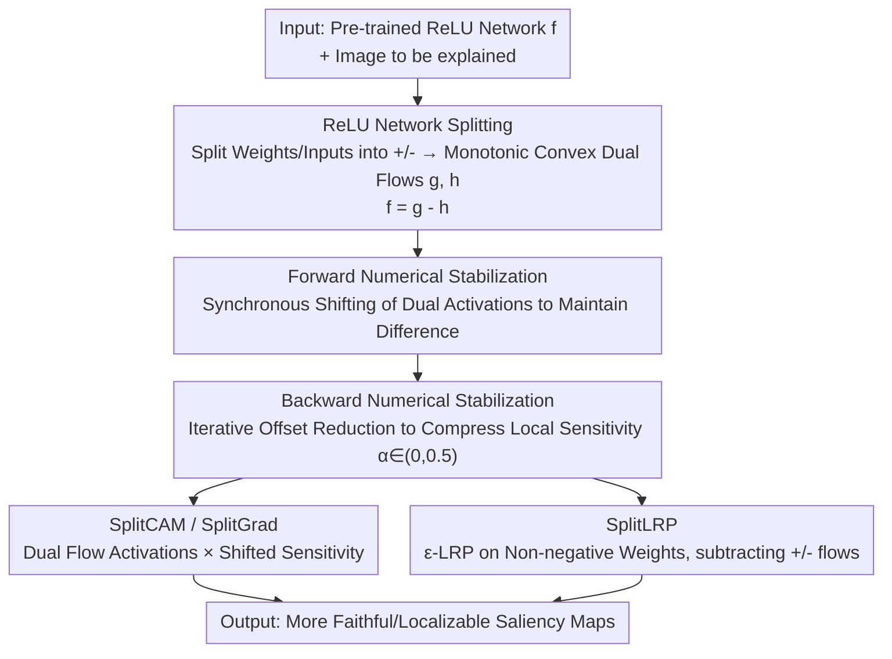

# Hidden Monotonicity: Explaining Deep Neural Networks via their DC Decomposition

**Conference**: CVPR 2026  
**Paper**: [CVF Open Access](https://openaccess.thecvf.com/content/CVPR2026/html/Zimmermann_Hidden_Monotonic_Explaining_Deep_Neural_Networks_via_their_DC_Decomposition_CVPR_2026_paper.html)  
**Code**: Not public (code included in supplementary materials)  
**Area**: Interpretability / Saliency Map Attribution  
**Keywords**: Interpretability, DC Decomposition, Monotonic Networks, Saliency Maps, ReLU Decomposition

## TL;DR
This paper losslessly decomposes any pre-trained ReLU network into the difference of two "monotonic and convex" subnetworks $f=g-h$. By resolving the numerical explosion inherent in such decompositions, it introduces three attribution methods—SplitCAM, SplitLRP, and SplitGrad—setting new state-of-the-art (SOTA) results for saliency maps across faithfulness, localization, and robustness on VGG16 and ResNet18 (ImageNet-S).

## Background & Motivation

**Background**: In Explainable AI (XAI), a major class of methods performs pixel or feature-level attribution (saliency maps), such as Gradient, Grad-CAM, LayerCAM, and Layer-wise Relevance Propagation (LRP). Another research line has identified that **monotonicity** is strongly correlated with interpretability, robustness, and fairness: monotonic networks with non-negative weights can "faithfully" represent monotonic dependencies without cancellation, making them inherently more interpretable.

**Limitations of Prior Work**: While the interpretability of monotonic networks is "interpretable-by-design," it comes at the cost of **limited expressivity**. Furthermore, these methods **cannot be applied to existing pre-trained architectures**—it is impossible to convert a pre-trained VGG16 into a monotonic network without retraining or altering its predictions. Consequently, a gap exists between "monotonic interpretability dividends" and "off-the-shelf large models."

**Key Challenge**: One must choose between monotonic networks (weak expressivity but interpretable, requiring training from scratch) and standard ReLU networks (strong expressivity but poor interpretability). Can we "borrow" the interpretability of monotonic networks for existing ReLU networks **without retraining or changing predictions**?

**Goal**: ① Losslessly decompose any pre-trained ReLU network (including CNNs) into the difference of two monotonic and convex subnetworks and overcome the exponential numerical explosion during decomposition; ② Perform attribution on these sub-network pairs to verify if the "difference structure" itself yields better explanations.

**Key Insight**: The authors utilize a simple identity $\text{ReLU}(a-b)=\max\{a-b,0\}=\max\{a,b\}-b$. This implies that a ReLU computation involving cancellation can be rewritten as the difference between two **cancellation-free** monotonic flows. This is a special case of Difference-of-Convex (DC) decomposition—previously proposed in literature but never successfully applied to XAI due to numerical explosion in forward and backward passes.

**Core Idea**: Decompose a ReLU network into a pair of monotonic convex "split flows" $g$ and $h$ such that $f=g-h$ using non-negative weights, stabilize propagation through affine transformations, and perform attribution on the split representation.

## Method

### Overall Architecture
The input is any pre-trained ReLU network $f$ (MLP/CNN) and an image to be explained; the output is a high-quality saliency map. The process consists of four steps: first, weights and inputs of each layer are split into non-negative positive and negative parts to construct two monotonic convex subnetworks $g$ and $h$ such that $f=g-h$ (lossless, predictions unchanged). Since split flows lack subtraction cancellation, deep layers suffer from numerical explosion; thus, **forward** passes are stabilized by recentering activations and **backward** passes are stabilized by iteratively reducing offsets to compress "local sensitivity." Finally, LayerCAM and LRP are rewritten as SplitCAM and SplitLRP on these split flows, alongside a new method, SplitGrad.

### Key Designs

**1. Lossless DC Splitting of ReLU Networks: Rewriting calculations as the difference between two monotonic convex flows**

To address the inability of "off-the-shelf ReLU networks to enjoy monotonic interpretability," each layer's weights are split into non-negative components $W^{(l)}=W^{(l,+)}-W^{(l,-)}$ where ($W^{(l,*)},W^{(l,-)}\ge0$), and the input $x$ is split into $a^{(0,+)}-a^{(0,-)}$. Per-layer pre-activations for both flows are calculated as $z^{(l,+)}=W^{(l,+)}a^{(l-1,+)}+W^{(l,-)}a^{(l-1,-)}$ and $z^{(l,-)}=W^{(l,-)}a^{(l-1,+)}+W^{(l,+)}a^{(l-1,-)}$. The original ReLU in the $g$ flow is replaced with a Maxout unit: $a^{(l,+)}=\max\{z^{(l,+)},z^{(l,-)}\}$ and $a^{(l,-)}=z^{(l,-)}$. Theorem 1 proves the splitting is lossless: $f^{(l)}(x_+-x_-)=(g^{(l)}-h^{(l)})(x_+,x_-)$, meaning the difference between flow outputs **precisely equals** the original network's output, with unchanged predictions. Components like convolutions, biases ($b=b^+-b^-$), residual additions, average pooling, and Batch Normalization (during inference) all have corresponding non-negative splitting strategies, supporting full CNNs.

**2. Forward Numerical Stabilization: Suppressing split flow explosion via "Synchronous Shifting"**

Without subtraction cancellation, $a^{(l,+)}$ and $a^{(l,-)}$ can grow exponentially in deep networks. The authors exploit a property from Theorem 1: adding the same constant shift to both $a^{(l,+)}$ and $a^{(l,-)}$ neither changes their difference $g^{(l)}-h^{(l)}$ nor the gradients of $g$ and $h$ (since gradients depend only on the **index** of the max operation in pre-activations, not their absolute values). Thus, activations are "recentered" whenever they exceed a threshold using three strategies (threshold/scaling/shifting). Intermediate calculations use `torch.float64` for precision, with optional caching of original activations for online correction to ensure the invariance $a^{(l,+)}-a^{(l,-)}=a^{(l)}$. Implementation uses a fixed scaling factor $\theta=0.1$ and threshold $\Theta=10$.

**3. Backward Numerical Stabilization: Compressing "Local Sensitivity" via iterative offset reduction and α interpolation**

The gradients of $g$ and $h$ involve only non-negative matrix multiplications and can also grow massive. The authors define local sensitivity $\delta^{(l,+,g)}=\partial g^{(l)}/\partial a^{(l,+)}$ (and three corresponding terms for other combinations) and, during layer-wise iteration, **subtract an $\alpha^{(l)}$ multiple of the product of subsequent absolute weight matrices** to compress the sensitivity values. $\alpha$ acts as an interpolation knob: when $\alpha=0.5$, local sensitivity reduces to a multiple of the original gradient; when $\alpha=0$, it restores the true split-flow gradient. The **most interesting interval is $0<\alpha<0.5$** (experiments mostly use $\alpha=0.3$ or $0.4$). During backpropagation through ReLU/Maxpooling, the **positivity pattern of cached original activations** is used instead of the split-flow max index, and the four sensitivity maps are corrected to satisfy the backward invariant $(\delta^{(l,+,g)}-\delta^{(l,-,g)})-(\delta^{(l,+,h)}-\delta^{(l,-,h)})=\partial f^{(l)}/\partial a^{(l)}$. The intuition is that Maxout retains pre-activation information discarded by ReLU at "dead neurons," resulting in a richer signal flow in the split representation.

**4. SplitCAM / SplitGrad / SplitLRP: Rewriting attribution methods on split flows**

To test if the split structure yields better explanations, they adapt two classic attribution methods. **SplitCAM** is modified from LayerCAM—where LayerCAM is $\text{ReLU}(\sum_c \frac{\partial y}{\partial a_c^{(l)}}\odot a_c^{(l)})$. SplitCAM replaces activations with split-flow activations and gradients with shifted local sensitivities, and **removes the ReLU positive filtering**: $\text{SplitCAM}^{(l,+,g)}=\sum_c \delta_{\text{shift}}^{(l,+,g)}\odot a_c^{(l,+)}$. **SplitGrad** is a newly proposed gradient method that averages shifted local sensitivities across channels: $\text{SplitGrad}^{(l,+,g)}=\frac{1}{C}\sum_c \delta_{\text{shift},c}^{(l,+,g)}$; when $\alpha\ll0.5$, it provides fine-grained gradients aligned with image details due to the retention of pre-activations by Maxout. **SplitLRP** adapts LRP-γ: since split weights are non-negative, it uses ε-LRP with $\gamma=0$ and $\varepsilon=10^{-6}$, yielding positive/negative relevance tensors $R^{(l,+)}$ and $R^{(l,-)}$, reporting the composite map $R^{(l,\text{comb})}=R^{(l,+)}-R^{(l,-)}$—where the positive flow marks "evidence for prediction" and the negative flow marks "evidence against." Since LRP normalizes per layer, no additional backward stabilization is needed.

### A Complete Example
Using an MNIST digit as an example of "differential structure" interpretability: the authors invert the h-flow input ($1-x$) and train a Deep Input-Convex (DIC) model, observing a clear separation of roles—**g-flow gradients focus on "stroke features present in the image," while h-flow gradients focus on "counterfactual features that are missing"** (Fig. 3). This provides class-specific, expressive gradient explanations, confirming that improvements stem from the "difference of two monotonic/convex networks" structure itself rather than just splitting techniques.

## Key Experimental Results

### Main Results
VGG16 and ResNet18 on ImageNet (using ImageNet-S-50 for evaluation, containing 50-class pixel-level segmentation annotations: 50 validation, 566 test). Metrics from the Quantus library: Faithfulness (Pixel Flipping AUC@5/@20, Selectivity↓), Localization (Attribution Localization, Pointing Game↑), and Robustness (Max Sensitivity↓). All methods (including baselines) automatically selected layers and hyperparameters (including $\alpha$ and absolute value usage) on the validation set. Comparisons include Guided Backprop, LayerCAM, LRP-γ, DeepLift, Integrated Gradients, Gradient SHAP, GradCAM++, Occlusion, and Feature Ablation.

| Method (VGG16) | Pointing Game↑ | Selectivity↓ | Max Sens.↓ |
| :--- | :--- | :--- | :--- |
| **SplitCAM** (sc, α=0.4, wta) | **0.938** | 4.711 | 0.456 |
| SplitLRP (sc, wta) | 0.871 | 5.168 | **0.282** |
| Guided Backprop | 0.887 | 3.276 | 0.571 |
| LayerCAM | 0.855 | 3.128 | 5.508 |
| LRP γ=0.25 | 0.680 | 3.189 | 0.519 |
| GradCAM++ | 0.827 | 5.955 | 0.401 |
| Integrated Gradients | 0.797 | 4.838 | 1.069 |

> Note: The "better" direction for Pixel Flipping and Selectivity depends on Quantus implementation (lower Selectivity indicates faster saliency decline, which is better); performance varies significantly across layer selections.

### Ablation Study

| Comparison | Key Metric | Description |
| :--- | :--- | :--- |
| SplitCAM vs LayerCAM (VGG16) | Pointing 0.938 vs 0.855 | Localization improved significantly after splitting; Max Sens dropped from 5.508 to ~0.46 (massive robustness gain). |
| SplitGrad vs Original Gradient | Better alignment with details | Maxout preserves pre-activation info; gradients are finely aligned when α≪0.5. |
| SplitLRP vs γ-LRP (VGG16) | Slight localization gain | ε-LRP on non-negative weights slightly outperforms γ-LRP in Pointing/Selectivity. |
| α Values | α∈(0,0.5) is optimal | α=0.5 reduces to a gradient multiple; α=0 is the true split gradient. The middle range is most effective. |

### Key Findings
- **Split methods dominate on VGG16**: SplitCAM outperforms Guided Backprop (0.887) and LayerCAM (0.855) in Pointing Game at 0.938, also leading in Selectivity and being competitive in Pixel Flipping. SplitLRP slightly outperforms classic γ-LRP in localization.
- **Dramatic Robustness Gains**: Max Sensitivity for SplitCAM/SplitLRP is typically 0.28–0.46, whereas LayerCAM reach 5.508 and Integrated Gradients 1.069—explanations from split representations are much more stable under input perturbations.
- **Diminishing Gains on ResNet18**: Split methods only show marginal improvements over LayerCAM in Selectivity and Pointing Game, with other metrics remaining comparable, suggesting gains are architecture-dependent.
- **Mid-layer SplitCAM is most balanced**: Qualitatively (Fig. 4), mid-layer SplitCAM balances interpretability and focus (low entropy), covering all target pixels while highlighting key features; it shares similar visual characteristics with early-layer γ-LRP.

## Highlights & Insights
- **Leveraging a simple identity**: $\text{ReLU}(a-b)=\max\{a,b\}-b$ allows off-the-shelf models to access monotonic interpretability without retraining—a simple but powerful concept.
- **"Translation-invariant gradients" as a stabilizing anchor**: The discovery that gradients depend only on max indices and not absolute activation values allows for arbitrary synchronous shifting to suppress numerical explosion without affecting explanation—the fundamental step in making theoretical DC decomposition practically engineerable.
- **The α knob unifies explanation types**: $\alpha$ allows for continuous interpolation between "original gradients" (0.5) and "true split gradients" (0), enabling a smooth exploration of the explanation spectrum.
- **Positive/Negative Flows = Evidence/Counter-evidence**: SplitLRP's $R^{(l,+)}-R^{(l,-)}$ explicitly separates "support for vs opposition to prediction." Combined with the role separation in MNIST, this provides a natural counterfactual explanation perspective that could be transferred to other attribution methods.

## Limitations & Future Work
- **Significant Architecture Dependency**: Substantial gains on VGG16 vs. marginal gains on ResNet18 suggest that dividends from split representations correlate strongly with network structure; effectiveness on modern architectures (e.g., Transformers) remains unverified.
- **Heuristic Numerical Stability**: Forward recentering, backward offset reduction, float64 usage, and online correction are empirical strategies. They lack theoretical stability guarantees and may require per-network hyperparameter tuning ⚠️.
- **Doubled Computational/Memory Overhead**: Maintaining positive/negative dual flows, caching original activations/gradients, and using float64 significantly increases inference and VRAM costs, which the paper did not report specifically.
- **Proof-of-Concept Nature**: The self-interpretability of differential networks (DIC/DM models) was only verified for concept on MNIST; ImageNet experiments focused on the ImageNet-S-50 subset rather than the full dataset.

## Related Work & Insights
- **vs LayerCAM**: SplitCAM is its adaptation on split flows—replacing activations/gradients and removing ReLU positive filtering. Localization (Pointing 0.938 vs 0.855) and robustness (Max Sens 5.508→~0.46) improved concurrently.
- **vs LRP-γ**: SplitLRP reduces to ε-LRP because split weights are non-negative, removing the need for γ to emphasize positive weights. The evidence/counter-evidence decomposition yields slightly better localization than classic γ-LRP.
- **vs Existing DC Decomposition**: While previous works used DC decomposition for optimization/training (e.g., DC programming for training, CDiNN), this paper is the first to apply it to **interpretability**, with numerical stabilization of the forward/backward pass as its core contribution.
- **vs Design-for-Interpretability Monotonic Networks**: Traditional monotonic networks sacrifice expressivity and require retraining; this work does the opposite—performing post-hoc splitting on any pre-trained ReLU network to gain monotonic interpretability without changing predictions.

## Rating
- Novelty: ⭐⭐⭐⭐⭐ First to apply "unusable" DC decomposition to XAI via numerical stabilization; unique approach.
- Experimental Thoroughness: ⭐⭐⭐⭐ Two architectures, three classes of Quantus metrics, extensive baselines, and parameter ablations; however, ResNet gains are small, ImageNet-S-50 is a subset, and overhead is not reported.
- Writing Quality: ⭐⭐⭐⭐ Clear logic chain from identity → splitting → stability → attribution; good theorems and diagrams, though some implementation details are relegated to the Appendix.
- Value: ⭐⭐⭐⭐ Provides a new post-hoc interpretability paradigm that requires no retraining/prediction changes; engineering overhead remains a barrier to adoption.

<!-- RELATED:START -->

## Related Papers

- [\[ICML 2025\] FastCAV: Efficient Computation of Concept Activation Vectors for Explaining Deep Neural Networks](../../ICML2025/interpretability/fastcav_efficient_computation_of_concept_activation_vectors_for_explaining_deep_.md)
- [\[CVPR 2026\] When Do Models Actually Decide? Mapping the Layer-Wise Decision Timeline in Pretrained Neural Networks](when_do_models_actually_decide_mapping_the_layer-wise_decision_timeline_in_pretr.md)
- [\[ICLR 2026\] Provably Explaining Neural Additive Models](../../ICLR2026/interpretability/provably_explaining_neural_additive_models.md)
- [\[ICLR 2026\] Modal Logical Neural Networks for Financial AI](../../ICLR2026/interpretability/modal_logical_neural_networks_for_financial_ai.md)
- [\[ICLR 2026\] Addressing Divergent Representations from Causal Interventions on Neural Networks](../../ICLR2026/interpretability/addressing_divergent_representations_causal.md)

<!-- RELATED:END -->
