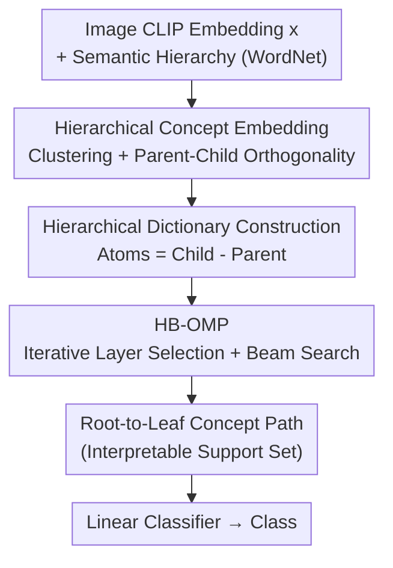

# Hierarchical Concept Embedding & Pursuit for Interpretable Image Classification

**Conference**: CVPR 2026  
**Paper**: [CVF Open Access](https://openaccess.thecvf.com/content/CVPR2026/html/Nguyen_Hierarchical_Concept_Embedding__Pursuit_for_Interpretable_Image_Classification_CVPR_2026_paper.html)  
**Code**: https://github.com/nghiahhnguyen/hcep  
**Area**: Interpretability / Concept Bottleneck  
**Keywords**: Interpretable Classification, Sparse Concept Recovery, Hierarchical Geometry, Dictionary Learning, Matching Pursuit

## TL;DR
HCEP explicitly encodes the "concepts have a hierarchical structure (hypernym → hyponym)" prior into the geometric conditions of the CLIP embedding space. It then utilizes Hierarchical Beam Orthogonal Matching Pursuit (HB-OMP) to recover concepts along "root-to-leaf" paths, significantly improving concept recovery precision/recall while maintaining classification accuracy, especially in few-shot scenarios.

## Background & Motivation
**Background**: Interpretable classification follows two routes: post-hoc and interpretable-by-design. The latter typically involves two steps: extracting human-readable concepts from an image, then performing classification using only these concepts. Within this, the "sparse concept recovery" branch is particularly scalable: an image embedding $x$ is represented as a sparse linear combination of concept embeddings from a dictionary $D$, where $x \approx Dz$. Non-zero coefficients indicate which concepts are present, which are then fed into a linear classifier.

**Limitations of Prior Work**: Standard sparse coding (e.g., OMP) treats all concept atoms in the dictionary equally, completely ignoring hierarchical relationships. Consequently, it might select contradictory concepts (e.g., both `animal` and `vehicle` for an image of a cat). While the prediction might be correct, the explanation is erroneous and untrustworthy.

**Key Challenge**: Semantic concepts naturally form a tree (or DAG, like WordNet), where each category has a unique path from the root (e.g., `animal → mammal → cat`). This path constitutes the "correct explanation." Flat sparse coding discards this structure, creating a disconnect between explanation faithfulness and off-the-shelf sparse solvers.

**Goal**: (1) Given a concept hierarchy, how can one construct concept embeddings with favorable geometric properties to support hierarchical recovery? (2) How can a sparse recovery algorithm be designed that respects the hierarchy, ensuring the recovered support set corresponds exactly to a "root-to-leaf" path?

**Key Insight**: Drawing inspiration from "hierarchical semantic geometry" in Large Language Models (orthogonality conditions by Park et al.), the authors observed that in pre-trained Vision-Language Models like CLIP, the difference vector "sub-concept embedding minus parent embedding" is naturally and approximately orthogonal to the parent embedding. Thus, the ideal hierarchical geometry already empirically holds in pre-trained models.

**Core Idea**: Use the "difference between parent and child embeddings" as dictionary atoms (each representing a refinement direction from parent to child). Sparse pursuit is restricted to a top-down, coarse-to-fine search among current nodes' children, utilizing beam search for fault tolerance to recover a hierarchically consistent concept path.

## Method

### Overall Architecture
The input to HCEP is a CLIP image embedding $x$ and a semantic concept hierarchy (e.g., WordNet). The output is a concept path from root to leaf (the explanation) and a corresponding class prediction. The pipeline consists of three steps: establishing hierarchical geometry in the embedding space (ensuring children cluster around parents, siblings are separated, and parent-child differences are orthogonal to parents), constructing a hierarchical dictionary using "parent-child differences," and finally using HB-OMP to recover the support set layer-by-layer to output the class via a linear classifier.

### Key Designs

**1. Hierarchical Concept Embedding Geometry: Clustering and Orthogonality as Conditions for Recovery**

If concept embeddings are disorganized, hierarchical recovery is impossible. HCEP proposes two geometric conditions for embeddings $\{a^{(i)}\}$. First is **Good Clustering** (Prop. 3.1): all descendants of node $i$ must fall within a cone centered at $a^{(i)}$ with a half-angle $\theta_{\mathrm{lev}(i)}$ (subtree containment), and sibling cones must not intersect. If the half-angle decreases geometrically $\theta_{l+1} \le \min\{r, 1/b\} \theta_l$ (Prop. 3.2), it ensures each node has a unique parent and subtrees are distinctive. Second is **Hierarchical Orthogonality** (Prop. 3.3): the child-parent difference vector is orthogonal to the parent embedding, $(a^{(j)}-a^{(i)})^\top a^{(i)}=0$. The authors prove this requires dimensionality $d \ge L+b-1$. Since CLIP has $d=768$, it easily satisfies WordNet's requirements ($L=14$, max $b=25$). Real-world verification on ImageNet CLIP embeddings shows these conditions approximately hold (median violation angle of $0^\circ$).

**2. Hierarchical Dictionary Construction: Using Differences as Atoms**

If the dictionary uses absolute embeddings, the sparsest explanation for a "cat" would simply be `cat`, losing hierarchical info. HCEP defines atoms as the difference between child and parent embeddings: $D = [a^{(j)} - a^{(\mathrm{par}(j))}]_{j \in A}$, with $a^{(\mathrm{root})} = 0$. By telescoping, any node embedding is the sum of difference atoms on its path: $a^{(i)} = \sum_{j \in \mathrm{anc}(i) \cup \{i\}} (a^{(j)} - a^{(\mathrm{par}(j))})$. For a noisy image $x = a^{(i)} + \epsilon$, recovery is equivalent to finding a support set that is exactly the "root to $i$" path. Each atom represents a "refinement direction" (e.g., `polar bear - bear` ≈ white fur).

**3. HB-OMP: Path-Restricted Expansion + Beam Search**

Standard OMP treats all atoms equally and may select inconsistent combinations. HB-OMP (Alg. 2) introduces two modifications. **Path-Restricted Expansion**: Each step only allows selecting atoms from the children of the currently explored deepest nodes (`Iactive ← chi(ilast)`), forcing a coarse-to-fine search. **Beam Search**: Maintains the top-$B$ hypotheses based on residual norm. This mitigates error accumulation; an early mistake (e.g., `animal` vs `object`) does not necessarily lead to a total failure of the sub-path explanation.

## Key Experimental Results

### Main Results
On synthetic data ($b=3, L=7, d=50$), HB-OMP consistently outperforms OMP in support precision/recall across all sparsity levels. On real datasets (ImageNette, ImageNet, CIFAR-100), metrics include classification accuracy and support precision/recall.

| Setup | Indicator | HCEP (HB-OMP) | Main Comparison | Conclusion |
|-------|-----------|---------------|-----------------|------------|
| CIFAR-100 / ImageNette | Support Precision & Recall | Best | OMP / HNN / CBM / NN | SOTA concept recovery, comparable accuracy |
| ImageNet (Full) | Classification Accuracy | Comparable | OMP / HNN / CBM | Improved explanation without accuracy loss |
| ImageNet Few-shot (12/25/50-shot) | Acc + Support P/R | Overall Best | All interpretable baselines | Hierarchical prior yields max gain in few-shot |
| ImageNet (SigLIP backbone) | Interpretability Metrics | Also Improved | — | Generalizes across VLMs |

### Ablation Study

| Configuration | Key Observation | Description |
|---------------|-----------------|-------------|
| OMP (Full dictionary) | Significantly lower P/R | Disrespects hierarchy, selects contradictory concepts |
| HB-OMP, $B=1$ | Lower Accuracy, Fastest | Degenerates to greedy hierarchical search without beam |
| HB-OMP, $B=4 \to 32$ | Performance increases with $B$ | Wider beam provides better fault tolerance, diminishing returns |
| Hierarchical NN (HNN) | Weaker than HCEP | Hard selection per layer with no backtracking |
| CBM | Drops more in few-shot | Requires learning concept classifiers from labels |

### Key Findings
- **Few-shot is the primary battlefield**: HCEP only requires averaging embeddings to estimate synsets, whereas CBM must learn classifiers. Hierarchical inductive bias is highly beneficial when labels are scarce.
- **Beam width $B$ is a clear trade-off**: Increasing $B$ from 1 to 32 monotonically improves precision and accuracy but increases per-sample runtime.
- **Geometric conditions are practical**: CLIP embeddings on ImageNet satisfy clustering and orthogonality empirically, proving hierarchical geometry exists in pre-trained models.

## Highlights & Insights
- **Geometric Migration**: Porting "hierarchical semantic geometry" from LLMs to vision embeddings provides strong evidence for the universality of semantic geometry.
- **Difference Dictionary**: Using "child - parent" atoms perfectly aligns the "sparse solution" with "hierarchical paths," solving the redundancy issues of absolute embeddings.
- **Fault Tolerance**: Explicitly modeling error recovery through beam search provides more robustness than simple greedy hierarchical traversal.

## Limitations & Future Work
- **Hierarchy Dependence**: Requires a pre-defined, high-quality hierarchy. For datasets like CIFAR-100, constructing a hierarchy manually or via induction impacts performance.
- **Ideal vs. Real Gap**: While 96% of nodes satisfy clustering, the behavior of the remaining 4% is not fully analyzed.
- **DAG Handling**: Current evaluation for DAGs (multi-parent) uses "distance to closest legal path," which may be overly simplistic.
- **Future Directions**: Jointly training/finetuning embeddings to actively satisfy geometric conditions instead of passive verification.

## Related Work & Insights
- **vs. Standard Sparse Recovery**: Flat OMP ignores hierarchy; HCEP ensures consistency through difference dictionaries and path-restricted search.
- **vs. CBM**: CBM requires supervision and does not scale well; HCEP uses embedding averages and excels in few-shot settings.
- **vs. Hierarchical NN**: HNN uses hard nearest neighbors per layer; HCEP’s beam search provides cross-layer fault tolerance.

## Rating
- Novelty: ⭐⭐⭐⭐ Solid integration of hierarchical geometry, difference dictionaries, and beam pursuit.
- Experimental Thoroughness: ⭐⭐⭐⭐ Extensive real-world and synthetic tests, though quantitative tables are partially replaced by charts.
- Writing Quality: ⭐⭐⭐⭐ Clear presentation of geometric propositions and algorithms.
- Value: ⭐⭐⭐⭐ Highly practical for faithful, hierarchically consistent explanations in label-scarce scenarios.

<!-- RELATED:START -->

<!-- RELATED:END -->

## Related Papers

- [\[CVPR 2026\] HierUQ: Hierarchical Uncertainty Quantification with Adaptive Granularity Reconciliation for Degraded Image Classification](hieruq_hierarchical_uncertainty_quantification_with_adaptive_granularity_reconci.md)
- [\[CVPR 2025\] Interpretable Image Classification via Non-parametric Part Prototype Learning](../../CVPR2025/interpretability/interpretable_image_classification_via_non-parametric_part_prototype_learning.md)
- [\[NeurIPS 2025\] From Flat to Hierarchical: Extracting Sparse Representations with Matching Pursuit](../../NeurIPS2025/interpretability/from_flat_to_hierarchical_extracting_sparse_representations_with_matching_pursui.md)
- [\[CVPR 2026\] On the Possible Detectability of Image-in-Image Steganography](on_the_possible_detectability_of_image-in-image_steganography.md)
- [\[CVPR 2026\] PRISM: Prototype-based Reasoning with Inter-modal Semantic Mining for Interpretable Image Recognition](prism_prototype-based_reasoning_with_inter-modal_semantic_mining_for_interpretab.md)

<!-- RELATED:END -->
