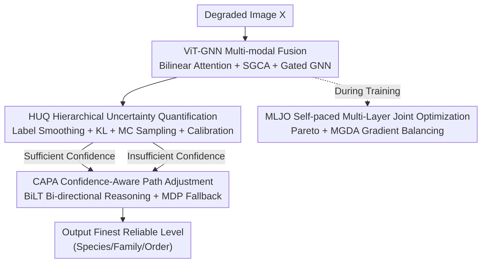

# HierUQ: Hierarchical Uncertainty Quantification with Adaptive Granularity Reconciliation for Degraded Image Classification

**Conference**: CVPR 2026  
**Paper**: [CVF Open Access](https://openaccess.thecvf.com/content/CVPR2026/html/Chu_HierUQ_Hierarchical_Uncertainty_Quantification_with_Adaptive_Granularity_Reconciliation_for_Degraded_CVPR_2026_paper.html)  
**Code**: None  
**Area**: Uncertainty Quantification / Hierarchical Classification / Degraded Image Recognition  
**Keywords**: Uncertainty Quantification, Hierarchical Classification, Confidence Fallback, Self-paced Learning, Multi-objective Optimization

## TL;DR
HierUQ addresses hierarchical classification of degraded (blurred/occluded/noisy/low-resolution) images by providing reliable confidence levels via Hierarchical Uncertainty Quantification (HUQ) based on label smoothing and proper scoring rules. It utilizes Confidence-Aware Path Adjustment (CAPA) to automatically fallback from fine-grained to coarser levels when uncertain, and employs Self-paced Multi-Layer Joint Optimization (MLJO) to coordinate multi-level objectives, achieving SOTA on degraded remote sensing ship and bird datasets.

## Background & Motivation

**Background**: Hierarchical Classification (HC) leverages semantic/structural dependencies (trees or DAGs) between labels to enhance fine-grained recognition, commonly used in remote sensing ship identification and biodiversity monitoring.

**Limitations of Prior Work**: In real-world scenarios, images are often contaminated by **degradation** such as blur, occlusion, noise, and low resolution, leading to unreliable feature representations. Models often provide low-confidence incorrect predictions at fine-grained levels (e.g., misclassifying a degraded ship as a "Ticonderoga-class cruiser" with only 31% confidence) without an effective mechanism to fallback to a more reliable coarse-grained category (e.g., "Warship"). The same applies to bird recognition ("Brandt's Cormorant" misclassified at 28%, while the family level "Phalacrocoracidae" has 76% confidence). Such confidence-related misclassifications have severe consequences in high-risk scenarios like military or medical applications.

**Key Challenge**: Traditional HC relies on single-level losses and fixed decision paths, lacking three elements: (1) a theoretically reliable **uncertainty quantification** strategy under degraded conditions; (2) adaptive adjustment for **feature competition** across granularities (unable to dynamically adjust classification paths and levels); and (3) **joint optimization** of multi-level training objectives (individual level losses acting independently, limiting overall performance and generalization). This results in misclassification, over-classification, and error propagation.

**Goal**: Construct a unified framework that allows the model to "boldly classify to the species level when the image is clear enough, and actively fallback to the family/order level when degradation is severe," integrating uncertainty modeling, granularity fallback, and self-paced optimization.

**Key Insight**: The authors propose an adaptive granularity selection and fallback mechanism based on "image degradation degree + prediction confidence"—timely falling back to more reliable high-level categories to reduce error propagation and lay a foundation for stable learning of fine-grained classes.

**Core Idea**: Use reliable Hierarchical Uncertainty Quantification (HUQ) as the "signal source" to drive a Confidence-Aware Path Adjustment (CAPA) controller, and stabilize the entire learning trajectory with Self-paced Multi-Layer Joint Optimization (MLJO).

## Method

### Overall Architecture
HierUQ is a unified ViT framework for hierarchical classification of degraded images, targeting three challenges: feature degradation, uncertainty estimation, and semantic granularity conflict. The input is a degraded image $X\in\mathbb{R}^{448\times448\times3}$, and the output is a hierarchical prediction path from coarse to fine that automatically "shortens" when uncertain. The system consists of three modules: HUQ for multi-modal fusion, uncertainty quantification, and confidence calibration; CAPA for granularity reasoning and confidence-aware fallback based on a Bi-directional Logit Tree (BiLT); and MLJO for the self-paced joint optimization of multi-level objectives.

Data Flow: ViT-B/16 extracts global visual features, which are fused with semantic embeddings (GloVe) via bilinear attention and Semantic-Guided Cross-Attention (SGCA), then passed through a gated GNN to inject hierarchical structural dependencies, obtaining a unified representation $F_{multi}$. HUQ computes confidence and variance for each level using hierarchical label smoothing, KL constraints, and Monte Carlo sampling. CAPA takes these as input, utilizing BiLT bi-directional reasoning and an MDP fallback strategy (actions = stay/fallback/terminate) to decide the final output level. MLJO uses self-paced sampling and dynamic weight balancing of multi-level losses during training.

### Key Designs

**1. HUQ: Hierarchical Uncertainty Quantification via Label Smoothing, Proper Scoring Rules, and MC Sampling**

Addresses the pain point of "lacking theoretically reliable uncertainty under degradation." First, probability consistency is enforced between adjacent levels: $P(Y^{(k)}=c_k|x)=\sum_{c_{k+1}\in\text{Children}(c_k)}P(Y^{(k+1)}=c_{k+1}|x)$, with a KL constraint loss $L_{KL}=\sum_{k=1}^{K-1}\lambda_k\cdot KL(P(Y^{(k)}|x)\,\|\,\text{Marg}(P(Y^{(k+1)}|x)))$ to align fine-level marginal probabilities with coarse levels. Label smoothing is driven by **hierarchical distance**: defining $d_{hier}(c_i,c_j)=2^{-\text{LCA}(c_i,c_j)}\in(0,1]$ (where LCA is the depth of the Lowest Common Ancestor, root depth is 0; depths 0/1/2/3 correspond to $d=1, \tfrac12, \tfrac14, \tfrac18$), followed by constructing soft labels $\tilde q(k|x)=(1-\alpha)\delta_{y,k}+\alpha\cdot\frac{\exp(-\beta d_{hier}(y,k))}{\sum_j\exp(-\beta d_{hier}(y,j))}$, where "closer" classes receive more smoothing mass. Reliability is measured by the **Hierarchical Brier Score** $BS_{hier}=\sum_k w_k\sum_i(p_i^{(k)}-y_i^{(k)})^2$. Confidence is provided by level-wise estimators $N^{conf}_k$, and variance-based uncertainty $U^{(k)}_{var}$ is calculated via $T=10$ Monte Carlo stochastic forward passes, finally calibrated via temperature scaling $\tilde P^{(k)}(c|x)=\exp(z^{(k)}_c/T_k)/\sum_j\exp(z^{(k)}_j/T_k)$ (where $T_k$ is optimized via NLL and evaluated using ECE). This combination ensures that confidence under degradation is both hierarchically consistent and calibrated, serving as a reliable "signal source" for fallback decisions.

**2. CAPA: BiLT Bi-directional Reasoning and MDP Fallback for Fine-to-Coarse Transitions**

Addresses "over-classification and error propagation." First, a Bi-directional Logit Tree (BiLT) is constructed on the hierarchy tree $T=(V,E)$, utilizing top-down $\phi_{TD}(h)$ and bottom-up $\phi_{BU}(h)$ reasoning paths, fused with gated adaptation $z_{BiLT}=\alpha(h)\phi_{TD}(h)+(1-\alpha(h))\phi_{BU}(h)$. To ensure logical consistency, a propagation constraint loss $L_{prop}=\sum_k\sum_{v\in V_k}(z^{(k)}(v)-\sum_{u\in\text{Children}(v)}z^{(k+1)}(u))^2$ is added. The fallback itself is modeled as a Markov Decision Process (MDP) $M=(S,A,P,R)$, where state $s_t=[h_t,c_t,u_t,k_t]$ includes features, confidence, uncertainty, and current level; the action space is $A=\{\text{stay}, \text{fallback}, \text{terminate}\}$. Q-values $Q(s_t,a_t)=\text{MLP}([\phi_{conf}(c_t);\phi_{feat}(h_t)])$ are optimized via policy gradients, and the reward $R_t$ integrates accuracy, efficiency, granularity, and consistency. Optimal thresholds are selected via Bayesian optimization with Gaussian processes. The intuitive effect is a step-by-step "Species → Family → Order" fallback: predicting down to the species if clear, falling back to family if fine-grained clues are unreliable, and retreating to order under severe degradation to avoid incorrect fine-grained labels.

**3. MLJO: Multi-level Joint Optimization with Self-paced Sampling and Pareto/MGDA Balancing**

Addresses "fragmented multi-level objectives." Ours reformulates HC as a constrained multi-objective optimization problem. The composite loss includes four terms: hierarchical consistency loss $L_{hierarchy}$, granularity coordination loss $L_{granularity}$ (aligning BiLT paths), classification loss $L_{cls}=\sum_k\omega^{adaptive}_k L^{(k)}_{CE}$, and fallback penalty $L_{fallback}$. Multi-objectives are handled via Chebyshev scalarization $L_{total}=\max_j\{\lambda_j|L_j-z^*_j|\}+\rho\sum_j\lambda_j|L_j-z^*_j|$, with MGDA used to find the optimal gradient combination $g_{balanced}=\sum_j\alpha^*_j g_j$. Simultaneously, self-paced learning is employed: sample difficulty is evaluated by a quality score $Q(x_i)$, and the threshold $\lambda_t$ is dynamically updated to weight samples by difficulty (easy samples learned first). This stabilizes training and accelerates convergence.

## Loss & Training
The total loss is the four-term composite loss from MLJO via Chebyshev scalarization and MGDA gradient balancing (see Design 3). Training uses SGD (momentum 0.9, weight decay $5\times10^{-4}$). For HRSC-Deg, the learning rate is 0.002 (batch 32), and for CUB-Deg, it is 0.0001 (batch 16), with a 10× decay at epochs 25/40. Training is conducted on NVIDIA V100. A Lyapunov stability function $V(\theta,t)$ and smooth weight interpolation $\omega_{smooth}$ are introduced to control the training pace.

## Key Experimental Results

### Main Results
Two self-constructed degraded datasets: **HRSC-Deg** (Remote sensing ships, 2 levels: 3 coarse + 21 fine classes) and **CUB-Deg** (Birds, 3 levels: 13 orders / 38 families / 200 species). Degradation is simulated via transformations $G$ (noise, blur, downsampling, occlusion).

Evaluation metrics: **ISDL** (Inverse Symmetric Difference Loss), measuring the semantic gap between ground truth set $S$ and predicted set $\hat S$ (higher is better); **PH** (Hierarchical Precision); **RH** (Hierarchical Recall); and level-wise accuracy (Lvlacc).

| Method | HRSC ISDL ↑ | HRSC Fine ↑ | CUB ISDL ↑ | CUB Species ↑ |
|------|-------------|-------------|------------|----------------|
| ViT-B | 66.03 | 84.98 | 80.39 | 61.58 |
| TransHP | 71.90 | 88.58 | 87.66 | 76.78 |
| SGHPN | 72.73 | 88.87 | 90.71 | 79.54 |
| VT-BPAN | 71.05 | 88.81 | 90.99 | 82.98 |
| BiLT | 68.71 | 88.33 | 91.07 | 82.00 |
| HierUQ-C (No Bilinear) | 76.27 | 92.05 | 92.70 | 85.06 |
| **Ours (HierUQ)** | **85.45** | **92.23** | **99.59** | **85.73** |

On HRSC-Deg, HierUQ achieves an ISDL of 85.45%, +12.72% higher than SGHPN; coarse accuracy reaches 100.00% and fine accuracy 92.23%. On CUB-Deg, ISDL reaches 99.59% (note: possible OCR noise, refer to original Table 1), with species-level accuracy at 85.73% (+2.75% vs VT-BPAN).

### Ablation Study
Effects of individual modules (Hie.=HUQ, Gra.=Granularity, Fal.=Fallback) on HRSC-Deg:

| Config | Lvlacc | Fine | ISDL | Description |
|------|--------|------|------|------|
| Baseline | 68.08 | 77.73 | 58.63 | No UQ/Fallback/Coordination |
| + Fal. Only | 71.09 | 85.15 | 67.26 | ISDL +8.63, fallback suppresses over-classification |
| + Gra. Only | 70.31 | 86.04 | — | Fine level +8.31 |
| HierUQ-C | 76.45 | 92.05 | 76.27 | Strong even without bilinear fusion |
| **Ours (Full)** | 78.45 | 92.23 | 85.45 | Complete model |

### Key Findings
- **HUQ stabilizes confidence**: Applying HUQ alone on HRSC-Deg improves level accuracy from 68.08% to 71.20% and PH from 81.30% to 87.38%. CUB-Deg species accuracy increases by +3.69%.
- **AGR/Fallback suppresses over-classification**: Granularity coordination alone improves HRSC-Deg fine accuracy by +8.31%. Fallback improves RH and suppresses error propagation via "Species → Family → Order" adaptive retreat.
- **MLJO accelerates convergence**: The full MLJO converges at epoch 18 (vs epoch 38 for baseline), a ~52.6% speedup, with higher final accuracy.
- **Bilinear fusion acts as an amplifier**: While HierUQ-C is strong, the full model achieves a significant leap in ISDL (e.g., 76.27 → 85.45 on HRSC).

## Highlights & Insights
- **Let uncertainty decide "how fine" to predict**: The core insight is that one should not force fine-grained classification on degraded images. Instead, let calibrated confidence drive an MDP-based fallback controller. This formalizes the intuition "better coarse and correct than fine and wrong."
- **Rigorous Uncertainty Modeling**: Label smoothing uses LCA distance $2^{-\text{LCA}}$, reliability uses Hierarchical Brier, calibration uses temperature scaling, and uncertainty uses MC variance. This is a theoretically grounded combination of proper scoring rules rather than heuristic adjustments.
- **Chebyshev + MGDA for Multi-objective Optimization**: Resolving conflicts between four level-specific losses using Pareto scalarization and MGDA gradient balancing provides a stable framework for hierarchical learning.

## Limitations & Future Work
- Datasets are self-constructed "degraded versions" (HRSC-Deg/CUB-Deg). Degradation is simulated, and hierarchical consistency is completed using a frozen pre-trained classifier. Discrepancies with real-world distributions and potential biases remain to be verified.
- The system is highly complex (HUQ with smoothing/KL/MC/scaling + CAPA with BiLT/MDP/Bayesian + MLJO with Chebyshev/MGDA/Lyapunov/Self-paced), leading to high hyperparameter and training complexity.
- Experiments are limited to 2-3 shallow levels in two domains; scalability to deeper hierarchies (e.g., full biological taxonomies) or larger scales is unknown.

## Related Work & Insights
- **vs BiLT**: BiLT performs bi-directional reasoning for granularity inference but lacks uncertainty calibration. HierUQ adds HUQ and MDP fallback, upgrading "reasoning" to "knowing when to retreat."
- **vs SPUR**: SPUR introduces self-paced learning to HC but does not jointly model granularity and fallback. HierUQ integrates these under a multi-objective framework.
- **vs SGHPN / TransHP**: These rely on structural constraints/prompts for HC but lack discriminative semantic retention under degradation. HierUQ uses bilinear fusion and explicit confidence-aware fallback to maintain robustness.

## Rating
- Novelty: ⭐⭐⭐⭐ Connects reliable UQ with confidence-driven fallback via MDP/multi-objective optimization; individual components are often existing tools combined effectively.
- Experimental Thoroughness: ⭐⭐⭐⭐ Two datasets + ablation + visualization; however, datasets are synthetic and the system is complex.
- Writing Quality: ⭐⭐⭐ Clear motivation, but the system is perhaps too intricate, making readability difficult.
- Value: ⭐⭐⭐⭐ Significant value for high-risk degraded image recognition (remote sensing/medical/quality control); the "granularity-by-uncertainty" paradigm is transferable.

<!-- RELATED:START -->

## Related Papers

- [\[CVPR 2026\] Hierarchical Concept Embedding & Pursuit for Interpretable Image Classification](hierarchical_concept_embedding_pursuit_for_interpretable_image_classification.md)
- [\[ICML 2026\] Courtroom Analogy: New Perspective on Uncertainty-Aware Classification](../../ICML2026/interpretability/courtroom_analogy_new_perspective_on_uncertainty-aware_classification.md)
- [\[ICML 2026\] MiniMax Learning of Interpretable Factored Stochastic Policies from Conjoint Data, with Uncertainty Quantification](../../ICML2026/interpretability/minimax_learning_of_interpretable_factored_stochastic_policies_from_conjoint_dat.md)
- [\[CVPR 2026\] On the Possible Detectability of Image-in-Image Steganography](on_the_possible_detectability_of_image-in-image_steganography.md)
- [\[CVPR 2026\] Making the Classification Explanation Faithful to the Confidence Score](making_the_classification_explanation_faithful_to_the_confidence_score.md)

<!-- RELATED:END -->
