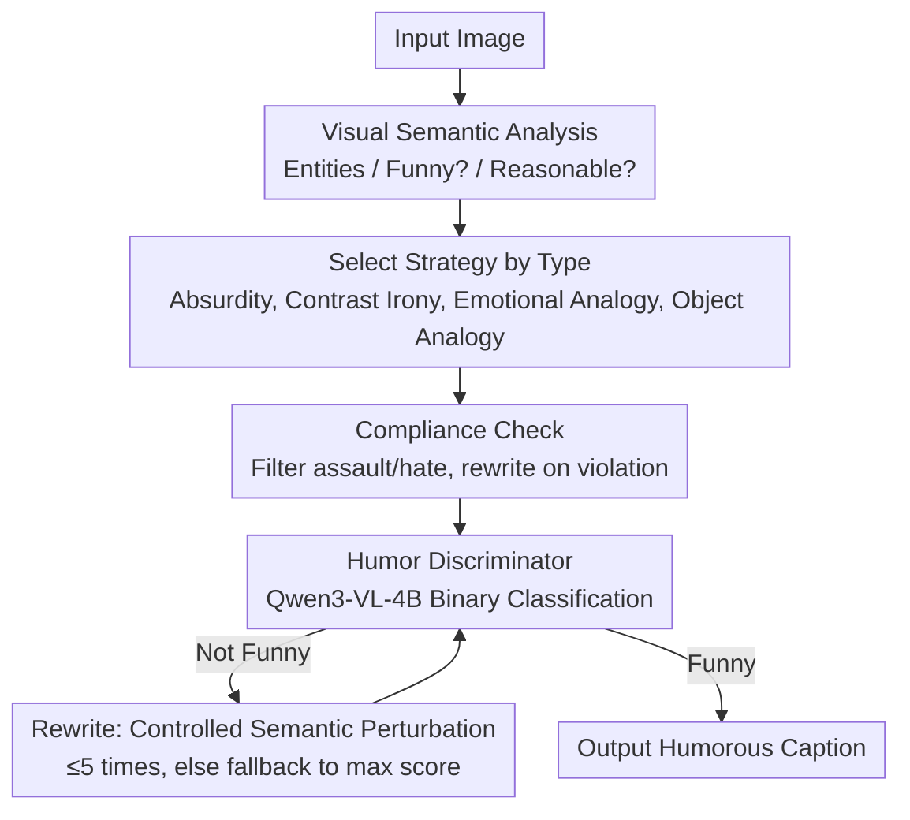

# HUMORCHAIN: Theory-Guided Multi-Stage Reasoning for Interpretable Multimodal Humor Generation

**Conference**: CVPR 2026  
**Paper**: [CVF Open Access](https://openaccess.thecvf.com/content/CVPR2026/html/Zhang_HUMORCHAIN_Theory-Guided_Multi-Stage_Reasoning_for_Interpretable_Multimodal_Humor_Generation_CVPR_2026_paper.html)  
**Code**: None (Not provided in the paper)  
**Area**: Interpretability / Multimodal Generation  
**Keywords**: Humor Generation, Multimodal Image Captioning, Humor Theory, Chain-of-Thought, Human Preference Discriminator

## TL;DR
HUMORCHAIN explicitly encodes four major humor theories—Incongruity-Resolution, Benign Violation, Superiority, and Relief—into a multi-stage LLM reasoning chain ("Visual Parsing → Strategy Selection → Generation → Discriminator Feedback"). A Qwen3-VL-4B humor discriminator is trained for a "generation-evaluation-rewriting" loop, outperforming existing methods in human preference, Elo/BT scores, and semantic diversity across three datasets.

## Background & Motivation
**Background**: Multimodal generative models are fluent in standard image captioning. Humorous image captioning follows two main paths: data-driven (e.g., large-scale training on 2.9 million pairs like OxfordTVG-HIC) and strategy-oriented (optimizing logic via templates or prompt engineering).

**Limitations of Prior Work**: Data-driven methods rely heavily on corpora, inherit training distribution biases, and lack stylistic variety; strategy-oriented methods use fixed templates, limiting dynamic reasoning and deep humor understanding. Fundamentally, existing methods **lack explicit modeling and theoretical grounding**, often producing sentences that are "fluent literal descriptions without actual punchlines or cognitive depth."

**Key Challenge**: While humor seems subjective and spontaneous, classical theories (Incongruity-Resolution, Benign Violation, Superiority, Relief) suggest it follows a **learnable systematic structure**. Current models neither embed these cognitive mechanisms into generation nor possess reliable humor evaluation metrics (automated metrics fail to capture subjective "funniness").

**Goal**: (1) Operationalize abstract humor theories into executable structured reasoning steps; (2) Solve the evaluation bottleneck by replacing failed automated metrics with a discriminator aligned with human preferences in a closed loop.

**Key Insight**: Humor theories describe the stages of "how cognition generates laughter"—perceiving incongruity, then resolution, violation, or release. These can be mapped directly to "Theory → Stage → Reasoning Step," endowing the generation process with explicit logic and theoretical interpretability.

**Core Idea**: Drive a multi-stage reasoning chain via humor theories (visual parsing, identifying incongruity triggers, then selecting a strategy based on image type) and attach a human-preference-tuned discriminator for a "generation-evaluation-rewriting" loop, combining theoretical guidance with quality control.

## Method

### Overall Architecture
HUMORCHAIN takes an image as input and outputs a humorous caption. It decomposes humor generation into serial cognitive stages: visual semantic parsing (identifying entities, determining if the image is inherently funny or plausible), routing the results to one of four humor strategies (Absurdity, Contrast Irony, Emotional Analogy, Object Analogy), followed by compliance checks for offensive content, and finally a fine-tuned humor discriminator for binary classification. If judged "not funny," it enters a rewriting phase with controlled semantic perturbation (up to 5 retries, otherwise falling back to the highest-scored candidate).

### Key Designs

**1. Theory-Guided Multi-Stage Reasoning: Mapping Four Theories to Cognitive Stages**

Prior methods merely "describe the image" without embedding the mechanism of "why it is funny." HUMORCHAIN formalizes humor generation as a sequential chain corresponding to the four theories: detecting incongruity in the visual domain (Incongruity-Resolution), introducing irony or self-deprecation to trigger emotional involvement (Superiority) or controlled norm violation (Benign Violation), and finalizing the expression for emotional discharge (Relief). This transforms abstract theories into an interpretable architecture where each step carries a specific cognitive task.

**2. Image-Type Routing for Four Humor Strategies: Diversified Theoretical Combinations**

To avoid repetitive outputs, the authors summarize four strategies based on Yus's image macro meme classification: **Absurdity** (for images with obvious incongruity; uses anthropomorphism based on Incongruity-Resolution); **Contrast Irony** (when visual incongruity is subtle; uses semantic reversals constrained by Benign Violation to stay within safe boundaries); **Emotional Analogy** (when the image already contains humor/emotion; combines Incongruity-Resolution and Relief to map visual tension to human psychological responses); and **Object Analogy** (for inanimate objects; combines Superiority and Relief to map physical features to life events, e.g., "messy desk → my brain before a deadline").

**3. Human Preference Discriminator + Closed-Loop Rewriting: Replacing Failed Metrics**

Humor evaluation is highly subjective. The authors fine-tuned Qwen3-VL-4B-Instruct with LoRA into a lightweight humor discriminator for binary classification of "image-caption" pairs. A classification head outputs a continuous probability, with a threshold set at $0.66$ to balance precision and rewriting costs. The discriminator forms a loop with the generator: if "not funny" is detected, it triggers rewriting with controlled semantic perturbation (up to 5 retries). Training data comes from a self-built 5,000+ pair human preference set.

### Mechanism Example: Generating Humor for a "Non-Funny" Portrait
Given a portrait, HUMORCHAIN first performs entity recognition, determines it's not inherently funny, and assesses the scene as "implausible." Consequently, the system activates the **Absurdity** reasoning path (guided by Incongruity-Resolution). After generation, it passes through compliance and the discriminator. If rejected, it undergoes semantic perturbation until it passes or reaches the retry limit.

### Loss & Training
The discriminator utilizes LoRA and humor-aware prompts to activate implicit reasoning, starting with SFT for binary classification, followed by a head for continuous probability (threshold $0.66$). The main reasoning backbone is GPT-5-2025-08-07. The loop is capped at 5 retries with a fallback mechanism.

## Key Experimental Results

### Main Results
Evaluation includes pairwise comparison (Win Rate, Hard Win Rate, Bradley-Terry/Arena Elo) and single-instance evaluation (Human Funny Rate, CLIPScore, BERTScore, etc.). HUMORCHAIN (I) is compared against baselines including zero-shot (A), few-shot CoT (F), external CLoT (G), and data-driven OxfordTVG-HIC (H).

| Comparison | Sample Size | Win Rate (I or J) | Implication |
|------|--------|----------|------|
| I (Ours) vs A (Zero-shot) | 300 | 0.695 | Multi-stage reasoning + theoretical modeling provides significant advantage |
| I vs F (Few-shot + CoT) | 300 | 0.680 | Explicit cognitive modeling outperforms implicit CoT |
| I vs G (External CLoT) | 794 | 0.683 | More stable and funnier across models |
| I vs H (External OxfordTVG-HIC) | 1007 | 0.860 | Significant lead over data-driven methods |
| I vs J (No Discriminator) | 300 | 0.745 | Discriminator + retry loop contributes significantly |
| J vs A (Theory vs Zero-shot) | 300 | 0.850 | Theory guidance alone vastly exceeds the baseline |

I achieved the highest Elo (1554.60) and BT (3.57). In single evaluations, I reached a human funny mean of 0.810, far exceeding external methods (0.195) and other strategy combinations (0.38–0.40).

### Ablation Study

| Configuration | Key Metrics | Note |
|------|---------|------|
| Full HUMORCHAIN (I) | Human Funny 0.810 / Elo 1554.6 | Theory Chain + Discriminator Loop |
| No Discriminator (J) | Win Rate J < I (0.745) | No loop; still beats baselines but weaker than I |
| Discriminator: Baseline (Untuned) | Accuracy 0.523 | Almost unusable without training |
| Discriminator: LoRA Binary | Accuracy 0.636 | Significant improvement after tuning |
| Discriminator: LoRA + Head (thr=0.66) | Accuracy 0.670 | Further gain with threshold flexibility |
| Pre- vs. Post-Discriminator | Funny Output 45.1% → 67.0% | Loop increases funniness by ~22 points |

### Key Findings
- The discriminator acts as a critical valve: funniness increased from 45.1% to 67.0% ($\Delta \approx +22\%$). The average accepted caption required 2.74 generations (36.5% acceptance), which is acceptable for quality-cost balance.
- "Large models $\neq$ good discriminators": Gemini-2.5-Flash and GPT-4 achieved high Positive Rates (88–96%) but low precision ($\sim 0.47$), severely overestimating humor. The fine-tuned 4B model was more precise ($0.670$).
- Single strategies yield limited gains: Zero-shot/Few-shot (A-C) performed similarly; explicit multi-stage orchestration (I) is required for a qualitative leap.

## Highlights & Insights
- **Theorizing the Generation Loop**: Unlike prior works that use theory only for post-hoc evaluation, this work maps theories to generation stages, providing strong interpretability.
- **Small Discriminator beats LLM Judgment**: A fine-tuned 4B model outperformed large closed-source models in humor detection, suggesting that "human-aligned specialized small models + closed-loop retries" is more efficient than increasing backbone size.
- **Dynamic Policy Routing**: Routing strategies based on image types avoids template rigidity, successfully translating cognitive differences into engineering switches.

## Limitations & Future Work
- Evaluation is highly dependent on human annotation, which is subjective. The "$\ge 2/5$" funniness threshold preserves diversity but introduces noise.
- The cost of the closed-loop is non-negligible, with an average of 2.74 generations per result, limiting real-time application.
- The backbone relies on GPT-5, raising replication barriers. The cross-cultural validity of the theory-to-prompt mapping remains to be verified.

## Related Work & Insights
- **vs CLoT [47]**: CLoT uses "leap-of-thought" for novelty; HUMORCHAIN yields more consistent humor via structured stages (Win Rate 0.683 over G).
- **vs Text Chain-of-Humor (CoH)**: While CoH focuses on text conflicts, this work extends to multimodal contexts and explicitly integrates four theories.
- **vs Data-driven (OxfordTVG-HIC)**: HUMORCHAIN requires less data and avoids the single-style bias of corpus-driven models (Win Rate 0.860 over H).

## Rating
- Novelty: ⭐⭐⭐⭐⭐ First to embed humor theory into multimodal generation with a preference-aligned loop.
- Experimental Thoroughness: ⭐⭐⭐⭐ Extensive pairwise comparisons and ablation, though sample sizes varied across datasets.
- Writing Quality: ⭐⭐⭐⭐ Clear theory-to-stage mapping and diagrams.
- Value: ⭐⭐⭐⭐ Provides a theory-driven paradigm for controllable creative generation.

<!-- RELATED:START -->

## Related Papers

- [\[ACL 2025\] IRT-Router: Effective and Interpretable Multi-LLM Routing via Item Response Theory](../../ACL2025/interpretability/irt_router_multi_llm.md)
- [\[CVPR 2026\] PRISM: Prototype-based Reasoning with Inter-modal Semantic Mining for Interpretable Image Recognition](prism_prototype-based_reasoning_with_inter-modal_semantic_mining_for_interpretab.md)
- [\[CVPR 2026\] Cut to the Chase: Training-free Multimodal Summarization via Chain-of-Events](cut_to_the_chase_training-free_multimodal_summarization_via_chain-of-events.md)
- [\[CVPR 2026\] Where Culture Fades: Revealing the Cultural Gap in Text-to-Image Generation](where_culture_fades_revealing_the_cultural_gap_in_text-to-image_generation.md)
- [\[CVPR 2026\] H-Sets: Hessian-Guided Discovery of Set-Level Feature Interactions in Image Classifiers](h-sets_hessian-guided_discovery_of_set-level_feature_interactions_in_image_class.md)

<!-- RELATED:END -->
