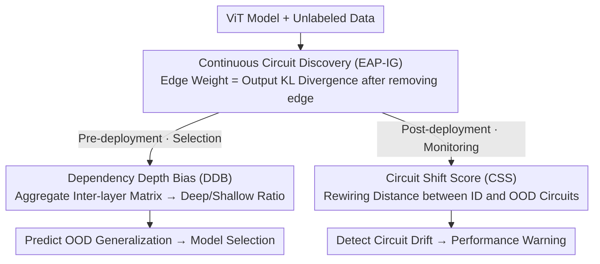

# Inside-Out: Measuring Generalization in Vision Transformers Through Inner Workings

**Conference**: CVPR 2026 Highlight  
**arXiv**: [2604.08192](https://arxiv.org/abs/2604.08192)  
**Code**: [GitHub](https://github.com/deep-real/GenCircuit)  
**Area**: Interpretability  
**Keywords**: Generalization Metrics, Circuit Discovery, Vision Transformer, Distribution Shift, Mechanistic Interpretability

## TL;DR

This paper proposes generalization performance prediction metrics based on the internal circuits of models, including Dependency Depth Bias (DDB) for pre-deployment model selection and Circuit Shift Score (CSS) for post-deployment performance monitoring. These metrics improve correlation by an average of 13.4% and 34.1%, respectively, compared to existing proxy metrics.

## Background & Motivation

Reliable generalization assessment is crucial for machine learning deployment, especially in high-risk scenarios with scarce labels (e.g., medical imaging). Core challenges arise from two practical scenarios:

1.  **Pre-deployment Model Selection**: How to select the best model on unlabeled target data? ID accuracy is unreliable due to the underspecification problem (models with similar ID accuracy can show huge differences in OOD performance).
2.  **Post-deployment Performance Monitoring**: How to detect performance degradation during continuous distribution shifts? Confidence metrics are unreliable due to the overconfidence problem (providing high confidence even for incorrect predictions).

Existing proxy metrics (e.g., confidence, accuracy-on-the-line, RANKME, etc.) only analyze the **external behavior** of the model (output probabilities or feature quality), ignoring the **internal mechanisms** that generate these outputs.

**Core Idea**: Utilize circuit discovery techniques from Mechanistic Interpretability to extract generalization signals from the model's internal computational paths—arguing that "how a model calculates" reflects its generalization ability better than "what it calculates."

## Method

### Overall Architecture

The starting point of this paper is that "how the model calculates reflects generalization better than what it calculates." Therefore, circuit discovery techniques from mechanistic interpretability are used to extract generalization signals from the internal computational paths of ViT. The entire pipeline is: first, use EAP-IG to extract ViT into a circuit with continuous edge weights; then, provide two complementary metrics—**Pre-deployment**, use DDB (by aggregating the circuit into an inter-layer dependency matrix) to predict a model's OOD generalization ability (for model selection); **Post-deployment**, use CSS to monitor circuit drift with distribution shifts to warn of performance degradation. The entire process requires no labels.

### Key Designs

**1. Continuous Circuit Definition and Discovery: Quantifying "Importance of Each Computational Path"**

Traditional binary circuits (an edge is either present or absent) lose fine-grained information and are insufficient for evaluating generalization. This paper relaxes the circuit into a **continuous edge weight function**: for a ViT computational graph $\mathcal{G}=(\mathcal{V}, \mathcal{E})$, the weight of edge $e$ is defined as the KL divergence of the model output after its removal:

$$c(e) = \mathbb{E}_{x \sim \mathcal{D}}\big[\mathrm{KL}(\mathcal{M}_{\setminus\{e\}}(x),\, \mathcal{M}(x))\big]$$

This represents the causal importance of the edge to the model's behavior. Implementation-wise, mean ablation is used instead of swap ablation, which is more suitable for vision tasks, and EAP-IG is used to balance faithfulness and computational efficiency. Continuous weights retain the structural information needed for subsequent generalization evaluation, and the entire process is label-free.

**2. Dependency Depth Bias (DDB): Metric for Pre-deployment Generalization Prediction**

After aggregating edge weights into an inter-layer dependency matrix $\Lambda_{ij}$, the authors used CCA to discover a cross-task "universal generalization motif"—**well-generalizing models rely on deep paths ($\nabla$ shape), while poorly-generalizing models rely on shallow shortcuts ($\Delta$ shape).** The intuition is that deep layers encode more abstract, domain-invariant semantics, while shallow layers capture domain-specific spurious correlations. DDB quantifies this ratio of deep to shallow dependency using a logarithm:

$$DDB = \log\Big(\textstyle\sum_{deep} \big/ \sum_{shallow}\Big)$$

Three variants exist (DDB_global, DDB_deep for deep-to-deep connections, DDB_out for nodes to output nodes), with the threshold $\tau=0.3$ performing best. A higher DDB indicates the model relies more on deep semantics and has better OOD generalization, allowing for model selection before deployment.

**3. Circuit Shift Score (CSS): Metric for Post-deployment Performance Degradation Warning**

Post-deployment, there is no ID baseline to compare inter-layer topology—the authors found that **inter-layer topology remains stable after deployment, but edge rewiring intensifies with distribution shifts**, and CCA even provides contradictory generalization motifs across different datasets. Therefore, CSS focuses on fine-grained rewiring rather than topology:

$$CSS = d\big(\mathcal{R}(c_{ID}),\, \mathcal{R}(c_{OOD})\big)$$

Where $\mathcal{R}$ is the circuit representation and $d$ is the distance, supporting both vectorized (cosine/ℓ2/SRCC) and graph-structured (Laplacian/NetLSD/Jaccard) types. CSS(v, SRCC) performs best, indicating that **changes in the relative ranking of edge weights** predict degradation more reliably than absolute magnitudes.

### Loss & Training

This method involves no training. Threshold calibration for CSS uses 39 corruption domains from CIFAR10-C as proxy data to simulate distribution shifts, finding the CSS value corresponding to the corruption domain closest to the performance threshold $\delta$ as the alarm threshold $\delta'$.

## Key Experimental Results

### Main Results — Pre-deployment Model Selection

| Dataset | Metric | DDB_out (Ours) | Best Baseline | Gain |
|--------|------|---------------|---------|------|
| PACS (Style Shift) | R²/SRCC/KRCC | 0.862/0.897/0.731 | 0.765/0.878/0.720 (ID Acc) | +13% |
| Camelyon17 (Institutional Shift) | R²/SRCC/KRCC | 0.748/0.820/0.646 | 0.588/0.802/0.628 (ATC) | +22% |
| Terra Incognita (Geographic Shift) | R²/SRCC/KRCC | 0.714/0.838/0.642 | 0.684/0.813/0.613 (DDB_global) | +5% |
| **Average** | Composite Score | **0.766±0.029** | 0.632±0.047 (ID Acc) | **+13.4%** |

### Main Results — Post-deployment Performance Monitoring

| Dataset | Metric | CSS(v,SRCC) (Ours) | Best Baseline | Gain |
|--------|------|-------------------|---------|------|
| PACS | R²/SRCC/KRCC | 0.912/0.983/0.944 | 0.645/0.617/0.444 (ATC) | +78% |
| FMoW | R²/SRCC/KRCC | 0.723/0.750/0.722 | 0.428/0.717/0.611 (MDE) | +29% |
| Camelyon17 | R²/SRCC/KRCC | 0.519/0.807/0.608 | 0.036/0.273/0.187 (MDE) | +187% |
| ImageNet | R²/SRCC/KRCC | 0.953/0.961/0.855 | 0.942/0.957/0.861 (ATC) | +1% |
| **Average** | Composite Score | **0.811±0.041** | 0.470±0.095 (ATC) | **+34.1%** |

### Ablation Study

| Configuration | R² | SRCC | KRCC | Description |
|------|-----|------|------|------|
| τ=0.1 | 0.744 | 0.743 | 0.562 | Shallow/Deep boundary too narrow |
| τ=0.2 | 0.772 | 0.843 | 0.653 | Suboptimal |
| τ=0.3 | **0.798** | **0.862** | **0.684** | Best |
| τ=0.4 | 0.801 | 0.849 | 0.671 | Near optimal |
| τ=0.5 | 0.772 | 0.838 | 0.673 | Halfway boundary |

### Key Findings

- DDB is highly aligned with the training dynamics of OOD accuracy: DDB for well-generalizing models increases from 2.6 to 4.1, while for poorly-generalizing models, it stagnates at -0.9.
- Vectorized CSS significantly outperforms graph-structured CSS, indicating that fine-grained edge weight patterns are more informative than coarse-grained topological similarity.
- Different datasets exhibit different circuit shift patterns: FMoW shows extensive cross-layer changes, while Camelyon17 focuses on deep-layer changes.
- CSS alarm F1 improves by approximately 45% over the best baseline within the clinically acceptable performance range (0.8-0.9).

## Highlights & Insights

- Groundbreaking shift of mechanistic interpretability from "post-hoc explanation" to "predictive metrics," providing a new paradigm for model evaluation.
- The "universal generalization motif" reveals an intuitively consistent pattern: well-generalizing models rely more on deep abstract features, while poorly-generalizing models rely on shallow surface features.
- CSS can detect "silent failures" without labels, which has significant practical value in high-risk scenarios such as healthcare.
- Circuit discovery migrated from language models to vision models, validating that Visual Transformer circuits possess interpretable generalization patterns.

## Limitations & Future Work

- High computational cost of circuit discovery limits the practicality of real-time post-deployment monitoring.
- Validated only on ViT architectures; applicability to CNN or hybrid architectures is unknown.
- The cost of constructing a model zoo (72-144 ViTs) is high, and such a large number of candidate models may not exist in practical scenarios.
- Threshold calibration strategy depends on artificially constructed corruption datasets; its robustness under real-world distribution shifts requires further validation.

## Related Work & Insights

- **vs Accuracy-on-the-Line**: This observation assumes a linear correlation between ID and OOD accuracy, but the underspecification phenomenon breaks this assumption; DDB avoids this by looking at internal structure rather than external behavior.
- **vs Confidence Metrics (AC/ANE/MDE)**: Confidence metrics only reflect output probability distributions and are severely affected by overconfidence; CSS measures from the perspective of computational path changes and is more reliable.
- **vs RANKME/α-ReQ**: Feature quality metrics evaluate representation space properties but do not consider how features are used by subsequent layers; DDB considers complete inter-layer dependencies.

## Rating

- Novelty: ⭐⭐⭐⭐⭐ First to use circuit discovery for generalization prediction, a paradigm innovation.
- Experimental Thoroughness: ⭐⭐⭐⭐ Three pre-deployment + four post-deployment datasets, comparison with multiple baselines, thorough ablation.
- Writing Quality: ⭐⭐⭐⭐ Clear problem definition, two scenarios explained separately in a self-contained manner.
- Value: ⭐⭐⭐⭐ Practical significance for model evaluation and monitoring, though computational costs limit application.

<!-- RELATED:START -->

## Related Papers

- [\[ICLR 2026\] Block Recurrent Dynamics in Vision Transformers](../../ICLR2026/interpretability/block_recurrent_dynamics_in_vision_transformers.md)
- [\[CVPR 2026\] Align Once to Explain: Feature Alignment for Scalable B-cosification of Foundational Vision Transformers](align_once_to_explain_feature_alignment_for_scalable_b-cosification_of_foundatio.md)
- [\[CVPR 2026\] CIGMA: Causal Information-Gain Mechanistic Attribution of Attention Heads in Vision Transformers](cigma_causal_information-gain_mechanistic_attribution_of_attention_heads_in_visi.md)
- [\[CVPR 2026\] Measuring the (Un)Faithfulness of Concept-Based Explanations](measuring_the_unfaithfulness_of_concept-based_explanations.md)
- [\[CVPR 2025\] Prompt-CAM: Making Vision Transformers Interpretable for Fine-Grained Analysis](../../CVPR2025/interpretability/prompt-cam_making_vision_transformers_interpretable_for_fine-grained_analysis.md)

<!-- RELATED:END -->
