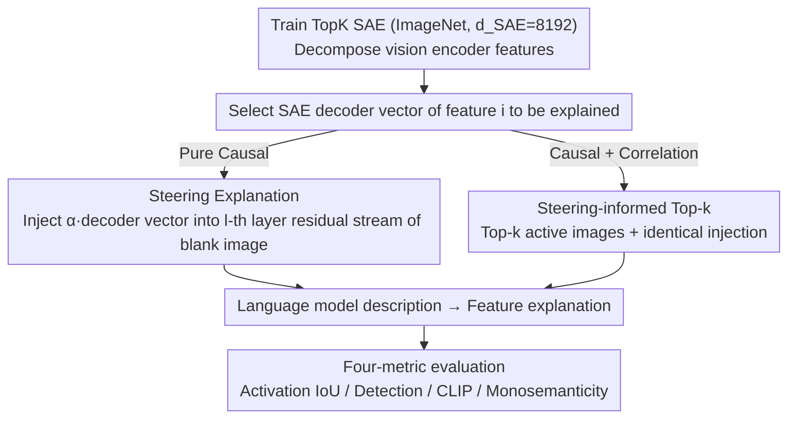

# Language Models Can Explain Visual Features via Steering

**Conference**: CVPR 2026  
**arXiv**: [2603.22593](https://arxiv.org/abs/2603.22593)  
**Code**: [GitHub](https://github.com/HPAI-BSC/vision-interp)  
**Area**: Interpretability  
**Keywords**: Sparse Autoencoders (SAE), Visual Feature Interpretation, Causal Intervention, VLM, Automated Interpretability

## TL;DR

Ours proposes performing causal intervention (steering) using SAE features on VLM vision encoders. By inputting blank images and allowing the language model to describe the visual concepts it "sees," this method achieves scalable automated interpretation of visual features without needing evaluation image sets. The hybrid approach, Steering-informed Top-k, achieves SOTA performance.

## Background & Motivation

**Background**: Sparse Autoencoders (SAEs) have become powerful tools for discovering interpretable features in vision models. However, automatically interpreting these features remains an open problem as SAEs scale to thousands of features.

Limitations of Prior Work (Top-k methods):
1. **Based on correlation rather than causality**: Selecting top activating images for an interpreter to find common patterns is essentially correlation analysis.
2. **Dependent on evaluation image sets**: Requires large-scale image sets to find top activations, introducing dataset bias.
3. **High computational cost**: Requires forward passes across the entire evaluation set to rank activations.

Key Insight: VLMs connect vision encoders with pretrained language models. If causal intervention is performed on the vision encoder—injecting specific SAE feature vectors into a blank image—the language model should be able to express the visual concepts it "sees."

## Method

### Overall Architecture

The problem addressed is how to automatically generate human-readable explanations for tens of thousands of features discovered by SAEs in vision encoders. Existing Top-k methods feed several images that highly activate the feature to an interpreter to find commonalities, which is correlation-based and requires traversing the evaluation set. Ours takes a different approach: since the VLM connects the vision encoder to a language model, causal intervention is applied to the vision encoder to observe what the language model "says."

Mechanism: A TopK SAE ($d_{SAE}=8192$) is first trained on ImageNet to decompose vision encoder features. To explain feature $i$, the SAE decoder vector of that feature is injected into the residual stream of a specific vision encoder layer while inputting an all-white blank image. The language model is then prompted to describe what it "sees"; this description serves as the explanation for feature $i$. A hybrid version can be created by overlaying this with Top-k images.

### Key Designs

**1. Steering Explanation: Injecting feature vectors into blank images to let the language model speak for them**

The reason Top-k methods are limited by evaluation sets and only provide correlational evidence is that they never truly "drive" the model, only observing high activations post-hoc. Ours performs direct causal intervention: inputting a blank (all-white) image $\tilde{I}$, and adding the SAE decoder weight vector multiplied by a strength coefficient to all positions in the residual stream of layer $l$, i.e., $m_{sub}^l(\tilde{I}) \leftarrow m_{sub}^l(\tilde{I}) + \alpha W_{dec}[i,:]$. The interpreter then generates text based on this rewritten visual representation, formulated as:

$$e_i \sim m_{exp}\big(e \mid P, \tilde{I}, \mathrm{do}(m_{sub}^l(\tilde{I}) \leftarrow m_{sub}^l(\tilde{I}) + \alpha W_{dec}[i,:])\big)$$

The key is that the blank image carries no meaningful visual signal of its own, so every word the language model speaks must originate from the injected feature. This is a pure causal explanation rather than a guess of commonalities across images. For example, when injecting a low-level texture feature, the language model directly describes "stripes" or a specific color. This also solves the cost issue: explaining a feature requires only one forward pass on a blank image.

**2. Steering-informed Top-k: Combining causal and correlational evidence**

While pure Steering is clean, blank images lack context, making Steering less effective than Top-k with real images for high-level semantic features like object categories. The hybrid version does not choose between them: while conditioning on Top-k activating images as usual, it applies the same SAE feature injection to the vision encoder. The interpreter thus sees both "which real images activate it" (correlational evidence) and "what it becomes when forced on" (causal evidence). These types of evidence are complementary—Steering excels at low-level features while Top-k excels at high-level semantics. The combination achieves optimal performance across four metrics with nearly zero extra computational cost over standard Top-k.

**3. Four complementary explanation quality metrics**

Explanation quality is quantified from four perspectives: **Activation IoU** measures the overlap between "high-activation images retrieved by the explanation text" and "high-activation images of the SAE feature itself"; **Detection Score** tests whether concepts described in the explanation can actually be detected in images by the VLM; **CLIP Similarity** calculates the distance between the explanation text and top activating images in the CLIP embedding space; **Monosemanticity** determines whether the feature corresponds to a single concept. These metrics address retrieval overlap, detectability, cross-modal semantics, and concept purity to avoid single-metric bias.

### Loss & Training

The SAE is trained on ImageNet using a standard TopK objective ($d_{SAE}=8192$). Intervention strength $\alpha$ is selected on a validation set of 500 features. Explanation generation involves no training and is pure inference-time causal intervention.

## Key Experimental Results

### Main Results — Explanation Quality Comparison (Gemma 3 Vision Encoder)

| Method | Activation IoU↑ | Detection↑ | CLIP↑ | Monosemanticity↑ |
|------|---------|-----------|-------|--------|
| Top-k (Original Images) | Baseline | Baseline | Baseline | Baseline |
| Top-k (Mask) | Slightly Better | Slightly Better | Slight Decrease | Equivalent |
| Top-k (Heatmap) | Equivalent | Equivalent | Equivalent | Equivalent |
| Steering (Pure Intervention) | Lower than Top-k | Lower than Top-k | Lower than Top-k | Equivalent |
| **Steering-informed Top-k** | **Best** | **Best** | **Best** | **Best** |

### Ablation Study — Language Model Scaling Effect

| LM Scale | Explanation Quality Trend |
|--------|-------------|
| Small | Baseline level |
| Medium | Significant improvement |
| Large | Continuous improvement |

Explanation quality improves continuously with language model scale with no signs of saturation.

### Key Findings

- Pure Steering methods outperform Top-k on low-level features (textures, colors, edges), as causal intervention better captures these raw visual concepts.
- Top-k methods are stronger for high-level semantic features (object categories) because specific images provide reference.
- The hybrid approach (Steering-informed Top-k) reaches SOTA on all metrics with no additional computational overhead.
- Language model scale is a key factor—larger LMs better "express" visual concepts.
- Conclusions are consistent across different VLMs (Gemma 3 and Intern VL3).

## Highlights & Insights

- Paradigm shift from "correlation" to "causality": Steering directly intervenes in internal representations, providing a more causal foundation than Top-k correlation analysis.
- Extremely efficient: Explaining a feature requires only a single forward pass without traversing an evaluation set.
- LM scaling effects suggest that future stronger LMs will further enhance automated interpretability.
- Elegant hybrid design: Injecting causal signals into the image context of Top-k allows for complementary information.

## Limitations & Future Work

- Pure Steering is weaker than Top-k for high-level semantic features due to the lack of context in blank images.
- Results are sensitive to the intervention strength $\alpha$, requiring tuning on a validation set.
- Validated only on VLM architectures; cannot be directly applied to pure vision models without a language component.
- SAE dimension is fixed at 8192; the scalability with larger dictionaries is unknown.
- Evaluation relies mainly on automated metrics; human evaluation is lacking.

## Related Work & Insights

- **vs Standard Top-k methods**: Top-k is correlation-based, requires evaluation sets, and is compute-intensive; Steering is causal, dataset-independent, and requires only one forward pass.
- **vs PatchScopes/SELFIE**: These methods perform self-interpretation in LMs; Ours extends this paradigm to vision encoders for the first time.
- **vs CB-SAE (Same Conference)**: CB-SAE focuses on SAE controllability and interpretability metrics, while Ours focuses on generating natural language explanations for SAE features.

## Rating

- Novelty: ⭐⭐⭐⭐⭐ Causal intervention for visual feature explanation is a brand-new paradigm, concise and elegant.
- Experimental Thoroughness: ⭐⭐⭐⭐ Multiple metrics, multiple VLMs, and scaling analysis, though human evaluation is missing.
- Writing Quality: ⭐⭐⭐⭐ Clear motivation and intuitive method, despite issues with LaTeX rendering in the source.
- Value: ⭐⭐⭐⭐ Significantly advances research in automated interpretability for vision models with high scalability.

<!-- RELATED:START -->

## Related Papers

- [\[ACL 2026\] Compositional Steering of Large Language Models with Steering Tokens](../../ACL2026/interpretability/compositional_steering_of_large_language_models_with_steering_tokens.md)
- [\[ICML 2026\] CorrSteer: Generation-Time LLM Steering via Correlated Sparse Autoencoder Features](../../ICML2026/interpretability/corrsteer_generation-time_llm_steering_via_correlated_sparse_autoencoder_feature.md)
- [\[CVPR 2026\] Draft and Refine with Visual Experts](draft_and_refine_with_visual_experts.md)
- [\[CVPR 2026\] Understanding Counting Mechanisms in Large Language and Vision-Language Models](understanding_counting_mechanisms_in_large_language_and_vision-language_models.md)
- [\[ICML 2026\] Interpretability Can Be Actionable](../../ICML2026/interpretability/interpretability_can_be_actionable.md)

<!-- RELATED:END -->
