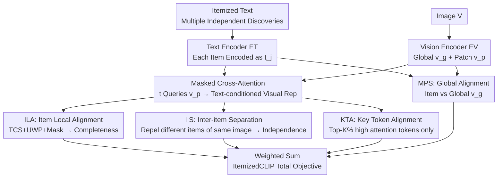

# Learning complete and explainable visual representations from itemized text supervision

**Conference**: CVPR 2026  
**Paper**: [CVF Open Access](https://openaccess.thecvf.com/content/CVPR2026/html/Lyu_Learning_complete_and_explainable_visual_representations_from_itemized_text_supervision_CVPR_2026_paper.html)  
**Code**: https://github.com/MLNeurosurg/ItemizedCLIP  
**Area**: Multimodal VLM / Explainability  
**Keywords**: Itemized text supervision, CLIP, cross-attention, medical imaging, explainable representations

## TL;DR
Addressing supervision scenarios like medical imaging and remote sensing where "one image is paired with multiple non-overlapping independent text descriptions (itemized text)," this paper proposes ItemizedCLIP. It utilizes a masked cross-attention module to generate "text-item-modulated" visual representations, paired with four SigLIP-style objectives to enforce "item independence" and "representation completeness." Zero-shot performance and fine-grained explainability significantly outperform CLIP-family baselines across four real medical/remote sensing domains and one synthetic domain.

## Background & Motivation

**Background**: Training vision models with language supervision (the CLIP paradigm) has become the mainstream path for obtaining generalizable and transferable representations. Subsequent works further introduced "multi-positive caption supervision," where an image is paired with multiple captions to enhance semantic coverage and robustness through redundant descriptions.

**Limitations of Prior Work**: However, many critical domains do not satisfy this assumption. In **non-object-centric** imagery such as brain MRI, head CT, chest CT, and remote sensing, an image is paired not with redundant captions describing the same entity, but with "**itemized**" text—multiple items with almost no semantic overlap, each describing an independent finding. For example, a brain MRI report might list "enhancing posterior fossa tumor of the fourth ventricle," "ventricular enlargement suggesting obstructive hydrocephalus," and "subependymal seepage suggesting elevated intracranial pressure." These items reside in different spatial regions; missing any one could mean a missed diagnosis of a tumor or hemorrhage.

**Key Challenge**: Multi-positive objectives and itemized supervision are fundamentally in conflict. Multi-positive contrastive losses **explicitly pull all positive captions of the same image together** (since they describe the same thing), which directly violates the requirement for "item independence." Conversely, early radiological CLIP models **concatenated all items into a single long caption**, discarding the compositional structure inherent in itemized supervision. Neither approach can simultaneously satisfy the two rigorous properties required for itemized scenarios.

**Goal**: To learn visual representations directly from itemized text supervision that simultaneously satisfy two attributes: ① **Item independence**: features corresponding to different text items should be distinguishable and localized to their respective regions; ② **Representation completeness**: the merged visual embedding must encode information from **all** items, rather than just one.

**Key Insight**: The authors formalize "itemized text supervision" as an independent paradigm distinct from multi-positive supervision. They observe that the "text-conditioned visual representation + cross-attention" mechanism (e.g., in FLAIR) is naturally suited for item-level localization, though its training objectives were designed for redundant captions and require redesigning for itemized settings.

**Core Idea**: Use masked cross-attention to project "each text item" into a "visual representation modulated by that item." A set of specialized SigLIP-style objectives (Local Alignment + Inter-item Separation + Key Token Alignment + Global Alignment) is then applied to enforce item independence and representation completeness, achieving explainable fine-grained visual features without any region or segmentation annotations.

## Method

### Overall Architecture
ItemizedCLIP follows the CLIP dual-tower structure: Vision Encoder $E_V$ (ViT, outputting global CLS representation $v_g$ and patch-level representation $v_p$) + Text Encoder $E_T$, with an additional multi-head cross-attention module `CrossAttn` using linear qkv projections. Training data consists of pairs $D=\{V^{(i)}, T^{(i)}\}$, where each $T^{(i)}$ contains $n_i$ **independent** text items $\{item_1, \dots, item_{n_i}\}$ (where $n_i$ varies per image). During the forward pass, each item is independently encoded as $t_j^{(i)}=E_T(item_j^{(i)})$. The image is divided into $m$ patches, yielding global representation $v_g$ and patch-level representations $v_p=\{v_{p,1},\dots,v_{p,m}\}$.

The mechanism uses text item $t$ as a query to query patch representations $v_p$, yielding a "text-conditioned visual representation" $CrossAttn(t, v_p, v_p)$. The cosine similarity is calculated as $\text{TCSim}(t,v_p)=CS(t, CrossAttn(t,v_p,v_p))$. Four SigLIP-style objectives are applied: Local Alignment (ILA, including Upweighting Worst Positive (UWP) + masked attention), Inter-item Separation (IIS), Multi-positive Global Alignment (MPS), and Key Token Alignment (KTA). The total loss is their weighted sum. For zero-shot inference, categoric descriptions are treated as text items, and the prediction logit is $\text{TCSim}(t_{c_k}, v_p)$.

### Key Designs

**1. ILA Item Local Alignment: Enforcing Completeness and Robustness via TCS**

ILA builds upon Text-Conditioned SigLIP (TCS) from FLAIR. TCS applies SigLIP loss to each $\text{TCSim}(t,v_p)$: maximizing it if the item belongs to the image, and minimizing it otherwise. This paper adds two features to transform TCS into ILA. First is **Upweighting Worst Positive (UWP)**: for each image, the loss of the currently **lowest similarity positive item** is multiplied by a coefficient $w_{uwp}$, formulated as $w_j^{(i)}=w_{uwp}$ when $j=\arg\min_j \text{TCSim}(t_j^{(i)}, v_p^{(i)})$, otherwise 1. This forces the model to learn the item it currently perceives as "least like a positive sample," ensuring **no single item is omitted**—the source of representation completeness. Second is **Masked Attention**: randomly masking a portion of visual tokens during training (via $\text{Bernoulli}(p_{mask})$) to prevent overfitting and encourage robust visual localization.

**2. IIS Inter-item Separation: Mutual Repulsion of Items within the Same Image**

Item independence requires different items to focus on different image regions. IIS pairs the text-conditioned visual representation $v_{tc}^{i,j}=CrossAttn(t_j^{(i)},v_p^{(i)},v_p^{(i)})$ with another item $t_k^{(i)}$ from the same image: $k=j$ yields a positive pair, while $k \neq j$ yields a negative pair. The loss is $\mathcal{L}_{IIS}=-\frac{1}{|B|}\sum_i\sum_j\sum_k SigL(CS(t_k^{(i)},v_{tc}^{i,j}), \mathbb{I}_{k=j}, b, \tau)$. This pushes $v_{tc}$ of different items apart, forcing the cross-attention to attend to distinct regions.

**3. KTA Key Token Alignment: Strengthening Localization via Compact tokens**

KTA aligns items with a small subset of high-attention visual tokens. For each item $t$, an attention map is extracted from $CrossAttn(t,v_p,v_p)$. $KT(t,v_p)$ is defined as tokens within the top-$K\%$ attention scores. A TCS loss is then computed using **only these key tokens**, tying the item more tightly to the compact region truly carrying the discovery.

**4. MPS Global Alignment: Low-weight Auxiliary for Global Semantic Awareness**

MPS is a multi-positive SigLIP using the global representation $v_g$ (sampling one random item per image as a negative). While MPS pulls items from the same image together (conflicting with item independence), a **low weight** for MPS enhances the model's perception of global visual attributes, benefiting zero-shot classification.

### Loss & Training
The SigLIP objective is $SigL(k,z,b,\tau)=\log\frac{1}{1+e^{z(-\tau k+b)}}$, where $b,\tau$ are learnable bias and temperature, and $z\in\{+1,-1\}$ identifies positive/negative pairs. The total loss is $\mathcal{L}_{all}=\mathcal{L}_{ILA}+\lambda_{IIS}\mathcal{L}_{IIS}+\lambda_{MPS}\mathcal{L}_{MPS}+\lambda_{KTA}\mathcal{L}_{KTA}$.

## Key Experimental Results

### Main Results
Evaluated across four real itemized domains and one synthetic domain, zero-shot performance significantly outperforms baselines.

| Dataset / Setting | Metric | ItemizedCLIP | Prev. SOTA | Gain |
|--------------|------|--------------|-----------|------|
| UM220K Prospective (Brain MRI, 52 tasks) | mAUC | 90.5 | 83.7 (HLIP) | +6.8 |
| Pub-Brain-5 (Brain MRI, 12 metrics) | mean BAcc | 83.6 | 76.5 (HLIP) | +7.1 |
| HeadCT240K Prospective (83 tasks) | mAUC | 85.1 | 75.8 (HLIP) | +9.3 |
| RSNA / CQ500 (Head CT) | mAUC | 91.5 / 90.0 | 85.7 / 83.1 (HLIP) | +5.8 / +6.9 |
| CT-Rate (Chest CT, 16 tasks) | mAUC | 83.2 | 78.7 (HLIP-SA) | +4.5 |
| RSICD (Remote Sensing, 30 classes) | Top-1 Acc | 46.2 | 46.3 (MPS) | ≈Equal* |
| Itemized-cc0.3M (Synthetic Flickr) | T@1 | 19.2 | 16.7 (FLAIR) | +2.5 |

\*While RSICD Top-1 is equal to MPS, Ours is superior in mean rank (3.76 vs 4.10) and Top-5 (78.7 vs 76.1). On Head CT, ItemizedCLIP zero-shot even exceeds the linear probing results of FM-HeadCT, Google-CT, and Merlin.

### Ablation Study
Ablations performed by incrementally adding components (ILA split into TCS/UWP/Mask), reporting completeness (MLL) and zero-shot mIoU.

| Configuration | Brain MRI 12-task mBAcc | MLL×100 (Completeness) | Segmentation mIoU |
|------|---------------------|---------------------------|-----------|
| FLAIR (Equal TCS+MPS) | 78.7 | 31.12 | 11.4 |
| TCS | 79.9 | 38.56 | 9.1 |
| + IIS | 81.2 (+1.3) | 40.29 (+1.73) | 6.5 (−2.6) |
| + MPS | 81.9 (+0.7) | 39.43 (−0.86) | 16.1 (+9.6) |
| + UWP | 81.6 (−0.3) | 42.96 (+2.50) | 18.1 (+2.0) |
| + KTA | 82.7 (+1.1) | 42.46 (−0.50) | 15.9 (−2.2) |
| + TCS Mask (=ItemizedCLIP) | 83.6 (+0.9) | 43.83 (+1.37) | 17.5 (+2.6) |

### Key Findings
- **Every component contributes differently**: IIS focuses on item distinguishability, UWP on completeness (largest MLL contribution, +2.50), and KTA/Masking on classification accuracy and robustness.
- **Strong localization requires IIS + MPS**: IIS alone causes segmentation mIoU to drop to 6.5; adding MPS jumps it to 16.1, indicating global semantic awareness is vital for localization.
- **Explainability is "free"**: Cross-attention maps align with expert-annotated lesions without any segmentation labels, even isolating multiple independent locations for the same pathology.

## Highlights & Insights
- **Formalizes "Itemized Text Supervision" as an independent paradigm**: Clearly distinguishes scenarios where semantics do not overlap (Medical/Remote Sensing) from multi-positive (redundant) scenarios, providing two measurable constraints: item independence and representation completeness.
- **UWP Design**: Cleverly translates the clinical requirement of "not missing any findings" into an optimizable objective by upweighting the "worst" positive sample.
- **Reusable Diagnostic Metrics**: mAMS (item distinguishability) and MLL (Mean Lowest Logit, for completeness) quantify abstract properties into numbers, applicable to any "one image, multiple independent labels" task.

## Limitations & Future Work
- **Reliance on attention maps**: The paper does not deeply discuss the gap between attention maps and true causal attribution; precise heatmap alignment does not guarantee the decision is based on that region.
- **MPS Weight Tuning**: Global alignment and item independence are inherently in conflict. The paper relies on low-weight trade-offs, but sensitivity and cross-domain stability were not fully explored.
- ⚠️ Many main results (e.g., RSNA/CQ500, CT-Rate) are cited from original papers like HLIP; caution is needed regarding consistency in preprocessing/backbones during direct comparison.

## Related Work & Insights
- **vs Llip / DreamLIP**: Llip first proposed text-conditioned visual representations via mixture tokens; DreamLIP used sub-captions and local tokens for localization. Both were designed for multi-positive settings and do not enforce item independence/completeness.
- **vs FLAIR**: Ours reuses the TCS+MPS shell but adds UWP, Masking, IIS, and KTA for itemized scenarios. FLAIR discarded IIS-like objectives as ineffective for multi-positive data; this work proves they are critical for itemized data.
- **vs HLIP / Prima (Expert Medical Models)**: These explain results via LIME or specialized attention. ItemizedCLIP generates visualizations directly from natural language input, validating fine-grained discovery understanding.

## Rating
- Novelty: ⭐⭐⭐⭐⭐ Formalizes the paradigm and provides a targeted four-objective suite.
- Experimental Thoroughness: ⭐⭐⭐⭐⭐ Solid validation across five domains with multi-dimensional metrics (completeness/distinguishability/segmentation).
- Writing Quality: ⭐⭐⭐⭐ Clear formulas and diagrams, though the density of symbols requires careful reading.
- Value: ⭐⭐⭐⭐⭐ Directly addresses the "no-miss" requirement in medical imaging with high alignment value.

<!-- RELATED:START -->

- [SIGLIP] Sigmoid Loss for Language-Image Pre-training (ICCV 2023)
- [FLAIR] Fast Learning of Annotations from Image Reports (BioNLP 2024)
- [HLIP] Health-CLIP: Contrastive Language-Image Pre-training for Radiology (Nature Communications 2024)

<!-- RELATED:END -->

## Related Papers

- [\[AAAI 2026\] Concepts from Representations: Post-hoc Concept Bottleneck Models via Sparse Decomposition of Visual Representations](../../AAAI2026/interpretability/concepts_from_representations_post-hoc_concept_bottleneck_models_via_sparse_deco.md)
- [\[ICLR 2026\] Dynamic Reflections: Probing Video Representations with Text Alignment](../../ICLR2026/interpretability/dynamic_reflections_probing_video_representations_with_text_alignment.md)
- [\[ACL 2026\] Evian: Towards Explainable Visual Instruction-tuning Data Auditing](../../ACL2026/interpretability/evian_towards_explainable_visual_instruction-tuning_data_auditing.md)
- [\[CVPR 2026\] Selection-as-Nonlinearity: Bridging Attention and Activation via a Joint Game-Decision Lens for Interpretable, Discriminative Visual Representations](selection-as-nonlinearity_bridging_attention_and_activation_via_a_joint_game-dec.md)
- [\[NeurIPS 2025\] Time-Evolving Dynamical System for Learning Latent Representations of Mouse Visual Cortex](../../NeurIPS2025/interpretability/time-evolving_dynamical_system_for_learning_latent_representations_of_mouse_visu.md)

<!-- RELATED:END -->
