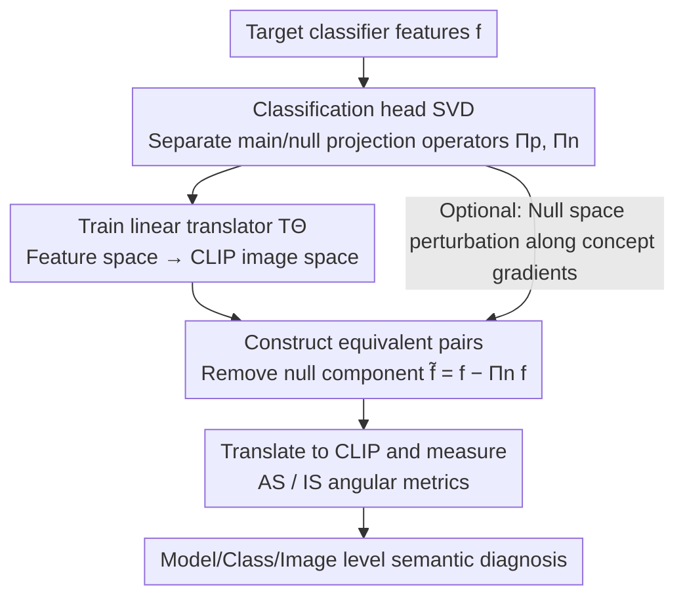

# Make it SING: Analyzing Semantic Invariants in Classifiers

**Conference**: CVPR 2026  
**Paper**: [CVF Open Access](https://openaccess.thecvf.com/content/CVPR2026/html/Yadid_Make_it_SING_Analyzing_Semantic_Invariants_in_Classifiers_CVPR_2026_paper.html)  
**Code**: https://tinyurl.com/githubSING  
**Area**: Interpretability  
**Keywords**: Null Space Geometry, Invariance, SVD, CLIP Translator, Semantic Leakage

## TL;DR
SING projects invariant directions in the null space of a classifier's linear head—which "change the input without changing logits"—into the CLIP vision-language space via a linear translator. By using two angular metrics (AS/IS) to quantify the semantic content of these invariants, the authors diagnose "semantic information leakage into the invariant subspace" across model, class, and image levels, discovering that DinoViT is less prone to leaking class-related semantics into the null space compared to models like ResNet50.

## Background & Motivation
**Background**: Modern visual classifiers learn internal representations with complex geometry. While performance is strong, mechanistic interpretability remains poor. A fundamental phenomenon is the existence of "equivalence sets" induced by the null space of the classifier's linear layer—sets of inputs that yield identical logits. Research into these invariants typically follows two paths: performing SVD on latent features (data-driven) or decomposing based on weights (separating directions that influence logits from those that do not).

**Limitations of Prior Work**: The first path (feature-space SVD) reflects the covariance of the measured dataset rather than the classifier's decision geometry, potentially missing invariants hidden in the null space. The second path (weight-based null space decomposition) identifies the existence of invariant directions but fails to explain their semantic meaning and often relies on task-specific data for demonstration. Essentially, it is known that the null space contains invariants, but their "meaning" remains elusive.

**Key Challenge**: Non-semantic invariants (e.g., background, lighting) are generally beneficial, but invariants carrying class-related semantic information can harm the classifier and expose adversarial vulnerabilities. Users lack a straightforward way to know what a model has actually learned as invariant, even when employing data augmentation—they must rely on indirect inference through rigorous testing.

**Goal**: Provide human-readable semantic interpretations of invariant directions in the classifier's null space and establish a general framework for quantifiable comparisons across models, classes, and individual images.

**Key Insight**: Recent work in mechanistic interpretability translates latent features into a multimodal vision-language space (specifically CLIP) to generate human-readable concepts and counterfactuals. The authors observe that this "translation to CLIP" technique has only been applied to the active feature subspace; the null space—where invariants reside—has been entirely ignored.

**Core Idea**: Use a linear translator to map classifier features into the CLIP image space. By measuring semantic changes in null-space perturbations (e.g., removing the null component to create an equivalent pair), "invisible invariant geometry" is converted into "readable, quantifiable semantic evidence." To the authors' knowledge, this is the first work to map classifier invariant directions into multimodal networks for systematic analysis.

## Method

### Overall Architecture
The input to SING consists of a target classifier and a set of image features; the output is a readable measurement and visualization of the semantic content carried by null-space invariants. It follows four steps: first, perform SVD on the classification head weights to separate the main and null subspaces and construct corresponding projection operators; second, train a linear translator to map classifier features to the CLIP image embedding space; third, select a feature and perturb it within the null subspace along a specific semantic direction (most commonly by removing the null component) to create an "equivalent pair" with identical logits; finally, translate the equivalent pair into CLIP space and quantify semantic shifts using two angular metrics (Attribute Score and Image Score). This workflow applies to single images (local invariants) and image sets (statistical analysis at class and model levels).

### Key Designs

**1. Classification Head SVD: Splitting Linear Layers into Main and Null Spaces**

The authors focus on the final fully connected layer $W \in \mathbb{R}^{c \times m}$ (mapping the penultimate feature $f \in \mathbb{R}^m$ to $c$-dimensional logits). Applying SVD yields $W = U \Sigma V^\top$, where $V = [V_p \ V_n]$. $V_p$ is the main space associated with non-zero singular values, and $V_n$ spans the null space. Any perturbation in the null space $\nu \in \mathrm{span}(V_n)$ satisfies $W(f + \nu) = Wf + W\nu = Wf$ (since $W\nu = 0$), leaving logits unchanged. This defines two orthogonal projection operators $\Pi_p = V_p V_p^\top$ and $\Pi_n = V_n V_n^\top$. Crucially, this decomposition is weight-induced and independent of data covariance, capturing the decision geometry of the classifier itself rather than dataset bias.

**2. Linear Translator: Mapping Features to CLIP Image Space**

To make null-space directions interpretable, a linear map $T_\Theta: \mathbb{R}^m \to \mathbb{R}^n$ is trained to translate classifier features $f$ to CLIP image features $z_{img}$, optimizing Mean Squared Error with weight decay:

$$L = \|T_\Theta(f) - z_{img}\|_2^2 + \lambda\|\Theta\|_2^2.$$

A linear map is chosen for its property $T_\Theta(f + v) = T_\Theta(f) + T_\Theta(v)$, which naturally aligns with the additive feature decomposition (original feature + null perturbation). Accuracy is validated by showing that relative classification performance is maintained (Pearson correlation of 0.972 between logits before and after translation).

**3. AS / IS Metrics: Separating Semantic Shift and Appearance Change**

Defining the angle $\angle(x, y) := \arccos\frac{x \cdot y}{\|x\|\|y\|}$, the metrics compare feature $f$ and its equivalent pair $\tilde{f}$ (with null component removed). Let $z_{text}$ be a CLIP text embedding for a prompt. **Attribute Score (AS)** measures whether the equivalent image moves semantically closer to or further from a text prompt:

$$AS(f, \tilde{f} \,|\, z_{text}, T_\Theta) := \angle(T_\Theta(f), z_{text}) - \angle(T_\Theta(\tilde{f}), z_{text}).$$

A positive AS indicates the equivalent image is more semantically aligned with the prompt. **Image Score (IS)** measures the overall "appearance change" via the angular distance between translated features:

$$IS(f, \tilde{f} \,|\, T_\Theta) := \angle(T_\Theta(f), T_\Theta(\tilde{f})).$$

Ideally, a good classifier should have a **low AS** (null-space modifications should not affect class identity) and a **high IS** (allowing significant class-irrelevant semantic variation, like background).

**4. Null Space Applications and Directional Perturbations**

Beyond removing null components ($\tilde{f} = f - \Pi_n f$), the method supports directional manipulation. By calculating the gradient of cosine similarity $s(f; z_{text})$ with respect to $f$, denoted as $g_{text}(f) := \nabla_f s(f; z_{text})$, and projecting it onto the null space as $d_{null}(f) = P_N g_{text}(f)$, the representation can be pushed toward a target concept (e.g., another class) without changing logits: $f_\varepsilon = f + \varepsilon \hat{d}_{null}(f)$.

## Key Experimental Results

### Main Results
Using 5 ImageNet-1k pretrained models (DinoViT, ResNet50, ResNext101, EfficientNetB4, BiT-ResNetv2), the authors analyzed the AS/IS tradeoff:

| Model | Performance (AS/IS tradeoff) | Conclusion |
|-------|------------------------------|------------|
| DinoViT | Highest IS/AS ratio | Least class leakage, richest benign invariance |
| ResNet50 | Larger AS and high variance | Significant class-related leakage in some classes |
| ResNext101 | Lowest IS/AS ratio | Most severe class-related semantic leakage |

### Key Findings
- **Validator Reliability**: The linear translator maintains a 0.972 Pearson correlation for discriminative information. Null space removal barely affects logits, whereas other perturbations of the same norm cause significant drift.
- **Class-Level Comparison**: DinoViT maintains low $|AS|$ ($<1$) across classes. ResNet50 shows high leakage for specific classes like "Porcupine" and "Sports Car."
- **Directional Manipulation**: DinoViT is the most resistant to directed null-space manipulation ($|AS| = 5.0 \pm 0.59$), while ResNet50 ($12.04 \pm 0.25$) and others are easily "fooled" semantically while keeping the same decision.

## Highlights & Insights
- **First Semantic Null Space Interpretation**: SING moves beyond simply stating null directions exist by making them human-readable through translation and visualization.
- **Clean Decoupling**: The AS/IS framework successfully separates "benign invariance" (high IS) from "harmful leakage" (high AS).
- **Security Implications**: The ability to drastically drift semantics without changing logits reveals a "blind spot" in classifiers that could be exploited for decision-invariant semantic attacks.

## Limitations & Future Work
- **Scale of Evaluation**: Model-level statistics were demonstrated on 16 ImageNet classes as a proof of concept; broader coverage is needed.
- **Dependency on Reference Space**: conclusions rely on the CLIP vision-language space and the linearity of the translator.
- **Visualization vs. Metrics**: While UnCLIP visualizations show drifts, quantitative conclusions are strictly based on CLIP embeddings.
- **Future Directions**: Proposed strategies include targeted augmentation to suppress AS during fine-tuning or using projection methods to migrate useful semantics from null to main spaces.

## Related Work & Insights
- **Vs. Feature SVD**: Unlike prior work capturing data covariance, SING captures the invariant directions of the decision geometry itself.
- **Vs. Weight Null Space Analysis**: Previous works used the null space for OOD detection or overfitting quantification but lacked semantic interpretability.
- **Vs. Multimodal Interpretability**: Methods like CLIP-Dissect focus on active features; SING interprets the typically ignored null space.

## Rating
- **Novelty**: ⭐⭐⭐⭐⭐ (Unique approach to a previously ignored problem)
- **Experimental Thoroughness**: ⭐⭐⭐⭐ (Solid proof of concept, though sample sizes for some class analyses are small)
- **Writing Quality**: ⭐⭐⭐⭐ (Clear definitions and well-structured arguments)
- **Value**: ⭐⭐⭐⭐ (Provides a reusable tool for invariance diagnosis and robustness research)

<!-- RELATED:START -->

## Related Papers

- [\[CVPR 2026\] H-Sets: Hessian-Guided Discovery of Set-Level Feature Interactions in Image Classifiers](h-sets_hessian-guided_discovery_of_set-level_feature_interactions_in_image_class.md)
- [\[ACL 2026\] Flattery in Motion: Benchmarking and Analyzing Sycophancy in Video-LLMs](../../ACL2026/interpretability/flattery_in_motion_benchmarking_and_analyzing_sycophancy_in_video-llms.md)
- [\[ICLR 2026\] Conjuring Semantic Similarity](../../ICLR2026/interpretability/conjuring_semantic_similarity.md)
- [\[CVPR 2026\] PRISM: Prototype-based Reasoning with Inter-modal Semantic Mining for Interpretable Image Recognition](prism_prototype-based_reasoning_with_inter-modal_semantic_mining_for_interpretab.md)
- [\[ACL 2026\] Make Mechanistic Interpretability Auditable: A Call to Develop Guidelines via Continuous Collaborative Reviewing](../../ACL2026/interpretability/make_mechanistic_interpretability_auditable_a_call_to_develop_guidelines_via_con.md)

<!-- RELATED:END -->
